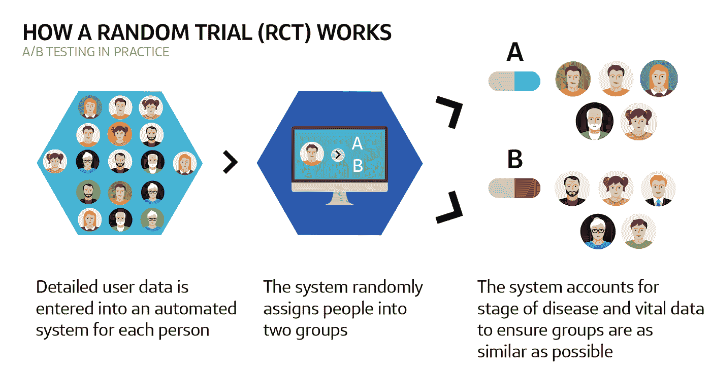
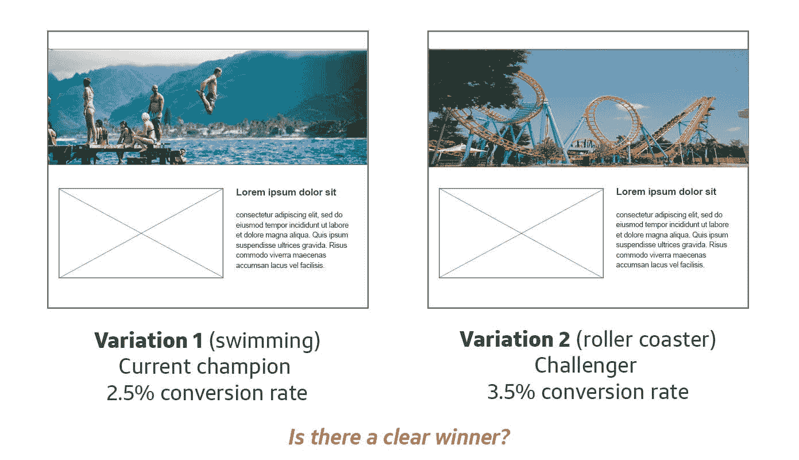
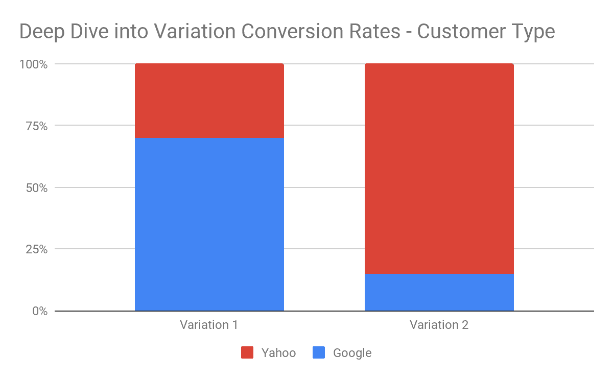
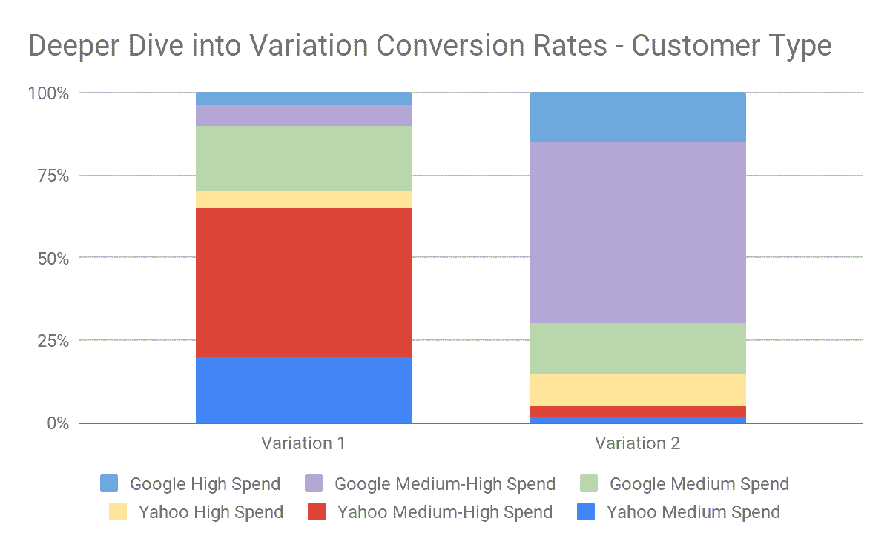

# A/B 测试——它在机器学习时代扮演什么角色？

> 原文：<https://medium.com/capital-one-tech/the-role-of-a-b-testing-in-the-machine-learning-future-3d2ba035daeb?source=collection_archive---------1----------------------->

# **直接实验是我们理解原因的方式**

A/B 测试很容易理解。向一半的访问者展示你当前的体验，并向另一半访问者提供另一种体验；观察性能差异，然后要么继续使用旧的，要么将所有流量切换到新的。这里有许多最佳实践和微妙之处，但是过程是直观的。

我们经常忽略的是*为什么*我们这样做的原因。如果我们将我们的变化限制在尽可能少的变量内，我们就能了解是什么真正导致了行为的变化。“为什么”更具挑战性，但“是什么”变得很清楚。在复杂、多元的机器学习世界中，寻找原因并不是首要关注的问题。优化一个目标函数。因此，对于人类来说，学习、创造新的想法和建立反映理想世界的模型，A/B 测试扮演了一个有价值和持久的角色。

让我们来看看 A/B 测试、机器学习，并发现其中每一个单独或组合的一些真实世界应用。

## **通过化学(医学)更好地生活是严格的 A/B 测试的结果**

简单的 A/B 试验或随机对照试验(RCT)是产品开发过程的支柱，可以通过开发新药的例子进行深入研究。

如前所述，RCT 帮助我们准确理解机会/效果的大小(以及 ROI)，并且还能够阐明**因果关系**，这是机器学习尚未成熟的领域。因果关系让我们能够平息[‘相关性 vs .因果性’](https://towardsdatascience.com/the-infamous-causation-vs-correlation-c9cdf4fc6563)的争论，并了解我们的新药是否如预期那样起作用。让我们从最基本的方面来看看药物试验是如何进行的。

在安慰剂对照研究中，受试者被随机分配到两组中的一组；他们要么接受药物，要么接受安慰剂。两组都按照说明服用避孕药或其他运载工具。这里的关键是这些组是随机分配的。每个组中的用户数量越多，出错的几率就越低。

如果试验组和对照组之间存在观察到的差异，并且我们的样本是随机分配的，我们可以得出结论，在接受的治疗和观察到的差异之间存在因果关系。通过将我们的观点简化为一个单一的变量，我们可以有信心这远远超出了相关性。观察到的效果不需要验证我们的假设是一个有用的发现。

## **机器学习如何增强医药产品开发？**

在新兴的[个性化医疗](https://www.ncbi.nlm.nih.gov/pmc/articles/PMC2957753/)领域，软件被用来为人类匹配符合独特症状和基因标记的治疗方法。在这种情况下，最初的 A/B (RCT)测试非常有价值，因为我们已经对不同类型的使用者(女性对男性，成人对儿童)和已开发的药物进行了匹配。在最初的试验和大规模的产品推广过程中，我们可能已经了解到，一种药物对特定类型的使用者具有增强的效力，并且在特定的情况下具有积极的相互作用。

在这一点上，我们正在对数百个变量进行数据挖掘，以开发模型，使我们能够专门为你(或像你这样的人)量身定制药物。现在是数据科学家的时代，分析因果关系以开发尽可能符合现实生活的模式。

# **A/B 测试帮助数据科学家找到有价值的杠杆**

A/B 测试有能力向数据科学家传授宝贵的经验，既能增强对受众和底层数据集的理解，又能通过系统的实验设计帮助关注核心用例。让我们来看看两者。

## **吸取宝贵的教训**

数据科学的主要目标之一是通过软件对自然界发生的事情进行精确建模。这里的自然，我们指的是人类的思想。在没有清晰观察的情况下，仅仅回顾大型数据集将无法让我们模仿自然。这些观察，当用单个变量进行分析时，允许我们将复杂的问题分解成可消化的、模型化的概念。

通过接近离散的受众并分析行为模式，我们可以使用一系列最符合自然世界的技术来开发功能丰富的模型。它还有一个附带的好处，就是将数据科学家与现实生活中的问题和人联系起来，从而激发解决人类问题的创造力。学术挑战也可能是有用的，但对于我们这些致力于帮助解决人与钱之间紧张且往往至关重要的问题的人来说，现实基础是至关重要的。

## **实验的系统设计**

我尽量不低估好的[实验设计](https://en.wikipedia.org/wiki/Design_of_experiments)的价值。对于数据科学家来说，提前思考自己想学什么，并掌握数据中潜在的观察结果是一个很好的入门。通过过去的观察探索杠杆作用最大的领域，并为快速实验做好计划，这是最大限度地增加您可以识别的原因数量的关键。A/B 测试不必复杂、冗长或昂贵，就可以增强您的机器学习优化框架。

这是一个虚构的、但很常见的思维过程的例子:

*   一家电子商务网站观察到的网络流量数据显示，大量潜在客户会出现在他们的季节性产品页面上。因此，申请数量正在下降。漏斗顶部的参与度没有变化。漏斗中段跳出率增加，现场停留时间减少了 22%。没有对 UX 进行任何更改来解释这一差异。
*   他们假设全球的口味正在发生变化，季节性产品不再满足顾客的需求。对其竞争对手最近所做变化的深入研究显示，社交证明信息的频率有所上升，特别是在季节性产品上。
*   他们对 50%的季节性产品和另外 50%的 BAU 进行了 A/B 测试。
*   他们观察到在应用率和转化率、跳出率的降低和现场返回到先前水平的时间方面的统计显著改善。学习被捕获，UX 被展开到 100%

这对数据科学家有什么帮助？通过因果关系，团队可以使用实验中的数据切片来更好地模拟微观群体或个人的行为。用户可以根据对主要 KPI 的改进来模拟结果(请在此考虑结束列指标)。如果没有 A/B 测试，数据科学家将处于严重的劣势，因为建模将缺乏刺激-反应系统，团队既不能准确地确定机会大小，也不能观察可能具有净效益的治疗类型。

# **为什么不同时使用 A/B 测试和机器学习？**

## **伟大目的地国家的用例**

伟大的、数据驱动的公司运行 A/B 测试，测量各种类型体验的客户参与度(转化率)——;从文案变化到新图像或用户体验的明显变化，甚至是测试不同风格的受众细分。

当一个新的信息在实验中胜过旧的信息时，我们用新的信息替换旧的信息。这是一种“赢者通吃”的方法，因为自从有更多的客户转化了新的内容。因此，我们根据实验结果决定向客户展示新内容，即使新内容可能不会吸引所有客户。

让我们探索一个虚构的，但是说明性的例子，您可能在 A/B 测试的真实世界中遇到。一家公司通过与现有创意(变体 1，人游泳)进行比较，测试了一个新创意(变体 2，过山车形象)。变体 1 具有 2.5%的转化率，变体 2 具有 3.5%的转化率。因此，实验者决定用新信息(变体 2)替换旧信息(变体 1)。

*Example creative*

然而，更深入的分析表明，变体 1 有更多来自谷歌的访客参与，变体 2 有更多来自雅虎的访客参与。不选择获胜的变异，而是使用两种变异从两个群体获得更高的转化率将是有益的。

*Conversion rates for our example*

一种方法可以是以变体 1 的 Google 推荐和变体 2 的 Yahoo 推荐为目标。然而，更仔细的研究表明，虽然变体 1 在谷歌用户中有更高的转化率，但变体 2 实际上在代表中高消费的访问者中有更高的转化率。此外，虽然我们的过山车形象(变体 2)在谷歌访客中有更大的转化率，但人们游泳(变体 1)实际上在低消费类别的谷歌访客中有更大的转化率。

*A deeper dive into conversion rates for our example*

有了这些知识，我们将我们的方法转向利用机器学习，推出两种变体，并让模型确定哪些客户应该看到人们游泳，哪些应该看到过山车。机器学习优化引擎可以通过确定该客户与从变体 1 或变体 2 转换来的其他客户(协同过滤)有多相似来确定要显示哪个变体。

这个例子是一个非常简单的用例——当我们将数据分成更小的部分时，消息变化可能会吸引其他客户子群，并产生更复杂的关系。

# **要点和关键建议**

这就是了。你也可以进行 A/B 测试和机器学习。

事实上，明智的做法是将它们有效地用于各自的目的。如何为可用受众改善结果以实现最大价值取决于您，但是这里显示的原则可以帮助您避免以后的分析和建模问题。一如既往地观察、测试和优化，以取得成功。

最后，非常感谢 Dan Pick 和 Scott Golder 在这方面的专业知识。

*披露声明:2019 首创一号。观点是作者个人的观点。除非本帖中另有说明，否则 Capital One 不隶属于所提及的任何公司，也不被这些公司认可。使用或展示的所有商标和其他知识产权是其各自所有者的财产。*