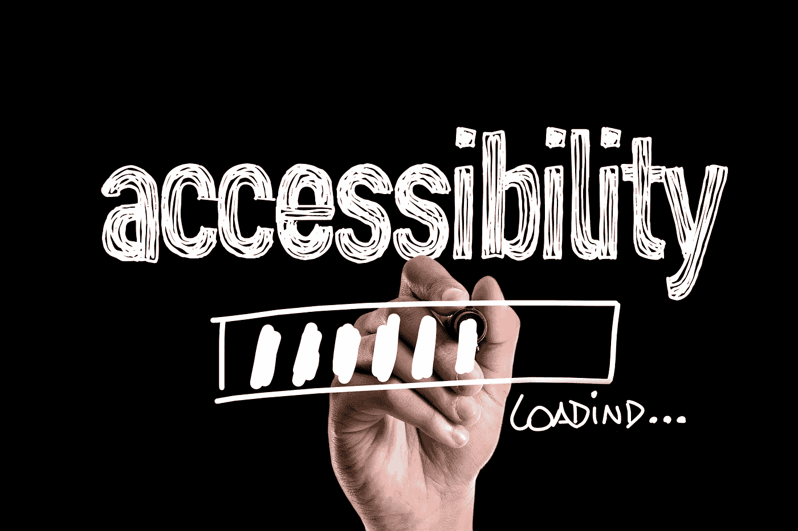
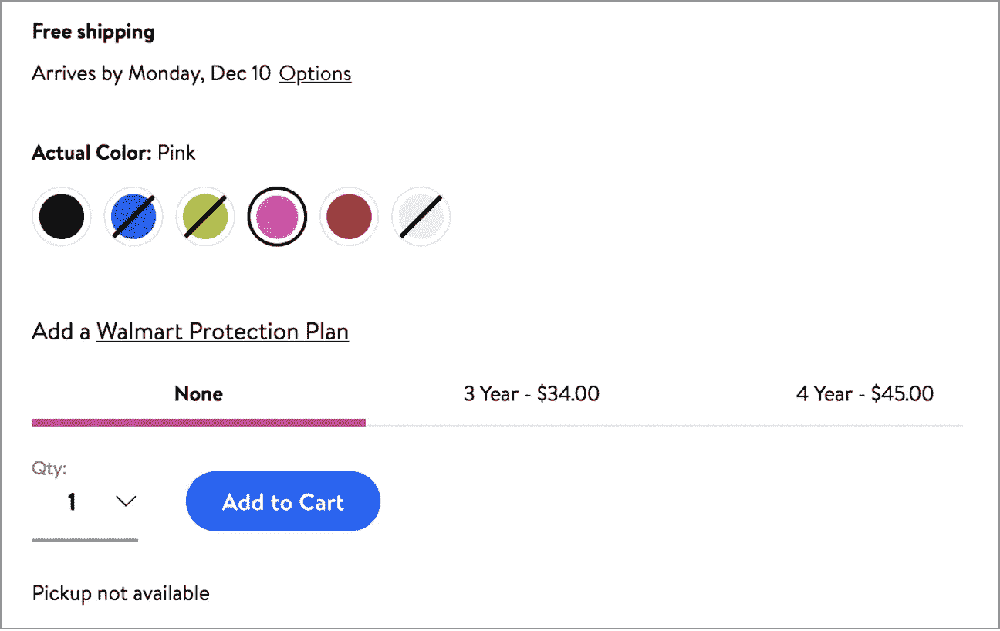
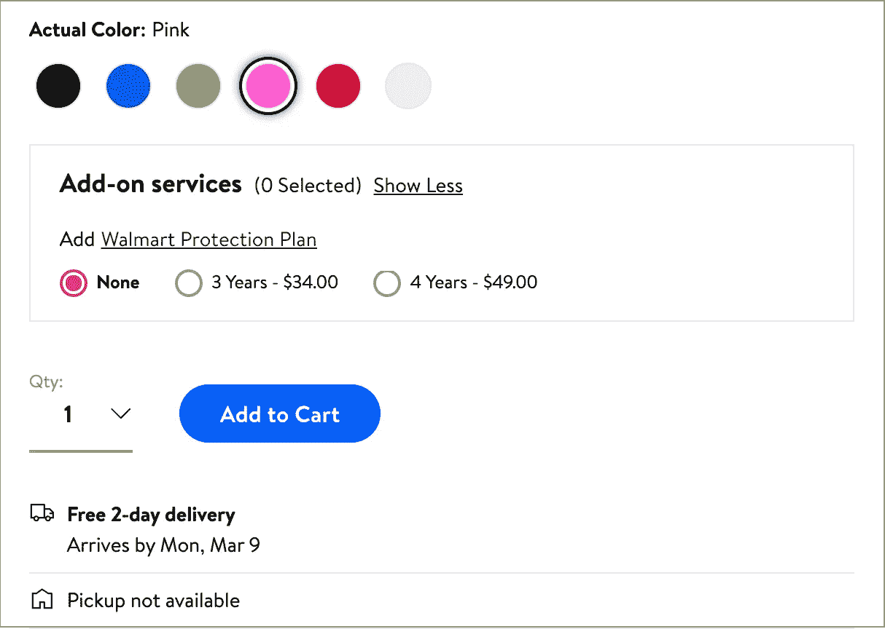

# DOM 顺序在可访问性中的作用

> 原文：<https://medium.com/walmartglobaltech/the-role-of-dom-order-in-accessibility-47071c886ca8?source=collection_archive---------5----------------------->

Image by [gustavofrazao](https://www.canva.com/gettyimagespro/)

在沃尔玛实验室，我们努力创造令人愉快的无缝用户界面，这些界面强大、包容且易于访问。我们这样做是为了让**每个人**都可以在做出任何决定之前轻松浏览页面并了解产品——这些决定可以是将产品保存到列表中，将其添加到注册表中，以及将其与任何最适合客户的保护计划一起购买。为了实现这一目标，我们必须考虑世界上各种各样的用户，了解已知会影响人们使用数字媒体的障碍，并了解他们可能使用的辅助技术的功能和局限性。

每天有数百万人访问 www.walmart.com，其中许多人依赖于无障碍技术，如屏幕阅读器、键盘、盲文显示器、高对比度浏览器模式、浏览器缩放和文本到语音转换软件。

为了说明支持这些技术有多重要，这里有一些美国残疾人的统计数据:

*   2018 年美国有 326，155，000 人，其中 13.1%(42，630，000 人)患有某种残疾。
*   大约 2%的人口患有某种视力残疾(即失明或即使戴眼镜也很难看清)
*   大约 50%的人口有某种临床上显著的屈光不正(一种视觉障碍，如果足够轻微，可以用眼镜矫正)。
*   大约 8%的男性和 0.5%的女性患有先天性或遗传性色觉缺陷。
*   大约 2%的成年人有听力障碍。
*   超过 4%的人有认知障碍(难以记忆、集中注意力或做决定)。

为了适应屏幕阅读器技术，软件开发人员应该确保正确表达 HTML 网页的所有语义。如果我们必须设计定制元素，这些元素需要具有与本地元素相同的行为(例如使用

标签创建的按钮)，我们还需要手动合并必要的功能，例如添加 *tabIndex* 以使元素可聚焦。

这是 2018 年拍摄的沃尔玛的商品页面部分截图。该页面上的所有交互元素都是可聚焦的、可读的(对于屏幕阅读器来说)、可发现的，并且所有图像都使用“alt”属性提供了简洁的描述。

The early design as of Dec 2018 — screenshot image by Maya

然而，仍有改进的余地。虽然信息的视觉顺序是合乎逻辑和直观的，但事实证明，屏幕阅读器被置于一个潜在的混乱境地:运输和提货信息，当可用时显示在页面中更高的位置，当选择新的颜色或尺寸时会改变。屏幕阅读器用户可能会错过更新的信息，因为它位于页面中他们当前位置之前。

我们希望*在选项之前直观地*显示运输和提货信息，但是由于屏幕阅读器根据 DOM 顺序读取内容，我们决定调整 DOM 顺序，同时在 CSS 中应用 *flexbox“顺序”*属性。这种方法允许屏幕阅读器在选项选择后读取运输和提货信息，但视力正常的用户仍然可以在选项上方看到可用的运输和提货信息(这是我们的 UI 设计的要求)。

然而，改变 DOM 顺序来解决屏幕阅读器问题带来了副作用:交互式页面元素的跳转顺序不再与视觉顺序同步。这可能会破坏键盘用户的体验，因为他们会看到他们的焦点环以一种令人困惑的方式在元素之间跳跃。为了向典型用户以及屏幕阅读器和键盘用户提供同样易于理解的体验，我们需要确保信息的顺序以逻辑和直观的方式呈现(参见第 1.3.2 节中的 Web AIM 清单状态[)。](https://webaim.org/standards/wcag/checklist#sc1.3.2)

如果我们仍然在选项选择(可能是颜色、大小等)之前保留显示送货/取件信息的视觉顺序，就不能完美地适应屏幕阅读器和键盘用户。解决办法？我们不得不停止使用*flexbox“order”*样式，而是直接依赖于 DOM 顺序，我们将使用 React 动态设置这个顺序。

因此，在与其他前端开发人员、可访问性专家和 UI/UX 设计人员进行了长时间卓有成效的讨论后，我们一致同意重新设计视觉顺序，以便送货和取件信息出现在选项选择的下方。

这是该部分的更新设计:

The updated design as of March 2019 — screenshot image by Maya

新设计给我们带来了很多好处:

1.  我们可以依靠*仅仅*DOM 顺序来决定视觉、跳转和屏幕阅读器的顺序。
2.  因为视觉顺序已经被 DOM 处理了，我们可以删除 CSS *flexbox order* 代码，这减少了潜在的技术债务。
3.  聚焦环按照与视觉顺序相匹配的逻辑顺序移动。
4.  屏幕阅读器用户可以很容易地理解信息，因为在做出任何影响他们的决定后*会读取相关信息，如运输和提货。*

一开始，一切看起来都很棒——UI 设计对普通用户来说是令人愉快的，所有交互元素都是可聚焦的，所有屏幕阅读器应用程序都可以阅读有意义的信息。但是我们知道这还不够，我们之前对设计的假设需要根据更严格的标准重新评估。我很高兴地说，我们都带着全新的视角和对依赖辅助技术的人的更强的承诺走出了这段旅程。

*统计数据的来源*:

[残疾纲要](http://disabilitycompendium.org/) | [“对颜色的感知”](http://www.ncbi.nlm.nih.gov/books/NBK11538/)|[“1999-2004 年美国屈光不正的患病率”](http://archopht.jamanetwork.com/article.aspx?articleid=420707) | [Udacity 无障碍课程概述](https://www.udacity.com/course/web-accessibility--ud891)