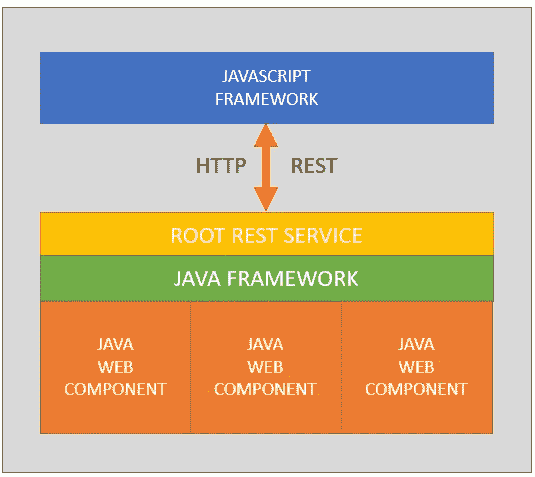

# 数据或应用的根源

> 原文：<https://medium.com/quick-code/the-root-of-dor-applications-cd6f07ec5a98?source=collection_archive---------0----------------------->

DOR 应用程序的根 REST 服务的角色

Photo by [Teo Zac](https://unsplash.com/@teo?utm_source=medium&utm_medium=referral) on [Unsplash](https://unsplash.com?utm_source=medium&utm_medium=referral)

# 介绍

在 DOR 应用程序架构的框架设计阶段，**根 REST 服务**扮演了一个重要的角色。

根 REST 服务(缩写为 *RRS* )需要成为 DOR 应用程序的唯一入口点，事实上它服务于 web 客户端发送的所有请求。

现在，我将尝试设计(虚拟地)并向您解释由 RRS 管理的角色和主要操作。

***走吧！***

# 根 REST 服务

RRS 的想法是由于需要有一个独特的入口点来满足所有的请求。

RRS 将管理 HTML/CSS 模板的请求以及将数据发送到应用程序的请求。详细来说:

*   **GET Template** :当第一次需要显示一个页面(或其中的一部分)时，或者在内部路由调用 RRS 来检索信息以显示页面之后，在浏览器上运行的 JavaScript 框架。现在，这一步被认为是在 GET 模式下调用的 REST 服务，JS 框架只向服务器提供 web 组件的标记，该标记旨在可视化通过检查 DOM 提取的内容。
*   **发布数据和事件** : web 客户端在呈现页面后，继续等待接收用户的输入。可以由浏览器管理的信息是数据、事件或两者。点击按钮或者在文本字段中输入值的动作将会被 JavaScript 框架捕获，并被发送到在 POST 模式下调用 RRS 的应用程序。

在 GET 和 POST 两种模式下，响应都需要是一个格式良好的 HTML，这样 JavaScript 框架就只能替换之前被请求的页面部分。RRS 的响应很可能是 JSON 格式的。

# 流动

流程从浏览器对第一页的请求开始；第一次请求时，浏览器接收 DOR 应用程序的索引页面和 JavaScript 框架。

当页面加载完成时，JavaScript 框架将第一次调用；JavaScript 的作用是检查接收到的 DOM，并且对于接收到的每个定制 HTML 元素，调用 RRS 的 GET 方法来检索 HTML 和样式 CSS 以呈现 Web 组件。

RRS 将接收请求，并与 Java 框架协作来获取表示 Web 组件的 Bean，并将返回请求的信息作为响应。

下图是层堆栈的简化表示:

A draft of the DOR architecture

目前，我实现的存储库在一个 Java 项目中包含了 Java 应用程序、Java 框架和 JavaScript 框架:下一步是将应用程序和框架分离到两个不同的项目中，并开始将框架作为 Maven 依赖项使用。

# 结论

在这个故事中，我试图想象 Root REST 服务的角色和架构，它将成为 DOR 应用程序的第一层(更外部的)。

当然，我已经抓住了许多要点:

*   GET/POST 响应的格式和结构
*   用于管理 RRS 响应的 Javascript 框架的架构
*   检查 DOM 的方法
*   捕捉用户事件的方法

***感谢您的配合！***

Medium.com**简介[或应用](https://link.medium.com/W4oxtdgtw1)**

**GitHub**:DOR 应用([资源库](https://github.com/Mamix84/medium/tree/master/DomOverRestProject))的一个例子