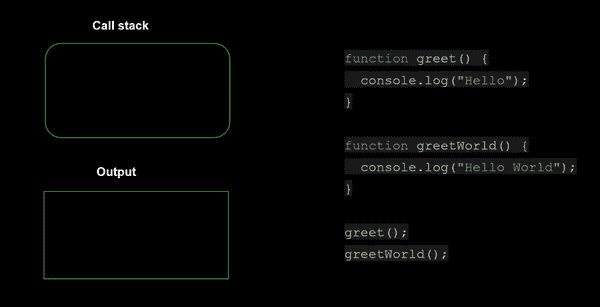
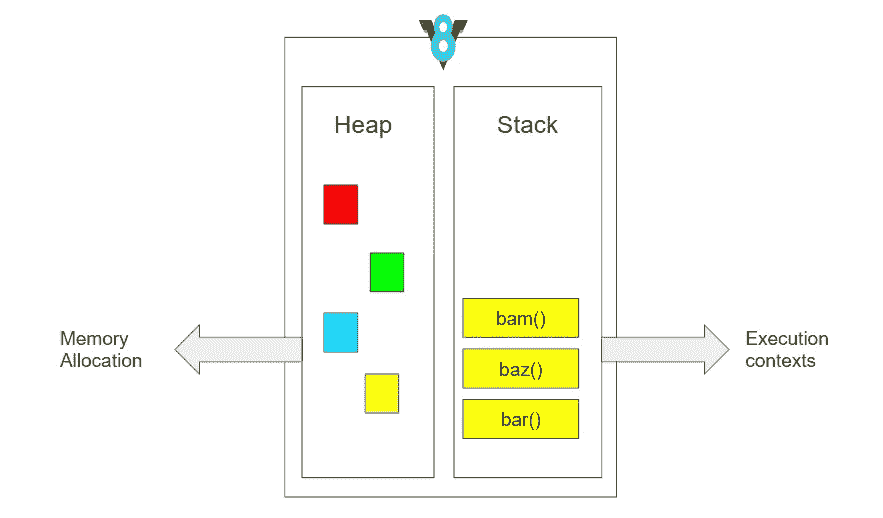
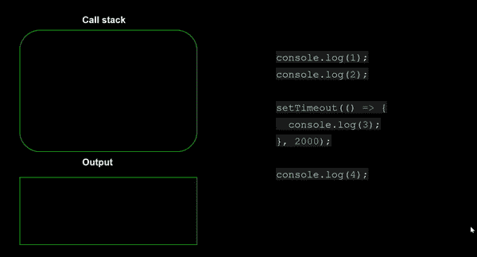
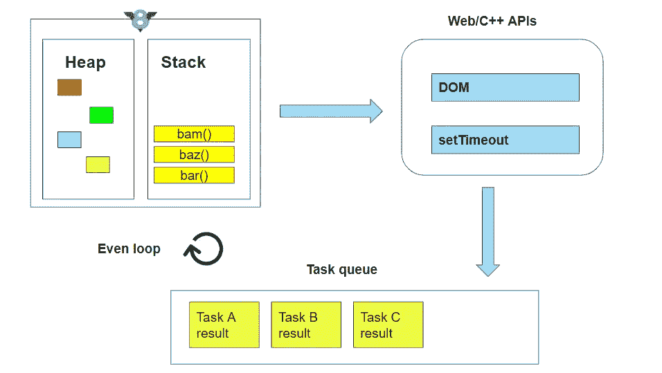
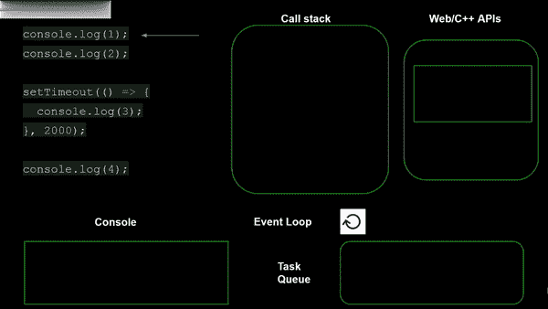

# JavaScript 异步本质背后的秘密

> 原文：<https://medium.com/globant/the-secret-behind-javascripts-asynchronous-nature-c9837ed0e723?source=collection_archive---------0----------------------->

当你学习 JavaScript 时，你经常会听到人们使用“单线程”、“阻塞”和“异步回调”这样的词。如果你和我一样，点头表示同意，好像一切都很明显，即使你几乎不知道那些术语是如何运作的；然而，像我这样好奇的实体试图找出 JavaScript 到底是如何工作的，然后让我们深入研究！

***什么是 JavaScript？***

> 单线程、非阻塞、异步编程语言

啊，单线程的！！

***即***

> 一个线程==一个调用堆栈==一次一件事

下面让我们想象一下调用堆栈是如何一次执行一条程序语句的:

Fig 1 Single Threaded

***参考图 1:*** 我们可以看到有几个函数定义最后引擎到了 greet()函数调用。

1.  我们调用 greet()函数
2.  它是 ***把*** 推到 ***上的调用栈***
3.  打印出“你好”
4.  greet()方法将 ***弹出***
5.  引擎再次遇到新的调用，即 greetWorld()函数
6.  它是 ***将*** 推到 ***上的调用栈***
7.  打印出“Hello World”
8.  greetWorld()方法获取弹出的

*你可能想知道上图中的 ***调用栈*** 是什么。*

> *这是一种数据结构，记录我们在程序中的位置。如果我们进入一个函数，那么这个函数被推到堆栈上，如果我们从一个函数返回，那么我们从堆栈的顶部弹出。*

****想知道我们在哪里可以找到这个调用栈吗？****

> *它驻留在 **JavaScript 引擎**中，就像 **Chrome V8 引擎**一样。*参考下面的图 2:**

**

*Fig 2 The JavaScript Runtime (The Chrome V8 engine)*

*现在我们看到了 JavaScript 是如何单线程的，你可能会想" ***是的*** " JS 在调用栈就位的情况下工作。但是如果我们的代码需要一些时间来执行呢？*

****我们到底怎么称呼耗时/慢的代码？****

> *啊堵住了！！*

****意为:****

> *执行速度慢或需要很长时间的事情指的是阻塞代码。*

***问题陈述:**假设我们想订阅 YouTube 上的一个频道。如果订阅一个频道花费了超过 x 的时间会怎样？*

**

*Fig 3 Blocking*

***遇到的问题:**浏览器！！*

****参考图 3:*** 上面场景的问题是，我们点击订阅按钮后，整个屏幕/浏览器都被卡住了，直到订阅请求完成。*

****有什么解决办法？****

> *异步回调。*

*啊，异步回调！！*

****即****

> *我们运行一些代码，并给它一个回调，这个回调将在稍后的时间点执行。让我们使用下面的调用堆栈来想象一下:*

**

*Fig 4 Asynchronous callback*

****参考图 4:*** 在运行上面的代码片段时我们可以看到:*

1.  *1ˢᵗ console.log()语句将被压入调用堆栈*
2.  *打印输出 1*
3.  *console.log(1)被弹出*
4.  *类似地，执行 2ⁿᵈ console.log()语句*
5.  *然后将 setTimeout 函数调用推送到调用堆栈上以打印 3，这将在最少 2 秒 的 ***中执行。因此，setTimeout 函数不知何故消失了！！****
6.  *那么 console.log(4)将被压入调用堆栈*
7.  *打印输出 4*
8.  *console.log(4)被弹出*
9.  *几秒钟后，console.log(3)神奇地出现在调用堆栈上，并打印出 3*

****怎么会这样？****

> *JavaScript 异步本质背后的秘密:**事件循环！！***

*你现在可能认为 JavaScript 是一种单线程编程语言 ***但事实并非如此！！****

> *所以 JavaScript 运行时(Chrome V8 引擎)一次执行一件事。当其他代码正在执行时，它不能发出网络请求/不能设置超时。*

*那么，我们如何发出网络请求，或者如何在执行其他代码的同时执行 setTimeout 呢？*

> *因为浏览器本身除了 JavaScript 运行时(Chrome V8 引擎)还有很多东西。让我们看看下面的图表，看看还有哪些其他的东西。*

**

*Fig 5 The bigger picture: Event Loop*

*让我们重新看一下异步回调示例的执行，以理解其他组件是什么:***Web/c++ API、任务队列、事件循环****

**

*Fig 5 Asynchronous callback with the event loop*

****参考图 5:*** 在运行上面的代码片段我们可以看到:*

1.  *1ˢᵗ console.log(1)语句被推送到调用堆栈上*
2.  *打印输出 1*
3.  *console.log(1)被弹出*
4.  *类似地，执行 2ⁿᵈ console.log()语句*
5.  *现在，当 setTimeout 被压入堆栈时，它在调用堆栈 ***之外执行，即由浏览器的 Web API***执行。所以浏览器为我们启动了计时器，现在它将处理它的执行。由于 setTimeout 的执行没有完成，我们将它从堆栈中弹出。*
6.  *我们继续以类似于 console.log(1)和 console.log(2)的方式执行 console.log(4)的代码片段*
7.  *一旦 Web API 完成 setTimeout 语句的执行，它就将结果推送到任务队列中。最后，我们得到“ ***事件循环*** ”。事件循环就像“*嘿，我终于有任务了。如果是空的，让我看一下堆栈。哦，是的，它是！因此，让我将 1ˢᵗ的东西从任务队列推到调用堆栈，即回调*。*
8.  *然后，回调的结果被打印到控制台上，即数字 3，并弹出调用堆栈。*

***结论***

*我们已经了解了“单线程”、“阻塞”和“异步回调”等词的含义，事件循环是一个持续运行的过程，它监控调用堆栈和队列之间的任务，以实现 JS 的异步特性。*

*希望这能让你对事件循环的概念更加熟悉。*

**本文受* [*菲利普·罗伯茨*](http://latentflip.com/) *的影响较大，在* [*JS 事件循环上*](https://www.youtube.com/watch?v=8aGhZQkoFbQ) *。谢谢菲利普·罗伯茨的视频，它帮助我更好地理解 JavaScript。**