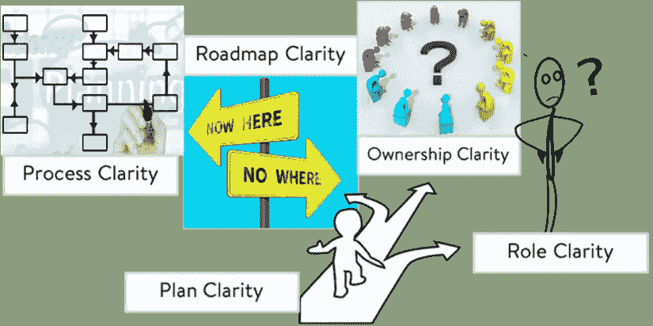
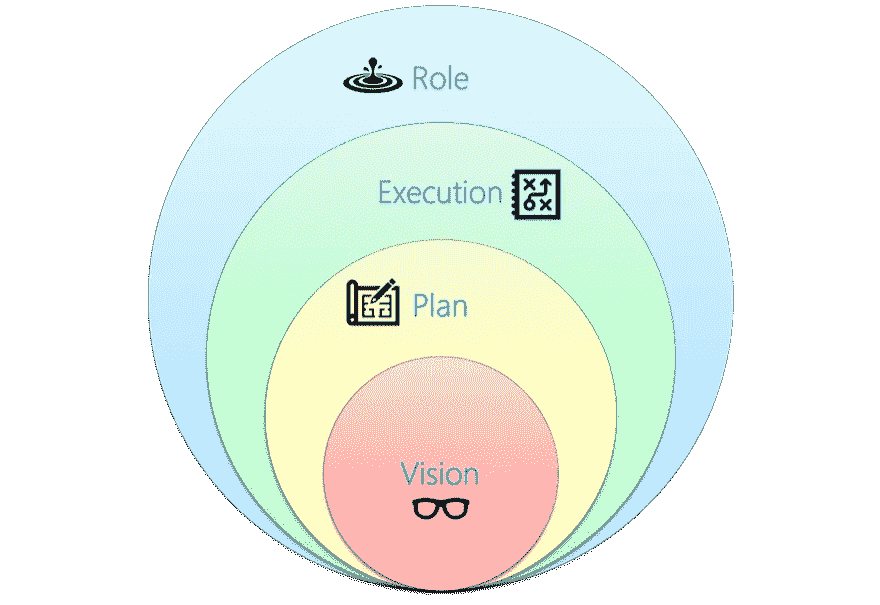
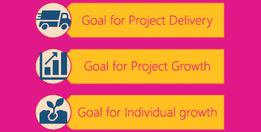

# 团队成长的秘密

> 原文：<https://medium.com/walmartglobaltech/the-secret-of-growing-teams-bd5ddb8b378f?source=collection_archive---------0----------------------->

在我的一个项目中，我正努力朝着建立高绩效团队迈出下一步。团队信任我和彼此，他们很开放，在分享他们的想法时不那么害怕。我们分享了我们的问题和瓶颈，并意识到是什么阻碍了我们的发展。

但是，这些问题就像交叉路口的交通堵塞一样，到处都是混乱。我努力想看出一个规律。

一个周末，我女儿问我她是否能为我准备茶，我说可以。她端着一杯好茶回来了，脸上带着期待被认可的微笑。我喝了一小口，我意识到它不应该是这样的。然而，作为一个好妈妈，我拍了拍她的后背，告诉她不能放那么多糖，当她准备的时候，帕特回答说我没有说清楚要放多少。对我来说，这是理解“清晰”的一个灵光乍现的时刻。如此简单的一个名词，却有如此深刻的含义。

我用一个词就解决了办公室的问题。

# **定义**

> 简而言之，清晰就是不含糊。

你如何识别一个缺乏清晰度的团队

1.  这个团队能力很强，但无法提高工作水平。
2.  团队太忙了，以至于没有时间在 sprint 之外挑选工作，但是在 sprint 期间他们一直在等待的 retro 又回来了。
3.  团队觉得他们对工作并不完全满意。
4.  团队花时间跑来跑去完成他们的故事。
5.  团队有想法，但不想分享。

Clarity Source —[*https://pixabay.com/*](https://pixabay.com/)

正如 Sadhguru 所说——**没有清晰的信心是一场灾难**，我制定了 10 天(角色清晰+路线图)——30 天(执行清晰)——60 天(提前一步)的计划来解决这个问题。

Different pillars of clarity

# **角色**

不管你的项目处于什么阶段，当一个新的团队成员加入或者项目开始时，确保他/她知道他们的角色是什么，以及他们的期望是什么。

对...清楚

1.日常责任。

2.他们拥有什么特征。

3.他们负责什么，而不管其他人在做什么。

我们很少把工作(等级)期望和一个人在项目中的实际工作混淆。基于当前的项目状态，我们的日常职责可能/可能不符合一个人被雇佣的工作角色。

# **执行(哇)**

我们经常让团队明确他们各自的职责，但是作为一个团队，他们缺乏步骤、工作流和他们之间协作过程的透明度。

和团队一起创造 WOW(工作方式),让他们和你在同一页上

1.向团队说明工作流程——谁负责签署设计、审核、质量、UX 等，什么是审核工作流程，工作完成前需要什么质量等级等

当你这样做时，重要的是为团队成员提供一个展示自己的环境，而不是成为头重脚轻的层级。这将有助于团队根据他们的职责而不是他们的标签来看待彼此。

# **向前一步**

如果我们的目标是迈出下一步，那么很好地定义现在是一件美好的事情

> 对**下一步**的明确有助于团队规划他们的角色和实现目标的步骤。

**产品视觉:**

1.整个团队应该清楚产品的**愿景**——本季度、半年和明年的下一步是什么。

a.对于虚拟团队，建议将它放在一个对每个人(领导、执行团队、管理层等)都可见的**中心位置**

b.愿景表应明确定义所有产品特征(技术/产品/债务)、目标日期和交付状态。

2.当**发生变化**时，这个单一的事实来源应该立即反映出变化的原因。

**个人目标**

Individual Clarity

虽然产品愿景是好的，但个人愿景是大多数人的激励因素。拥有可衡量的、与战略一致的目标会使它们更有说服力。

# **测量**

每隔一段时间重新评估你的策略，以测量你的团队的模糊指数。

一个简单的匿名调查，答案为“面部表情(快乐->悲伤)”就可以了。

1.  我知道今年的产品路线图。—视觉
2.  我知道我在目前的职位上需要做些什么。—角色清晰
3.  我知道今年我的下一个期望。—目标

**怎么得出的结论**

当我试图带来改变时，角色和执行的清晰性是最难实现的。我面临的挑战很少

1.很少团队成员听到的真实情况是，他们更多地关注等级而不是实际职责。

2.在接受签署工作流时犹豫不决。

它需要越来越多的一对一和可信的协作，以便将个人成长目标和项目目标保持一致。

我还需要确保团队信任整个过程，当他们努力适应时，我会在他们身边。

# **拿走**

有了这么多需要明确的地方，我想我能把所有的东西都写在纸上吗？这是一个艰难的过程，虽然会有支持者，也会有很多反对者。

当我们敞开心扉的时候并不容易，会有失望，自我冲突，但是会有更少的流言蜚语和更少的时间花在可以避免的问题上。

这个练习是一个持续的过程，当你带来清晰时，要与团队产生共鸣，即**变化也必然会改变**。当你带来清晰的信息时，当你把信息带出来时，要明智地使用过滤器。