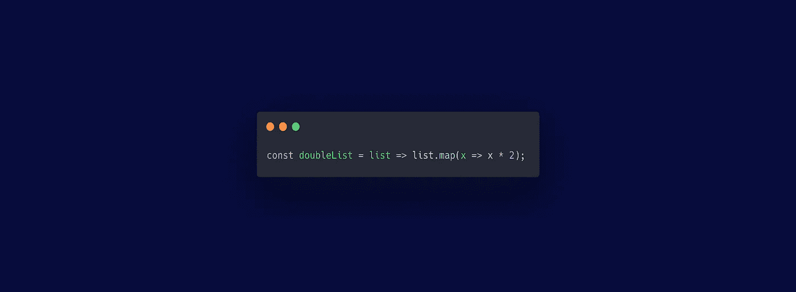

# 简单代码的秘密

> 原文：<https://medium.com/javascript-scene/the-secret-of-simple-code-a2cacd8004dd?source=collection_archive---------0----------------------->

## 10 倍开发者如何创造 10 倍价值

成为 10x 开发者有捷径吗？是否有一些神奇的秘密——如果你知道的话——会为你打开一个软件开发掌握和生产力的全新世界？

这就是怀疑者认为“没有捷径！每个人都需要练习才能变好！”这是真的，但是软件生产力专家在实践什么，有没有一个关键的东西可以产生巨大的差异？

是啊！有！

但是，即使我与你分享它——即使我把它送给你，并为你详细地解释它——你也可能需要 10 年的时间来成长并完全欣赏它的简单性。

至少，我就是这样。它是我的高中编程老师用简单的英语拼写给我的。我使用一些示例代码一步一步地完成了应用它的过程。直到 10 年后才真正理解。但是现在，有了经验，这是一个我深深感激的教训，尽管我知道这是一个你第一眼无法真正欣赏的教训——我将与你分享。

这个秘密是平均生产力和 10 倍生产力之间的关键区别。利用这个秘密提供的杠杆作用，你可以提高几个数量级的效率。

您可以编写可重用性更高的代码，并且在引入新需求和周围代码发生变化时不太可能崩溃。

生产率提高 10 倍的秘密是掌握**抽象。许多开发人员认为“抽象”是一个肮脏的词。你会听到(或者说是好的)建议，比如“不要太早抽象”或者 Python 著名的“显式比隐式更好”的禅，暗示具体比抽象更好。所有这些都是很好的建议——取决于具体情况。**

但是现代应用程序使用了大量的代码。如果你把现代 10 大应用的源代码打印出来，那些成堆的纸会和摩天大楼的高度相抗衡，软件维护起来要花很多钱。您创建的代码越多，成本就越高。

# 抽象是简单代码的关键

正确的抽象可以通过隐藏对当前上下文不重要的细节，并减少完成相同工作所需的代码量，使代码更具可读性、适应性和可维护性。

> "简单就是用
> 减去明显的
> ，加上有意义的东西."
> 
> ~约翰·梅达:[简单法则](https://www.amazon.com/Laws-Simplicity-Design-Technology-Business/dp/0262134721/ref=as_li_ss_tl?ie=UTF8&linkCode=ll1&tag=eejs-20&linkId=d496ae0ff9297a950b4c93fd6dfb2c44&language=en_US)

抽象不是单行道。它实际上是由两个互补的概念构成的:

*   **概括**——去除重复的部分*(明显的)*并将它们隐藏在抽象之后。
*   **专门化** —将抽象应用于特定的用例，添加需要不同的东西*(有意义的)。*

考虑以下代码:

代码本身没有任何问题，但是它包含了许多对于这个特定的应用程序来说可能不重要的细节。

*   它包括正在使用的容器/传输数据结构(数组)的细节，这意味着它将只与数组一起工作。它包含一个**状态形状依赖。**
*   它包括迭代逻辑，这意味着如果您需要其他操作，这些操作也需要访问数据结构中的每个元素，您也需要在代码中重复非常相似的迭代逻辑。它迫使**重复**，这可能违反**干(不要重复自己)。**
*   它包括显式赋值，而不是声明性地描述要执行的操作。**很啰嗦。**

这些都没有必要。所有这些都可以隐藏在抽象背后。在这种情况下，一个如此普遍的抽象，它已经改变了现代应用程序的构建方式，并减少了我们需要编写的显式 for 循环的数量。

> "如果你以深刻的觉知触摸一件事物，你就触摸了一切."
> 
> ~ **一行禅师**

使用 map 操作，我们可以通过删除明显的部分(我们可能会在类似代码中重复的部分)，并将重点放在有意义的部分(只是需要与我们的用例不同的部分)来将代码缩减为一行代码:

**初级开发人员**认为他们必须写很多代码才能产生很多价值。

高级开发人员明白没人需要编写的代码的价值。

想象一下，作为一名程序员，他在 JavaScript 等编程语言中推广了 map 操作的使用。Map 抽象出一些细节，比如映射的数据类型、包含数据的数据结构类型以及枚举数据结构中每个数据节点所需的迭代逻辑。它提高了我在过去十年中开发的每个应用程序的效率。

Jeremy Ashkenas 让几个这样的操作在 JavaScript 中流行起来，并通过在 CoffeeScript 中率先使用它们，为我们现在在 JavaScript 中认为理所当然的许多伟大的语法快捷方式铺平了道路。他开发了下划线，从而产生了 Lodash(仍然是 JavaScript 中最流行的函数式编程实用工具带)和 Backbone，后者普及了 JavaScript 中的 MVC 架构，并为 Angular 和 React 奠定了基础。

John Resig 开发了 jQuery，它是如此流行和有影响力，它形成了最大的可重用、封装的 JavaScript 模块(jQuery 插件)的集合，直到几年后出现了标准节点模块和 ES6 模块。jQuery 的选择器 API 非常有影响力，它构成了今天 DOM 选择 API 的基础。当我对 React 组件进行单元测试时，我几乎每天都从 jQuery 的选择 API [中受益。](/javascript-scene/unit-testing-react-components-aeda9a44aae2)

正确的抽象是可以显著影响生产力的强大杠杆。抽象不是一个肮脏的词。模块、函数、变量、类——所有这些都是抽象的形式，它们存在的全部原因是使抽象和抽象的组合更容易*。*

没有抽象，你无法构建复杂的软件。甚至汇编语言也使用抽象——指令的名称、内存地址的变量、子程序跳转的代码点(如函数调用)等。现代软件是有用的抽象层蛋糕，这些层给你杠杆。

> 给我一根足够长的杠杆和一个支点，我可以撬动地球。
> 
> ~阿基米德

简单的关键是:我们追求的秘密是如何减少我们产生的堆积如山的代码，如何用更少的资源做更多的事情。当你掌握了这一点，你将成为 10 倍的程序员。我保证。

***埃里克·埃利奥特*** *是一位科技产品和平台顾问，著有* [*【作曲软件】*](https://leanpub.com/composingsoftware) *，*[*EricElliottJS.com*](https://ericelliottjs.com)*[*devanywhere . io*](https://devanywhere.io)*和 dev 团队导师。他为 Adobe Systems、* ***、Zumba Fitness、*** ***【华尔街日报、*******【ESPN、*******BBC、*** *以及包括***【Usher、【Metallica】**在内的***

**他和世界上最美丽的女人享受着与世隔绝的生活方式。**