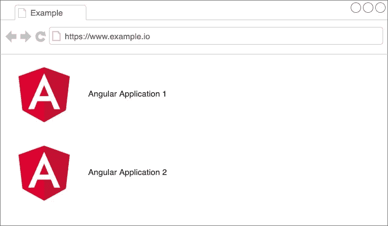
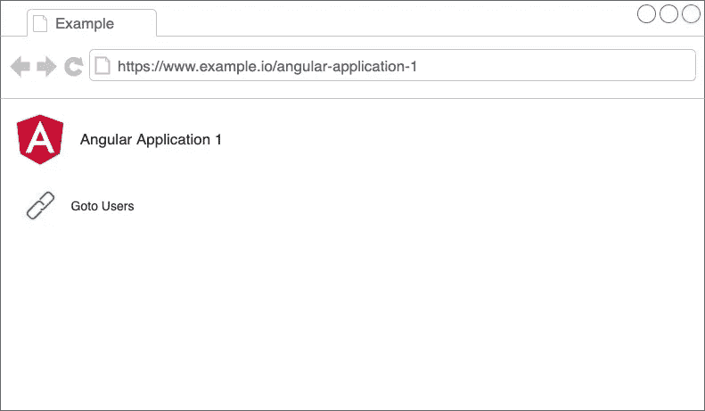
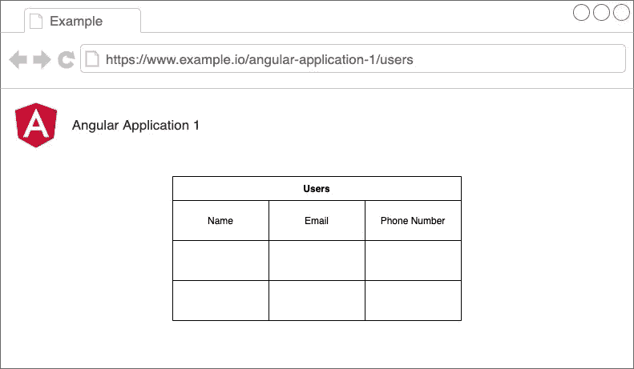
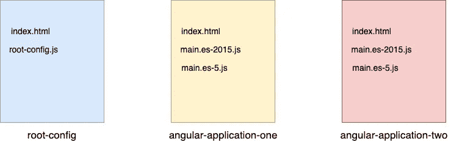

# 微前端的秘方:照章办事

> 原文：<https://medium.com/globant/the-secret-sauce-of-micro-frontends-doing-it-by-the-books-249eba69a0fd?source=collection_archive---------0----------------------->

## 摘录自微前端小队的开放 MRS RFC。


Calculated decisions for architecting Micro Frontends

# 对微前端规则手册的需求

那是一个晴朗的日子，我们正在研究关于微前端的成熟标准。研究的主要原因之一是为我们未来的工作奠定基础，以创建一个完整、稳定、文明和可生产的微前端生态系统。

经过几次尝试和失败后，我们登陆了由 [OpenMRS](https://openmrs.org/) 团队管理的微前端[RFC](https://github.com/openmrs/openmrs-rfc-frontend/tree/master/text)中的一个。通读它帮助我们认识到这正是医生要求的，因此，我们决定重新使用 OpenMRS 微前端团队的成果，而不是重新发明轮子。这也是因为该团队一直在使用 [openmrs-frontend-rfc](https://github.com/openmrs/openmrs-rfc-frontend/tree/master/text) 进行所有的[决策](https://wiki.openmrs.org/display/projects/Frontend+-+SPA+and+Microfrontends)，这导致了当前开放 mrs 微前端生态系统的稳定性。

是的，这是本文的核心内容。欢迎您踏上一段旅程，这不仅能帮助您消化当前的 [Open MRS frontends RFC](https://docs.google.com/presentation/d/1sv0n_15Zp9HNusdSagOXnBO7Kbh2qURMQj3a8OR8ndo/edit#slide=id.g5681fc88ca_0_190) ，还能让您通过遵循最佳实践，将您的需求映射到一个稳定且定义良好的微前端架构。

相信我，这不是一次性阅读，当您在会议室时，请将它作为参考点，思考与微前端相关的最常见问题之一，例如:

*   我们如何构建一个微前端生态系统？
*   建立一个微前端生态系统需要哪些不同的构件？
*   在有循环连接点的 web 应用程序中，如何扩展前端团队？
*   如何部署微前端？
*   还有更多的…

> 希望你已经准备好了，准备好用你的枪来锻炼你的脑细胞。让我们折断一条腿。

# 一次展开一页

让我们探讨一下在构建微前端生态系统时需要考虑的关键点，以及我们如何采用它们。以防你刚到这里还不知道微前端到底是什么，[这里有一个由](https://www.youtube.com/watch?v=3EUfbnHi6Wg&list=PLLUD8RtHvsAOhtHnyGx57EYXoaNsxGrTU)[乔尔·丹宁](https://medium.com/u/a142a504a37c?source=post_page-----249eba69a0fd--------------------------------)所做的惊人解释。我们继续。

## 规则一:单页应用程序(SPA)

生态系统中的每个微前端本身应该是一个[单页面应用](https://en.wikipedia.org/wiki/Single-page_application)。这样做的好处是无缝的用户体验，因为浏览器将负责按照 JavaScript 中提到的指令呈现 DOM。此外，web 应用程序的路由和导航将在客户端处理，因此避免了服务器往返获取给定路由的 DOM。

使用 [Angular](http://angular.io/) 、 [ReactJS](https://reactjs.org/) 、 [Vue](https://vuejs.org/) 或[svelet](https://svelte.dev/)可以很容易地为微前端生态系统创建这样一个 SPA。

**实施挑战**



Multiple Angular Applications

***挑战 1***

让我们考虑这样一个场景，我们需要在一个页面上加载几个 Angular 应用程序，这样用户就可以获得无缝的用户体验，而无需往返服务器以在浏览器中呈现 DOM 元素。



angular-application-1 loaded as a Micro Frontend

***挑战二***

除此之外，一个 Angular 应用程序，比如说“angular-application-1”有自己的导航界面，允许用户独立浏览“angular-application-1”。



angular-application-1 has its own route /users

***挑战 3***

此外，一旦用户导航到给定的路线，比如说'/users '，它应该由' angular-application-1 '再次加载，而不需要任何服务器往返来呈现 DOM。

**一个可能的解决方案**

使用[单 spa](http://single-spa.js.org/) 可以很好地解决上述实施挑战，这被认为是建立微前端生态系统的最佳解决方案之一。其 [CLI](https://single-spa.js.org/docs/create-single-spa) 提供了一个名为 [root-config](https://single-spa.js.org/docs/create-single-spa#--moduletype) 的应用，该应用使用[单 spa 库](https://single-spa.js.org/docs/configuration/#registering-applications)来注册微前端。这将帮助我们解决 ***挑战 1。*** 另一方面， ***挑战 2*** 和 ***挑战 3*** 可以通过按照[单 spa 规范](https://single-spa.js.org/docs/ecosystem-angular#angular-cli)创建 Angular 微前端，使用 Angular 框架提供的[路由库](https://angular.io/guide/router)来解决。

## 规则二:浏览器内模块

在正常情况下，Angular、React、Vue 或 Svelte 应用程序的编译会生成 index.html、静态资产(如图像和 JavaScript 文件),其路径会加载到生成的 index.html 中。然而，根据我们在规则 I 中了解到的，index.html 页面应该只为 root-config 加载，而对于所有其他微前端，应该只加载 JavaScript，它在内部定义了需要为给定微前端呈现的 DOM。我们如何在不渲染每个微前端的 index.html 文件的情况下，加载微前端构建过程生成的 JavaScript 文件？

**实施挑战**

编译“根配置”、“角度应用-1”和“角度应用-2”将产生以下输出:



这里的挑战是加载主要的。*.“根配置”中的“角度-应用-一”和“角度-应用-二”的 js 文件。我们所说的“当需要时”是指当用户导航到需要“root-config”来加载给定微前端的路由时。

**一个可能的解决方案**

正如开放 MRS 前端 RFC 所提议的，这里应该使用浏览器内的 JavaScript 模块,这将允许 JavaScript 代码在容器内的延迟加载，这样它就不会向外部世界(窗口)暴露任何变量或逻辑，除非有明确的意图。因为浏览器并不支持 JavaScript 模块，这就是为什么建议使用 [SystemJS](https://github.com/systemjs/systemjs) 的原因，这样就可以加载[导入图](https://github.com/WICG/import-maps#the-import-map)中提到的浏览器内模块。除此之外，我们预测最近在 Webpack 5 中引入的[模块联盟](https://webpack.js.org/concepts/module-federation/)是一个更好的选择，因为它支持动态加载和依赖关系的解析，以及与 SystemJS 相比的受控定制。

## 规则三:导入地图

从 Rule II 实现挑战来看，很明显每个微前端最后都被编译成一个 JavaScript 文件。现在，对于[生产部署](https://www.youtube.com/watch?v=QHunH3MFPZs&list=PLLUD8RtHvsAOhtHnyGx57EYXoaNsxGrTU&index=5)，很明显，这些微前端(JS 文件)将被推送到 blob 存储提供商(如 Google Storage Bucket)或内容交付网络(CDN)提供商。这里的一个挑战是，我们如何通知 SystemJS 这些单个微前端的当前位置。

**实施挑战**

例如，为规则 I 和规则 II 中的挑战创建和构建的微前端，即“角度应用-1”和“角度应用-2”部署在 Google 存储桶上。现在，我们如何通知“root-config”中使用的 SystemJS 关于这些微前端的位置？解决方法是[导入地图](https://github.com/WICG/import-maps)。

导入映射是微前端到其位置的映射。在下面的例子中，定义了一个导入映射，说明了微前端的名称及其位置。

```
<script type="systemjs-importmap">
      {
        "imports": {
          "@mfe/angular-application-one": "http://api.googlestoragebucket.com/main-es5.js"
        }
      }
    </script>
```

> 尝试一下

*   Angular with SystemJS、Single-spa 和 Docker —即将发布动手实验

## 规则四:带设计库的风格指南

当多个小团队在不同的微前端工作时，团队很可能会偏离为产品定义的品牌指导方针和设计系统，从而导致不一致的用户体验。因此，建议创建一个“风格指南”微前端，定义需要在所有微前端中使用的设计系统。设计系统为' [Ant](https://ant.design/) '、 [Material](https://material.angular.io/) 或' [Bootstrap](https://getbootstrap.com/) 等，定义了全局 CSS 类，应由所有微前端继承。

仅定义设计系统并不能保证一致性，因为微前端生态系统中使用的各个组件的不同行为可能会让用户感到困惑。例如，对于多选下拉菜单，一个设计微前端的团队可以选择芯片来显示所选选项，而另一个团队可能只选择显示下拉菜单中所选选项的数量。现在，为了避免这种不一致的用户体验，应该将可重用组件添加到样式指南中，并在所有微前端中使用，从而消除用户体验不满意的风险。

等等！！我们刚刚讨论了可重用组件，但是我们如何决定在风格指南中使用哪个框架来设计这些可重用组件。它应该是有棱角的，有反应的，脆弱的还是苗条的？答案是，*看情况*。如果生态系统中的所有微前端都是使用单个框架构建的，例如 ReactJS，那么使用相同的框架来创建样式指南。然而，如果你的微前端生态系统是一个多框架生态系统，那么这些可重用的组件应该是框架不可知的，即使用 [Web 组件](https://www.webcomponents.org/)或[单组件](https://single-spa.js.org/docs/parcels-overview/)构建。使用 web 组件或单 spa-parcles 使开发团队能够创建与框架无关的组件，允许这些组件与 Angular、ReactJS、Vue 或 Svelte 一起使用。

## 规则五:实用模块

我们确实创建了一个集中的位置来加载跨微前端使用的所有全局 CSS 和组件，但是对于所有微前端都可用的应用程序的实用方法和共享状态呢？对于实用方法，我们指的是用于执行业务计算的方法、通用枚举(如 CustomerType)和类(如在 60%的微前端(在银行应用程序中)中使用的 Customer)。我们是否应该为所有微前端复制逻辑，或者必须有一个集中的位置，用于与所有微前端共享所有横切关注点？

**一个可能的解决方案**

可以使用支持开箱即用的打字稿的[单 spa 实用模块](https://single-spa.js.org/docs/module-types/#utilities)将实用模块创建为浏览器内模块。可以在这个实用模块中创建一个 redux 存储，使所有微前端能够共享状态。除此之外，验证和授权用户的逻辑也可以使用实用程序模块共享。此外，实用模块还可以用于分析、错误报告和推送通知，这些都是应用程序中常见的交叉问题。

你所探索的只是冰山一角。我正在为上面讨论的所有概念创建动手实验，以便架构师和开发人员都可以使用本文作为进入微前端世界的入门。如果您希望在这些动手实验发布时收到更新，请随时关注。

编码快乐！！

## 推荐读物

*   你知道我们可以共享微前端之间的依赖关系，以减少最终的包大小，这里是你怎么做。

[](/globant/the-secret-sauce-of-micro-frontends-preventing-bundle-bloat-using-systemjs-and-single-spa-5fdf15b2a82a) [## 微前端的秘方:使用 SystemJS 和 Single-spa 防止捆绑包膨胀

### 先决条件

medium.com](/globant/the-secret-sauce-of-micro-frontends-preventing-bundle-bloat-using-systemjs-and-single-spa-5fdf15b2a82a)