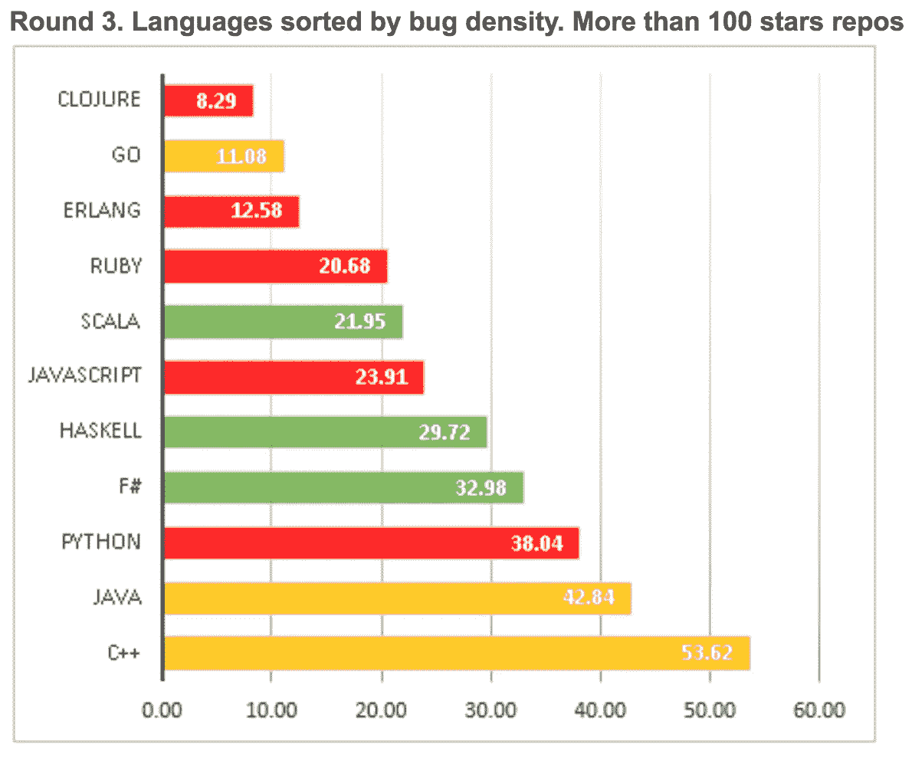

# 静态类型令人震惊的秘密

> 原文：<https://medium.com/javascript-scene/the-shocking-secret-about-static-types-514d39bf30a3?source=collection_archive---------2----------------------->

Google Trends: Angular (Red) / TypeScript (Blue)

最近 TypeScript 的人气真的爆发了。我喜欢 TypeScript，我喜欢静态类型。它有一些很棒的功能。它是结构化的，而不是名义上的，这意味着它的工作方式基本上类似于自动鸭子打字，而不是基于名称或身份的类型检查。这非常适合像 JavaScript 这样的动态语言。

我不喜欢的是，很多人认为 TypeScript 解决了 ***的问题，但它实际上并没有解决***——至少没有达到任何显著的程度。

著名的营销说辞是“大型 web 应用没有静态类型是很难的”。的确，静态类型为一些真正伟大的开发工具提供了动力，比如跳转到定义和自动重构，这些工具*感觉它们让我们更有效率*。(实际上可能会让我们更有效率，我们需要更多地研究静态类型的**实际好处**)。

但是许多人认为静态类型有助于减少进入应用程序的错误数量。不可否认的是，静态类型捕获了一个重要的 bug 子类，但是静态类型真的降低了总体 bug 密度吗？

## 静态类型给你一种虚假的安全感

几个[最近的](https://labs.ig.com/static-typing-promise) [研究](http://macbeth.cs.ucdavis.edu/lang_study.pdf)使用 GitHub 上可用的丰富数据来测试 bug 密度问题，结果是……嗯……**实际上并不那么热门:**

> “虽然不是结论性的，但图表中缺乏证据表明更高级的类型语言将使我们免于编写错误，这非常令人不安。”— Daniel Lebrero，“静态类型的破碎承诺”

在一项更正式的研究中，静态类型的表现稍好一些，来自加州大学戴维斯分校的 Baishakhi Ray，Daryl Posnett，Vladimir Filkov，Premkumar T Devanbu:

> “数据表明函数式语言比过程式语言更好；它提示强分型比弱分型好；静态类型优于动态类型；并且托管内存的使用情况比非托管要好。”

这才像话！ ***除:***

> “虽然这些关系在统计上很显著，但影响却很小。【着重号另加。]

事实上，我不知道有任何经验证据表明静态类型对 bug 密度有很大的影响。

因此，尽管它们提供了很酷的开发工具，静态类型实际上并没有帮助降低总体的错误密度。为什么？

# **类型正确性不保证程序正确性。**

如果你没有练习过代码，你真的不知道它是否有效。当然，你可以知道一个变量是否已经被定义，或者一个函数是否传递一个数组而不是一个对象，但是结果是:

*   有很多其他的方式来表达你的程序中类型检查不能捕捉到的错误，并且…
*   有很多其他的方法来捕捉类型相关的错误。

## 那么什么能真正降低 Bug 密度呢？

测试驱动开发(TDD)。具体来说，测试第一的方法。

> TDD 来救援了。

对于 TDD 的影响已经进行了一些很好的研究。有几个很好的元研究，以及来自[微软、IBM 和 Springer](http://link.springer.com/article/10.1007%2Fs10664-008-9062-z) 的著名研究。Springer 的研究表明，相对于没有使用测试优先实践的类似项目，bug 密度减少了 40%-90%。[许多其他研究也发现了类似的结果](https://www.computer.org/csdl/mags/so/2007/03/s3024.pdf)，比较了先测试和后测试，以及根本没有测试的情况，先测试的 bug 密度显著降低(比后测试明显更好),大多落在 40% — 80%的范围内**。**

换句话说，TDD 可以有效地将您的运输 bug 密度减半，并且有大量的证据支持这种说法。

## 你应该试试 TypeScript 吗？

你可能仍然想使用静态类型，但是如果你打算选择静态类型，那么做是因为它们确实提供了很酷的好处，而不是因为它们所谓的捕捉错误的能力**。**

TypeScript 给我留下了深刻的印象，它是对 rtype 的主要影响:一种旨在补充标准 JavaScript 的类型符号。我为什么不用 TypeScript 呢？

我担心使用 TypeScript 构建一个大型代码库，只会让 ECMAScript 规范引入冲突的关键字和类型特性，如 *`interface`* 和 *`implements`。*

使用 TypeScript 编译器的优点是，即使发生这种情况，您也可以通过编译消除差异。缺点是您不再真正编写标准的 JavaScript。我预测 TypeScript 将无法保持其作为 JavaScript 超集的地位。我相信，随着时间的推移，它将不可避免地出现分歧。

这是我更关心的问题，因为我教 JavaScript，我希望我所教授的内容能够应用于使用各种框架和开发工具的广大开发人员。

您可能没有这种担心，但是您的代码库仍然需要易于其他开发人员学习和贡献，并且如果您加入了一个不使用 TypeScript 的团队，您作为个人需要能够适应。

目前，尽管 TypeScript 发展迅速，但与整个 JavaScript 语言甚至 jQuery 相比，它的用户群很小，但它的发展轨迹令人印象深刻。它已经遥遥领先于编译到 JavaScript 的替代品。

有些工具是值得权衡的。它现在不适合我，但是也许你会喜欢它。如果你没有体验过微软的 Code IDE 搭配 TypeScript，那就值得踢踢轮胎。你可能会坠入爱河。

## 结论

说到减少 bug，我认为可以这么说:

> 静态类型被高估了。

但是说到其他特性，*静态类型还是很酷，*可能还是值得使用的。

底线:

> 你想减少 bug？使用 TDD。你想要有用的代码智能工具吗？使用静态类型。

当我使用 TDD 构建真正的应用程序时，你想和我坐在一起吗？

# [跟随埃里克·埃利奥特学习 JavaScript】](https://ericelliottjs.com/product/lifetime-access-pass/)

***埃里克·艾略特*** *著有* [*【编程 JavaScript 应用】*](http://pjabook.com) *(奥赖利)，以及* [*【跟埃里克·艾略特学 JavaScript】*](http://ericelliottjs.com/product/lifetime-access-pass/)*。他为****Adobe Systems*******Zumba Fitness*******【华尔街日报】*******【ESPN*******BBC****等顶级录音师贡献了软件经验*****

**他大部分时间都在旧金山湾区和世界上最美丽的女人在一起。**