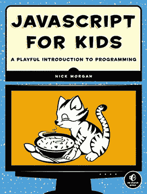
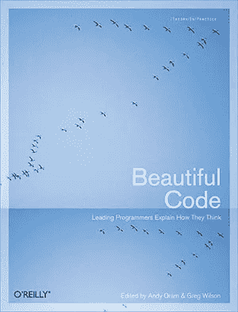
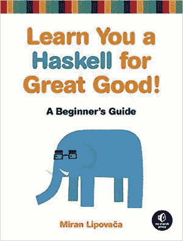
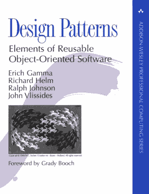
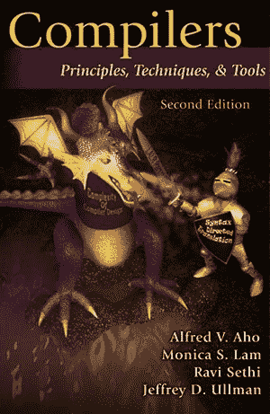
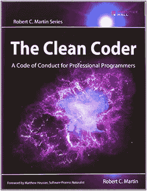

# 软件开发人员的图书馆:热爱代码的人的图书宝库

> 原文：<https://medium.com/javascript-scene/the-software-developer-s-library-a-treasure-trove-of-books-for-people-who-love-code-f9bc92c7883b?source=collection_archive---------2----------------------->

The Strahov Library — James Whitesmith (CC BY-NC-ND 2.0)

热爱代码的人的书籍宝库。由埃里克·埃利奥特策划。

按主题排列，学习顺序松散。

# 初学者注意事项

我在学习读写的同时学会了编程。我喜欢电脑游戏，我想学习如何制作自己的游戏。我喜欢游戏和关于魔法的故事，电脑似乎是你能得到的最接近魔法的东西。在那个时候，许多计算机直接启动到编程环境中，我想当然地认为，如果你想在计算机上创造一些东西，你必须学会编码。我最好的朋友的爸爸给了我一本旨在教孩子们如何用代码制作电脑游戏的书，我一头扎了进去。

今天，我们一直在电脑上创作，我们认为电脑是理所当然的，但如果你是那种喜欢拆开东西看看它们是如何工作的人，那么看看引擎盖下的东西并发现应用程序是如何制作的诱惑可能是不可抗拒的，而且是无穷无尽的娱乐。

我现在半辈子都在追逐这种激情。从对电脑游戏的热爱开始，这已经成为一个有意义的职业，使我能够环游世界，发现我们可以用软件创造的真正魔力。一路走来，我受到了许多其他伟大书籍的启发。

我希望这些我最喜欢的编程书籍能够帮助你发现和创造一些你自己的魔法。

~埃里克·艾略特

P.S .使用本页的会员链接购买有助于我们继续与您共享教育资源。

# 适合初学者和儿童

*   [超级 Scratch 编程大冒险！通过牵头项目制作酷游戏](http://www.amazon.com/Super-Scratch-Programming-Adventure-Program/dp/1593274092/ref=as_li_ss_tl?ie=UTF8&linkCode=ll1&tag=eejs-20&linkId=16addcb2acd2ce7181c55aed391a4b8e)学习编程
*   [乔纳森·s·哈伯的儿童视频游戏编程](http://www.amazon.com/Video-Game-Programming-Jonathan-Harbour/dp/1435461169/ref=as_li_ss_tl?ie=UTF8&linkCode=ll1&tag=eejs-20&linkId=0320e4e869522073c5438d3806f73277)
*   尼克·摩根的《儿童 JavaScript:有趣的编程入门》
*   儿童 3D 游戏程序:用 JavaScript 创造互动世界
*   [大卫·威尔、马丁·欧汉伦的《《我的世界》历险记》](http://www.amazon.com/Adventures-Minecraft-David-Whale/dp/111894691X/ref=as_li_ss_tl?ie=UTF8&linkCode=ll1&tag=eejs-20&linkId=9da01767bbd5eb732a4ada0504c8a662)
*   [游戏制作者的学徒:新手游戏开发](http://www.amazon.com/The-Game-Makers-Apprentice-Development/dp/1590596153/ref=as_li_ss_tl?ie=UTF8&linkCode=ll1&tag=eejs-20&linkId=982ca1338bec7213474fbcac8dc888d6)雅各布·哈布古德，马克·奥维马斯，菲尔·威尔逊
*   代码:计算机硬件和软件的隐藏语言
*   Marijn Haverbeke 的《雄辩的 JavaScript:编程的现代介绍》

# 软件工艺

*   工作中的编码员:对编程技术的思考
*   [美丽的代码:顶尖程序员解释他们是如何思考的](http://www.amazon.com/Beautiful-Code-Leading-Programmers-Practice/dp/0596510047/ref=as_li_ss_tl?ie=UTF8&linkCode=ll1&tag=eejs-20&linkId=9584716c6027fccff9c12e866f3353a2)安迪·奥兰，格雷格·威尔逊
*   安德鲁·亨特和戴维·托马斯的《实用程序员》
*   罗伯特·c·马丁的《干净的代码:敏捷软件工艺手册》
*   史蒂夫·麦康奈尔的《代码完整:软件构造实用手册》
*   [调试:发现最难以捉摸的软件和硬件问题的 9 条不可或缺的规则](http://www.amazon.com/gp/product/0814474578/ref=as_li_ss_tl?ie=UTF8&linkCode=ll1&tag=eejs-20&linkId=7c11d9e624328bb8242dc11e9c73e0d7)
*   [七周七种语言](http://www.amazon.com/Seven-Languages-Weeks-Programming-Programmers/dp/193435659X/ref=as_li_ss_tl?ie=UTF8&linkCode=ll1&tag=eejs-20&linkId=d85311a13116f2aa4e97d60ebdb8fd2f)布鲁斯·泰特著
*   七周七个数据库:现代数据库和 NoSQL 运动指南
*   [七周七个并发模型](http://www.amazon.com/Seven-Concurrency-Models-Weeks-Programmers/dp/1937785653/ref=as_li_ss_tl?ie=UTF8&linkCode=ll1&tag=eejs-20&linkId=8564874935a619d8a8bdd22baeab506b)作者保罗·布切
*   布莱恩·w·克尼根和丹尼斯·m·里奇合著的《C 编程语言》

# 函数式编程

*   Brian Lonsdorf 编写的 Frisby 教授的函数式编程指南
*   丹尼尔·p·弗里德曼，马蒂亚斯·费莱森，杜安·毕比，杰拉尔德·j·苏斯曼
*   米兰·利波瓦卡向你学习哈斯克尔
*   Chris Okasaki 的纯函数式数据结构
*   [计算机科学家的基本范畴理论](http://www.amazon.com/Category-Computer-Scientists-Foundations-Computing/dp/0262660717/ref=as_li_ss_tl?ie=UTF8&linkCode=ll1&tag=eejs-20&linkId=b29a738fb45af42a56ea448708f438c0)

# 学术话题

*   [新的图灵综合:计算机科学的六十六次旅行](http://www.amazon.com/New-Turing-Omnibus-Sixty-Six-Excursions/dp/0805071660/ref=as_li_ss_tl?ie=UTF8&linkCode=ll1&tag=eejs-20&linkId=d4c83e87bc3746de2bc108878dad8e0b)作者 A. K. Dewdney
*   设计模式:可重用的面向对象软件的元素
*   马蒂亚斯·费莱森、罗伯特·布鲁斯·芬德勒、马修·弗莱特、施拉姆·克里希那穆提
*   [计算机程序的结构和解释](http://www.amazon.com/Structure-Interpretation-Computer-Programs-Engineering/dp/0262510871/ref=as_li_ss_tl?ie=UTF8&linkCode=ll1&tag=eejs-20&linkId=c9229d8c79cf8044b3f467dcf7fc3354)哈罗德·艾贝尔森，杰拉德·让伊·萨斯曼，朱莉·苏斯曼
*   [算法简介，第三版](http://www.amazon.com/Introduction-Algorithms-3rd-Edition-Press/dp/0262033844/ref=as_li_ss_tl?ie=UTF8&linkCode=ll1&tag=eejs-20&linkId=6cd4795a1defdc493ae88583dcc7ffea)作者:托马斯·h·科尔曼、查尔斯·e·莱瑟森、罗纳德·L·李维斯特、克利福德·斯坦
*   [凯文·韦恩罗伯特·塞奇威克的算法](http://www.amazon.com/Algorithms-4th-Edition-Robert-Sedgewick/dp/032157351X/ref=as_li_ss_tl?ie=UTF8&linkCode=ll1&tag=eejs-20&linkId=34295214cd2497b23525e76d24e5134d)
*   计算机编程的艺术:第一卷
*   [计算机编程的艺术:第二卷](http://www.amazon.com/Art-Computer-Programming-Volume-Seminumerical/dp/0201896842/ref=as_li_ss_tl?ie=UTF8&linkCode=ll1&tag=eejs-20&linkId=e9cb1b0bb7c748d917adcefbdc1dea93)
*   [计算机编程的艺术:第三卷](http://www.amazon.com/The-Art-Computer-Programming-Searching/dp/0201896850/ref=as_li_ss_tl?ie=UTF8&linkCode=ll1&tag=eejs-20&linkId=597462f2262f3e6aab618b8f2e51dcad)
*   乔恩·本特利的《编程珍珠》
*   如何证明:丹尼尔·j·威尔曼的结构化方法
*   [带注释的图灵:艾伦·图灵关于可计算性和图灵机的历史性论文的导游](http://www.amazon.com/The-Annotated-Turing-Historic-Computability/dp/0470229055/ref=as_li_ss_tl?ie=UTF8&dpID=51sx1xpVIOL&dpSrc=sims&preST=_AC_UL160_SR107%2C160_&refRID=0H3V56NSRHJC0C36GQD0&linkCode=ll1&tag=eejs-20&linkId=d369bb156ec4cb9f9016d47cebc24aa3)
*   理查德·j·特鲁多的《图论导论》
*   人工智能编程范例:Common Lisp 案例研究
*   杰夫·希顿的《人类的人工智能:深度学习和神经网络》
*   [哥德尔、埃舍尔、巴赫:永恒的金色辫子](http://www.amazon.com/G%C3%B6del-Escher-Bach-Eternal-Golden/dp/0465026567/ref=as_li_ss_tl?ie=UTF8&linkCode=ll1&tag=eejs-20&linkId=93ed30e47f63b051e0d84071cec83fc1)道格拉斯·霍夫施塔特著

# 编译程序

*   [编译器:原理、技术和工具](http://www.amazon.com/Compilers-Principles-Techniques-Tools-Edition/dp/0321486811/ref=as_li_ss_tl?ie=UTF8&linkCode=ll1&tag=eejs-20&linkId=b05ead9350e6c40d2ad5de0220df93b3)作者:阿尔弗雷德·v·阿霍、莫妮卡·s·拉姆、拉维·塞西、杰弗里·d·乌尔曼
*   Benjamin C. Pierce 的类型和编程语言
*   Benjamin C. Pierce 的《类型和编程语言的高级主题》

# 生产力和原则

*   杰森·弗里德、大卫·海涅迈尔·汉森重新制作
*   神话中的人月:小佛瑞德·P·布鲁克斯的软件工程论文。
*   [连续交付](http://www.amazon.com/Continuous-Delivery-Deployment-Automation-Addison-Wesley/dp/0321601912/ref=as_li_ss_tl?ie=UTF8&linkCode=ll1&tag=eejs-20&linkId=c3a14417e3124e233330982128167324)由 Jez Humble & David Farley
*   反模式:重构危机中的软件、架构和项目
*   [重构:改进现有代码的设计](http://www.amazon.com/Refactoring-Improving-Design-Existing-Code/dp/0201485672/ref=as_li_ss_tl?ie=UTF8&linkCode=ll1&tag=eejs-20&linkId=503f5f6539e7c33836f1f848b424295f)作者:马丁·福勒、肯特·贝克、约翰·布兰特、威廉·奥普戴克、唐·罗伯茨、埃里希·伽马
*   [干净的程序员:职业程序员的行为准则](http://www.amazon.com/The-Clean-Coder-Professional-Programmers/dp/0137081073/ref=as_li_ss_tl?ie=UTF8&linkCode=ll1&tag=eejs-20&linkId=677a2ee28efb51d1c3b8392a81efa5a1)罗伯特·c·马丁著
*   充满激情的程序员:在软件开发中创造非凡的职业生涯
*   Kent Beck 的[测试驱动开发示例](http://www.amazon.com/Test-Driven-Development-By-Example/dp/0321146530/ref=as_li_ss_tl?ie=UTF8&linkCode=ll1&tag=eejs-20&linkId=4bdd44ebc587c423a1986285edd66e2c)
*   [凤凰计划:一部关于它的小说，DevOps，帮助你的企业成功](http://www.amazon.com/Phoenix-Project-DevOps-Helping-Business/dp/0988262509/ref=as_li_ss_tl?ie=UTF8&linkCode=ll1&tag=eejs-20&linkId=a0f02161c4cba3083fd25d7ecc27a1fd)作者:吉恩·金，凯文·贝尔，乔治·斯帕福德
*   Eric S. Raymond (ESR)的《大教堂》&《集市》——一个偶然的革命者对 Linux 和开源的思考》, 2001 年
*   Eric S. Raymond 的《Unix 编程的艺术》

# [跟随 Eric Elliott 学习 JavaScript】](https://ericelliottjs.com/product/lifetime-access-pass/)

***Eric Elliott*** *著有* [*【编程 JavaScript 应用】*](http://pjabook.com) *(O'Reilly)，以及* [*【学习 JavaScript 通用 App 开发用节点，ES6，&*](https://leanpub.com/learn-javascript-react-nodejs-es6/)*。他曾为****Adobe Systems*******尊巴健身*******华尔街日报*******ESPN*******BBC****等顶级录音师贡献过软件经验*****

**他大部分时间都在旧金山湾区和世界上最美丽的女人在一起。**