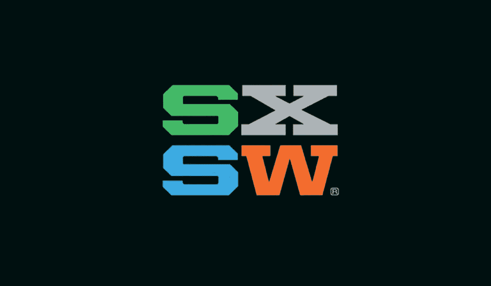

# 在烧烤和啤酒之间 SXSW 2017 开发者指南

> 原文：<https://medium.com/capital-one-tech/the-space-between-bbq-beers-a-developers-guide-to-sxsw-2017-ff48bbecfb6?source=collection_archive---------4----------------------->

和你们有些人一样，我去 SXSW 已经有(我敢承认吗？)将近 25 年。不是每年，但自从 1987 年音乐节开始和 1994 年互动推出以来，已经有很多次了。作为一名职业营销人员，目睹 SXSW 品牌的成长令人着迷。让我回想起 SXSW 一直是一个联系的好地方——品牌与人，人与人，最重要的是，人与新的体验和想法。但我承认，这也成为了一种压倒性的体验。

所以我想分享我关于如何充分利用你的 SXSW 2017 冒险的 10 大想法——特别是如果你是开发人员、产品创新者、技术极客或以上所有人。

1.今年的[开发&代码赛道](http://schedule.sxsw.com/2017/events/track/Development%20&%20Code?_ga=1.100634522.524402215.1478114667)令人发指。在回顾了 14 次阵容之后，我的建议是——选一次，任何一次。有那么好。

2.聊天机器人是议程中的一个热门话题——为这种新的客户体验进行设计是一个令人兴奋、迷人的挑战。[奥斯汀·比尔周日下午关于聊天机器人](http://schedule.sxsw.com/2017/events/PP66459)的会议看起来特别有趣——问了一个基本问题，“我们如何设计对人工智能的信任？”[来自脸书的 Tricia Katz 周五下午将主持一场会议](http://schedule.sxsw.com/2017/events/PP67905)，探讨聊天机器人如何加深消费者参与，这看起来也很有趣。但是在你参加 Tricia 或 Austin 的会议之前，请在周五上午 9:30[到首都一号大厦](http://schedule.sxsw.com/2017/venues/V1109)参加一个关于这个热门话题的激动人心的产品技术设计会议。

3.为了庆祝国际妇女节，我不得不对[产品特立独行者:来自周日健身的女性的顶级建议](http://schedule.sxsw.com/2017/events/PP68889)大声疾呼。我看过 Slack、Hilary for America、Lyft 和脸书的许多领导人的演讲，他们激励着所有人。我也喜欢在 SXSW 2017 上阅读[这篇关于多样性&包容的中型文章](/a-change-is-coming/diversity-and-inclusion-at-sxsw-2017-8c4a94b373ed#.4a0ruwpua)。

4.去年，我们在 SXSW 推出了 DevExchange——可编程网站称之为美国第一个真正的开放式银行平台。今年，在 DevExchange 成立一周年之际，我们与新的合作伙伴、新的 API 产品和开源项目、新的最佳实践分享等一起庆祝这一时刻。周六和周日，请到 Capital One House @ Antone's 来帮助我们庆祝并了解更多我们的工作。

[5。富兰克林烧烤。](https://franklinbarbecue.com/)我在堪萨斯城长大，但我喜欢德克萨斯烧烤。今年 SXSW，我将通过 [@FranklinBbq](https://twitter.com/FranklinBbq) feed 替代生活——因为很遗憾，我不能赶上午餐。但是如果你能去，你应该去。

6.还有其他数据狂人吗？你和我一样热爱 A/B 和多元测试吗？优步，Etsy & Intuit 将讨论 A/B 测试的“秘密”。不仅仅是对于营销人员——对于所有希望提升测试能力和业务影响力的开发人员来说，这看起来都不错。

7.到处开源。也许“无处不在”是言过其实了。但是在 SXSW 上快速搜索开源内容会返回十几个会议和今年加入对话的 OSS 专家的激增。如果你对开源感兴趣，你会想和 Capital One 自己的[贾里德·史密斯](http://schedule.sxsw.com/2017/search?q=open+source)联系，他的简历非常简单，*“开源呆子”(哦，对了，我们将在周六上午 11:00 启动一个新的 Capital One 开源项目。)*

8.给每个人的音乐。我发现[SXSW](http://bloggersguide.sxsw.com/?_ga=1.201900949.524402215.1478114667)的音乐博客指南是一个精心设计的探索，探索谁在演奏，灵感来自于*“我们不能总是相互联系，但我们都可以联系到一首好歌。”*如你所料，今年各场馆的阵容非常多样化。我是一个朋克女孩和爱狗人士——所以 PAWS 乐队立刻引起了我的注意。对于 music anytime，Capital One DevExchange 推出了一个[特殊的 Spotify 播放列表，展示在 Capital One House](http://bit.ly/capitalonehouse) 演奏的艺术家。我们所有的 Spotify 播放列表都是由开发人员为开发人员或任何需要一点“请勿打扰”时间的人创建的。所以听好了！

9.探索人类与科技的交集是 SXSW 的全部议程。我对 IBM Watson 特别感兴趣，这是我们首届 NEXTECH 活动的一个讨论话题。与其在 Jeopardy 上的公开亮相不同，Watson 正在加速人与计算机之间的新伙伴关系——解决医疗保健、政府、金融和其他影响我们日常生活的领域的问题。关于 IBM Watson 如何“真正”工作的会议听起来将提供有趣和有价值的幕后独家新闻。

10.贴纸！我和你一样爱他们。我们在首都一号房为你准备了一些好的——比去年的还要好。

如果你要去奥斯汀，我希望你能学会、笑、听并充分享受德克萨斯烧烤。我们很想知道你最喜欢或不太喜欢什么，所以请在 Twitter 上通过@CapitalOneDevEx 加入[对话，并在 DevExchange 网站上关注我们的直播博客](https://twitter.com/capitalonedevex?lang=en)..我将会和朋友、开发人员和同事在首都一号屋共度美好时光。停下来，让我们联系。

*声明:本博客中的观点是作者/受访者的观点，不一定是 Capital One 的观点。除非本帖中另有说明，否则 Capital One 不属于所提及的任何公司，也不被其认可。使用或展示的所有商标和其他知识产权都是其各自所有者的所有权。这篇博文是 2017 Capital One。*

要了解更多关于 Capital One 的 API、开源、社区活动和开发人员文化的信息，请访问我们的一站式开发人员门户网站 DevExchange。