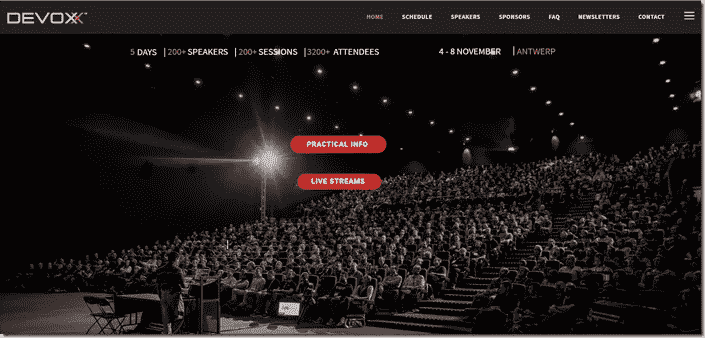

# Java[开发者]的状态——对 Devoxx 2019 的思考

> 原文：<https://medium.com/oracledevs/the-state-of-java-developers-reflections-on-devoxx-2019-d82b17488301?source=collection_archive---------2----------------------->

我参加了比利时 Devoxx 年 11 月。超过 3000 名 Java 开发人员的年度聚会(数字由 Devoxx 网站提供)。也许不是所有人都是 Java，也许有些人甚至不是开发人员。但是总的来说……Java 和软件开发是核心主题。

这个会议已经取代 JavaOne 成为 Java 社区的首要场所——