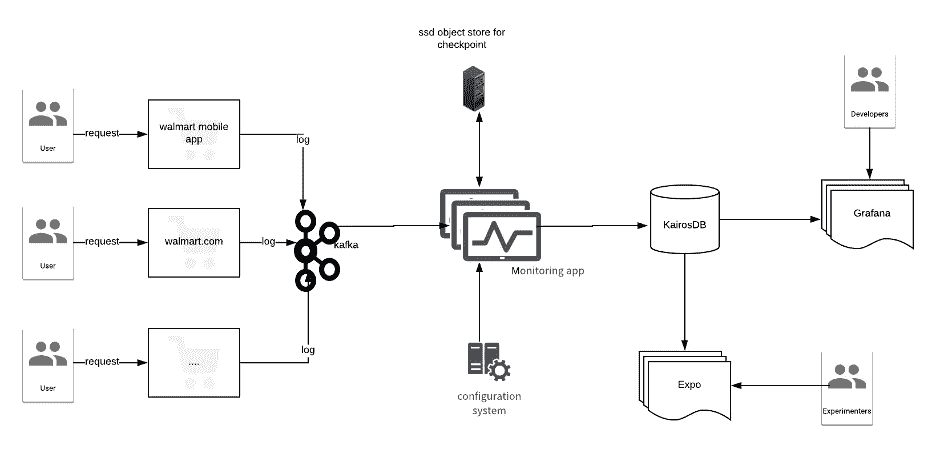
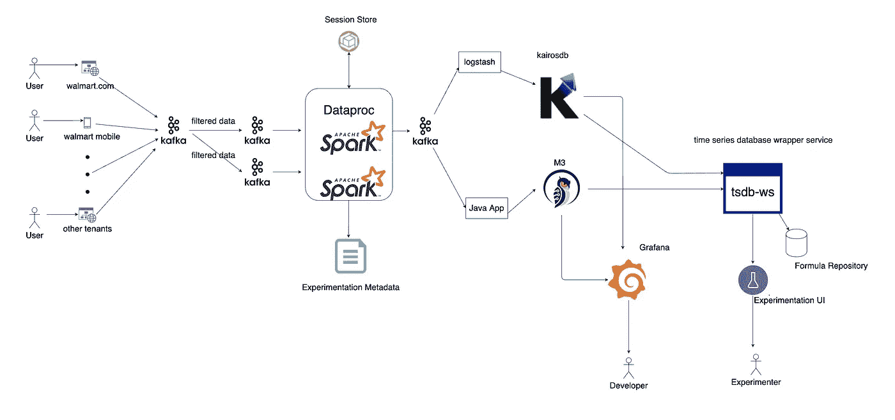

# 与 10 倍流量作战的故事

> 原文：<https://medium.com/walmartglobaltech/the-story-of-battling-with-10x-traffic-711589c8878b?source=collection_archive---------0----------------------->

## 实时报道

Photo credit: [jeffjacobs1990](https://pixabay.com/illustrations/jesus-christ-god-holy-spirit-4779546/)

去年在我的[上一篇文章](/walmartlabs/real-time-data-processing-for-monitoring-and-reporting-a-practical-use-case-of-spark-structured-8e4f91f6f3a7)中，我描述了沃尔玛的 A/B 测试平台 *Expo* 的实时 spark 作业管道的整体架构。从那以后，我们的系统发生了很多变化。鉴于疫情的情况，网上购物者的数量大幅增长。我们观察到，一夜之间，我们的监控管道接收的流量增加了 5 到 10 倍。因此，我写这篇博客是为了简要回顾我们是如何平稳地向云迁移的，以及为了应对我们所面临的挑战，我们对我们的架构所做的改变。

# 背景

简而言之，我们有一个 spark 结构化流作业，从 Kafka 接收数据，将会话状态保存在内存和检查点中，并将指标推送到我们的时间序列数据库中，供实验人员进一步评估。虽然总体而言，流量增加对 Walmart.com 非常有利，但这意味着我们的监控系统会承受更大的压力，导致将指标推送到管道时出现延迟。

在这篇文章中，我将介绍我们面临的所有挑战，以及我们为处理如此巨大的流量所采取的措施。当前系统已经运行了六个月，几乎没有停机时间**。目前，它每秒处理**15-25 万条消息**，每分钟推出大约**300 万条记录**，从我们开始实验到我们的数据库中有指标之间的延迟不到 **3 分钟**。在正常情况下，我们的系统大约运行**100–150 个并发实验**，这些实验放大了监控系统处理的数据量。**

概括一下，我在这里复制了整体架构，更多细节你可以阅读我之前的文章。我也把新的架构放在下面，作为这篇文章其余部分的参考。

The old architecture of the monitoring system

The new architecture of the monitoring system currently running in production

# 问题和行动

在这一节中，我将我们面临的问题以及我们为解决问题所采取的措施进行了分类。我们做的一个主要改变是将整个管道转移到谷歌云，以确保我们有足够的资源进行扩展。之前的工作是在我们的私有数据中心进行的，我们团队的预留容量即将用完，因此我们决定将整个管道迁移到 GCP。我在本文剩余部分的重点将是我们在管道中观察到的问题本身。

## **卡夫卡与调度员比率**

**发布**

通常，每个流作业要么是 CPU 密集型的，要么是 I/O 密集型的。虽然我们的监控系统的性质不同。我们的流媒体管道分为三个阶段。在第一阶段，该作业从 Kafka 获取大约 150 GB(2–3GB/秒)的数据，这是一项繁重的 I/O 操作。在第二阶段，它开始处理来自前一阶段的数据，并在系统中创建/更新会话。这一步是 CPU 密集型的。第三阶段是将指标发送到数据库。这一步不需要太多时间。

1.  **摄取率:**我们有一个流调度程序，它评估事件并决定将事件重定向到其他主题以进行进一步处理。这种重定向不需要任何时间，调度程序发送数据的速度比用户快。我们注意到，dispatcher 向主题发送数据的速率高于我们可以消耗(I/O)和处理(CPU)的速率。

**行动**

1.  **尽早丢弃不必要的数据:**我们采取的早期行动之一是彻底重新评估指向主题的信标类型。世博会自 2015 年开始举办，我们有相当数量的历史元数据。这些数据显示了我们的实验者更感兴趣的信标类型。我们根据主题中的信标评估了历史元数据，发现主题中大约有 *43%* 的数据不会影响实验结果。因此，我们在调度程序中很早就过滤掉了这些信标。dispatcher 中的过滤比作业的管道更便宜，因为在流式作业中，每一秒都很重要，每一毫秒都会累积起来，造成很大的延迟。这一改变缓解了延迟，并且管道能够赶上进度。
2.  **根据流量模式划分数据:**我们将移动和网络流量分开，并将其重定向到各自的主题。这使我们有机会为每个主题创建单独的作业，并独立于其他主题处理每个主题。
3.  **添加更多的分区和计算:**Kafka 消费群中的并行度受到分区数量的限制。如果您有足够的资源，更多的分区会带来更高的吞吐量。我们将每个主题的分区数量从 360 个增加到 490 个，这有助于我们更快地从 Kafka 获取数据。我们还增加了 spark 集群中的计算数量，以克服任务中 CPU 密集型的部分。

## KairosDB

**问题**

另一个问题是 KairosDB。KairosDB 是围绕 Cassandra 的一个包装器，它向外部公开了一个 rest API。

1.  **KairosDB 摄取率:**在疫情之前，我们对 KairosDB 很满意，但随着流量的每一次激增，我们发现我们不能将其作为一个可靠的组件，我们需要认真考虑系统的这一部分。KairosDB 在内部使用本地队列来处理高吞吐量流量，但在突发流量期间，它会丢弃数据并延迟推送数据。即使在新冠肺炎之前，我们也有几次因为机器人或者一些流量爆发(如 PS5 交易)而导致峰值，KairosDB 令我们失望。
2.  **KairosDB 内存管理:**KairosDB 的另一个问题是当我们查询大范围的时间时出现内存异常。由于这种内存管理不善，我们不得不多次重启服务。
3.  **数据保留政策:**KairosDB 中的指标没有压缩，我们很难接受其他团队提出的延长保留期或向当前渠道添加更多指标的请求。我们在实时管道中设置了一个两天的 TTL 策略，但我们收到了许多增加该数量的请求。我们甚至很难轻松地添加更多的指标。每次我们收到添加新指标的请求时，我们都必须小心谨慎。我们还不得不推迟请求，比如用我们的监控系统捕获图像的点击和印象指标，因为这几乎会使我们捕获的指标翻倍。

**动作** ‍

1.  **评估其他选项:**甚至在流量增加之前，我们就注意到 KairosDB 可能是一个问题。所以，我们开始更换我们的时间序列数据库。我们评估了多个数据库，最终得到了两个选项:***elastic search***和 ***M3DB*** 。虽然 Elasticsearch 是一个强大的搜索引擎，其聚合框架可以帮助我们很多，但我们发现与其他时间序列数据库相比，它需要大量的内存和空间。随着数据量的增长，查询速度也越来越慢。另一方面，M3DB 确实大放异彩。我们通过运行两个独立的作业将生产数据推送到 M3DB 并让它运行两周，使系统负载加倍。M3DB 能够轻松处理负载。M3DB 出色的另一个因素是压缩数据的能力，这有助于我们在生产中将指标的 TTL 延长到 30 天。我们还向系统添加了印象和图像点击等指标(带有多个属性和标签)。
2.  **给一个数据库摄取的时间:**我们把 Kafka 作为我们 spark app 和 M3DB 之间的中间件。推送 Kafka 主题比推送数据库更快，因为它只是附加到一个片段文件，这也可以批量完成。通过这种设置，另一个作业可以将指标发送到所需的数据库。对于 KairosDB，我们设置了一个 logstash 集群，对于 M3DB，我们使用一个内部 java 应用程序将指标发送到数据库。我们通过 Grafana 图表比较 KairosDB 和 M3DB 的结果，对两个数据库进行了全面的测试，以确保我们不会因为这种转换而看到任何不一致。

通过上述更改，我们能够添加更多指标，而不必担心系统的稳定性，将保留时间增加到 30 天，并且在过去六个月中指标数据零下降。

## 代码和配置耦合

**发布**

1.  **元数据和代码的卷积:**UI 之前的实现是直接调用 KairosDB 来获取度量，并基于那些计算硬编码的公式。很难给系统添加新的公式。公式是不同指标的组合。例如，转换率来自两个不同的指标，客户数量除以总访客数量。很多时候，实验者需要一个新的公式，它是我们系统中当前指标的组合，但是为了添加它，团队需要改变代码。这部分代码与 Expo UI 服务错综复杂，很难维护。

**动作**

**时序数据库包装服务( *tsdb-ws* ):** 当我们决定用另一个未知数据源切换 KairosDB 时，我们知道最终我们也需要更改 UI 代码。因此，我们决定将通信接口与我们当前和未来的数据源(KairosDB、M3DB、Elaticsearch)统一起来。

为此，我们使用 KOA(node . js 框架)开发了一个时序数据库包装服务( *tsdb-ws* )。为了做到这一点，我们用一个逻辑键空间分隔每个租户，并为该租户定义每个公式的含义，并将这种关系放入一个存储库中。每个公式都可以是模板文字。在这种情况下，UI 将发送适当的有效载荷来生成完整的表达式。

除了公式部分之外，我们在配置文件中还有一个元数据部分，以便提供 UI 呈现图表所需的一切(就像图表的标题一样，这是一个百分比图表或数字图表等)

UI 应用程序点击`*/<:keyspace>*` 获得适当的数据，在给定的时间段内批量请求多个公式。 *tsdb-ws* 服务查看公式列表，*找到公式和指标之间的依赖图，*并基于此通过*一次调用*获取整个数据。返回值由公式的元数据修饰。

使用这种架构，我们不需要任何代码更改。每次实验者需要更多的公式在 UI 中显示时，我们可以很容易地将它们添加到资源库中，它会在 UI 中呈现为图表。

此外，这个设置帮助我们从 KairosDB 平稳过渡到 M3DB。UI 不需要知道我们正在使用的底层数据库是什么。当我们觉得 M3DB 已经准备好了，并且我们有了一个合适的设置，我们只是切换 tsdb-ws 中的标志来使用 M3DB，而 UI 甚至不知道它。

# 包裹

大约两年前，我们开始为世博会建立一个高度可用的监控系统。在过去的两年里，我们的建筑适应了不同的环境。目前的系统运行顺利，我们有计划确保它可以扩展到下一个 10 倍的流量。我们现在确信，这是我们和我们的客户应该采取的正确策略。