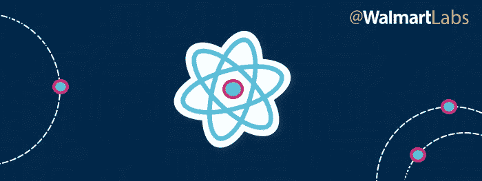
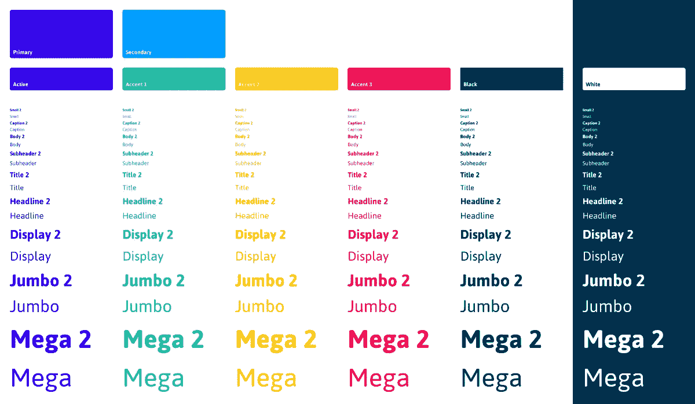
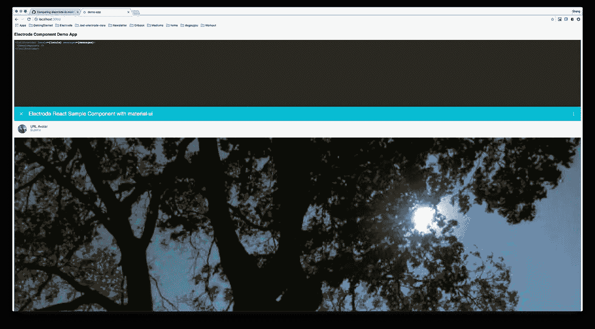

# 电极组件原型的造型

> 原文：<https://medium.com/walmartglobaltech/the-styling-of-electrode-component-archetype-356d8f8c77b3?source=collection_archive---------2----------------------->



WalmartLabs 电极组件原型是一个 npm 模块，封装了样板文件，用于集中管理电极组件的配置、工作流程和依赖性。如果你不熟悉电极原型，请阅读 [Joel Chen](https://medium.com/u/9f67cc98eb00?source=post_page-----356d8f8c77b3--------------------------------) 的文章[此处](/walmartlabs/the-evolution-of-electrode-archetype-d61a5dcc90c9)，然后继续下面的内容。

组件原型的一个关键部分是样式，这是我们一直想要改进的部分之一。“如何在电极组件中配置不同的样式”，“原型支持什么样式”，“我们可以在一个电极组件中有多种样式”是我们的开发人员经常问的问题。在本文中，我将解释样式如何在电极组件原型中工作。

# 样式文件的布局

让我们先来看看组件样式文件的布局:

```
electrode-component
    demo-app
        src/client/styles
    packages
        [component]
            demo/demo.[css|styl|scss]
            src/styles 
```

*   `demo-app/src/client/styles`:`demo-app`的样式文件；用于演示组件。
*   `packages/[component]/demo` : `demo`文件夹是`demo-app`和`packages/[component]`之间的连接。这是`demo-app`获得`packages/[component]`样式的唯一来源。`demo-app`只会在`demo`文件夹上引用，不会在`src/styles`上引用。
*   `packages/[component]/src/styles`:组件的样式文件。

# 可以有哪些款式？



组件原型支持多种风格，如纯 CSS、 [CSS-Modules + CSS-Next](https://github.com/css-modules/css-modules) 、 [Stylus](http://stylus-lang.com/docs/css-style.html) 和 [SCSS](http://sass-lang.com/) 以及它们的组合。它支持基于不同标志和样式类型的不同样式。

# 原型中的风格是如何捆绑在一起的？

在组件原型中，我们使用 webpack 将所有资产(包括 Javascript、样式文件等)放在一个依赖图中。然后我们可以在本地静态资产上使用 *require()* 。为了捆绑 JavaScript 之外的静态资源，您可以使用 webpack 加载器来编译/转换样式文件。加载器是为 webpack 构建的基于节点的实用程序，用于编译/转换给定类型的资源，这些资源可以捆绑到 javascript 模块中。以下是我们用来编译样式的 webpack 样式加载器:

*   **css-loader:** 从所有 css 文件中收集 CSS，并将它们放入一个字符串中。
*   **style-loader:** 获取上述 css-loader 生成的输出字符串，并将其放入 index.html 文件的< style >标签中。
*   **postcss-loader** 提供了各种插件来用 JavaScript 转换 css。
*   **stylus-relative-loader** 是由 [@WalmartLabs](https://medium.com/u/c884135151a4?source=post_page-----356d8f8c77b3--------------------------------) 创建的，一个用于固定相对导入的 stylus loader。
*   **sass-loader** 是一个 sass 加载器。将 Sass 编译为 CSS。

组件原型根据文件类型和***CSS modulesupport***标志加载样式加载器。
没有***CSS modulesupport****指定或者有一个值 *false* ，样式加载器将默认为以下:*

```
*{      
  test: /**\.**css$/,      
  use: ${cssLoader}!${postcssLoader}    
},    
{     
  test: /**\.**scss$/,     
  use: `${cssQuery}!${sassLoader}`    
},    
{      
  test: /**\.**styl$/,      
  use: `${cssLoader}!${stylusLoader}`
}*
```

*使用 *cssModuleSupport: true* ，所有的类名和动画名都将由 CSS-Modules 和 CSS-Next 在本地确定范围。样式加载器将按如下方式加载:*

```
*const cssLoaderOptions = "?modules&localIdentName=[name]__[local]___[hash:base64:5]&-autoprefixer";{      
  test: /**\.**css$/,      
  use: ${cssLoader}${cssLoaderOptions}!${postcssLoader}    
},    
{     
  test: /**\.**scss$/,     
  use: `${cssQuery}${cssLoaderOptions}!${sassLoader}`    
},    
{      
  test: /**\.**styl$/,      
  use: `${cssLoader}${cssLoaderOptions}!${stylusLoader}`
}*
```

# *如何指定所需的样式？*

*您可以扩展或定制电极组件的配置。为了加载相应的样式加载器，例如 CSS-Modules + CSS-Next，你需要在`app/archetype/config`中指定标志`cssModuleSupport:true`(注意:这里检查标志定制)。*

*组件原型将从项目中寻找定制的配置，并将它们合并到当前的 webpack 配置中。以下是您可以为组件选择的可用标志:*

*   *`cssModuleSupport`:启用`css-modules + css-next`支持的标志。(默认值:未定义)*
*   ***【弃用警告】**这不是推荐的设置。`cssModulesStylusSupport`:启用 CSS 模块手写笔支持的标志。(默认值:false)*

# *风格用例*

*如果不指定标志，以下是样式的默认情况:*

*   *如果您使用的是*。css 作为你的样式类型，它将使用 CSS-Modules + CSS-Next*
*   *如果您使用的是*。styl 作为你的风格类型，它将使用手写笔*
*   *如果您使用的是*。scss 作为您的风格类型，它将使用 SCSS*

*以下是您可以自定样式的方法:*

*   *要使用纯 CSS(不支持 CSS-Modules + CSS-Next)，将`cssModuleSupport`设置为 false。*
*   *要使用触笔和 CSS-Modules + CSS-Next，请将`cssModuleSupport`设置为 true。*
*   *要将 SCSS 与 CSS-Modules + CSS-Next 一起使用，请将`cssModuleSupport`设置为 true。*

# *哪里可以找到演示？*

*为了更好地理解电极组件的样式，我们在这里为您创建了几个示例:*

*如果你使用 css 模块作为你的风格，[这里](https://github.com/didi0613/oss-electrode-component-css-modules-example)是一个演示组件。*

*如果你使用 SASS 作为你的风格，[这里](https://github.com/didi0613/oss-electrode-component-sass-example)是给你的一个演示组件。*

*我们还有一个来自我们的[开源电极库](https://github.com/electrode-io/electrode/tree/master/samples/demo-component/packages/demo-component)的电极组件项目，请在这里查看[。](https://github.com/electrode-io/electrode/tree/master/samples/demo-component/packages/demo-component)*

**

# *大声喊出来*

*感谢 [@WalmartLabs](https://medium.com/u/c884135151a4?source=post_page-----356d8f8c77b3--------------------------------) 电极团队负责人 [Joel Chen](https://medium.com/u/9f67cc98eb00?source=post_page-----356d8f8c77b3--------------------------------) 和电极团队成员 [Dat Vong](https://medium.com/u/9095df05ab92?source=post_page-----356d8f8c77b3--------------------------------) 对本文的帮助和评论。*