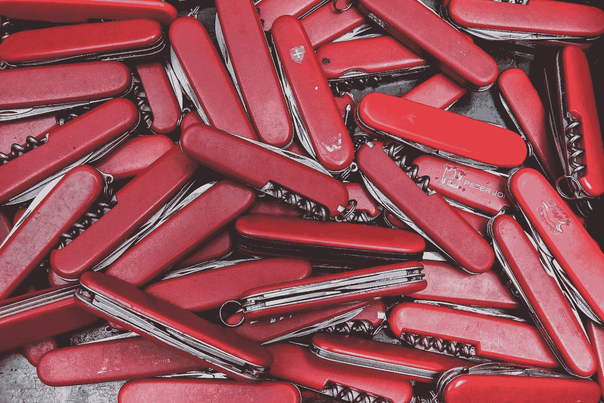

# 瑞士军刀和烹饪书第一部分——我工程工具箱里最喜欢的工具

> 原文：<https://medium.com/capital-one-tech/the-swiss-army-knife-and-the-cookbook-part-1-my-favorite-tool-in-my-engineering-utility-belt-8e3c13ee7155?source=collection_archive---------1----------------------->

## Redis 如何满足应用程序数据库、缓存和消息代理的需求

# 为什么我❤️·雷迪斯

我想写这两篇文章已经有一段时间了，因为 Redis 是我反复使用的工具。作为一名软件工程师…