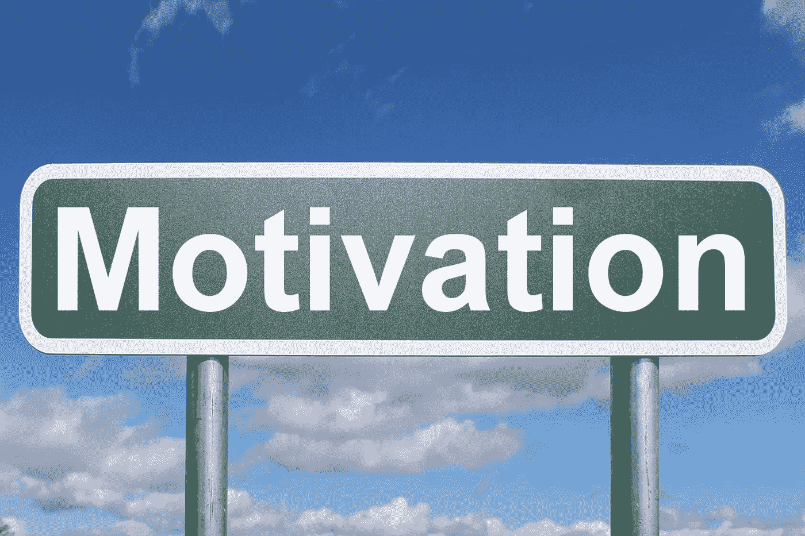
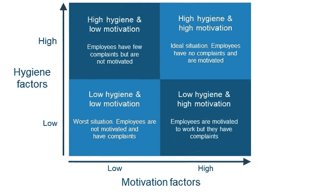

# 动机理论

> 原文：<https://medium.com/globant/the-theory-of-motivation-e9f728011d5b?source=collection_archive---------2----------------------->

Motivation by [Nick Youngson](http://www.nyphotographic.com/) [CC BY-SA 3.0](https://creativecommons.org/licenses/by-sa/3.0/) [Pix4free](https://pix4free.org/)

在这个场合，我也想写一下赫尔茨贝格的动机理论，也称为双因素理论。尽管许多专业人士对动机进行了理论化，但我想把赫尔茨贝格的理论放在桌面上，因为它似乎简单，而且非常优雅地将工作场所中影响动机的各种因素分为两个简单的组。

*   卫生因素:这些因素的存在并不一定会激励人们努力工作，但这些因素的缺乏会挫伤人们在工作场所的积极性。
*   激励因素或激励剂或动机:这些因素的存在会激励人们努力工作。

# 卫生因素

赫尔茨贝格的卫生因素是强制性因素，没有这些因素，人们就没有动力。这些是激励在工作场所存在的必要因素。

卫生因素的存在并不一定导致积极的满意，但这些因素的缺失会导致消极的满意或不满意。

卫生因素可以说是个体期望得到满足的生理和安全需求。

赫尔茨贝格卫生因素的一些例子:

*   人身安全和良好的工作条件:设备和工作环境必须安全、适合使用和卫生。
*   公司政策:公司政策必须对员工公平明确，此外，还必须与竞争对手保持一致。
*   公平薪酬:薪酬必须公平合理，符合行业标准，与同行业其他组织相比具有竞争力。
*   工作保障:员工必须感到他们的工作是安全的，他们不会一直处于被解雇的威胁之下。
*   工作中的良好关系:同事、上司和下属之间应该有合作、友好、健康的关系。
*   工作生活平衡:员工不应该被工作和不切实际的期望压得喘不过气来，这样他们就没有时间享受个人生活了。必须给予员工适当的关注，以保持健康的工作生活平衡。

在众多其他产品中…

# 激励因素

这些因素激励员工取得更好的绩效，因为它们被视为额外的利益。激励因素，如果存在的话，会导致积极的满意，但是这些因素的缺乏不一定会导致消极的满意或不满意。

赫尔茨贝格激励因素的一些例子:

*   奖励和认可:工作应该为员工的成功提供表扬和认可。这种认可应该来自你的上级和你的同事。
*   成就:工作应该给员工一种成就感。这会让你有一种自豪感，觉得你做了一件困难但值得的事情。
*   工作性质:工作不应该是单调的，而是有意义的，有趣的，并提供足够的挑战来保持员工的积极性。
*   管理:员工不应该被微观管理，但应该感到他们有足够的自由拥有自己的工作，并对其完成负责。
*   专业成长:员工必须发挥高知名度的作用，并有可能获得高专业成长。

在众多其他产品中…

# 组织的四种可能状态

根据赫尔茨贝格的理论，并基于上述要点，一个组织或团队可以发现自己在保健因素和激励因素方面存在四种状态:

The four states of an organization as per Herzberg’s motivation theory

高卫生、高动力:这是任何组织或团队最好、最理想的情况。在这种状态下，员工被激励尽最大努力，很少或没有抱怨。

高卫生和低积极性:这是一种状态，在这种状态下，员工的所有基本需求都得到了满足，对薪酬或工作条件几乎没有抱怨。然而，工作对员工来说不是很有趣，他们来工作只是为了薪水。如果员工找到的工作报酬和他们目前的公司一样好，并且有机会从事有趣的工作，他们就会跳槽。

低卫生和高动力:在低卫生，高动力的情况下，员工有很高的动力来工作，但有许多未解决的投诉。最典型的例子是，员工正在从事一些非常具有挑战性的技术和令人兴奋的项目，但薪酬与竞争对手相比较低或不符合行业标准。

低卫生、低动力:这是任何组织或团队最不希望出现的情况。这就是员工工资低，工作也无趣的地方。如果这种情况持续下去，除非他们的抱怨得到解决，否则员工就会开始离开组织。

# 那么，如何将这一理论应用到没有动力的员工身上呢？

有几个迹象可以让你看出你的员工缺乏动力。其中一些是低生产率，高流失率，经常抱怨工资和工作条件，对你的最终客户服务质量差或生产低质量产品，员工罢工事件等。

根据赫尔茨贝格的激励理论，在上述情景中，管理层应该集中精力对工作进行重组，从而激活激励因素。工作轮换、工作扩大和工作充实是雇主在这种情况下重新激励员工的三种策略。没有积极性的员工。

# 摘要

赫尔茨贝格的动机理论也被称为双因素理论。根据这一理论，影响工作场所动机的因素可以分为两组:保健因素和激励因素。

保健因素的存在不会导致更高的满意度，但这些因素的缺失会导致不满意和动力低下。

激励因素就像员工更满意的附加福利，这可能会导致更好的绩效，但缺乏这些因素不一定会导致消极的满意度。

每一个组织和团队都应该指向实现一个高健康和高动力的状态，并且总是避免低健康和低动力的状态。