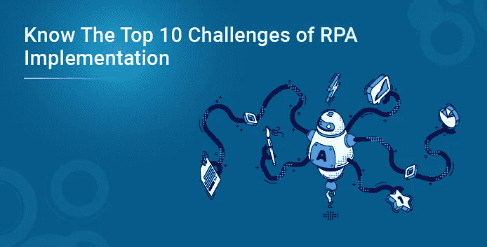

# 了解 RPA 实施的 10 大挑战

> 原文：<https://medium.com/edureka/the-top-10-challenges-of-rpa-implementation-25ad77f6eb6a?source=collection_archive---------2----------------------->

我们都听说过 RPA 中技术熟练的专业人员如何使用这一技术来帮助组织实现更高的运营效率，在不到 6 到 9 个月的时间内提供 100%的投资回报，提高员工士气，并在短时间内帮助扩大业务运营。所有这些事实都是真实的；然而，这并不意味着 RPA 项目是完美的，没有任何挑战。因此，在这篇关于 RPA 挑战的文章中，我们来讨论一下 RPA 项目面临的不同挑战。

本文将涵盖以下几点:

*   技能资源短缺
*   自动化端到端用例的挑战
*   缺乏必要的业务支持
*   缺乏适当的团队结构
*   定义模糊的业务连续性计划
*   文化冲击
*   自动化用例识别错误
*   不遵循最佳实践
*   RPA 平台供应商提供的支持不够
*   实施后采用

# RPA 挑战

## 技能资源短缺

我们都同意，随着当今市场需求的增加，RPA 正在蓬勃发展，但是，在 RPA 市场上缺乏熟练的资源。在开始一个新项目时采购资源，并在损耗的情况下回填关键资源，这对任何项目的成功都构成了巨大的威胁。此外，具有丰富经验的 RPA 专业人员期望获得丰厚的报酬，而这对于一些公司来说可能在财务上不可行。

## 无法自动化端到端用例

在某些流程中，并非所有步骤都可以通过使用基于规则的 RPA 工具直接自动化。相反，它需要与机器学习算法和 OCR 引擎集成。然而，这些额外的技术组件将花费额外的资金和技能，这可能不会给业务领导带来预期的结果。

## 缺乏必要的业务支持

要使 RPA 项目取得成功，重要的是为业务用例提供必要的工作流图、潜在故障场景的可能解决方案、要由 Bot 处理的不同类型数据的业务规则以及操作团队在手动处理过程中面临的技术异常。

如果业务并不真正倾向于提供所需的支持，RPA 项目将因此在用户验收测试期间面临创建全面的流程设计文档的挑战。这些测试要求企业提供关于 Bot 执行的关键反馈。

## 缺乏适当的团队结构

专门的团队，每个人都有明确定义的角色，以确保按照预期标准按时进行移交。对要遵循的流程和多个项目之间的资源共享缺乏足够的了解会给实现 RPA 项目的既定里程碑带来风险。

## 定义模糊的业务连续性计划

对 RPA 项目的期望是这样设定的，一旦在生产中部署了机器人，就应该只需要很少的维护，甚至不需要维护，以确保顺利交付。然而，现实情况是，它确实需要维护，包括识别 Bot 执行期间新的未处理场景、生产环境中面临的问题、根据来自不同时区的多个业务单位的要求定义 Bot 执行计划，以及重大故障期间的缓解计划。

## 文化冲击

通常，组织实施任何新的流程/技术，要么使用'*自顶向下的方法*，要么使用'*自底向上的方法*。在自上而下的方法中，高层领导确定 RPA 必须在整个组织中实施。但是，如果对新技术的影响缺乏认识，RPA 自动化将会在员工中产生负面印象，因为它可能会在部署自动化机器人后引发失业和责任不明的担忧。

## 自动化用例识别错误

确定可以提供良好 ROI 的用例对于获得业务的认可至关重要，因为这将为下一组要自动化的流程分配足够的预算。不正确识别的用例只会产生很低的 ROI，并且不会如业务或者甚至向业务提议的度量所期望的那样提高过程效率。为自动化确定的流程的复杂性在产生预期的投资回报方面起着重要的作用。

## 不遵循最佳实践

如果团队没有遵循最佳实践，将很难调试代码，其他团队成员也很难理解和重用流程。在过渡的情况下，新成员所需的时间会比预期的长。当需要升级解决方案时，解码逻辑将是一项艰巨的任务。

## RPA 平台供应商提供的支持不够

在几乎所有 RPA 项目中，我们都会遇到没有直接解决方案的情况。在这种情况下，如果团队成员无法自动执行某个特定步骤，请务必确保 RPA 平台供应商提供足够的支持，因为他们拥有使用工具功能的专业知识，并且也了解不同客户以多种方式实施这些功能。

## 实施后采用

企业通常会在采用 RPA 之前采取所有必要的措施。然而，他们没有注意到在自动化部署到生产中之后可能出现的阻碍。

因此，我们可以总结说，对不同项目所面临的挑战的了解提供了一个清单，以便做好准备不落入上述类别之一。它还有助于创建一个知识库，其中包含针对每个已确定挑战的可能解决方案、解决这些问题的不同方法以及一旦实施后如何随机应变。

各位，关于 RPA 挑战的这篇文章到此结束。本文中讨论的挑战将有助于您在将来从事 RPA 项目时避免它们。现在您已经了解了 RPA 项目，请查看 Edureka 提供的 **RPA 开发人员课程** & **使用 Automation Anywhere 进行 RPA 培训**，edu reka 是一家值得信赖的在线学习公司，拥有遍布全球的 250，000 多名满意的学习者。这两个认证将分别帮助你深入了解 UiPath 和 Automation Anywhere。

如果你想查看更多关于人工智能、DevOps、道德黑客等市场最热门技术的文章，那么你可以参考 [Edureka 的官方网站。](https://www.edureka.co/blog/?utm_source=medium&utm_medium=content-link&utm_campaign=rpa-challenges)

*原载于 2022 年 1 月 6 日 https://www.edureka.co**[*。*](https://www.edureka.co/blog/rpa-challenges/)*