# 打字税

> 原文：<https://medium.com/javascript-scene/the-typescript-tax-132ff4cb175b?source=collection_archive---------0----------------------->

## 成本与收益分析

Photo: LendingMemo (CC BY 2.0)

TypeScript 在 2017 年和 2019 年之间增长了很多，而且在许多方面都有很好的理由。TypeScript 有很多可爱之处。在 2018 年 JavaScript 调查中，[几乎一半的受访者](https://2018.stateofjs.com/javascript-flavors/overview/)表示他们已经尝试过 TypeScript，并将再次使用它。但是你应该把它用于你的大规模应用程序开发项目吗？

本文采用一种更关键的、数据驱动的方法来分析使用 TypeScript 构建大规模应用程序的 ROI。

# 打字稿增长

TypeScript 是发展最快的语言之一，也是目前领先的编译到 JavaScript 语言。

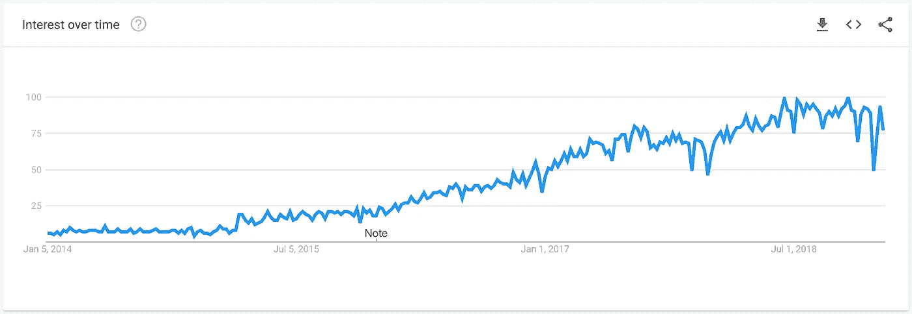

Google Trends 2014–2019 TypeScript Topic Growth

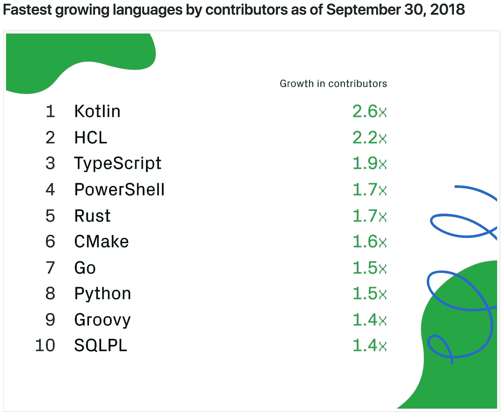

GitHub Fastest Growing Languages by Contributor Numbers [[Source](https://blog.github.com/2018-11-15-state-of-the-octoverse-top-programming-languages/)]

这是非常令人印象深刻的牵引力，不应该被忽视，但它仍然远远没有主宰整个 JavaScript 生态系统。你可能会说这是一个更大的海洋中的一个大浪。

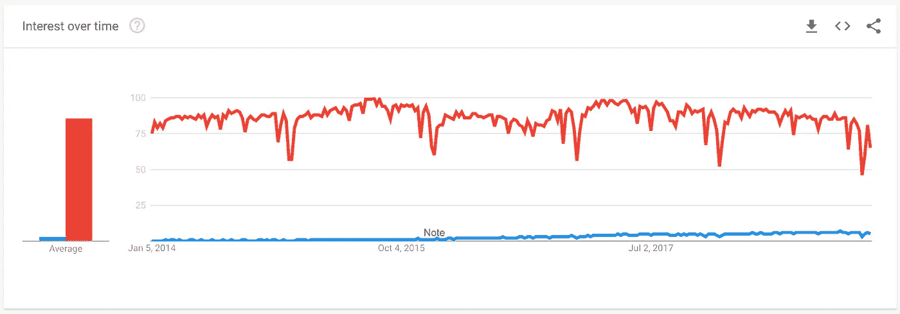

Google Search Trends 2014–2018 JavaScript (Red) vs TypeScript (blue) Topic Interest

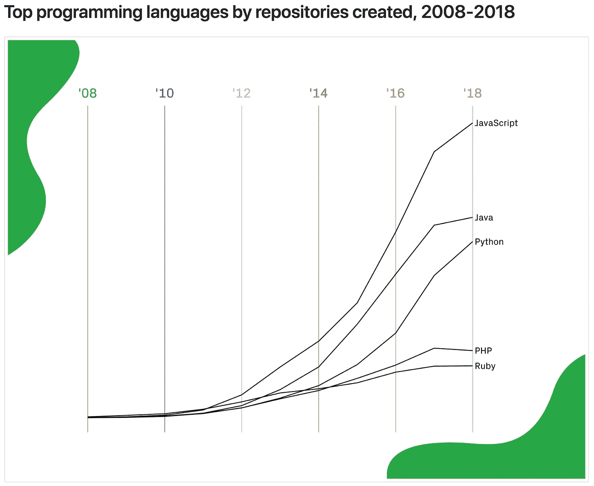

GitHub Top Languages by Repositories Created: TypeScript is Not in the Top 5\. [[Source](https://blog.github.com/2018-11-15-state-of-the-octoverse-top-programming-languages/)]

也就是说，TypeScript 在 2018 年达到了一个拐点，在 2019 年，将会有大量的制作项目使用它。作为一名 JavaScript 开发人员，您可能别无选择。TypeScript 的决定会为您做出，您不应该害怕学习和使用它。

但是如果你处于决定是否使用它的位置，你应该对收益和成本有一个现实的理解。会有正面影响还是负面影响？

以我的经验来看，两者都有，但是没有正的投资回报率。许多开发人员喜欢使用它，我也非常喜欢 TypeScript 开发人员体验的许多方面。但是所有这些都是有代价的。

# 背景

我来自一个使用静态类型语言的背景，包括 C/C++和 Java。JavaScript 的动态类型起初很难适应，但一旦我习惯了，就像从一个漫长黑暗的隧道中走出来，来到了光明中。静态类型有很多优点，但是动态类型也有很多优点。

在过去的几年里，我断断续续地全身心投入到打字稿上，积累了一年多的日常实践经验。接着，我领导了多个使用 TypeScript 作为主要语言的大型制作团队，了解了 TypeScript 对多项目的高级影响，并将其与类似的大型原生 JavaScript 版本进行了比较。

2018 年，[去中心化应用起飞](/the-challenge/blockchain-platforms-tech-to-watch-in-2019-f2bfefc5c23)，大部分使用智能合约和开源软件。当你处理价值互联网时，漏洞会让用户损失金钱。编写可靠的代码比以往任何时候都重要，因为这些项目通常都是开源的，所以我认为我们用 TypeScript 开发代码很好，这样其他 TypeScript 团队可以更容易地集成，同时保持与使用 JavaScript 的项目的兼容性。

我对 TypeScript 的理解，包括它的好处、成本和缺点，已经大大加深了。我很难过地说，它不像我希望的那样成功。除非它有很大的改进，否则我不会为另一个大型项目选择 TypeScript。

## 我喜欢打字稿的地方

我还是长期看好 TypeScript 的。**我喜欢打字稿，** 我仍然喜欢它的许多部分。我希望 TypeScript 的开发者和支持者会把这看作是一个建设性的批评，而不是一个充满敌意的反驳。TypeScript 开发人员*可以修复一些问题，*如果他们这么做了，我可能会重复 ROI 分析并得出不同的结果。

静态类型对于帮助**记录功能、阐明用法和减少认知开销非常有用。**例如，我*通常*发现 Haskell 的类型是有帮助的、低成本的、无痛苦的、不引人注目的，但是有时甚至 Haskell 灵活的更高级的类型系统也会碍事。尝试在 Haskell(或 TypeScript)中键入一个转换器。这并不容易，可能比非类型化的等价函数还要差一点。

我喜欢 TypeScript 中的**类型注释在碍事时可以是可选的**，我也喜欢 TypeScript 使用结构化类型，并对类型推断提供了一些支持(尽管推断还有很大的改进空间)。

**TypeScript 支持接口，**接口是可重用的(与内联相反)类型，您可以用各种方式应用它们来注释 API 和函数签名。一个接口可以有许多实现。接口是 TypeScript 最好的特性之一，我希望这个特性能够内置到 JavaScript 中。

最好的消息:在我看来，如果你使用一个得到很好支持的编辑器(比如 Atom 或 Visual Studio Code)，TypeScript 的编辑器插件仍然可以为**提供 JavaScript 生态系统中最好的 ide 开发者体验**。其他插件开发者应该尝试一下，并记下他们如何改进。

# 在数字中键入 ROI

我将从几个方面对 TypeScript 进行评分，给你一个更好的感觉，TypeScript 是否适合大规模应用程序。

大于 0 表示积极影响。小于 0 表示负面影响。3-5 分代表相对较强的影响。2 分代表中度影响。1 分代表影响相对较低。

这些数字很难精确测量，而且有些主观，但是我已经尽我所能估计出反映我们在真实项目中看到的实际成本和回报。

所有被判定有影响的项目都超过 5 万 LOC，有几个合作者工作了几个月。一个项目是 Angular 2 + TypeScript，而另一个类似的项目是用 Angular 1 和标准 JavaScript 编写的。所有其他项目都是用 React 和 Node 构建的，并与用标准 JavaScript 编写的 React/Node 项目进行比较。主观的 bug 密度、主观的相对速度和开发人员的反馈被估计，但是没有精确的测量。所有团队都混合了有经验的和新的 TypeScript 开发人员。所有成员都可以接触到更有经验的导师，以协助 TypeScript 入职。

在项目的小样本中，客观数据噪音太大，无法以可靠的误差范围做出任何明确的客观判断。在一个项目中，原生 JavaScript 显示出比 TypeScript 低 41%的公开错误密度。在另一个项目中，TypeScript 项目显示出比可比较的本地 JavaScript 版本低 4%的错误密度。显然，其他质量度量的实现(或缺乏)比 TypeScript 有更强的影响，TypeScript 使数字超出了可用性。

由于误差如此之大，我放弃了客观量化，转而关注特性交付速度和对我们花费时间的观察。您将在投资回报逐点细分中看到更多这些细节。

因为涉及到很多主观性，你应该考虑到解释中的误差幅度(如图所示)，但是总的投资回报平衡应该给你一个好主意。

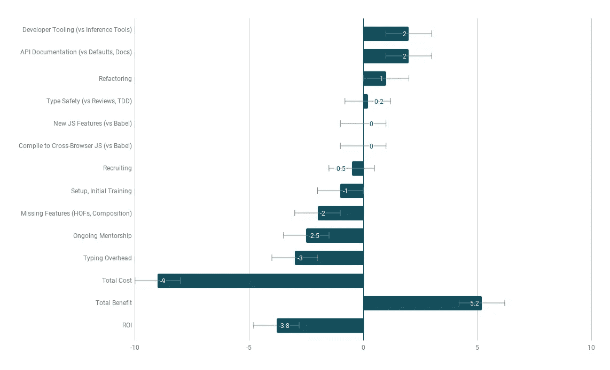

TypeScript Cost vs Benefit Analysis: Likely Negative ROI

我已经可以听到花生画廊对小收益分数的反对意见，我并不完全不同意这些论点。TypeScript 确实提供了一些非常有用、强大的功能。这是毫无疑问的。

为了理解相对较小的收益分数，您必须很好地理解我将 TypeScript 与什么进行比较:不仅仅是 JavaScript，还有与为原生 JavaScript 构建的工具配对的 JavaScript *。*

让我们更详细地看一下每一点。

**开发人员工具:**我最喜欢的 TypeScript 特性，也可以说是使用 TypeScript 最大的实际好处是，它能够通过提供接口类型提示和在编程时实时捕捉潜在错误来减轻开发人员的认知负担。如果这些在带有一些好插件的原生 JavaScript 中都不可能，我会给 TypeScript 更多的好处，但是 0 分是使用 JavaScript 已经可以得到的，基线已经很好了。

大多数 TypeScript 的拥护者似乎并没有很好地理解 TypeScript 在与什么竞争。开发工具的选择不是 TypeScript vs native JavaScript，也没有工具。它介于 TypeScript 和*之间，JavaScript 开发工具的整个丰富生态系统*。当你使用[自动完成](https://github.com/atom/autocomplete-plus)、[类型推断](https://atom.io/packages/atom-ternjs)和 [lint 工具](https://eslint.org/)时，原生 JavaScript 自动完成和错误检测让你获得 80% — 90%的类型脚本的好处。当您运行类型推断时，并且[您使用 ES6 默认参数](/javascript-scene/javascript-factory-functions-with-es6-4d224591a8b1)，您会得到类型提示，就像使用带类型注释的类型脚本代码一样。

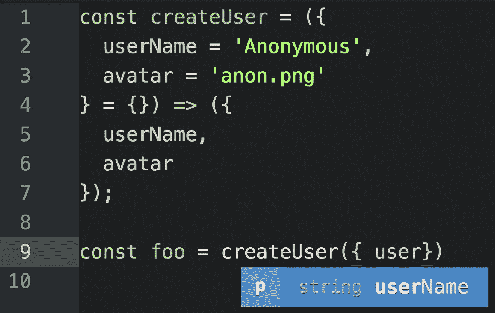

Example of Native JavaScript Autocomplete with Type Inference

公平地说，如果您使用默认参数来提供类型提示，您也不需要为 TypeScript 代码提供注释，这是减少类型语法开销(使用 TypeScript 的开销之一)的一个很好的技巧。

TypeScript 为这些事情提供的工具可以说稍微好一点，更加一体化——但这还不足以证明其成本的合理性。

**API 文档:**TypeScript 的另一个好处是更好的 API 文档，它总是与您的源代码保持同步。您甚至可以从您的 TypeScript 代码中生成 API 文档。这也会得到更高的分数，除了您可以在 JavaScript 中使用 [JSDoc](http://usejsdoc.org/) 和 [Tern.js](http://ternjs.net/) 获得相同的好处，并且文档生成器非常丰富。就我个人而言，我不是 JSDoc 的忠实粉丝，所以 TypeScript 确实有一些优点。

即使有世界上最好的内联文档，您仍然需要真正的文档，因此 TypeScript 增强了而不是取代了现有的文档选项。

**重构。**在大多数情况下，如果你能在重构中从 TypeScript 中获得显著的好处，那通常是一种代码味道，表明你的代码过于紧密耦合。我已经写了一整本书，讲述如何编写更加可组合、更加松散耦合的代码，书名叫做[“编写软件”](https://leanpub.com/composingsoftware)。如果 TypeScript 为您节省了许多重构的痛苦，那么紧耦合很可能仍然会给您带来许多其他可以避免的问题。我强烈建议阅读这本书，尤其是章节[“嘲讽是一种代码味道”](/javascript-scene/mocking-is-a-code-smell-944a70c90a6a)，它提供了大量关于紧密耦合的原因的信息，以及一些可以帮助您避免它们的最佳实践。

另一方面，一些公司运行着共享相同代码库的连接项目的非常大的生态系统(例如，[谷歌著名的 monorepo](https://cacm.acm.org/magazines/2016/7/204032-why-google-stores-billions-of-lines-of-code-in-a-single-repository/fulltext) )。使用 TypeScript 使他们能够升级 API 设计选择，以考虑更好的设计和新的用例。负责这些升级的开发人员还负责确保他们的库更改不会破坏 monorepo 中依赖于这些库的任何软件。TypeScript 可以为这个非常有限的 TypeScript 用户子集节省大量时间。

我说非常有限的子集，因为巨大的、封闭的 monorepo 生态系统是例外，而不是规律。这个过程可能会扩展到整个 Google，但是不能扩展到库作者不知道的库。对更广泛的生态系统所使用的库 API 进行突破性的更改可能会破坏您甚至不知道存在的代码。

在传统的、更加分散的库生态系统中，人们避免对 API 进行突破性的更改，而是遵循开放/封闭原则来创建新功能(API 对扩展开放，对突破性的更改关闭)。除了少数例外，这就是网络平台本身的演变方式。这就是为什么 React 仍然支持自 React 0.14 以来被更好的选项所取代的特性。React 发展并增加了新的特性，从根本上改善了开发者的体验*而没有破坏旧的功能。*例如，`class`React 仍然支持组件，即使在改进很多的 React Hooks API 成熟之后。

这使得整个生态系统的变化是可选的，而不是必须的。团队可以根据需要逐步升级他们的软件，而不是将整个生态系统的代码变更项目堆在库团队上。

即使在需要改变整个生态系统代码的情况下，类型推断和[自动化代码模块](https://github.com/reactjs/react-codemod)也能有所帮助——不需要类型脚本。

我最初在心里给重构打了零分，并把它从列表中删除了，因为我非常喜欢开放/封闭的方法、推理和 codemods。然而，在有限的情况下，一些团队从中获得了真正的好处。

使用原生 JavaScript 很有可能在其他方面为您提供更好的服务。

**类型安全似乎没有太大的区别。** TypeScript 的支持者经常谈论类型安全的好处，但是[几乎没有证据表明类型安全对生产 bug 密度有多大影响](/javascript-scene/the-shocking-secret-about-static-types-514d39bf30a3)(真的，[静态类型似乎对生产 bug 密度几乎没有影响](http://janvitek.org/pubs/toplas19.pdf))。(2022 年的一项研究甚至有更多证据表明，TypeScript 对减少 bug 没有太大影响)。这是很重要的，因为代码审查和 TDD 有很大的不同(对于单独的 TDD，[40%—80%](https://www.computer.org/csdl/mags/so/2007/03/s3024-abs.html))。将 TDD 与设计评审、规范评审和代码评审结合起来，您会看到 bug 密度减少了 90%以上。这些进程中的许多(特别是 TDD)能够捕获 TypeScript 捕获的所有同类错误，以及 TypeScript 永远无法捕获的许多错误。

根据伦敦大学学院的高正和厄尔·t·巴尔以及微软研究院的克里斯蒂安·伯德的说法，TypeScript 只能解决大约 20%的“公共错误”，其中“公共”意味着这些错误在实现阶段后仍然存在，并被提交给公共存储库。

这项研究的作者认为他们低估了 TypeScript 的影响，因为他们假设已经应用了所有其他质量度量，但他们没有努力判断其他错误预防措施的质量。他们承认这一变量，但却将其完全排除在计算之外。

在我的经验中，绝大多数团队都部分应用了一些措施，但很少很好地应用所有重要的 bug 预防措施。在我的团队中，我们使用设计评审、规范评审、TDD、代码评审、lint、模式验证和公司赞助的指导，这些都对 bug 密度产生了巨大的影响，将类型错误减少到几乎为零。

根据我的经验，除了林挺之外，其他类型对代码质量的影响都比静态类型大。换句话说，我从一个比论文作者更严格的零的定义出发。

如果你没有正确地实现那些其他的 bug 预防措施，*我毫不怀疑你会看到仅使用 TypeScript 就能减少 15% — 18%的 bug 密度，*但是你也会完全错过 80%的 bug，直到它们进入生产并开始引起真正的问题。

有些人会争辩说，TypeScript 提供了实时的错误反馈，因此您可以更早地捕捉到错误，但是类型推断、lint 和 TDD 也是如此(我设置了一个监视脚本来运行文件保存上的单元测试，因此我得到了非常即时、丰富的反馈)。你可能会说这些其他的措施是有成本的，但是因为 TypeScript 总是会遗漏 80%的 bug，所以你不能安全地跳过它们，所以它们的成本适用于 ROI 数学的两个方面，并且已经被计算在内了。

该研究着眼于预先已知的错误，包括为修复有问题的错误而更改的确切行，其中问题和潜在的解决方案是在引入类型化之前已知的。这意味着，即使事先知道漏洞存在，TypeScript】也无法检测到 85%的公共漏洞——只能捕获 15%。

> **更新:**我们将假定 TypeScript 是无辜的，并在我们的计算中使用 20%，以证明收益呈指数递减的观点。

为什么这么多 bug 是 TypeScript 检测不到的？首先，[规范错误导致了 GitHub 上 78%的公开分类错误](http://earlbarr.com/publications/typestudy.pdf)。未能正确地指定行为或正确地实现规范是最常见的错误类型，这种情况会自动导致绝大多数错误无法被 TypeScript 检测或阻止。在“键入或不键入”中，研究作者识别并分类了一系列“ts 不可检测”的错误。

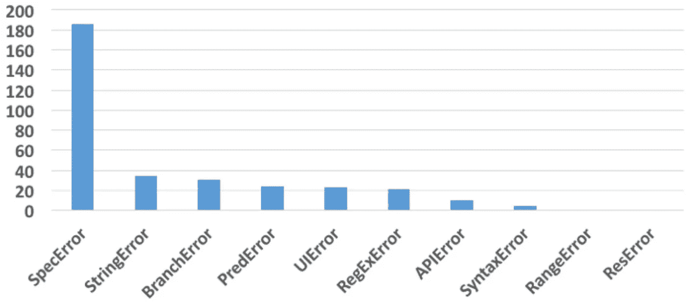

Histogram of ts-undetectable bugs. Source: [“To Type or Not to Type”](http://earlbarr.com/publications/typestudy.pdf)

上面的“StringError”是错误的分类，其中字符串是正确的类型，但包含错误的值(如不正确的 URL)。分支错误和谓词错误是导致使用错误代码路径的逻辑错误。如您所见，还有各种其他类型的错误是 TypeScript 无法触及的。TypeScript 检测超过 20%的错误的可能性微乎其微。

但是 20%听起来太多了！为什么 TypeScript 没有获得高得多的 bug 预防分？

因为有太多的 bug 是静态类型检测不到的，所以跳过其他的质量控制措施，比如设计评审、规范评审、代码评审和 TDD，是不负责任的。因此，假设 TypeScript 将是您用来防止 bug 的唯一工具是不公平的。为了真正获得 ROI 的感觉，我们必须在扣除由研究作者没有充分考虑的其他措施捕获的错误后，应用错误减少数学*。*

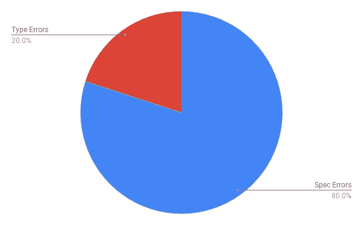

It’s unsafe to skip other measures: Spec errors: 80% — Type errors: 20%

假设您的项目包含 1000 个没有预防措施的 bug。在应用了其他质量度量之后，潜在的产品缺陷数量减少到了 100 个。**现在**我们可以看看 TypeScript 可以阻止多少额外的错误，从而更真实地了解我们在 TypeScript 投资上的错误捕获回报。近 80%的 bug 不能被 TypeScript 检测到，所有 TypeScript 可检测到的 bug 都有可能被其他方法捕获，比如 TDD。

*   没有措施:1000 个错误
*   采取其他措施后:仍有 100 个 bug—*捕获 900 个 bug*
*   在将 TypeScript 添加到其他度量之后:还剩下 80 个 bug—*又捕获了 20 个 bug*

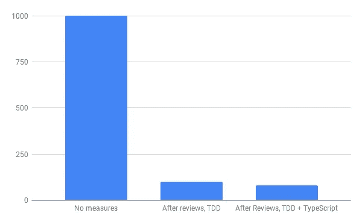

Bar graph of bugs remaining after applying reduction measures: TypeScript provides little added benefit.

有些人认为，如果你有静态类型，你不需要担心写这么多测试。那些人在进行愚蠢的争论。真的没有比赛。即使你打算使用 TypeScript，*你仍然需要其他的方法。*

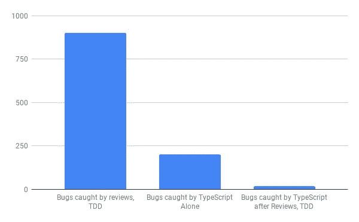

Chart: Adding TypeScript after reviews, TDD catches a tiny fraction of the total bug count.

在这个场景中，reviews 和 TDD 可以在没有 TypeScript 的情况下捕获 900/1000 的 bug。如果你跳过评论和 TDD，TypeScript 可以捕获 200/1000 个 bug。很明显，您不必选择其中的一个，但是在应用其他度量之后添加 TypeScript 会导致非常小的改进，因为回报呈指数递减。

**更新时间:2019-02-11:**

Airbnb 最近报告称，通过在开发过程中添加 TypeScript，bug 减少了 38%。怎么可能呢？根据这篇文章，那应该是不可能的吧？数学不是这样的。我们处理的是百分比、平均值和收益递减，而不是具体的数值。

这篇文章所依赖的研究代表了*平均值、*，其他质量度量的存在与否影响了打字稿*可以*解决的剩余 bug 的百分比。

其他措施解决的*ts-detected*bug 越多，TypeScript *可以*解决的剩余 bug 的百分比就越高，但是这些其他措施也减少了 TypeScript 要解决的剩余 bug 的总数。因此百分比可能会上升，但是捕获的错误总数可能只会有一点点变化。

此外，仔细的代码审查在捕捉和减少 bug 方面做得很好，没有比彻底检查整个代码库，仔细检查和分析每一行代码更仔细的代码审查了。不管是哪种类型，我预计仅从这一行为就能减少 30%的错误(即使他们把它留在 JavaScript 中)。

在撰写本文时，他们还没有发布他们的方法或报告他们正在采用的其他 bug 减少措施，但我猜测他们正在采用某种形式的设计/规范审查过程，以减少最初出现在代码中的规范 bug。

换句话说，当您消除了大量 TypeScript 无法解决的 bug 时，TypeScript 可以为剩余的*bug 提供更高百分比的 bug 减少。*

这个结果并没有改变只有 *20%的公共 bug 可以被 TypeScript 解决的事实，也没有否定收益指数递减的观点。*

相反，这意味着 *Airbnb 可能有高于平均水平的设计或规格审查*(或者两者都有)，加上低于平均水平的自动化代码覆盖率*——可能缺少单元测试覆盖率、功能测试覆盖率，或者两者都有。适当的单元测试覆盖率可以捕获静态类型可以捕获的接近 100%的错误，以及大量 TypeScript 不能捕获的错误。*

大多数团队很少或没有实施设计/规格审查过程。甚至在将模型交给开发人员实现之前，让工程师用批判的眼光来看待它们，也比一般情况要好。许多团队根本没有任何正式的设计评审过程。

下面是他们的 TypeScript 优势图表:

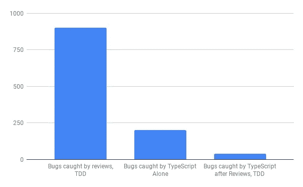

TypeScript 仍然只捕获了 1000 个潜在 bug 中的 38 个，但是由于大多数潜在 bug 是通过管道中的前几个步骤捕获的(就像人们在去开发人员那里实现之前检查模型一样)，TypeScript 可以解决更大份额的剩余 bug。在这种情况下，比团队遗漏 Airbnb 的额外代码质量度量多 18 个 bug。

只有当 TypeScript 能够捕获更大份额的错误时，收益递减数学才能完全失效:接近 75%+，因为在那个阶段，替换质量控制过程中其他昂贵的部分可能是可行的，如代码审查或 TDD。

了解 Airbnb 在转换到 TypeScript 的过程中到底捕获了多少 bug，了解 TypeScript 无法预防的 bug 的分类，了解 bug 密度(以及他们是如何计算的)，以及了解他们已经采用的其他质量控制措施，这将是一件有趣的事情。

> 请记住:我并不反对使用 TypeScript。我主张人们考虑成本和收益，做出对你和你的团队都是正确的理性、明智的决定。一些产品需要更严格的质量控制，为了消除 1000 个 bug 中的 18 个，额外的花费可能是值得的。例如，如果你的代码为特斯拉的自动驾驶系统的关键部分提供动力，我希望你使用静态类型和所有其他质量度量，因为错误的成本要高得多。每个团队都应该进行他们自己的 ROI 分析，并做出适合他们的决策。

我已经在大规模、数百万美元的开发项目中实施了质量控制系统，我可以告诉你，我对高成本系统实施的有效性的预期是 30% — 80%的减少。您可以从以下任何一个地方获得这些数字:

*   **设计和规格审查** ( [高达 80%的降低](http://earlbarr.com/publications/typestudy.pdf))
*   **TDD** ( [剩余 bug 减少 40%—80%](https://www.computer.org/csdl/mags/so/2007/03/s3024-abs.html))
*   **代码评审** ( [一个小时的代码评审节省了 33 个小时的维护](http://www.ifsq.org/finding-ia-2.html))

事实证明，类型错误只是所有可能的错误中的一小部分*,还有其他方法可以捕捉类型错误。*数据在，结果很清楚: **TypeScript 不会把你从 bug 中拯救出来。**在最好的情况下，你会得到一个非常适度的减少，你仍然需要你所有的其他质量措施。

> 类型正确性并不能保证程序的正确性。

看起来这些好处并没有达到打字稿宣传的效果。但这些并不是唯一的好处，对吗？

**新的 JavaScript 特性和编译为跨浏览器 JavaScript:** Babel 为原生 JavaScript 做了这两项。

我们已经到了收益的终点，我不知道你怎么样，但我感觉有点索然无味。如果我们可以使用其他工具为原生 JavaScript 获得类型提示、自动完成和极大的 bug 减少，那么剩下的唯一问题是，类型脚本的差异是否值得使用它所需的投资？

为了弄清楚这一点，我们需要仔细看看 TypeScript 的成本。

**招聘:**虽然有将近一半的 JavaScript 受访者已经使用过 TypeScript 并且会再次使用，还有 33.7%的人希望学习，5.4%的人已经使用过 TypeScript 并且**不会再次使用**，还有 13.7%的**对学习 TypeScript 不感兴趣。**这使得招聘人数减少了近 20%,对于需要大量招聘的团队来说，这可能是一笔巨大的成本。招聘是一个昂贵的过程，可能会拖上几个月，并占用其他开发人员的生产时间(他们通常是最有资格评估新候选人技能的人)。

另一方面，如果你只需要雇佣一两个开发人员，使用 TypeScript 可能会让你的开场白对几乎一半的候选人更有吸引力。对于小项目来说，可能是一洗，甚至是略正。对于数百或数千人的团队来说，这将会变成 ROI 误差的负值。

**设置、初始培训:**因为这些是一次性成本，所以相对较低。已经熟悉 JavaScript 的团队倾向于在 2-3 个月内提高 TypeScript 的工作效率，并在 6-8 个月内变得相当流利。肯定比招聘成本高，但如果这是唯一的成本，肯定值得努力。

**缺少特性—Hof、组合、具有更高级别类型的泛型等。:** *TypeScript 与惯用的 JavaScript 不完全共表达。*这是我在使用 TypeScript 时面临的最大挑战之一(也是最大的花费),因为熟练的 JavaScript 开发人员会经常遇到很难或不可能打字的情况，但是有责任心的开发人员会对把事情做好感兴趣。他们会花上几个小时搜索例子，试图学习如何输入 TypeScript 无法正确输入的内容。

TypeScript 可以通过提供更好的文档和发现 TypeScript 当前的限制来改善这种成本，这样开发人员就可以少花时间来尝试让它在更高阶的函数、声明性函数组合、转换器等方面表现良好。在许多情况下，良好的、可读的、可维护的 TypeScript 类型根本不会发生。开发人员需要能够很快发现这一点，这样他们就可以把时间花在更有成效的事情上。

**持续指导:**虽然人们使用 TypeScript 很快就变得有效率，但确实需要相当长的时间才能变得自信。我仍然觉得还有很多东西要学。在 TypeScript 中，有不同的方法来键入相同的内容，并找出每种方法的优缺点，找出最佳实践，等等。比最初的学习曲线要长得多。

例如，新的 TypeScript 开发人员倾向于过度使用注释和内联类型，而更有经验的 TypeScript 开发人员已经学会了重用接口和创建单独的类型来减少内联注释的语法混乱。更有经验的开发人员也将发现在编译时收紧类型以产生更好的错误的方法。

这种对打字的额外关注是一种持续的成本，你每次加入新的开发人员时都会看到，而且当你有经验的 TypeScript 开发人员学习并与团队的其他成员分享新技巧时也会看到。这种持续的指导只是合作的正常副作用，从长远来看，当应用于其他事情时，这是一种健康的习惯，可以节省金钱，但这是有代价的，TypeScript 大大增加了这一点。

**打字开销:**在打字开销的成本中，我包括了所有花费在打字、测试、调试和维护类型注释上的额外时间。调试类型是一项经常被忽略的成本。类型注释有自己的一类错误。打字太严格，太宽松，或只是错误的。

自从我第一次探索它以来，这个成本中心已经下降了，因为许多第三方库现在都包含了类型，所以你不必做那么多工作去寻找它们或者自己创建它们。然而，除了最流行的 OSS 包之外，这些类型化中的许多仍然是坏的和过时的，所以你仍然会最终为你想要类型提示的第三方库回填类型化。通常，开发人员试图将这些类型添加到上游，结果大相径庭。

您可能还会注意到语法噪音大大增加了。在像 Haskell 这样的语言中，类型通常是在被定义的函数上面列出的简短的一行代码。在 TypeScript 中，特别是对于泛型函数，它们通常是侵入式的，默认情况下是内联定义的。

类型脚本的类型化不仅没有增加函数签名的可读性，反而常常会使它们更难阅读和理解。这是有经验的 TypeScript 开发人员倾向于使用更多可重用的类型和接口，并从函数实现中单独声明类型的一个原因。大型 TypeScript 项目倾向于开发自己的可重用类型库，这些类型库可以在项目中的任何地方导入和使用，维护这些库可能会成为一项额外但值得做的工作。

语法噪音是有问题的，原因有几个。你想让你的代码保持整洁的原因和你想让你的房子保持整洁的原因是一样的:

*   更多的混乱=更多的臭虫藏身的地方=更多的臭虫。
*   更多的杂乱会使你更难找到你想要的信息。

杂波就像调谐不良的收音机里的静电噪声——噪声多于信号。当你消除噪音时，你能更好地听到信号。减少语法噪音就像把收音机调到合适的频率:意思更容易理解。

语法噪音是 TypeScript 的一个较大的代价，它可以通过几种方式得到改善:

*   更好地支持使用高级类型的泛型，这可以消除一些模板语法噪音。(参考 Haskell 的类型系统)。
*   鼓励单独打字，而不是行内打字，默认*。*如果避免内联类型化成为一种最佳实践，类型化语法将从函数实现中分离出来，这将更容易阅读类型签名和实现，因为它们不会相互竞争。这可以作为一个文档检查来实现，并伴随着一些关于堆栈溢出的布道。

# 结论

我仍然喜欢 TypeScript 的许多方面，我仍然希望它能有所改进。这些成本问题中的一部分可能会在未来通过添加新功能和改进文档来充分解决。

然而，我们不应该掩盖这些问题，开发人员夸大 TypeScript 的好处而不考虑成本是不负责任的。

TypeScript 可以而且应该在类型推断、高阶函数和泛型方面做得更好。TypeScript 团队也有巨大的机会来改进文档，包括教程、视频、最佳实践和易于找到的 TypeScript 局限性概述，这将帮助 TypeScript 开发人员节省大量时间，并显著降低使用 TypeScript 的成本。

我希望随着 TypeScript 的继续发展，更多的用户将度过蜜月期，并意识到它的成本和当前的局限性。随着用户越来越多，越来越多的优秀人才可以专注于解决方案。

就 TypeScript 而言，我肯定会在小型开源库中再次使用它，主要是为了让其他 TypeScript 用户的生活更轻松。但是我不会在我的下一个大型应用程序中使用当前版本的 TypeScript，因为项目越大，使用 TypeScript compound 的成本就越高。

这个结论很讽刺，因为 TypeScript 的标语是“可伸缩的 JavaScript”。一个更诚实的标语可能会加上一个词:“笨拙伸缩的 JavaScript。”

> **更新:2023–0310—**添加了一个链接，链接指向 2022 年的一项研究，该研究分析了 600 多个 GitHub 存储库，发现 TypeScript 似乎并没有对 bug 产生显著影响。删除了一些关于“TypeScript 理论上的最大好处”的令人困惑的措辞，取而代之的是强调 GitHub 上只有大约 20%的公共 bug 可以通过 TypeScript 解决。
> 
> **更新时间:2019–02–11**—澄清 Airbnb 如何在添加 TypeScript 后报告 bug 减少 38%，而不使本文中的任何主张无效。TL；DR——高于平均水平的设计/规格评审+低于平均水平的测试覆盖率可能导致高于平均水平的剩余缺陷的 ts 可寻址百分比，而不会实质性地改变所有措施所防止的缺陷的总百分比。
> **更新时间:2019 年 1 月 26 日** —增加了“重构”的好处。
> **更新日期:2019 年 1 月 26 日** —澄清了减少 bug 的数学方法，将减少 bug 的好处从剩余 bug 的 8%增加到 20%，以使 TypeScript 获得最大的好处，并证明它仍然不会对 ROI 产生重大影响。

***Eric Elliott****是一位分布式系统专家，著有《编写软件》***[*【编程 JavaScript 应用】*](https://ericelliottjs.com/product/programming-javascript-applications-ebook/) *等书籍。作为*[*devanywhere . io*](https://devanywhere.io/)*的联合创始人，他教授开发人员远程工作和拥抱工作/生活平衡所需的技能。他为加密项目组建开发团队并提供建议，并为 Adobe Systems、****【Zumba Fitness、*** ***【华尔街日报、*******【ESPN、*******BBC、*** *以及包括* ***Usher、弗兰克·奥申、金属乐队在内的*******

**他和世界上最美丽的女人享受着与世隔绝的生活方式。**