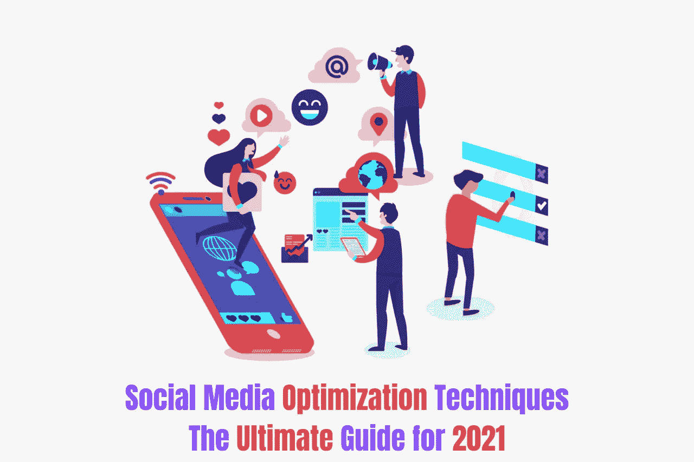
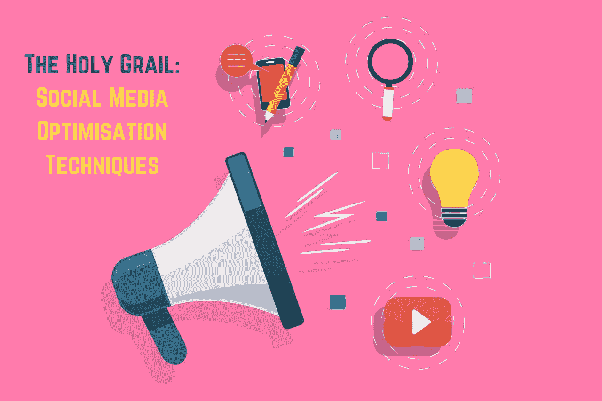
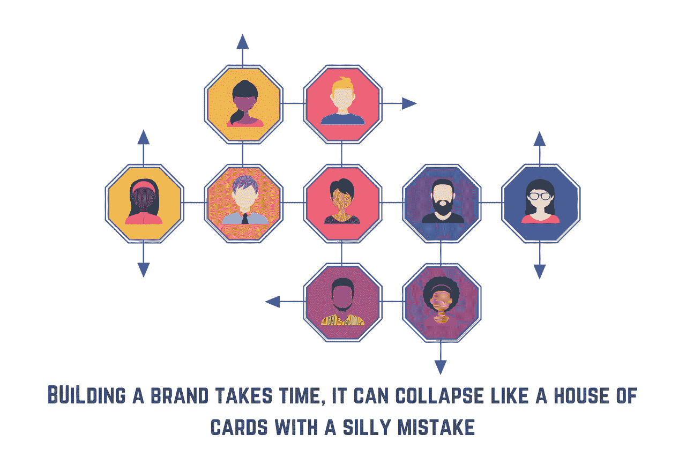

# 终极指南-2021 年的社交媒体优化技术和策略

> 原文：<https://medium.com/globant/the-ultimate-guide-on-social-media-marketing-for-ecommerce-startups-b3171d52905c?source=collection_archive---------4----------------------->

Step by Step Guide on Social Media Optimisation Techniques

# 了解如何在 2021 年为您的电子商务业务或任何新品牌实施可行的社交媒体优化战略。

> 你准备好为一个新的电子商务品牌提升你的社交媒体形象了吗？你准备好启动你的社交媒体优化策略了吗？我打赌你是！

占据社交媒体排行榜首位的趋势是，千禧一代的购买模式从 Instagram reels 等可购物功能到 Tiktoks 与 Shopify 的合作，以吸引和赢得电子商务客户。

作为一名聪明的社交媒体营销人员，你应该发现能够激发观众兴趣和好奇心的热门内容。简而言之，一个人应该了解行业的脉搏，并致力于与你的受众产生共鸣的内容，以实现电子商务品牌更好的客户参与。

**提示**:借助 Salesforce Social Studio、Hootsuite 等自动化工具，您可以发现真知灼见，找到新兴内容，并实时发布诱人的故事。您还可以预测与您的品牌相关的流行标签、关键词、短语和特定内容支柱主题。你应该能够设计出新鲜的新想法，为下一个大的活动创造成功的公式，并推出你的观众会爱上的连续广告。

对于 B2B，一旦你有了未来的洞察力，知道什么内容吸引你的利基受众，你就可以成为你所在行业的思想领袖。

为了保持领先地位，你应该率先采取绩效驱动的营销策略，定期优化活动，并借助你的内容和品牌声音突出你的 USP。

Top 10 social media optimization techniques for eCommerce brands

# **2021 年新电商品牌十大社交媒体优化技术:**

1.  通过深入研究兴趣、人口统计和行为来锁定正确的受众
2.  识别买家角色，了解发布内容的正确社交渠道和最佳时间
3.  使用人工智能工具分析您的竞争对手并发现洞察力
4.  通过寻找合适的影响者来扩大你的品牌声音的影响
5.  对创意、投标策略、广告文案、受众和目标进行 A/B 测试
6.  利用相关的 CTA 和引人注目的视觉效果优化帖子内容
7.  通过添加用于重定目标的像素来构建自定义或相似的受众
8.  实时跟踪提升您的品牌病毒式传播，实现危机管理
9.  利用合适的平台和用户生成的内容扩大您的内容分发
10.  直播内容、微时刻和视频将在 2021 年及以后占据统治地位

# **如何计划、衡量和实现社交媒体活动的 SMART 目标？**

在设定社交媒体营销战略的目标时，使用 SMART 方法来确定每个目标，并跟踪哪些因素有助于成功。

SMART 代表:

**具体-** 用现实的时间表设定可实现的业务目标数字

*示例-* 想在 2021 年 6 月前将付费广告转化率提高 30%

**可衡量的**——不时衡量你的目标

*举例*——密切关注每个月的转换率，以实现业务目标

**可实现的** -根据行业基准或业务成果使其变得现实

*示例* **-** 确保以%或数字定义的业务目标可以实现

相关性——相关性是设定你期望目标的关键

***示例* -** 选择与您的营销活动相关的业务关键绩效指标，如达成度、参与度或转化率

**有时限的**——实现你设定目标的最后期限

***举例* -** 当你设定任何 smart 目标时，必须有一个以天、月或年为单位的时间框架

上述目标应该理想地基于品牌，尤其是 B2B 和 B2C 的收入相关目标。这将帮助您列出与目标相关的相关指标。

这种方法确保你有充分的准备来制定一个精确的、可行的、目标驱动的社会营销策略。

5 essentials social media pillars to analyze and implement for eCommerce companies

# **如何利用 5 个基本社交媒体支柱为任何品牌带来巨大成功:**

## **品牌测量:**

确定对衡量品牌成功最重要的品牌指标或 KPI。您可以根据触及度、参与度和转化率指标来跟踪这些指标。这些指标包括受众增长率、后到达率、病毒率、平均参与率和点击率。

## **品牌推广**

你应该通过合适的社交媒体渠道推广你的品牌，从而吸引你的潜在客户。每个企业都必须选择混合的社交媒体渠道来扩大内容。每个电子商务品牌都必须在脸书和 Instagram 上建立并运营你的数字店面。

## **品牌保护**

您应该通过考虑法律风险、品牌标志、品牌声音或任何隐私问题等需要覆盖的要点来保护您的品牌。确保您的创意、内容和社交媒体团队相互协作，以控制危机管理

## **社交媒体分析**

你永远不应该满足于有机访问者，并确保用正确的营销渠道扩大你的社交媒体内容。使用来自社交渠道的最佳分析功能，或使用基于人工智能的工具，如 talkwalker，为您的品牌实现隐藏的宝石和内容预测。

## **竞争洞察**

了解洞察力并关注竞争对手对于了解他们正在使用什么策略、什么是趋势以及缺少什么非常重要。你应该提供一个有创意的改头换面，采用量身定制的内容方法，提升个性化，并与你的品牌建立积极的关系

# 成功的付费社交媒体活动的十大优化技巧

## #1 试验定制受众和长相相似的受众
#2 为每个目标选择正确的位置
#3 AB 测试您的活动创意和标语
#4 创建至少 5 个广告组， 5 个广告副本进行试验
#5 设置自动化广告规则以实现更好的优化
#6 避免在学习阶段改变您的广告
#7 检查受众重叠以最小化每次点击的 CPC 成本
#8 基于广告创意优化您的登录页面
#9 再营销活动以提高转化率优化
#10 排除现有客户列表以避免向他们显示广告

有效的社交媒体营销策略的一个成功公式是使用营销自动化平台部署[数据驱动营销策略](/globant/how-to-win-the-marketing-automation-game-with-a-data-driven-strategy-de14240ef972)，其中包括社交活动策略、客户细分、内容制作、内容放大和社区管理。实施付费社交广告工具的最佳实践是任何数字营销渠道成功的关键。

也有许多电子商务公司正在实施社交客户服务，考虑两个组成部分，如社交适度和社交倾听。

# **Globant 对每个公司的见解:**

在 2021 年，如果我们谈论为组织建立以客户为中心的文化，社交关系变得比以往任何时候都更加重要。高度重视数字技术、其文化和社会关系的公司将在新常态中获得额外的成功优势，并进一步帮助促进成功的文化转型。

您可以[从 Globant](https://stayrelevant.globant.com/en/its-time-for-your-culture-to-digitally-transform/) 下载该报告，了解我们如何在 2021 年&以后让任何商业文化实现数字化转型。

**包装:**

随着电子商务初创公司占据全球市场的中心舞台，社交媒体营销将在网上购物方面占据主导地位。具有“立即购买”选项的直播将随着诱人的优惠和大幅折扣呈指数级增长。