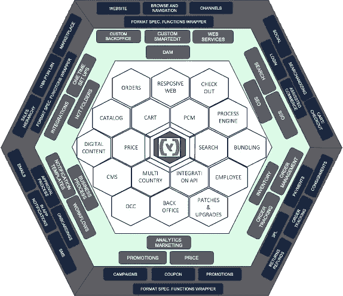
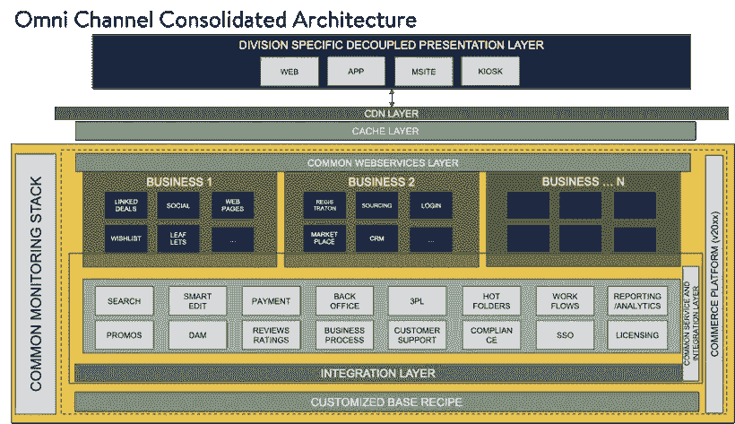

# 集中式电子商务的世界——SAP 商务方式

> 原文：<https://medium.com/walmartglobaltech/the-universe-of-centralized-e-commerce-sap-commerce-way-db98ae2d30bd?source=collection_archive---------8----------------------->

这篇文章试图向读者展示电子商务的不同要素，以便理解它的生动性。此外，在设计整合的电子商务架构时，还需要了解一些基本要素。

出于类比的目的，本文将宇宙中一些迷人的现象与电子商务最佳实践进行了比较。

- *pic credits NASA*

它是巨大的，而且还在不断扩大。无穷无尽，包罗万象。孕育着无数的秘密，孕育着无限的机会。它的“可发现的”面纱导致成千上万的探险家“重新”搜索和“重新”完善解释，只是为了更好地理解它的工作方式。冠上不同的名字，它是无所不在的宇宙或宇宙。

人类与大自然幽会。有时他们拥抱，有时他们与它赛跑。在 90 年代，数字计算和创造时代催生了一种电子买卖方式，即电子商务。创造一种独特的消费者体验，穿着睡衣就能轻松购买几乎所有东西，它不断扩展，有着无数的解释(实现)，只是开辟了一个探索的新领域，并改变了全球做生意的方式。

宇宙速度表显示，宇宙正以 70 公里/秒的加速度膨胀。电子商务正在飞速发展。2019 年，全球零售电子商务销售额达 3.53 万亿美元，预计 2022 年电子零售收入将增长至 6.54 万亿美元。网上购物是全球最受欢迎的网上活动之一。

Blood-wolf-moon 2019\. Kevin Clarke used two different cameras and some photo editing to get both the eclipsed moon and the faint halo in the shot. (Image credit: Kevin Clarke and [https://www.space.com/](https://www.space.com/))

宇宙中有各种各样的天体以随机的方式到处乱窜，每个天体都有自己的组成。同样，注重品牌突出的公司也有不同的网站——每个网站都有自己的特色。在一个合并和收购的时代，大公司最终会拥有一个以上的业务线网站，这往往会导致大量的运营和维护成本。他们面临的挑战主要是

1.**管理不同的销售目录** —不同网站上产品供应的不同部门导致不同的销售目录。家具既不能被搜索，也不能像食品一样被列出。不同的产品线需要不同的显示器。

2.**不同的主数据** —来自不同主数据来源的产品的文章列表导致复杂化。如果我们有重叠的目录，情况只会更糟。供应商数据系统陷入了重复的泥潭。

3.**单一视图** —由于不同的交易系统，很难获得实体的单一视图。例如:对于一家既经营 B2B 又经营 B2C 形式的商务的公司来说，将会有一组不同的 B2B 客户，他们必须与公司达成购买协议(并获得特价)，这与 B2C 客户相反，B2C 客户允许匿名商务，任何人都可以随时注册。

4.**特性维护** —维护不同代码库的成本成指数级增长，一个特性必须被复制到多个实现中。在服务层和基础设施成本上有一定的冗余机会。

5.**脱节的渠道**——销售渠道(网站)就像平行的轨道，他们相处但从不融合。这是一个错失的机会，而且不管它看起来多么简单，都是复杂的。缺乏平稳过渡会在无人知晓的情况下影响销售。

Astrophotographer Gerald Rhemann captured this view of the bright-green Comet 2018/Y1 Iwamoto, which swung by the sun in February 2019\. (Image credit: Gerald Rhemann and [https://www.space.com/](https://www.space.com/))

宇宙对待小行星的方式和对待行星一样。它用一种弱的(松散耦合的)中心力——引力将它们结合在一起。对这种力的解释取决于物体的质量，但却受到一个普遍的引力常数的约束。通过这样做，宇宙确保了系统的自给自足和稳定。这种安排提供了长期的可持续性，有时甚至是生命。

相似的信息是清楚的，为了保持多样化的电子商务景观旋转，必须有松散耦合的集中化。集中化不仅解决了他们的挑战，而且充分利用了可用资源。这不仅仅是为了保护自然资源(可持续发展)，也是为了打开剩饭剩菜孕育创新(生命)的空间。

对于大多数组织来说，集中化是一个巨大的挑战，主要是

1.**惯性** —系统和用户都有一种工作方式。他们熟悉界面和他们的生产力。随着新系统/团队的出现，集中化可能会导致现有系统/团队的消失。适应新的工作方式会有一种天然的阻力。

2.**运动学** —由于过时或次优，一些已开发的功能可能会被搁置。这可能包括一些新开发的或即将上线的功能。

3.**动量守恒** —在转化的初始阶段，动量会有所损失，因为这需要完全的聚焦和横向视野。为了保持势头，需要一个独立的团队来处理转换，而现有的团队可以支持实时实现。

4.**阻尼** —集权意识形态和正在进行的 DevOps 是有区别的。这导致了短暂的竞争架构/解决方案的产生，它们不会持续很久。为了避免这种情况，基于阶段的方法是各公司首选的方法。

5.**碰撞和反冲—** 预计实施过程中会有过山车。冲突的发生是由于意识形态和心态的改变。企业面临的挑战是有胃口消化这些冲突，以便更好地实现未来。让你到这里的东西不会让你到那里。

6.**滚动** —启动滚动是最困难的阶段，需要明确的切换策略，即绝热保真的数据迁移。新平台必须带来强制性的变化，以使客户的旅程受到最小的影响。

The landing site for Perseverance Mars Rover. Image credit: NASA/JPL-Caltech/MSSS/JHU-APL and [https://www.space.com](https://www.space.com/)

# 最有价值的假设

1.**向心动力学**——记住，维持星系、太阳系的向心引力足以让天体围绕其中心旋转。用力过大会导致螺旋塌陷或离心飞镖。最终的愿景必须非常清晰，关键绩效指标应该明确定义。所有的实现都必须遵循一些中心指导原则，以避免走极端。任何偏差都会导致实施的扭曲。

2.**计算加速度**——“g”的值对于不同的物体是不同的。不是所有的功能都需要同等的关注和努力。因此，优先级非常重要。必须对需要什么以及何时需要有一个愿景。

3.**重心** —确定一个将控制所有开发的核心。这可以是一个提供现成服务的专有解决方案，也可以是一套能够启动灯塔的*就地*自制核心服务。

4.**相对论** —了解客户的脉搏，学会忘却。放弃某些个人喜爱但不适合未来难题的设计/功能是可以的。请记住，解决方案是为客户准备的，听起来对您有吸引力的内容对客户来说可能不一样。

5.**利用通用常数**——尽可能避免重新发明轮子。利用已经发现并确立的事实或解决方案。这将有助于控制成本。

6.**相对运动** —研究竞争对手在做什么总是更好。从某种意义上说，不一定要复制它们，而是要跟踪趋势的走向。记住，河水的流动总是会导致游泳者不自觉的漂移。

7.**适者生存** —对反馈持开放态度。打开渠道，这样你就可以听到你打算服务的人的反馈。试着根据当时的需要进行修改和调整，而不仅仅是最初的编辑和发现。记住——既不是最强壮的生存下来，也不是最聪明的生存下来。适应性最强的才能生存下来。

A long-exposure photo of a Falcon 9 rocket launch shows the rocket’s liftoff from Cape Canaveral Air Force Station, the separation of the booster and the upper stage, followed by the booster’s descent for a drone-ship landing as the payload cruises into orbit. (Image credit: SpaceX and [https://www.space.com/](https://www.space.com/))

# 使用 SAP 商务实现集中化

SAP hybris commerce 是一款功能强大的电子商务套件，通过内置的行业特定加速器机制来帮助加快上市速度，该机制可以构建一个运行中的网站，该网站具有可根据业务需求轻松扩展的基本功能。

SAP commerce 由一系列先进的开源技术创建，允许对其产品进行解耦*以便可以利用 SAP 内置和开放堆栈的优势。该产品支持托管在大多数应用服务器上，如 Tomcat/JBoss/Weblogic 等。

如需进一步了解 SAP (Hybris)商务，请点击此处访问[。](https://help.sap.com/viewer/p/SAP_COMMERCE_CLOUD)

上述蜂巢概述了通过使用 hybris commerce 作为多场景(或多国家)实施的电子商务解决方案来实现集中化的方式。

该实现的核心非常类似于大众中心，在这里提供开箱即用的服务，如登录、购物车/结账、响应 web、订单等。集中于与 SAP/非 SAP 后端环境集成的简单模式。任何定制的实现大多是建立在这个核心的服务层之上的。这些实现是特定于业务的，并且可以通过合适的扩展/插件轻松插入。在核心产品中有不同的层次，这使得企业可以深入研究并选择他们关注的层次。

集中化的概念包括-

1.**识别共性** —识别核心部件。这些组件通常是那些通常出现在景观之间的组件。例如，搜索、集成、搜索引擎优化、单点登录等。绿色背景层解释了一些可能的核心组件。

2.**尊重客户的特质** —客户在 B2B 网站上的注册不同于 B2C 网站。重要的是要在这里概述，登录过程与根据密码或 OTP 进行的身份验证几乎相同，但授权取决于注册过程中与客户群相关联的权限。重要的是要在概括和规范之间划清界限。这将有助于模块化架构布局。最外层讨论特定格式的实现

3.**轨迹不可知** —建议采用分离的表示层来确保实现的互斥性

4.**约束力**—web 服务框架满足交付轻量级内容的责任。适当的框架可以缓存响应。

5.**双击** —始终保持双击或放大该架构的视图，看它对单个企业意味着什么。这有助于让他们自信并与大局保持一致

# 体系结构

# 结论

宇宙是一个永无止境的地方，电子商务也是如此。在宇宙中迷路比找到一条路容易。同样，要找到一个完美的电子商务解决方案也相对困难。但它只会激发人类的想象力和努力，这正是它存在的理由。

引用《博伽梵歌》中的话，奎师那对阿尔诸那说

> अभ्यासेन तु कौन्तेय वैराग्येण च गृह्यते

阿诸那啊，只有通过实践和不放纵，才能达到完美

(First-ever view of a black hole to humanity. The supermassive black hole, M87 is at the centre of the Messier 87 (M87) galaxy, 53.49 million light-years away. Image Credits: [https://www.vox.com/](https://www.vox.com/))