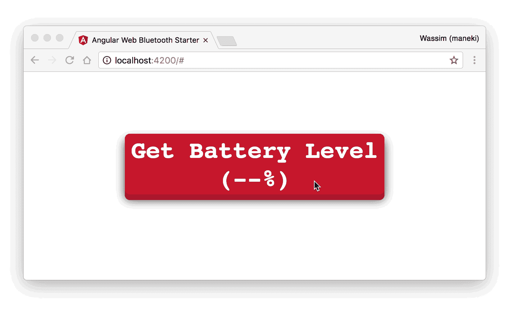
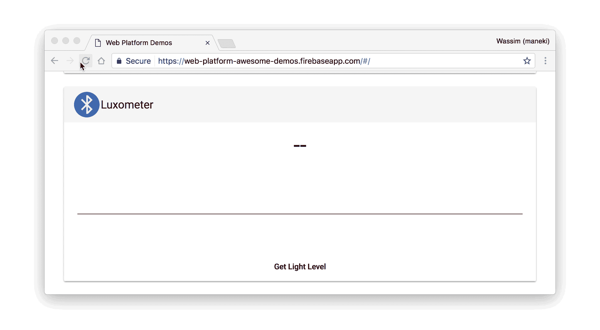

# 用于 Angular 的网络蓝牙模块

> 原文：<https://medium.com/google-developer-experts/the-web-bluetooth-module-for-angular-9336c9535d04?source=collection_archive---------2----------------------->


在过去的几个月里，我一直在玩新的 [Web 蓝牙 API](https://www.chromestatus.com/feature/5264933985976320) ，它将于 2017 年 2 月在 Chrome 56 中发布。让我告诉你，这个新功能为网络开启了许多新的可能性。

作为一名 Web 倡导者，我非常兴奋，迫不及待地构建了一个应用程序，展示将 Angular 和 Web Bluetooth API 结合起来是多么容易(甚至更多，关于任何即将推出的 Web APIs，请继续关注)。

> 让我们来认识一下用于角度应用的缺失的 Web 蓝牙模块

然后我开始和我的好友[弗朗索瓦·博福特](https://plus.google.com/+FrancoisBeaufort)(向他致敬！)来构建一个[演示应用](https://web-platform-awesome-demos.firebaseapp.com/#/home)，这是一种概念验证，演示了如何将 Web 蓝牙与 Angular 集成在一起。

在实现了几个用例之后，我想到了一个 Angular 模块，它抽象出了配置 Web 蓝牙 API 所需的所有样板文件。

# 一些免责声明

## 网络蓝牙 API

我假设你已经熟悉了网络蓝牙 API:GATT 服务器，服务，特性…等等。在阅读下一部分之前，请熟悉这个主题。以下是一些资源:

1.  [https://developers . Google . com/web/updates/2015/07/interact-with-ble-devices-on-the-web](https://developers.google.com/web/updates/2015/07/interact-with-ble-devices-on-the-web)
2.  [https://medium . com/@ urish/start-building-with-web-bluetooth-and-progressive-web-apps-6534835959 a6](/@urish/start-building-with-web-bluetooth-and-progressive-web-apps-6534835959a6#.rmddefp0o)

## 看得见的

我还假设你对[可观察对象](http://reactivex.io/rxjs/manual/overview.html#observable)、[观察者](http://reactivex.io/rxjs/manual/overview.html#observer)和[主体](http://reactivex.io/rxjs/manual/overview.html#subject)有一些[基础知识](http://reactivex.io/rxjs/manual/overview.html)。

## 芬兰符号

您会注意到一些方法以$符号结尾。这是可观测世界中的某种[惯例，我们已经使用了一段时间。因为](https://cycle.js.org/basic-examples.html#what-does-the-suffixed-dollar-sign-mean)[这篇](/@benlesh/observables-and-finnish-notation-df8356ed1c9b#.e1uakchpi)博客文章，我们将来可能会放弃这个$符号。



# 安装模块

你可以使用**纱线**或 **NPM** 来获得这个模块:

```
$ yarn add [@manekinekko/angular-web-bluetooth](http://twitter.com/manekinekko/angular-web-bluetooth)$ npm i -S [@manekinekko/angular-web-bluetooth](http://twitter.com/manekinekko/angular-web-bluetooth)
```

# 使用网络蓝牙模块

该模块易于使用。首先导入 **WebBluetoothModule** 模块表单*@ manekinekko/angular-we b-bluetooth*:

app.module.ts

调用**web bluetooth module . for root()**方法将提供 **BluetoothCore** 服务，您将需要在您自己的服务/组件中使用该服务，就像在*battery-level . component . ts*中一样:

app.component.ts

**web bluetooth module . forroot()**还提供了一个 **BrowserWebBluetooth** 实现，它使用了[**navigator . bluetooth**](https://webbluetoothcg.github.io/web-bluetooth/#dom-bluetooth-requestdevice)的引擎盖。Angular Universal 的一个 **ServerWebBluetooth** 实现将在稍后推出。当然，使用 Angular 的 DI，如果你愿意，你可以自由地提供你的定制实现。

**battery level service**(*battery-level . service . ts*)服务是您将(应该)实现设备/传感器逻辑的地方。在下面的示例中，我们实现了一个电池电量服务，它读取所连接设备的电池电量:

app.service.ts

# 给我一些解释

好吧！让我们解释一下**getbatterylelevel()**方法内部发生了什么…

基本上，为了从设备读取值，您需要经历相同的工作流程(对于常见用例):

1.  调用 **discover$()** 方法来运行发现过程

2.这将把 GATT 服务器还给你

3.然后，您将获得 GATT 服务器的主要服务

4.接下来，得到一个具体的特征

5.最后读取从该特性提取的值(作为数据视图)

6.最后一步将为您提供数据视图类型的值。您必须读取特定于您的设备/传感器的正确值。例如，对于简单的值，如[电池电量](https://www.bluetooth.com/specifications/gatt/viewer?attributeXmlFile=org.bluetooth.characteristic.battery_level.xml)，调用 **value.getUint8(0)** 就足够了:

```
.map( (value: DataView) => value.getUint8(0) );
```

但是有时候，事情会更复杂。一些制造商通常提供他们自己的蓝牙 GATT 特性实现而不遵循标准。如果你需要从一个通常被称为光传感器的*光度仪*中读取数值，就会出现这种情况。以下是与德州仪器 SensorTag CC2650 传感器相关的示例代码:

```
.map( (data: DataView) => {
    let value = data.getUint16(0, true /* little endian */);
    let mantissa = value & 0x0FFF;
    let exponent = value >> 12;
    let magnitude = Math.pow(2, exponent);
    let output = (mantissa * magnitude);
    let lux = output / 100.0;
    return +lux.toFixed(2);
 });
```

这通常可以在器件/传感器文档或源代码中找到，如果你幸运的话！



# 需要开胃菜吗？

这里有一个基本的回购，可以帮助你开始…

[](https://github.com/manekinekko/angular-web-bluetooth-starter) [## manekinekko/angular-web-bluetooth-starter

### angular-web-bluetooth-starter -一个 Angular Web Bluetooth 模块的启动器

github.com](https://github.com/manekinekko/angular-web-bluetooth-starter) 

# 有反馈吗？

欢迎所有的贡献。请在 github 上打开一个问题，并给我们您的反馈…

[](https://github.com/manekinekko/angular-web-bluetooth) [## manekinekko/angular-web-bluetooth

### Angular-web-Bluetooth-Angular(v2+)缺少的 Web 蓝牙模块🔥⚡️🚀✨🎉🎊

github.com](https://github.com/manekinekko/angular-web-bluetooth) 

# 更进一步

如果你需要更进一步，使用更多的设备和传感器实现更酷的应用，你可以看看[网络蓝牙 API](https://developers.google.com/web/updates/2015/07/interact-with-ble-devices-on-the-web) 。


*在 Twitter 上关注我*[*@ manekinekko*](https://twitter.com/manekinekko)*了解更多关于网络平台的信息。*