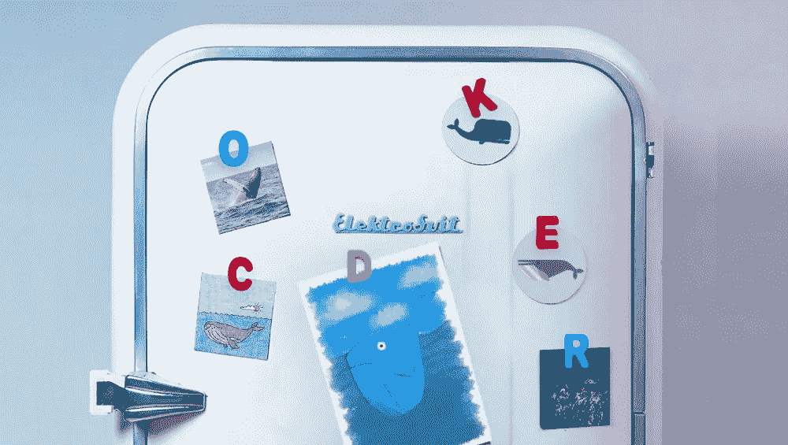
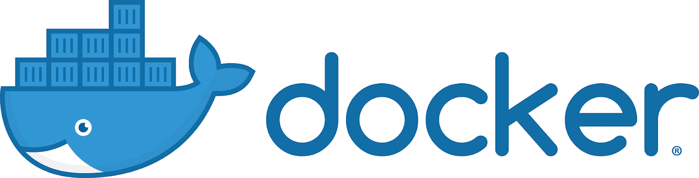
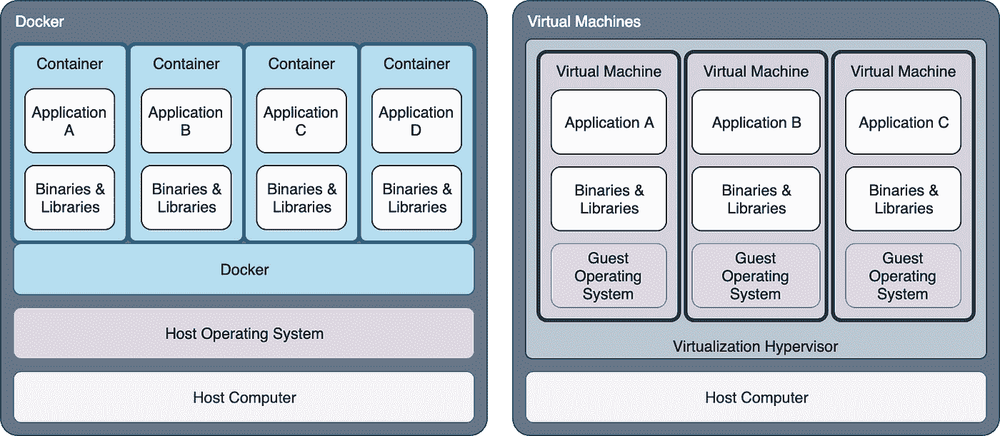
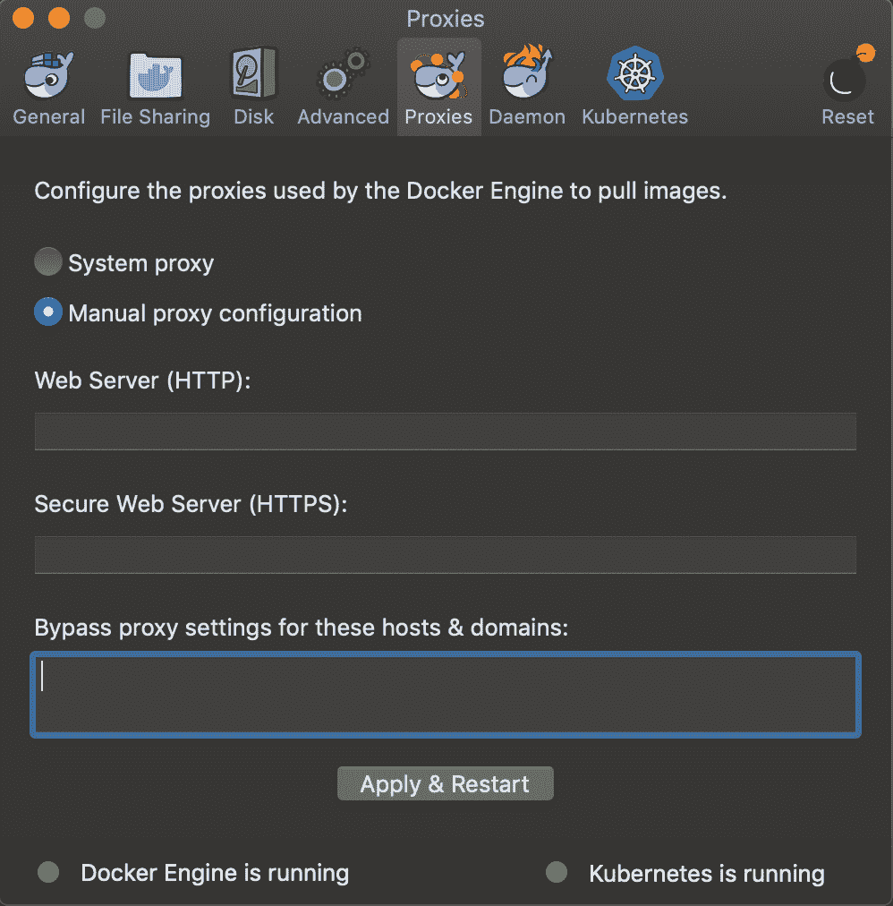
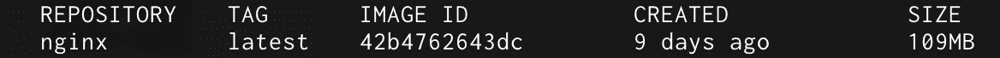
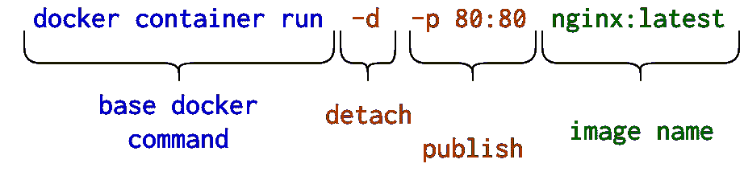
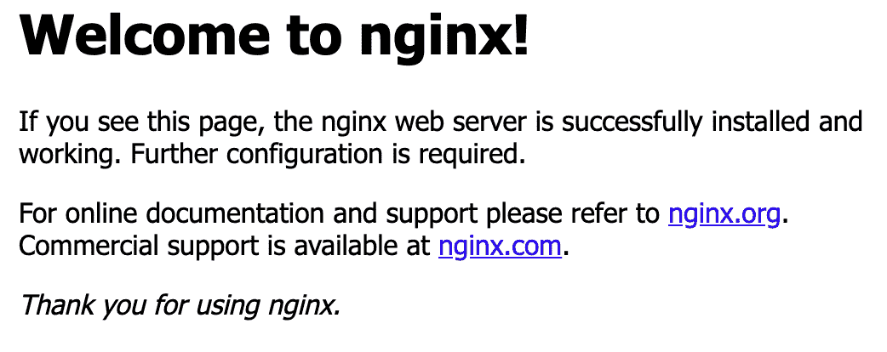
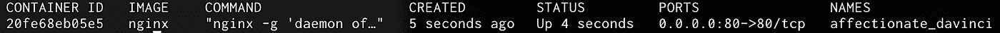

# 冰箱里的鲸鱼 Docker 简介

> 原文：<https://medium.com/capital-one-tech/the-whale-in-the-refrigerator-80f659fea1a4?source=collection_archive---------2----------------------->



如果您在 DevOps 领域呆过一段时间，您可能听说过 Docker，并且您肯定听说过“容器”。如果您刚刚开始使用 DevOps，或者想知道 Docker 是什么以及容器是如何工作的，那么请允许我启发您！我是一名 DevOps 工程师，也是一名 Docker 爱好者，使用 Docker 大约五年了，从小型集装箱工具到生产质量容器，我都在使用。我喜欢谈论码头工人。让我们从头开始…

# 什么是容器？

如果没有对容器的更高层次的理解，谈论 Docker 是不可能的。容器(在这个上下文中)是一个*独立的用户空间实例*。通常，这种隔离既来自主机的文件系统，也来自主机的网络，这意味着默认情况下，在容器中运行的任何进程都不能直接访问主机的资源。结果是，如果您正在与一个运行在容器内部的 shell 交互，您将无法(再次默认)访问主机系统上的任何可执行文件。

为了比较，我们以冰箱为例。冰箱持续运转，保持内部空气温度和湿度。现在，假设你想在冰箱里储存一些剩菜。你把这些剩菜放在一个塑料容器里，然后把那个容器放进冰箱。容器将剩菜与冰箱中的其他物品隔离开，*将冰箱的其他部分与容器*隔离开。该容器没有任何冷却剩菜的机制，它*重复使用*冰箱的冷却资源。现在假设你把容器放在冰箱里太久，霉菌设法进入了容器。该容器现在保护冰箱中的其余物品免受霉菌影响，确保冰箱中的所有食物不会仅仅因为一件物品变坏而变质。

# Docker 是什么(以及它的特别之处)？

希望上面提供了对什么是容器的高级理解。那么 Docker 是什么？Docker 是一个容器化平台，已经成为数据中心容器化的事实标准。然而，Docker 不仅仅是集装箱。Docker 命令行界面和相关的 GUI 包含用于轻松存储、传输、构建、检查和运行容器映像的工具——容器映像是 Docker 的基本分发单元——无论是作为单个容器、容器组，还是在协调的容器集群上。



如果您认为这听起来很像虚拟化，即在主机操作系统中运行虚拟机，那么您是正确的。Docker 和虚拟机有很多共同点，至少表面上是这样。一般来说，尤其是 Docker，容器的优势在于系统资源的使用。如上面冰箱示例中所述，容器重用主机操作系统中可以共享的某些部分和服务。然而，虚拟机必须运行任何给定来宾操作系统的完整版本—从内核到用户界面，带来来宾操作系统带来的所有磁盘和内存开销。这使得 Docker 容器的启动速度比 VM 快得多，并且使用的系统资源也少得多。



# 哦哦，我会说鲸语！

市场上的每个软件工具都有一个术语词典，这些术语在该工具的上下文中有特定的含义。Docker 也不例外。这里有两个你在和 Docker 打交道时会经常听到的术语。

*   **映像**或“**容器映像**”:一个轻量级的、独立的、可执行的包，包含运行一个软件所需的一切，包括代码、运行时、库、环境变量、解释器和配置文件
*   **容器**:图像的运行时实例——图像在实际执行时在内存中变成什么样

# Docker 的实际好处

## 运行服务器

容器化模型有几个好处，其中许多超出了本文的范围。然而，其中之一是软件安装、升级和删除。让我们以一个 web 服务器为例。

传统上，您使用操作系统的软件包管理器来安装您选择的 web 服务器。这将安装 web 服务器可执行文件，加上许多其他文件、库和运行 web 服务器软件的其他要求，还可能加上一些管理实用程序和/或插件。快进到大约六个月之后，网络服务器就可以升级了。您可以通过软件包管理器安装升级。然后你发现新的 web 服务器版本破坏了你的网站。所以您回滚它，但是为了这样做，您必须卸载当前安装的 web 服务器版本。您可以再次使用操作系统包管理工具删除它，但更有可能的是，您会在整个磁盘上留下残余的文件和库，更不用说潜在的数据丢失。

使用 Docker，安装和删除过程是完全不同的。几乎所有主要的网络服务器都可以从 [Docker Hub](https://hub.docker.com) 获得*官方* **Docker 镜像**。您只需将您想要运行的任何 web 服务器的 Docker 映像拉到您的本地主机(例如`docker image pull nginx:latest`)上，运行它，现在您就有了一个 web 服务器。当您需要升级时，您只需获取最新的版本，移除旧的 web 服务器容器，并启动新的容器。需要回滚吗？只要恢复到旧的图像。当您不再需要在该主机上运行 web 服务器时，只需删除映像(例如`docker image remove nginx:latest`)。没有什么需要卸载的，因为所有的 web 服务器可执行文件都在 Docker 映像中，并且您的系统没有任何额外的库或其他散布在文件系统中的文件。

## 发展

Docker 的另一个实际用途是用于开发。Docker 可以在任何现代桌面操作系统上运行，并提供与 Linux 服务器相同的功能。这意味着任何 Docker 映像都可以在您的笔记本电脑或台式机上本地运行，让您可以轻松访问您的目标架构。

例如，假设您的目标架构包括一个 Redis 缓存。如果您需要编写与 Redis 缓存对话的代码，您可以在云中启动一个虚拟机，安装 Redis 并确保安全组允许您与它对话，记下它的 FQDN 或 IP 地址，然后开始使用它进行开发。或者，您可以只`docker image pull redis` 、`docker container run redis`并在您的开发计算机上本地运行 Redis 缓存。当您完成 Redis 缓存时，不需要卸载或清理 Redis 安装，只需销毁 Redis 容器并删除 Redis 映像。

# Docker 设置

Docker 为 [Macintosh](https://docs.docker.com/docker-for-mac/install/) 和 [Windows](https://docs.docker.com/docker-for-windows/install/) 电脑提供免费安装程序。获取“稳定”版本的安装程序并安装它。如果您遇到任何问题，请参考上面链接的页面，了解故障排除程序。



安装完成后，通过在终端中运行`docker run hello-world`来测试它是否正常工作。假设您与互联网的连接不受限制，您应该会看到 Docker 从 Docker Hub 拉出一个名为“hello world”的图像，一些样板文本应该会打印到终端上。如果图像拉似乎挂起，或者如果你在一个公司代理后面，你可能需要编辑 Docker 的代理信息。

单击菜单栏(Mac)或系统托盘(Windows)中的 Docker whale 图标，选择“首选项…”然后选择“代理”选项卡，打开“首选项”对话框。然后尝试再次运行`docker run hello-world`。如果它仍然不工作，看看上面链接的那些页面上的文档。

# 练习:运行 Web 服务器

所以我们现在有 Docker 运行，让我们用它做点什么。

在本例中，我们将提取一个 Web 服务器的 Docker 映像(Nginx)，启动 Web 服务器，并验证它是否正常工作。这将涵盖以下 Docker 命令:

>`docker image pull`

>`docker image list`

>`docker image rm`

>`docker container run`

>`docker container stop`

>`docker container rm`

# 第 1 部分:提取图像

我将假设您的计算机上正确运行了 Docker。如果没有，请参考上面针对您的平台的链接。这里的第一步是运行某种终端，要么是 MacOS 上的 terminal 或 iTerm2，要么是 Windows 上的 CMD 或 PowerShell。

进入终端后，运行以下命令:

```
> docker image pull nginx
```

您应该看到 Docker 开始从 Docker Hub 中提取图像。这不会花很长时间，因为官方的 Nginx 图像相对较小。

完成后，当您返回提示时，运行以下命令:

```
> docker image list
```

您应该会看到类似这样的内容:



# 第 2 部分:运行映像

你闪亮的新 Nginx 图像已经下载，但在我们运行它之前，它对我们没有任何好处。

要启动 Nginx web 服务器，请运行以下命令:

```
> docker container run -d -p 80:80 nginx:latest
```

在我们继续之前，让我为您分解一下这个命令，因为我引入了一些重要的新命令行开关。



*   `docker container run` =基本停靠命令
*   `-d` =分离(即发送到后台)
*   `-p 80:80` =发布(即将端口从主机连接到容器)
*   发布开关的模式为`host:container`或`outside:inside`
*   这就是使容器可访问的魔力
*   `nginx:latest` =图像名称

当您运行上面的命令时，假设一切都按照预期的方式发生，Docker 应该会返回一个看起来像是随机的数字字符串，如下所示:

`*de3a09f56fbd4d1d6c5cf5c7b43ac42257bdc7a92f3e7cccde42d9f07027f961*`

这是容器的唯一 ID。有许多方法可以识别/指定一个容器，但是我们将在以后的文章中讨论这些方法。

现在您已经启动了 Nginx 容器，让我们检查一下以确保它工作正常。在 web 浏览器中(或使用`curl`，导航到 [http://localhost:80](http://localhost:80) 。您应该会看到标准的 Nginx 欢迎页面:



恭喜你！您刚刚运行了您的第一个 Docker 容器。

# 第 3 部分:清理

所以现在我们完成了这个 Nginx 容器。如果我不告诉你如何收拾自己的残局，那就是我的失职。要停止这个 Docker 容器，我们需要知道它的 ID。你可以从上面注意到它，但是有一个更简单的方法。

执行以下命令:

```
> docker container ls
```

您应该得到这样的回复:



集装箱 ID 在左边(`20fe68eb05e5`)，自动生成的名称(`affectionate_davanci`)在右边。这两种方法中的任何一种都可以用来阻止和破坏集装箱。

要停止容器:

```
> docker stop <container ID or container name>
```

现在如果你尝试访问 [http://localhost:80](http://localhost:80) ，浏览器就会超时。也就是说，Docker 容器实际上并没有消失，我们只是“停止”了它。再次执行容器列表命令:

```
> docker container list
```

您应该只取回标题行，这意味着没有“运行中”的容器。现在执行这个命令:

```
> docker container list -a
```

`-a`开关告诉 Docker 显示所有运行和停止的集装箱。您应该看到您的 Nginx 容器，但是在 status 下应该显示类似于"`Exited (0) About a minute ago`"的内容。让我们永远摆脱那个容器吧。

运行以下命令:

```
> docker container rm <container id or container name>> docker container list -a
```

Nginx 容器现在应该没有了。也就是说，Nginx *图像*还在。

```
> docker image ls
```

这应该向您显示我们之前*从*中提取的相同 Docker 图像。要删除此图像:

```
> docker image rm nginx:latest> docker image ls
```

结果应该只是标题行，因为系统上应该没有 Docker 图像。

# 结论

在本文中，我们讨论了一些容器背后的理论，以及使用 Docker 的容器的实际执行。我们在电脑上安装了 Docker 并运行了一个 web 服务器，然后我们清理了电脑上的任何残留痕迹。

我希望你喜欢这篇文章，并且至少对 Docker 是什么以及你为什么想使用它有了一个基本的概念。如果有，请关注后续文章，了解更高级的 Docker 主题，包括[构建 Docker 映像和 Docker 文件](/capital-one-tech/whale-in-the-grocery-store-an-introduction-to-docker-and-docker-images-311319688692)。

## 相关:

*   [安全 Docker 容器需要安全应用](/capital-one-tech/secure-docker-containers-require-secure-applications-75eb358abef9)
*   [使用多阶段构建来简化和标准化构建流程](/capital-one-tech/multi-stage-builds-and-dockerfile-b5866d9e2f84)
*   [杂货店里的鲸鱼 Docker 文件和 Docker 图像介绍](/capital-one-tech/whale-in-the-grocery-store-an-introduction-to-docker-and-docker-images-311319688692)

这些是作者的观点。除非本帖中另有说明，否则 Capital One 不隶属于所提及的任何公司，也不被其认可。使用或展示的所有商标和其他知识产权都是其各自所有者的所有权。本文为 2019 首都一。