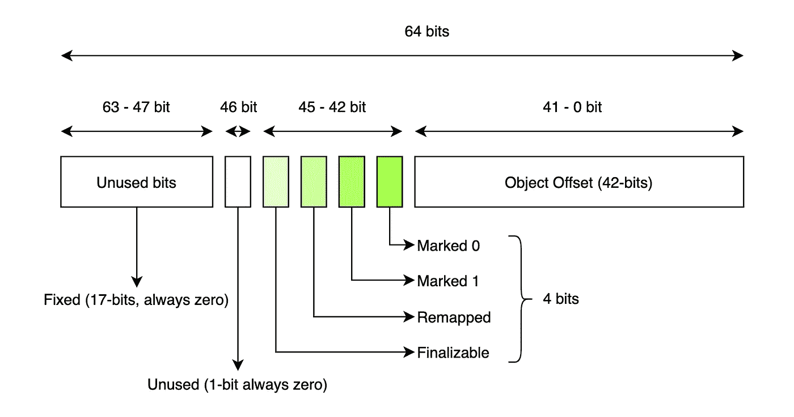
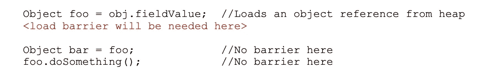
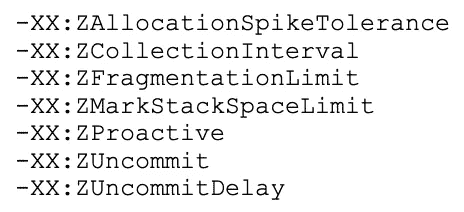

# Z 垃圾收集器算法(JDK 15 版本)

> 原文：<https://medium.com/globant/the-z-garbage-collector-algorithm-jdk-15-version-ca6da00b5281?source=collection_archive---------0----------------------->

# 介绍

9 月 25 日，JDK 11 号发射升空。在其他特性中， [Z 垃圾收集器](https://openjdk.java.net/jeps/333)算法，也称为 ZGC，是作为一个实验特性引入的。几周前的 9 月 15 日，JDK 15 发布了，最新版本的 ZGC 现在[准备生产](https://openjdk.java.net/jeps/377)。

简而言之，ZGC 是一个可扩展的低延迟垃圾收集器，最大 GC 暂停时间为 10 毫秒，能够处理从几兆字节到几兆字节的堆，最大吞吐量减少 15%。

## JVM 垃圾收集器

到目前为止，JVM 已经介绍了一个有趣的垃圾收集器算法列表，让我们通过下面介绍的最重要的算法列表和简要描述来记住它们。

*   **串行(低内存占用):**它使用单线程来完成工作。它适用于单处理器机器，并针对低内存占用量(通常是嵌入式系统)进行了优化。
*   **Parallel(吞吐量收集器):**它并行进行少量收集，以减少垃圾收集开销。它是为运行在多处理器硬件上的中型到大型数据集应用程序而构建的。
*   **CMS(并发标记-清除收集器):**它旨在缩短垃圾收集器暂停时间。专门为具有大量长寿命对象或大量有期限一代的应用程序而设计。CMS 收集器是分代的。
*   **G1(吞吐量/延迟平衡):**垃圾优先(Garbage-First)是一个服务器风格的垃圾收集器，为具有大内存的多处理器机器而设计。它是一个压缩收集器(它压缩到足以避免使用细粒度空闲列表进行分配)。
*   **ZGC(低延迟)**

> 串行和并行被称为“世界停止”算法。CMS 在 JDK 9 中被弃用，G1 取而代之。

比较它们很有意思。并强调 ZGC 同时执行所有繁重的运算，这是其他算法所不具备的(更多细节见下文)。

# 深入 Z 垃圾收集器

Z GC 是一个并发的低延迟算法，除了线程堆栈扫描之外，它执行所有并发的操作(标记、压缩、引用处理、重定位集选择、字符串表清理、JNI WeakRef 清理、JNI GlobalRefs 扫描和类卸载)。这使得该算法非常适合低延迟。

值得一提的重要一点是，目前，暂停时间*不会随着堆或活动大小*而增加，然而，暂停时间*会随着根集大小(您的应用程序正在使用的 java 线程的数量)而增加。*

从算法的角度来看，它是一个并发收集器，当 java 线程继续执行时，它完成所有繁重的工作。它是一个基于区域的收集器，这意味着堆被划分为更小的区域，压缩工作将集中在这些区域的子集上，即垃圾最多的区域。它是 NUMA 感知的，由于 CPU 的本地内存，它减少了延迟。它使用彩色指针和负载屏障，这些将在下面的章节中详细介绍。而且是单代收藏家，没有老少之分，*还没有*。

## **ZGC 阶段**

ZGC 的 GC 循环分为三个暂停。

在第一阶段，暂停标记开始，ZGC 遍历对象图来标记对象是活的还是垃圾。此阶段还包括实时数据的重新映射。

第二个阶段，暂停标记结束，是引用预处理完成的地方。类卸载和重定位集选择也在这个阶段完成。

暂停重定位开始，最后一个阶段，是压缩堆的繁重工作发生的地方。

## **彩色指针**

它们是 ZGC 的核心设计理念。该算法使用 64 位对象指针中一些未使用的位来存储一些元数据，这允许查找、标记、定位和重新映射对象。下图显示了 64 位对象指针和每个位的含义。

Colored pointers diagram.

## **负载屏障**

它是 JIT 在一些战略位置注入的代码。目标是检查加载的对象引用是否有错误的颜色。当线程从堆中加载对象引用时，加载屏障代码将运行。

Load Barrier example

# **调谐选项**

让我描述一下如何使用 ZGC 和一些有趣的参数进行调优。从 JDK 11 版到 JDK 15 版，如果您想使用 ZGC 算法，您必须解锁实验选项:

*-XX:+unlockeexperimentalvmoptions-XX:+use zgc*

从 JDK 15 版开始，您可以通过指定以下内容来使用它:

*-XX:+UseZGC*

ZGC 被设计成易于调音。以下是具体的 ZGC 选项列表:

为了了解所用的时间并查看有关算法行为的一些数字，最好打印垃圾收集器日志，只需在选择 ZGC 时添加以下命令来查看简单的日志:

*-XX:+UseZGC -Xmx <尺寸> -Xlog:gc*

或者，如果您想打印垃圾收集器日志以获得更多详细信息，请执行以下操作:

*-XX:+UseZGC -Xmx <尺寸> -Xlog:gc**

现在，让我们开始看看最有趣的调优选项。

## 设置堆大小

在 ZGC 中要调优的一个最重要的选项是设置最大堆大小( *-Xmx < size >* )。我们必须为我们的应用程序找到正确的值，因为我们不想失去内存，我们希望在 GC 运行时，我们的应用程序有足够的空间来容纳活动对象和分配。下面是一个使用示例:

*-XX:+UseZGC -Xmx <尺寸>*

## 设置并发 GC 线程

尽管 ZGC 有自动设置这个数字的启发式方法，但有时，根据我们的应用程序，指定并发 GC 线程的数量可能会很有趣。这个选项决定了你的 GC 将占用多少 CPU，所以你必须小心你想要给的容量。

*-XX:+UseZGC -Xmx <尺寸>-XX:congcthreads =<数量>*

## 将未使用的内存返回给操作系统

与其他 GC 算法不同，ZGC 取消了未使用内存的提交，将其交还给操作系统。对于内存占用可能成为问题的应用程序，这可能是必要的。如果要禁用这个选项，可以使用-XX:-ZUncommit。

*-XX:+UseZGC -Xmx <大小> -XX:-ZUncommit*

## 在 Linux 上启用大页面

这是一个带来性能改进的选项，没有缺点或副作用。唯一的问题是它需要 root 权限，这就是为什么不是默认选项，并且可能无法为您的应用程序启用它。请查看文档以正确设置该选项。这需要准备一些东西，选项如下:

*-XX:+use zgc-Xms16G-Xmx16G-XX:+use large pages*

## 在 Linux 上启用透明的大页面

对于对延迟敏感的应用程序，不建议使用 Huges 页面，尽管它可以很好地替代前面的调优选项。

*-XX:+UseZGC-…-XX:+use large pages-XX:+UseTransparentHugePages*

在这种情况下，我强烈建议您在您的应用程序中进行试验，并注意峰值，如果出现峰值，这可能不适合您的情况。

## 启用 NUMA 支持

正如我前面说过的，ZGC 是 NUMA 感知的，这意味着这个选项是默认启用的。这将把 Java 堆分配定向到 NUMA 本地内存。JVM 可以自动禁用它，如果您需要显式覆盖该行为，您可以使用选项-XX:+UseNUMA 或-XX:-UseNUMA。

*-XX:+UseZGC -Xmx <大小> -XX:+UseNUMA*

*或*

*-XX:+UseZGC -Xmx <大小> -XX:-UseNUMA*

算法的维基页面上有更多信息。

# 接下来会发生什么？

ZGC 团队的路线图中有两件事引起了我的注意。

首先，该团队正在努力将最大暂停时间减少到 1 毫秒。线程堆栈扫描将同时进行，这也意味着暂停时间不会随着根集大小( [JEP 376](https://openjdk.java.net/jeps/376) )而增加。

第二，他们将使 ZGC 分代，因为大多数对象是短命的，这将是另一个很好的改进。

# 参考

【https://openjdk.java.net/jeps/333 号

【https://openjdk.java.net/jeps/377 

[http://Hg . open JDK . Java . net/zgc/zgc/file/59 c 07 AEF 65 AC/src/hotspot/OS _ CPU/Linux _ x86/zGlobals _ Linux _ x86 . HPP # l39](http://hg.openjdk.java.net/zgc/zgc/file/59c07aef65ac/src/hotspot/os_cpu/linux_x86/zGlobals_linux_x86.hpp#l39)

[https://wiki.openjdk.java.net/display/zgc/Main](https://wiki.openjdk.java.net/display/zgc/Main)

[https://www.youtube.com/watch?v=88E86quLmQA](https://www.youtube.com/watch?v=88E86quLmQA)

[http://Cr . open JDK . Java . net/~ pliden/slides/ZGC-福斯德姆-2018.pdf](http://cr.openjdk.java.net/~pliden/slides/ZGC-FOSDEM-2018.pdf)