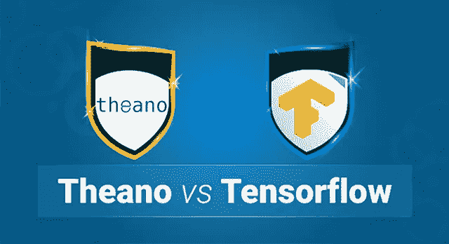
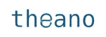
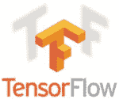
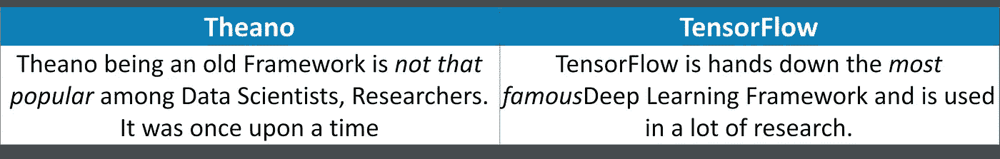
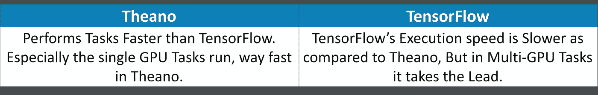
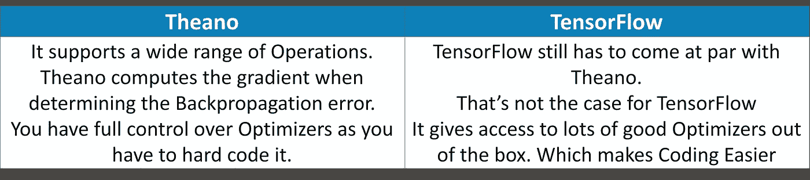
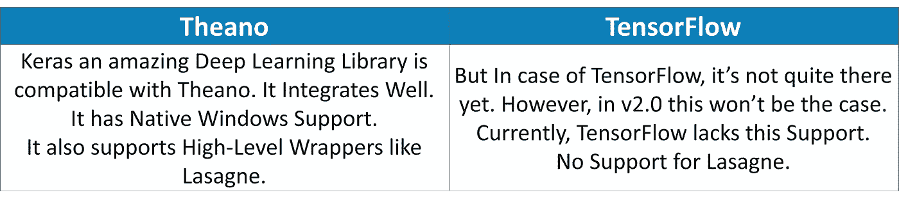
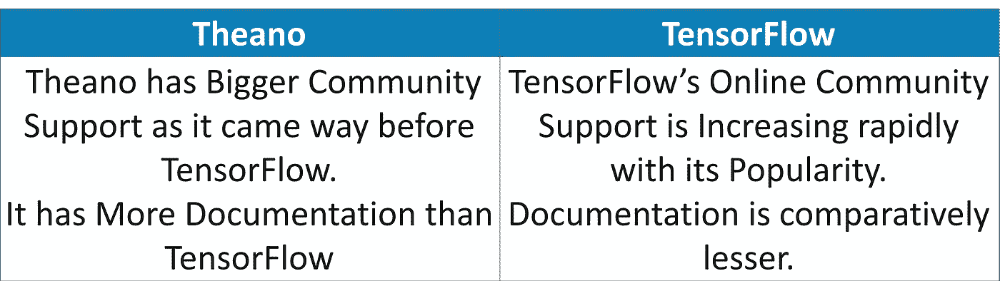

# Theano vs TensorFlow:框架的快速比较

> 原文：<https://medium.com/edureka/theano-vs-tensorflow-15f30216b3bc?source=collection_archive---------3----------------------->



Theano vs Tensorflow — Edueka

深度学习和机器学习的时代正处于巅峰。到 2020 年，它将创造 230 万个工作岗位。随着每个月都有新的框架出现，TensorFlow 和 Theano 已经存在了一段时间，也获得了很大的人气。因此，在本文中，我将讨论以下主题:

*   什么是 Theano？
*   什么是张量流？
*   Theano vs Tensorflow

1.  流行
2.  执行速度
3.  技术优势
4.  和睦相处
5.  社区支持
6.  代码可读性

*   最终判决:Theano vs TensorFlow

# 什么是 Theano？

Theano 可以定义为**科学计算**的库。它是由蒙特利尔大学开发的，自 2007 年以来一直可用。



它允许您有效地定义、优化和评估涉及多维数组的数学表达式。既可以在 CPU 上运行，也可以在 GPU 上运行。

# 什么是张量流？

**TensorFlow** 是谷歌大脑的开源软件库，用于跨一系列任务的数据流编程。



它是一个符号数学库，用于像神经网络这样的机器学习应用。

# Theano vs TensorFlow

我们将根据以下指标比较 Theano 和 TensorFlow:

## **人气:**



## **执行速度:**



## **技术优势:**



## **兼容性:**



## **社区支持:**



## **代码可读性:**


让我们根据代码比较一下 Theano 和 TensorFlow。在这里，我采用一个基本的示例脚本，我们将获取一些虚假数据，并初始化最适合该数据的数据，以便它可以预测未来的数据点。

**Theano 代码:**

```
import theano
import theano.tensor as T
import numpy

# Again, make 100 points in numpy
x_data = numpy.float32(numpy.random.rand(2, 100))
y_data = numpy.dot([0.100, 0.200], x_data) + 0.3

# Intialise the Theano model
X = T.matrix()
Y = T.vector()
b = theano.shared(numpy.random.uniform(-1, 1), name="b")
W = theano.shared(numpy.random.uniform(-1.0, 1.0, (1, 2)), name="W")
y = W.dot(X) + b 

# Compute the gradients WRT the mean-squared-error for each parameter
cost = T.mean(T.sqr(y - Y))
gradientW = T.grad(cost=cost, wrt=W)
gradientB = T.grad(cost=cost, wrt=b)
updates = [[W, W - gradientW * 0.5], [b, b - gradientB * 0.5]] 

train = theano.function(inputs=[X, Y], outputs=cost, updates=updates, allow_input_downcast=True) 

for i in xrange(0, 201):
    train(x_data, y_data)
    print W.get_value(), b.get_value()
```

**等效张量流代码:**

```
import tensorflow as tf
import numpy as np

# Make 100 phony data points in NumPy.
x_data = np.float32(np.random.rand(2, 100)) # Random input
y_data = np.dot([0.100, 0.200], x_data) + 0.300

# Construct a linear model.
b = tf.Variable(tf.zeros([1]))
W = tf.Variable(tf.random_uniform([1, 2], -1.0, 1.0))
y = tf.matmul(W, x_data) + b

# Minimize the squared errors.
loss = tf.reduce_mean(tf.square(y - y_data))
optimizer = tf.train.GradientDescentOptimizer(0.5)
train = optimizer.minimize(loss)

# For initializing the variables.
init = tf.initialize_all_variables()

# Launch the graph
sess = tf.Session()
sess.run(init)

# Fit the plane.
for step in xrange(0, 201):
    sess.run(train)
    if step % 20 == 0:
        print step, sess.run(W), sess.run(b)

# Learns best fit is W: [[0.100  0.200]], b: [0.300]
```

**长度方面**两者的代码都差不多**相似**没有太大区别。描述输入和目标输出的两个相同生成的 NumPy 数组。但是如果我们看一下模型的初始化。

**模型初始化:**

```
# TensorFlow
b = tf.Variable(tf.zeros([1]))
W = tf.Variable(tf.random_uniform([1, 2], -1.0, 1.0))
y = tf.matmul(W, x_data) + b

# Theano
X = T.matrix()
Y = T.vector()
b = theano.shared(numpy.random.uniform(-1, 1), name="b")
W = theano.shared(numpy.random.uniform(-1.0, 1.0, (1, 2)), name="W")
y = W.dot(X) + b
```

正如你在这里看到的，TensorFlow 不需要对 X 和 Y 变量进行任何特殊处理。另一方面，ano 需要额外的努力来确保变量是函数的符号输入。b 和 W 的定义是解释性的，也更好。

**学习:优化**

```
# Tensorflow
loss = tf.reduce_mean(tf.square(y - y_data)) # (1)
optimizer = tf.train.GradientDescentOptimizer(0.5) # (2)
train = optimizer.minimize(loss) # (3)

# Theano
cost = T.mean(T.sqr(y - Y)) # (1)
gradientW = T.grad(cost=cost, wrt=W) # (2)
gradientB = T.grad(cost=cost, wrt=b) # (2)
updates = [[W, W - gradientW * 0.5], [b, b - gradientB * 0.5]] # (2)
train = theano.function(inputs=[X, Y], outputs=cost, updates=updates, allow_input_downcast=True) # (3)
```

对于(1)而言，对于 ano 与 TensorFlow，MSE 几乎相同。

对于(2)来说，定义**优化器**就像在 TensorFlow 的情况下一样容易和简单，但是 Theanno 给了你很多对优化器的控制，尽管它相当冗长并且增加了验证工作。

对于(3) **训练功能**，代码几乎相似

**培训机构:**

```
# TensorFlow
init = tf.initialize_all_variables()

sess = tf.Session()
sess.run(init)
for step in xrange(0, 201):
    sess.run(train)

# Theano
for i in xrange(0, 201):
    train(x_data, y_data)
    print W.get_value(), b.get_value()
```

用于训练的代码几乎相同，但是将图形执行封装在会话对象中在概念上比不封装更清晰。

# 最终判决:Theano vs TensorFlow

最后，可以说这两个 API 都有一个*相似的接口*。但是 TensorFlow 相对来说更容易使用，因为它提供了许多监控和调试工具。Theano 在**可用性和速度**上领先，但是 TensorFlow 更适合部署。对于 ano 来说，文书工作或文档不仅仅是 TensorFlow，TensorFlow 作为一种新的语言，人们没有太多的资源。像 Keras、Lasagne 和 blocks 这样的开源深度库已经在 Theano 之上**构建。**

我希望这个比较足以让您决定选择哪个框架。如果你想查看更多关于人工智能、DevOps、道德黑客等市场最热门技术的文章，你可以参考 [Edureka 的官方网站。](https://www.edureka.co/blog/?utm_source=medium&utm_medium=content-link&utm_campaign=theano-vs-tensorflow)

请留意本系列中的其他文章，它们将解释深度学习的各个其他方面。

> 1.[张量流教程](/edureka/tensorflow-tutorial-ba142ae96bca)
> 
> 2. [PyTorch 教程](/edureka/pytorch-tutorial-9971d66f6893)
> 
> 3.[感知器学习算法](/edureka/perceptron-learning-algorithm-d30e8b99b156)
> 
> 4.[神经网络教程](/edureka/neural-network-tutorial-2a46b22394c9)
> 
> 5.什么是反向传播？
> 
> 6.[卷积神经网络](/edureka/convolutional-neural-network-3f2c5b9c4778)
> 
> 7.[胶囊神经网络](/edureka/capsule-networks-d7acd437c9e)
> 
> 8.[递归神经网络](/edureka/recurrent-neural-networks-df945afd7441)
> 
> 9.[自动编码器教程](/edureka/autoencoders-tutorial-cfdcebdefe37)
> 
> 10.[受限玻尔兹曼机教程](/edureka/restricted-boltzmann-machine-tutorial-991ae688c154)
> 
> 11. [PyTorch vs TensorFlow](/edureka/pytorch-vs-tensorflow-252fc6675dd7)
> 
> 12.[用 Python 进行深度学习](/edureka/deep-learning-with-python-2adbf6e9437d)
> 
> 13.[人工智能教程](/edureka/artificial-intelligence-tutorial-4257c66f5bb1)
> 
> 14.[张量流图像分类](/edureka/tensorflow-image-classification-19b63b7bfd95)
> 
> 15.[人工智能应用](/edureka/artificial-intelligence-applications-7b93b91150e3)
> 
> 16.[如何成为一名人工智能工程师？](/edureka/become-artificial-intelligence-engineer-5ac2ede99907)
> 
> 17. [Q 学习](/edureka/q-learning-592524c3ecfc)
> 
> 18. [Apriori 算法](/edureka/apriori-algorithm-d7cc648d4f1e)
> 
> 19.[用 Python 实现马尔可夫链](/edureka/introduction-to-markov-chains-c6cb4bcd5723)
> 
> 20.[人工智能算法](/edureka/artificial-intelligence-algorithms-fad283a0d8e2)
> 
> 21.[机器学习的最佳笔记本电脑](/edureka/best-laptop-for-machine-learning-a4a5f8ba5b)
> 
> 22.[12 大人工智能工具](/edureka/top-artificial-intelligence-tools-36418e47bf2a)
> 
> 23.[人工智能(AI)面试问题](/edureka/artificial-intelligence-interview-questions-872d85387b19)
> 
> 24.[tensor flow 中的物体检测](/edureka/tensorflow-object-detection-tutorial-8d6942e73adc)
> 
> 25.[什么是神经网络？](/edureka/what-is-a-neural-network-56ae7338b92d)
> 
> 26.[模式识别](/edureka/pattern-recognition-5e2d30ab68b9)
> 
> 27.[人工智能中的阿尔法贝塔剪枝](/edureka/alpha-beta-pruning-in-ai-b47ee5500f9a)

*原载于 2019 年 7 月 24 日*[*https://www.edureka.co*](https://www.edureka.co/blog/theano-vs-tensorflow/)*。*