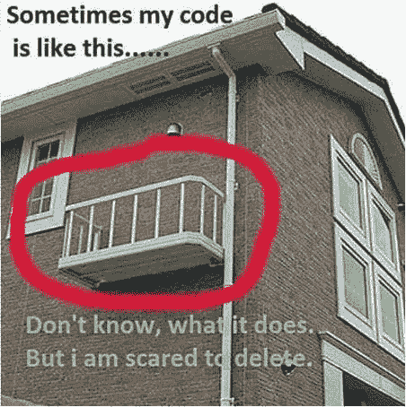
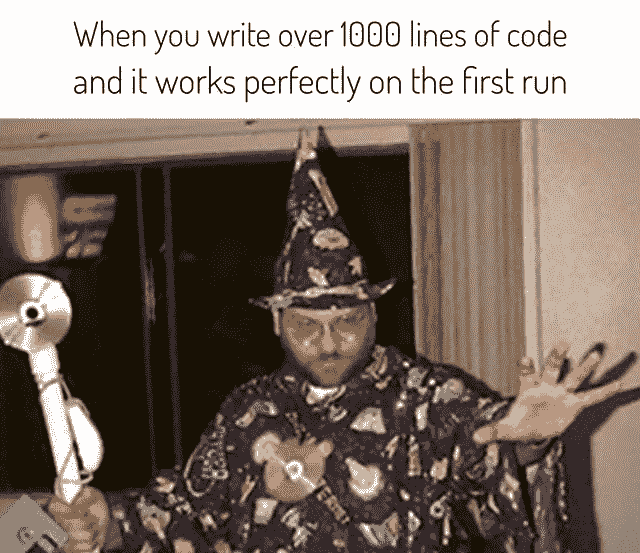

# 做了两年软件工程师后我学到的东西

> 原文：<https://medium.easyread.co/things-i-learned-after-two-years-being-a-software-engineer-c83d5e2c668?source=collection_archive---------4----------------------->

Photo by [felipe lopez](https://unsplash.com/@flopez_nice?utm_source=medium&utm_medium=referral) on [Unsplash](https://unsplash.com?utm_source=medium&utm_medium=referral)

去年 11 月，我刚从大学毕业。虽然大多数应届毕业生仍然不知道如何成为一名专业的软件工程师，但我感到幸运的是，我已经开始了作为软件工程师的工作。我从不后悔在攻读学士学位的同时做兼职的决定，尽管我和朋友一起玩耍的时间变少了。在我做软件工程师的两年中，我意识到并了解到做一名软件工程师是一个终生的过程。以下是我想分享给每个想成为软件工程师的人的一些要点。

# **有一个成长的心态**

我遇到过很多学习计算机科学/软件工程的人，思维定势很固定。固定的思维模式人们认为他们的品质是固定的，不能改变的。在我上大学的几年里，我的朋友中很少有人放弃编程课程，因为他们认为自己没有天赋或才华去做这件事。他们认为，你需要才能编写计算机程序。软件工程的世界一直在发展。如果你的心态是固定的，你就不可能茁壮成长和成功。而具有成长心态的人相信他们的学习和智力会随着时间的推移而增长。我有一个朋友，大学早期编程真的很烂。但他总是鞭策自己变得更好。现在，他比我的其他朋友更有技巧，他们比他更聪明，从不强迫自己取得更多成就。

# 专注于你解决问题的技巧

我非常感谢在我的大学迎新期间参观微软印度尼西亚公司的办公室。我们举办了一个办公室参观活动，一个关于科技行业的简短研讨会，还有一个来自科技传道者的激励性演讲。

> “专注于你解决问题的技巧。非常注重算法和数据结构类。”
> ——n 先生(微软技术布道者)

没想到技术会进化的这么快。框架来来去去。每年都会发布新的编程语言。那么如果那个技能只能用几年应该学什么呢？

作为一名软件工程师，你是一名问题解决者。你不仅仅是在编写代码，而是在指导计算机根据你的解决方案来解决问题。做一些增强你的逻辑和算法思维的编码挑战。你可以从类似[黑客等级](http://hackerrank.com)或者[codi ity](http://codility.com)这样的网站上找到。理解问题，并使用您编写的代码来修复它！

# 灵活使用编程语言

许多软件工程师要么太熟悉一种语言，要么太害怕尝试一种新的语言。Ajey Gore (GO-JEK 的 CTO)说编程语言就像金属。每种金属都有自己的潜力和能力。黄金是制作奢侈品的好材料。但是你会用金子造一个坦克吗？

编程语言也是如此。每种编程语言都是为了解决某个特定的问题而创建的。你那么热爱 C++，但是用 C++来搭建 web app 并不是一个好的选择。作为一名软件工程师，为某个问题选择合适的工具是你在旅途中需要学习的。

但我并不是说，你不需要掌握或深入一门编程语言。精通一门编程语言也是必要的。这将帮助你更快地完成任务，你可以继续迎接另一个挑战。

# 软件工程是一门手艺

What one programmer can do in one month, two programmers can do in two months.

每个学编程的人都可以创建一个运行的程序。但是好的节目和平庸甚至糟糕的节目有什么区别呢？

密码。

写好代码是一个终生的旅程。当你独自工作时，你可能会认为一切都很好。你写代码，你测试它，它根据你的意图运行。但是有一天你会在团队中工作。和其他软件工程师一起。在单人模式下写代码和在团队中写代码是完全不同的。你会发现你的队友讨厌你的代码，你也讨厌队友的代码。你的程序出现了错误，你修复了错误，但是新的错误又出现了。你正在处理遗留的代码库，你讨厌你被分配去维护那个项目，而你甚至不能理解这个系统，因为你不能阅读代码。

所以才叫手艺。你不仅仅是在编写软件，而是在制作软件。你写出好的可读的代码。你的软件是防弹的，因为你测试你写的所有东西。你的队友很乐意和你在同一个代码库中工作，因为阅读你的代码很容易。

有了两年的经验，我确信还有很多我不知道的事情。我很高兴这个职业不是一个重复性的工作，我可以不断提高自己，每天都变得越来越好。我希望这篇文章可以激励任何想追求梦想成为一名伟大的软件工程师的人。如果你喜欢问题和挑战，这个世界就适合你！