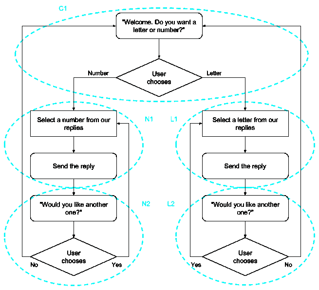

# 为声音而思考:设计对话，而不是逻辑

> 原文：<https://medium.com/google-developer-experts/thinking-for-voice-design-conversations-not-logic-7c60869451f1?source=collection_archive---------3----------------------->

“为声音而思考”不仅仅是关于编码，它涉及到我们如何设计对话体验的核心。大多数程序员处理这项任务的方式和我们以前处理编码任务的方式一样，都是关注我们如何请求信息，然后处理它。但从某些方面来说，这完全是倒退。当我们思考声音时，我们首先需要关注对话。这篇文章将帮助你理解为什么，以及如何去做。未来的文章将以此为基础，看看我们如何将对话设计转化为代码。


作为编码人员，我们的习惯(通常也是我们的训练)是看问题并将它们分解成更小的部分。我们还想识别相似的部分，这样我们就可以将它们转换成函数，从代码的不同部分调用这些函数。通常，我们会使用逻辑流程图来帮助确定我们的代码应该如何从一个部分流向另一个部分，在每一点上我们需要做出什么决定，以及如何回复。我们通常将我们的回复与逻辑和公共函数联系起来。

在构建语音应用程序时，这种设计模型可能会碍事。这是因为人类的对话不会以同样的方式中断，不一定有同样的逻辑流程，而且经常有需要更多变化和情景的回复。

我们将看一个例子问题，以及我们可能如何经典地处理它，以及为什么它会导致对话式设计的问题。然后我们会看到一个更好的方法，看看为什么它使我们的设计，最终我们的代码，变得更加容易。在未来的故事中，我们将展示如何将这种设计转化为代码。

我们的要求相当简单，一个可以提供有关字母或数字的信息的动作。在这种情况下，我们将主要提供琐事，但在未来，我们将看到如何扩展这一点，以提供不那么琐碎的事情。

## 不要随波逐流


我们的第一直觉会是建立一个图表，将它分解成必要的组成部分。可能是你在这里看到的流程图。在这个过程中，我们会问一些问题，根据用户的输入做出一些决定，做一些逻辑运算来找出要说什么，说出来，然后提示用户下一步该做什么。我已经圈出了几个似乎在功能上对其进行逻辑分解的位。



然而，仅仅从表面上看，我们可能会发现一些问题。像 N1 和 L1、N2 和 L2 这样的函数看起来很相似，但是它们又有很大的不同，我们可能无法用相同的函数来处理它们。

当我们开始实现它时，更令我们困惑的是，我们将向 N1 的用户发送一个回复，但是在我们等待用户对我们说任何话之前，立即作为 N2 的一部分发送另一个回复。我们的对话工具并不真的让我们这样做，所以我们试图找到让我们这样做的变通办法。大多数开发人员抓住一个叫做“跟进意图”的概念，因为听起来它代表了我们希望对话如何进行。

当我们思考如何处理对 N2 和 L2 说“不”的反应时，一个类似的问题又出现了。他们都想去同一个功能(C1)，但如果我们试图为他们使用一个“后续意图”，我们发现我们不能有相同的意图是两个不同的后续。所以我们也在寻找解决方法。

在我们的逻辑流程中还有更微妙的问题，在我们构建它之前可能不会遇到。如果用户在 C1、N2 或 L2 说了一些无意义的话，该怎么办？我们应该如何表现。如果他们一直说些无意义的话，我们应该在什么时候放弃呢？我们如何把它引入逻辑？什么是荒谬的？如果我们在得到一个数字后要求一个字母，这似乎是人类在交谈中很常见的说法，但我们的逻辑无法处理这一点。辞职怎么样？我们在 C1 的信息是“欢迎”，如果他们回到问题上，我们真的能改变吗？

我们可以做到所有这些，但要捕捉它们，逻辑图会变得非常非常复杂。有没有更简单的思考方式？(剧透:是的。)

## 设计对话


如果我们不去关注我们的程序做了什么，而是关注我们的用户在和我们交谈时说了什么，那会怎么样？这种*对话优先*的方法可以更容易地发现我们在上次会议结束时看到的一些问题。此外，它使事情变得相当简单，因为我们的设计可以一次只关注一件事情。

我们可以将流程图重组为若干对话。我们只是要经历一些“快乐之路”上的对话，但请记住，一个真正的设计应该有更多这样的脚本来探索其他可能发生的事情。稍后，我们将对对话进行注释，看看我们在每一点上都做了什么。

脚本 1:

```
User:  Talk to number or letter
Agent: Welcome! Would you like to hear a number or letter? 
User:  How about a number
Agent: 1 is the loneliest number. Would you like another?
User:  Yes
Agent: 2 is the only even prime. Care for another?
User:  No
Agent: Ok, would you like to hear a number or letter?
```

脚本 2:

```
User:  Talk to number or letter
Agent: Welcome! Would you like to hear a number or a letter?
User:  Number, please
Agent: 42 is the answer. Another one, so to speak?
User:  sure
Agent: 21 is blackjack. Care for another?
User:  nope
Agent: Ok, care for a letter or a number?
```

脚本 3:

```
User:  Talk to number or letter
Agent: Howdy! Would you like a letter or a number?
User:  Let's go for a number
Agent: A googol is 10 to the 100th power. Ready for another?
User:  How about a letter this time
Agent: The letters "A" and "I" are also words. Want another?
```

从中可以学到几点:

*   当被问到一个问题时，人们会有许多不同的反应。我们将使用的工具收集许多样本短语，加上混合一些 ML 算法，以匹配用户所说的话和他们如何回复。
*   在真实的对话中，用户可以将对话引向任何方向。因此，尽管我们问了一个是或否的问题，他们可能会试图把谈话引向一个完全不同的方向。
*   我们如何回复取决于两件事:
    (1)我们当时处于什么状态和
    (2)用户说了什么
*   上面第(1)点的结果是，我们应该跟踪用户的状态，以确定我们说什么，所以新的状态成为回复的一部分，即使用户没有看到。

我们通常根据用户所说的内容来分解这些对话。这些被称为**意图**，因为它们反映了用户打算说什么或做什么，而不是他们可能使用的特定词语。意图从来不是关于我们的代码将做什么，相反，它们关注的是任何对话中最重要的一点——别人在对我们说什么。

有了以上我们学到的要点，让我们在对话中加入更多的信息，按照用户在每个阶段说的话来细分。我们将添加可能匹配的意图，然后我们的代码将做什么——在状态集和发送的回复方面。

脚本 1:

```
User:  Talk to number or letter 
Match: intent.welcome 
Logic: Set replyState to "prompt" 
       Pick a response for the current replyState ("prompt") 
         and the intent that was matched ("intent.welcome") 
Agent: Welcome! Would you like to hear a number or letter? User:  How about a number 
Match: intent.number 
Logic: Set replyState to "number" 
       Pick a response for the current replyState ("number") 
Agent: 1 is the loneliest number. Would you like another? User:  Yes 
Match: intent.yes 
Logic: Pick a response for the current replyState ("number") 
Agent: 2 is the only even prime. Care for another? User:  No 
Match: intent.no 
Logic: Set replyState to "prompt" 
       Pick a response for the current replyState ("prompt") 
         and the intent that was matched (not "intent.welcome") 
Agent: Ok, would you like to hear a number or letter?
```

这样，我们可以看到我们的回复是基于当前状态和用户意图的组合。(我们的状态可能更复杂，要跟踪用户听到了什么，他们访问了多少次，等等。这是非常简化的。)

我们也看到“是”不会改变状态。它不需要。我们的一些处理并不关心是什么意图触发的，这没关系。其他人可能会稍微改变一下谈话方式，只在我们开始谈话时才说“欢迎”。

最后，我们还会注意到，我们已经将我们的回复(信息和提示)合并成一个单独的返回内容。这就是来回对话通常的工作方式，只有当我们的对话伙伴先说话时，我们才回答。

如果我们看看脚本 2，我们会看到它完全相同:

```
User:  Talk to number or letter 
Match: intent.welcome 
Logic: Set replyState to "prompt" 
       Pick a response for the current replyState ("prompt") 
         and the intent that was matched ("intent.welcome") 
Agent: Welcome! Would you like to hear a number or a letter? User:  Number, please 
Match: intent.number 
Logic: Set replyState to "number" 
       Pick a response for the current replyState ("number") 
Agent: 42 is the answer. Another one, so to speak? User:  sure 
Match: intent.yes 
Logic: Pick a response for the current replyState ("number") 
Agent: 21 is blackjack. Care for another? User:  nope 
Match: intent.no 
Logic: Set replyState to "prompt" 
       Pick a response for the current replyState ("prompt") 
         and the intent that was matched (not "intent.welcome") 
Agent: Ok, care for a letter or a number?
```

事实上，如果你看看“匹配”和“逻辑”部分，就程序而言，它们是相同的对话。唯一的区别是用户使用的确切单词和我们回复的确切短语。从根本上说，它们是完全相同的对话。

这在脚本 3 中是如何实现的？

```
User:  Talk to number or letter 
Match: intent.welcome 
Logic: Set replyState to "prompt" 
       Pick a response for the current replyState ("prompt") 
         and the intent that was matched ("intent.welcome") 
Agent: Howdy! Would you like a letter or a number? User:  Let's go for a number 
Match: intent.number 
Logic: Set replyState to "number" 
       Pick a response for the current replyState ("number") 
Agent: A googol is 10 to the 100th power. Ready for another? User:  How about a letter this time 
Match: intent.letter 
Logic: Set replyState to "letter" 
       Pick a response for the current replyState ("letter") 
Agent: The letters "A" and "I" are also words. Want another?
```

这里，用户突然要求我们跳到一个完全不同的状态。但这不是问题——我们的程序只是看到了这一点，就好像他们从提示问题中请求该状态，而处理程序以同样的方式做出反应。

因此，我们的目标是捕捉用户在说什么，然后使用我们的 webhook 基于此改变状态，而不是必须构建许多后续意图。

## 接下来会发生什么？

如果我们要做一个功能更全的设计，我们会添加一些反映其他“不太愉快的道路”元素的对话，比如

*   当用户随时要求退出时会发生什么？
*   如果他们说了些无意义的话怎么办？如果他们一直胡说八道怎么办？
*   如果他们不回应我们，我们该如何表现？
*   我们如何处理新的话题？

我们甚至可以考虑附加功能:

*   除了字母和数字之外，我们可以添加其他类别的信息吗？
*   用户可能想问更多关于我们最近结果的信息吗？


我们将看到的是，所有这些情况都可以像我们已经审查过的情况一样处理，通过可能改变状态，然后根据当前状态和用户刚刚触发的意图做一些事情。

一旦我们完成了设计，我们当然会想要编码！我们将开始研究下一步该如何做。

【stackoverflow.com】[](https://stackoverflow.com/q/52672920/1405634)**一问一答。我感谢用户*[*storms son*](https://stackoverflow.com/users/1553662/stormsson)*的提问，以及他们允许我对这个故事展开讨论。**