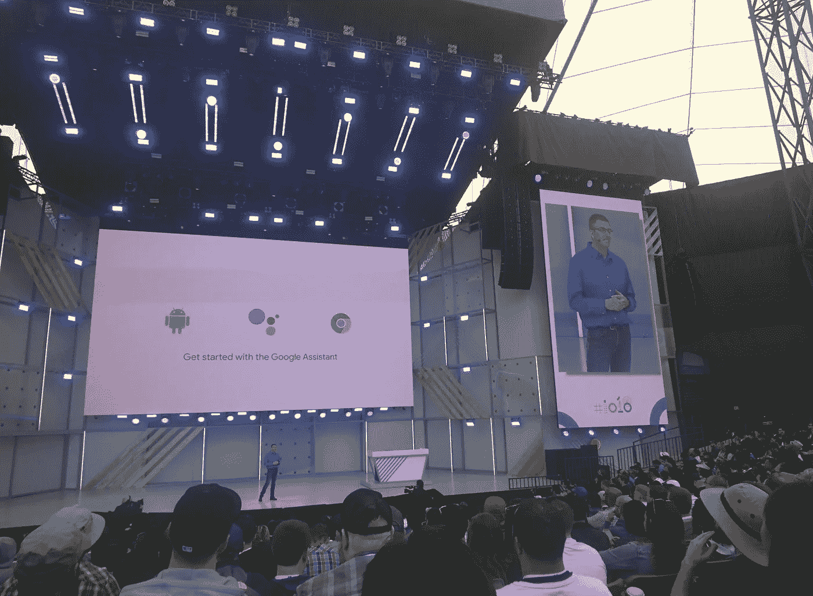

# 为声音而思考:Web 开发人员入门

> 原文：<https://medium.com/google-developer-experts/thinking-for-voice-getting-started-for-web-developers-88f0ac8bc707?source=collection_archive---------8----------------------->

“为语音而思考”不仅仅是学习如何为像谷歌助手这样的语音代理编程。这是关于如何制造出色的语音代理，因为你可以理解他们如何工作，并将其与你理解的事情联系起来。这篇文章旨在帮助目前从事网络工作的开发人员理解 Google Assistant 的操作是如何工作的，以及如何编写自己的程序。

当我第一次得到一个 Google Home 时，我很好奇为它开发会是什么样子。我从一开始就一直从事 Web 开发，并且随着移动开发变得流行，越来越多的代码被放到网页上的 Javascript 中，我看到了事情是如何变化的。在我所知道的和我需要知道的之间，为助理构建一条什么样的路径？开发动作会像开发应用程序一样吗？他们会引进全新的不同的东西吗？

事实证明他们没有。使用 Google 平台上的动作进行开发非常类似于开发基于服务器的 web 应用程序。虽然这两个平台之间有许多不同之处，但也有一些令人愉快的相似之处，因此大多数 web 开发人员会发现自己处于熟悉的环境中。

**将“外观和感觉”变成个性**

考虑语音时，最大的挑战不是技术上的，而是理解设计需要如何改变。尽管谷歌为构建良好的语音用户界面(VUIs)提供了许多建议(T4 ),但我们已经可以从构建良好的网络图形用户界面中吸取一些经验。

从表面上看，这两者似乎完全不同。但有一个基本的相似之处:我们希望我们的网站有一个独特的外观和感觉，这样当人们回到网站时就会认出它，同样，我们希望我们的语音代理有一个独特的角色，人们会将它与该行为联系起来。在网站上，我们使用颜色和布局以及我们的图形来获得“我们是谁”的感觉，而当涉及到语音时，我们的调色板是非常不同的。我们倾向于更依赖于我们使用的单词和短语，而不是它“看起来”如何，因为我们说话的方式使我们的代理人“听起来不同”。

就像一个网站可能看起来“专业”或“卡通”，我们使用的短语，以及我们如何传递它们，可以让我们的代理听起来“专业”或“愚蠢”。除了颜色，我们还会使用音调、音效、背景音乐，甚至是特定的短语来帮助说明我们的观点或引出重要的元素。在为声音设计时，人物角色是至关重要的，所以确保你在设计过程的早期就清楚地定义它，然后围绕它开始构建。

当我们谈到为语音代理设计时，我们通常会谈到为用户和动作之间的对话编写脚本。这非常类似于我们的用户与网页的交互方式。通过这两种方式，我们希望用户发起与我们的对话，然后我们回复。在网上，我们回复一个页面。通过语音，我们将回复一条消息。如此重复，直到用户完成了他们想要的。有时，我们的对话可能会误入歧途，我们需要引导用户回到他们想做的事情，但重要的是要理解我们的目标是相同的，帮助用户做他们想做的事情。我们经常在网上谈论错误页面，但在大多数情况下，它们并不是真正的错误页面，它们只是我们不能完全做到用户想要的页面，所以我们需要让它们回到正轨。同样，对于语音，我们在大多数情况下不会有错误响应，我们只需要帮助引导他们回到快乐的道路上。我们稍后将讨论对话模型中的其他一些相似之处。

然而，开发 GUI 和开发 VUI 有两个主要区别。

首先，图形用户界面可以是信息密集的——它们可以在屏幕上显示大量信息，并且可以在一次对话中收集大量信息。VUIs 不可能那么密集。一般来说，我们会一次只要求用户提供一点信息，而不是整个表单，但是我们需要做好准备，他们会给我们比我们要求的更多的信息。例如，如果我们问一个地址，他们可能会给我们一个完整的街道地址，或者可能只给我们城市。我们需要处理这两个案子。

第二大区别是用户期望什么，他们会发现什么不和谐。GUI 的变化会让用户迷失方向。如果他们经常访问一个网站，或者即使他们使用不同的网站，他们也希望像菜单和表单这样的输入元素每次都在大致相同的位置。如果有什么变化，他们会发现很难使用该网站。但是当用声音和某人说话时，他们期望得到不同的回应。每次听到相同的提示都感觉不自然，人们会倾向于忽略它们。当设计你的 VUI 时，你应该考虑用不同的方式向用户表达同样的意思，以及如何在不同的方式之间做出适当的改变。

**对话的结构**

与我们的行为对话可以以几种方式开始，但目前最常见的一种方式是用户[通过名字](https://developers.google.com/actions/discovery/explicit)请求它，比如“嘿，谷歌，跟莎士比亚的侮辱说话”。不需要安装。谷歌助手知道什么是“莎士比亚的侮辱”，因为动作名称是全球唯一的。

Web 开发人员会马上想“这像是域名吗？”的确是！以至于一些流行的域名不被允许作为动作名称，直到你使用谷歌的搜索控制台将你的动作链接到网站。

我们对一个动作发出的命令和一个 URL 之间的相似之处不止于此。在对话过程中，用户所说的每一件事通常都由自然语言处理工具(NLP)处理，如 [Dialogflow](https://dialogflow.com/docs/) 。Dialogflow 获取用户所说的短语，识别与该短语最匹配的[意图](https://dialogflow.com/docs/intents)，并从中提取相关参数。然后，它将这些信息以及一些额外的有用信息发送到一个 [webhook](https://dialogflow.com/docs/fulfillment) 进行履行处理。

顾名思义，webhook 只是一个 webapp，通过 HTTPS 服务器监听一个众所周知的公共 URL。当然，这一部分对 web 开发人员来说应该很容易，但是相似性更深。通常，我们的 web 应用程序有路径或路线，我们将把它们映射到要执行的功能中。通常这些路由会有参数，或者，如果我们把它作为 POST 操作来做，这些参数就是表单的一部分。同样，NLP 系统将一个路径(用户说过的短语)映射成一个带有参数的命名意图，我们将在服务器上的函数中处理该意图。

什么通过 HTTPS 传送到我们的服务器？为什么，所有这些信息的 JSON 表示。我们需要回复什么？又是 JSON。作为 web 开发人员，我们应该相当熟悉使用 JSON 的不同方式。就像构建 webapps 一样，webhooks 可以用任何语言编写，可以在任何平台上运行。我们唯一的限制是，它必须是可公开访问的，具有有效的(非自签名)SSL 证书，并且必须能够接受和返回 Google 和 Dialogflow 上的操作所定义的 JSON。

Voice 甚至有自己的 HTML 和 CSS 等价物。被称为 [SSML](https://developers.google.com/actions/reference/ssml) ，语音合成标记语言，这代表了如何说出响应，包括如何发音数字，首字母缩写词和其他单词。它甚至包括通过音频播放器播放短格式分层音效和长格式音频的方法。

**语音浏览**

你可能想知道浏览器的语音等价物是什么，因为你可能不记得安装了语音浏览器或类似的东西。助手本身在与您的操作对话时充当您的用户的浏览器，管理会话期间的交互，允许用户创建类似书签的快捷方式，甚至提供其他与帐户相关的活动。例如，您的动作可以[存储有限数量的特定于用户的数据](https://developers.google.com/actions/assistant/save-data)，无论是对于会话还是直到您或您的用户清除它，只有用户和您的动作可以访问。虽然不能复制 cookies 的工作方式，但有很强的相似性，可以类似地使用它们。

我们的用户甚至可以发现我们的行为，就像他们在网上做的一样。正如我们上面讨论的，如果他们知道动作的名称，他们可以直接访问它，就像访问 URL 一样。但是如果他们没有呢？这就是谷歌介入的地方，它的行为就像……嗯……像谷歌一样，通过[隐式调用](https://developers.google.com/actions/discovery/implicit)提供建议，告诉用户什么动作能够处理用户想要的东西。你可以通过构建一个可以处理特定[内置意图](https://developers.google.com/actions/discovery/built-in-intents)的动作来影响这一点，甚至可以通过使用一些专门用于检查动作行为的[分析](https://developers.google.com/actions/console/analytics)来查看你的动作是如何执行的。

当然，助手和浏览器之间的相似之处并不完美。能够在助手内部运行的东西很少，所以不要计划在客户端运行任何 Javascript 或其他东西。然而，从好的方面来说，用户的助手配置可以在他们可能使用的平台之间工作，因此他们可以在他们的移动设备或智能扬声器之间无缝移动，而您只需做很少的工作。

**结论……目前来看**

希望你已经看到了在 Google 上为 web 开发和为新兴的语音领域开发有多少相似之处。你已经掌握的许多技能将在你制定行动时帮助你。将来，我会讨论 Google 上关于动作的其他组件，以及当你为语音“思考”时如何使用它们。

我鼓励您访问 https://developers.google.com/actions/，了解更多信息，并开始探索如何使用语音与您的用户互动。我期待听到你的作品！