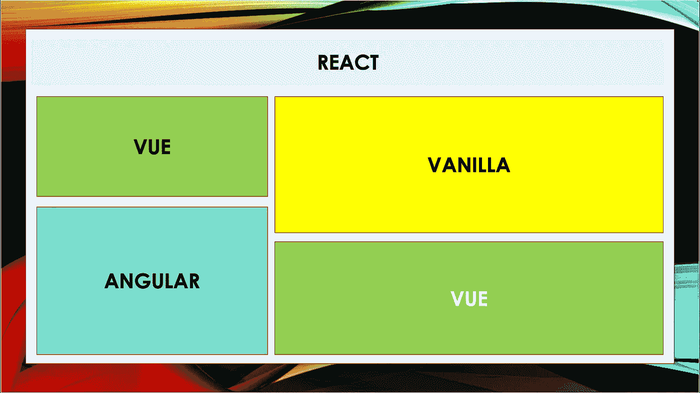
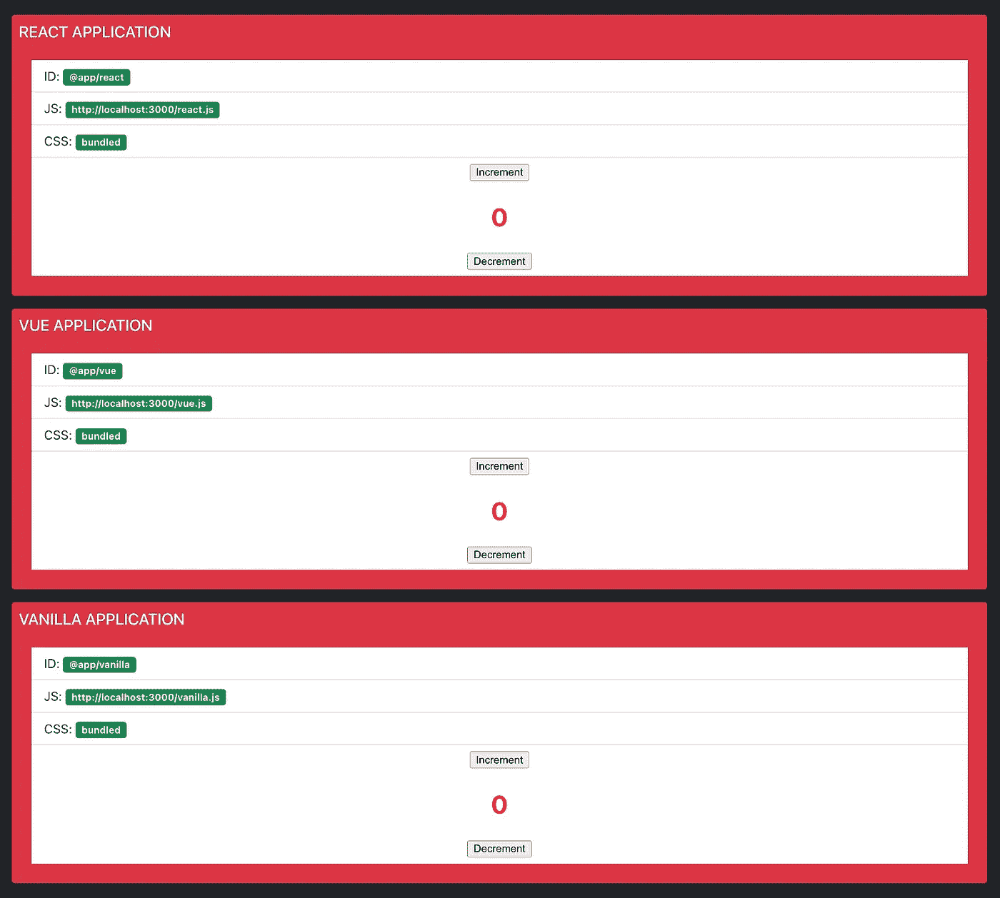

# 思维框架不可知——UI 工程

> 原文：<https://medium.com/walmartglobaltech/thinking-framework-agnostic-ui-engineering-fdb7892ed51b?source=collection_archive---------2----------------------->

作为 UI 技术的传播者，我们已经看到了 UI 领域的指数轨迹，一方面是新框架的不断引入，另一方面是 TC39 社区不断关注如何增强 Javascript 语言，以及我们如何继续关注内存占用较少的设备的性能。另一方面，Chrome 浏览器的 V8 引擎不断发布，以增强网络体验。

随着新框架的引入，UI 专家继续思考和解决的问题是

> 我们能做一些更通用的东西吗？我们可以开始思考框架不可知论吗？

虽然，当争论的时候，我同意 UI 框架已经使得成为主流成为可能，并且 web 现在已经成为对各种框架的依赖，比如 React，Angular，Vue 等等。整个前端社区都在不断升级，以学习各种框架的细节，并获得特定框架的专业知识。

虽然一个框架比另一个框架有一些优势，但是绝对没有一个框架在所有方面都是最好的。因此，没有这样明确的赢家，核心原因是敏捷性和业务需求以及几乎每小时都在开发的持续模块。这就是框架继续发展的速度！

我们认为 Angular 中的双向数据绑定性能不是很好，我们还认为 React 的协调算法带来了一些性能成本。

核心思想是考虑我们如何继续支持使用各种框架开发的应用程序，并使用本地浏览器功能托管它们。

***纳闷这有什么了不起的？*** 正确打包到 web 组件中的应用程序或实用程序组件可以轻松地以声明的方式嵌入到您的 HTML 中，web 组件将负责实例化自身。宿主应用程序的实现细节并不重要。重要的是，您的目标浏览器支持运行 web 组件所需的所有特性。这使得 web 组件与框架无关。

如果开发人员使用 Angular 或 Vue 创建一个组件，您可以轻松地在 React 应用程序中使用该组件，而无需任何特殊的逻辑。这在微前端的环境中变得很有趣，在微前端中，用户界面的各个部分可以由不同的团队开发，甚至可以使用不同的库或框架，但最终所有部分都被顺利地组合在一起，形成一个界面。

> ***那么我们怎么能走向框架不可知论呢？***

创建一个 shell，它能够托管由不同团队构建的组件，使用不同的技术栈并利用 DOM API。值得一提的是“微前端正在席卷网络”。

我们是继续用反应方式，角度方式，还是 Vue JS 方式？相反，拥有一个提供更通用的方法并将框架特性包装在组件中的架构怎么样？

增长代码绝对不是框架的问题，而是你的大脑的问题。你的大脑在概念和抽象中思考。因此，我们实际上应该从后向前构建我们的应用程序。

> ***你会看到什么好处？***

*   **重用**:一个组件只需制作一次，就可以跨不同的页面、应用或框架重用。
*   支持:一旦完全标准化，它可以在任何浏览器上工作，不需要额外的库。
*   **维护**:由于设计是模块化的，组件是独立的，所以更容易维护。
*   **封装**:同一个页面上的每个组件可能有不同的样式。我们不必担心元素身份的冲突。这是由于所谓的*阴影 DOM* 。
*   **可靠性**:代码不会跨 HTML 和 JS 文件传播，从而避免不一致。
*   **灵活性**:组件可以内联编写、导入甚至编译。
*   **可组合性**:组件可以使用或与其他组件接口。
*   **增加可测试性:**由于组件设计是模块化的，并且封装到一个单元中，所以组件代码的可测试性可以增加
*   **掌握特定框架**:不再需要不同框架中的特定专业领域，从而节省了就业市场中的入职专业技能。
*   所有权:组件开发人员将拥有架构部分
*   **支持组件的集成，内置于各种框架:**用特定框架编写的组件可以合并到你的应用中，而不必从头开始重新编写。

> ***关于网页组件***

如果您还不熟悉 web 组件，Mozilla Developer Network 上关于该主题的文章可能是开始了解它们的好地方。简而言之，Web 组件允许开发人员封装 HTML、JavaScript 和 CSS，将它们与宿主 HTML 文档隔离开来，并通过定制的脚本标签使其在 DOM 中易于重用。

Ten Thousand Feet High View of Web Components

让我们举一个简单的例子来详细理解底层概念，其中应用程序加载并嵌入了三个内容相同的 web 组件，但使用 Vue、React 和普通 JavaScript 实现。

让我们把这个例子分成如下三个部分:

1.  **定义 Web 组件**
2.  **加载 Web 组件**
3.  **使用 Web 组件**

# 定义 Web 组件

创建 web 组件只需要几个步骤:

*   创建自定义 HTML 元素。
*   对于作用域样式，使用[Shadow DOM](https://developer.mozilla.org/en-US/docs/Web/Web_Components/Using_shadow_DOM)——这是 web 组件封装背后的驱动力
*   在浏览器的自定义元素注册表中注册以前创建的元素，通过自定义 HTML 标记使其可用。

创建一个自定义元素就像创建一个扩展任何现有 HTML 元素的类一样简单。

在我们的基本 web 组件中，我们定义了两个属性:

*   connectedCallback —当我们在这里创建的定制元素被插入到 DOM 中时，这个函数被调用。我们使用该函数实例化元素的实际内容，在本例中为“欢迎使用 WEB 组件”。
*   disconnectedCallback —当自定义元素从 DOM 中删除时，调用此函数。我们使用这个函数来执行任何必要的清理操作，否则我们可能会以内存泄漏而告终。

让我们制作一个更通用的包装器来封装 React、Vue 或 Vanilla JS 组件，这允许我们做更多的事情。

让我们深入理解上面几行代码中发生了什么。

该函数接受一个具有三个属性的对象——mount、unmount 和 styles——并返回一个扩展浏览器 HTMLElement 的类

记住，我们讨论过创建一个定制的 web 组件，仅仅是通过扩展 HTMLElement 类，所以在我们更通用的包装器中，我们有一个函数返回一个扩展了 *HTMLELement* 的类。

参数列表的 mount 属性定义了当组件连接到 DOM 时应该发生什么。

在***connectedCallback***函数中我们使用了**this . attach shadow({ mode:" open " })；**将阴影 DOM 树附加到元素，以启用该元素的范围样式。如果您不想在自定义元素和宿主文档之间有冲突的样式规则，这一步很重要，这样可以避免 CSS 溢出到组件之外。或者，您可以编写仅应用于自定义元素的命名空间样式。使用 Shadow DOM 来实现这一点，使得元素可以在任何地方使用，而不必考虑冲突或覆盖 CSS 规则。

然后，我们创建一个包含样式标签中的样式和 DOM 节点的模板，DOM 节点是这个元素将要呈现的内容的挂载点。最后，模板被克隆并附加到元素 shadowRoot 节点，mount 函数用我们的挂载点元素调用。

同样地， ***disconnectedCallback 或 unmount 属性*** 决定了组件在 DOM 上的断开状态。当组件从 DOM 断开连接/卸载时，可以执行所有清理活动。这是我们的包装器避免浏览器内存泄漏的一个重要方面。

通过接受 mount 和 unmount 函数，上述实现完全是框架无关的，可以用来创建呈现任何东西的定制元素。这就是我们之前的示例应用程序创建呈现 React、Vue 和普通 JavaScript 代码的 web 组件所用的全部内容。

要创建呈现 React 应用程序的 web 组件，我们可以使用上面定义的函数，如下所示:

在上面的代码片段中，我们调用 createCustomElementWrapper 并定义 mount 和 unmount 函数来呈现和清理 React 应用程序。此外，当我们使用 Webpack 作为捆绑器时，我们使用 Webpack 的 [raw-loader](https://webpack.js.org/loaders/raw-loader/) 将我们的样式加载到一个字符串中，并将其传递给我们的函数。然后，我们在 customElement 的注册表中注册该元素，如下所示:

# 正在加载 Web 组件

Web 开发人员可以在他们的应用程序代码中直接创建和使用他们的 web 组件。然而，我们通常通过 scriptTags 静态或动态地加载这些通用组件。

让我们再深入一层，在应用程序中按需动态加载 web 组件。当处理延迟加载的模块时，这可能是一种有趣的方法，特别是当您希望根据用户动作动态显示组件时。

想象一下这样一种情况，多个团队处理多个小部件，比如仪表板，它们需要按需加载，每个都托管在不同的服务器上。

下面的代码片段，可以帮助你动态加载资产/风格和脚本。

让我们来解开上面的代码片段是怎么回事。因为我们需要保证我们只加载一次资产、脚本和样式资源，所以我们需要做一些检查。

考虑到这一点，一旦我们缝合了用户界面组合，我们将需要确保用户界面上的交互不会与布局中的其他视图发生冲突。

*   脚本以前加载过还是当前正在加载？这是通过检查 DOM 中是否已经存在与我们试图加载的脚本具有相同源的脚本标签来完成的。如果是，这意味着脚本要么正在加载，要么已经完成加载并已被执行。
*   为了确定脚本(如果存在于 DOM 中)是否已经完成加载，我们在脚本加载时在脚本元素上设置了一个自定义数据属性 data-script-loaded。每次我们试图加载一个脚本时，我们都会在脚本标签 load 事件上附加一个新的事件监听器，以了解它何时完成加载。这样，如果我们尝试加载同一个脚本两次，通过调用 loadAssets 两次创建的承诺将同时解析。

按照下面的代码片段，我们在示例应用程序中通过 React 挂钩使用 loadAssets 函数，以便在嵌入或使用 web 组件的地方提供关于加载或错误状态的信息。

上面的钩子还负责在失败的情况下重新尝试加载资产。

# 使用 Web 组件

现在让我们实际使用动态加载的 web 组件。为了达到预期的效果，我们假设对于加载到应用程序中的每个 web 组件，我们都知道相应资产的 HTML 标签和位置。这些信息可以由服务于我们的定制 web 组件的应用程序提供。在这里，我们可以利用后端服务的服务发现。

示例应用程序的以下实现使用 React，但也可以使用 Vue 或普通 JavaScript 重写。

我们利用上面的 useStaticAssets 钩子将 ui 组件嵌入到复合用户界面中。

这里有四点需要注意:

*   该组件接收 HTML 标签、资产路径和附加信息，作为我们的自定义元素的属性，这是与框架无关的。
*   它将资产路径传递给我们之前定义的钩子 useStaticAssets。
*   根据加载和错误状态，它呈现不同的内容。
*   它使用定制的 HTML 标记将 web 组件呈现给 DOM。

正如在[https://micro-frontends.org](https://micro-frontends.org)中所描述的，你可以使用 skeleton UIs 来显示 web 组件或 spinner 的加载状态，就像在示例应用程序中一样。浏览器缓存 web 组件的资产，因此加载时间只是第一次加载或缓存失效后的问题。

# 结束语

希望这篇文章有助于理解“思维框架不可知”的核心功能。这肯定不是使用包装器编写高阶组件的唯一方法，也不是框架不可知的唯一方法，但这是一个一步一步构建模块的良好起点。

Composition of components built using *react, vue & vanilla js* into a single interface.