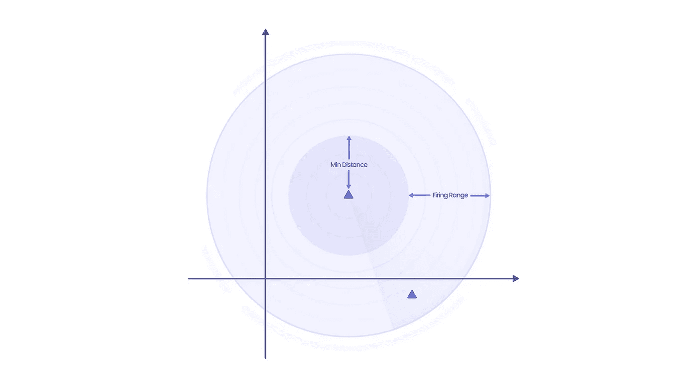
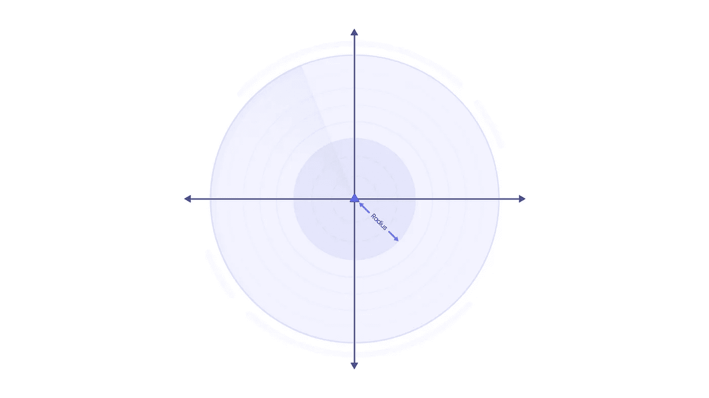

# 科特林的功能思维

> 原文：<https://blog.kotlin-academy.com/thinking-functionally-in-kotlin-1928c9995643?source=collection_archive---------0----------------------->


对于大多数应用程序开发人员来说，函数式编程很难理解。固执己见的框架告诉程序员如何构建应用程序，减少了实验的欲望。我经常听到人们说构建应用程序的正确方法是“这个”。推动变革的修补性质被抛在了后面。

移动应用程序开发人员就属于这种情况。iOS 和 Android SDK 是以某种方式构建的。开发人员通常认为这是构建应用程序的唯一方法。在本文中，我们将与科特林一起工作。任何使用 Java 的地方都可以使用 Kotlin。随着 Android 团队采用 Kotlin，许多 Android 开发人员使用它构建应用程序。这导致了用 Kotlin 进行 Java 编程的方式。

# 函数式编程

简而言之，函数式编程就是将参数应用于函数。函数是程序的基本构件。每个都接受参数并返回一个值。函数被组合在一起以构建程序。没有共享状态，因为给定一个输入，每个函数产生相同的输出。

Android 开发人员认为使用类作为构建块来构建应用程序。类维护状态，函数操纵和使用状态。这会产生副作用，导致不可预测的输出。加上线程，你就有了一个灾难的配方。

Android 应用程序需要在系统的边界内工作。这需要国家。Kotlin 支持面向对象(OO)和函数式(FP)风格。Android 开发者应该利用这一点。Android 应用程序中不涉及使用系统类的部分应该以功能性的方式构建。用 Kotlin 写得好的函数式程序是模块化的、可测试的和可预测的。

# 科特林的功能思维

功能性思维很难。它要求开发者将程序分解成小功能。然后组合这些函数来解决手头的问题。

解释这一点的最好方法是使用海军水面武器中心(NSWC)1993 年的问题声明。美国高级研究计划局(ARPA)与 NSWC 合作进行了这项实验。给出了一个问题陈述，并要求参与者提交不同语言的原型。这个问题，一个几何区域服务器是一个更大的系统——宙斯盾武器系统(AWS)的组成部分。

# 问题陈述



问题陈述最好用上图描述(想想战舰)。

*   三角形:这些代表友好的船只。
*   **最小距离**:超过这个距离射击不会造成自残。
*   **射程**:目标在射程内的距离。

问题归结为计算出一个点是否在射击范围内，并且不靠近友军船只。

# 必要的解决方案

```
data class Point (val xPosition: Double, val yPosition: Double)  // 1typealias Position = Point  // 2class Ship (val position: Position, val minDistance: Double, val range: Double) {  // 3

    fun inRange(target: Position, friendly: Position):Boolean { // 4
        return false
    }
}
```

1.  名为`Point` 的数据类，用于存储 x 和 y 坐标。
2.  可读性的一个`typealias`。
3.  代表战舰的类。
4.  确定`Position`是否在射程内的功能。

让我们修改`InRange` 函数，以满足问题陈述中的条件。

```
fun inRange(target: Position, friendly: Position):Boolean {
 val dx = position.xPosition - target.xPosition
 val dy = position.yPosition - target.yPosition

 val friendlyDx = friendly.xPosition - target.xPosition
 val friendlyDy = friendly.yPosition - target.yPosition

 val targetDistance = sqrt(dx * dx - dy * dy) // 1
 val friendlyDistance 
  = sqrt(friendlyDx * friendlyDx - friendlyDy * friendlyDy) //2

 return targetDistance < range 
   && targetDistance > minDistance 
      && friendlyDistance > minDistance //3
}
```

1.  `targetDistance`是船和目标之间的距离。
2.  `friendlyDistance` 是友船与目标之间的距离。
3.  这种情况检查目标是否在射程之内，并且没有靠近友方船只。

看看上面的代码，随着更多条件的加入，复杂性也增加了。很难阅读、维护和测试。

# 功能解决方案

在它的核心，我们正在寻找一个`Position`是否在射程之内。

```
typealias inRange = (Position) -> Boolean
```

上面是一个 lambda，它获取一个位置并返回一个布尔值。这个 lambda 将是我们的基本构建模块。

假设船在原点，让我们写一个函数来检查一个点是否在范围内。



```
fun circle(radius: Double): inRange {
    return { position ->
        sqrt(position.xPosition * position.xPosition 
             - position.yPosition * position.yPosition) 
         < radius
    }
}
```

该函数将半径作为参数，并返回一个 lambda。给定一个点，如果它在半径范围内，lambda 将返回 true/false。这个函数假设船总是在原点。要改变这一点，我们可以修改这个函数，或者创建另一个函数来完成转换。

```
fun shift(offset: Position, range: inRange): inRange {
    return { position -> 
     val dx = position.xPosition - offset.xPosition
        val dy = position.yPosition - offset.yPosition
        range(Position(dx, dy))
    }
}
```

这就是众所周知的变压器功能。它根据偏移量转换位置，并允许调用者对其应用任何`InRange` 函数。我们可以使用之前定义的`circle`函数。这是函数式编程的基本构件之一。位于位置 10，10 且圆半径为 20 的船将被描述为:

```
shift(Position(10, 10), circle(10))
```

我们可以定义更多的转换函数。以下是一些例子:

```
fun invert(circle: inRange): inRange {
    // not in circle
    return { position ->
        !circle(position)
    }
}fun intersection(circle1: inRange, circle2: inRange): inRange {
    // in both circle1 and circle 2
    return { position ->
        circle1(position) && circle2(position)
    }
}fun union(circle1: inRange, circle2: inRange): inRange {
    // either in circle1 or circle2
    return { position ->
        circle1(position) || circle2(position)
    }
}fun difference(circle1: inRange, circle2: inRange): inRange {
 // points in the first but not in the second
 return { position ->
        intersection(circle1, invert(circle2))
    }
}
```

回到我们最初的问题陈述，我们现在可以构建如下所示的解决方案:

```
fun inRange1(ownPosition: Position, 
             targetPosition: Position,
             friendlyPosition: Position,
             minDistance: Double,
             range: Double):Bool {
    val firingRange = difference(circle(minDistance), circle(range)) // 1
    val shiftedFiringRange = shift(ownPosition, firingRange) // 2
    val friendlyRange = shift(friendlyPosition, circle(minDistance)) // 3

    val safeFiringRange = difference(shifterFiringrange, friendlyRange) // 4
    return safeFiringRange(targetPosition)
}
```

上面的代码计算了船的射击范围和友船的最小安全范围。然后，它会找到两者之间的差异区域，并检查该区域中的点。这是编写相同解决方案的更具声明性的方法。一种使用函数而不使用状态的方法。你可能会说第一种方法更容易理解，但是当你在构建 android 应用程序时开始使用这些原则，测试的好处超过了任何争论。

# 从这里去哪里？

在本文中，我们提到了一些函数式编程的概念。我们采用问题陈述并在 Kotlin 中构建解决方案。

仅仅使用函数式编程来构建 Android 应用是不可能的。应用程序必须与系统中需要状态的不同组件进行交互。然而，应用程序中涉及业务逻辑的部分可以使用这些原则来构建。这允许您使用组合，避免副作用，并编写易于测试的代码。

注意:这个问题陈述的原始解决方案是由 [Paul Hudak 和 Mark Jones](https://www.cse.iitk.ac.in/users/karkare/oldcourses/2010/cs653/Papers/hudak_haskell_sw_prototype.pdf) 用 Haskell 编写的。

本博客最初发布于[**https://Wednesday . is**](https://wednesday.is/)了解更多关于周三工作的感受关注我们的 insta gram***|***[***推特***](https://twitter.com/wednesdaysol)***|***[***LinkedIn***](https://www.linkedin.com/company/wednesday-solutions/)

# 点击👏说“谢谢！”并帮助他人找到这篇文章。

了解卡帕头最新的重大新闻。学院，[订阅时事通讯](https://kotlin-academy.us17.list-manage.com/subscribe?u=5d3a48e1893758cb5be5c2919&id=d2ba84960a)，[观察 Twitter](https://twitter.com/ktdotacademy) 关注我们 Medium。

如果您需要 Kotlin 工作室，请查看我们如何帮助您: [kt.academy](https://kt.academy/) 。

[](https://kotlin-academy.us17.list-manage.com/subscribe?u=5d3a48e1893758cb5be5c2919&id=d2ba84960a)