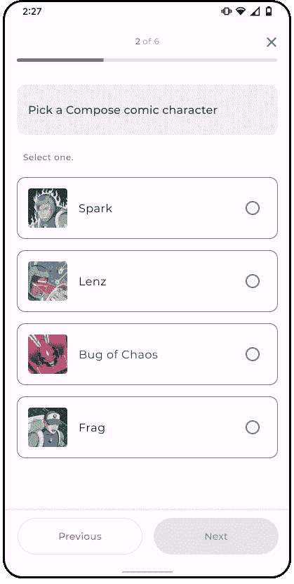

# 写作中的思考

> 原文：<https://medium.com/androiddevelopers/thinking-in-compose-c4ef150bb7cf?source=collection_archive---------0----------------------->


我们撰写基础系列的这篇文章详细介绍了在撰写中思考意味着什么。因为 Jetpack Compose 是一个声明性的 UI 框架，所以作为开发人员，你要描述你的 UI 应该显示什么 T2，而不是告诉 T3 如何显示 T4。

> 请务必在这里、YouTube 上或在 Twitter 上使用#MADCompose 对您的问题发表评论。我们将在 10 月 13 日的现场问答环节中回答您的问题。

你也可以把这篇文章作为一个疯狂的技能视频来看:

有了视图，你就可以一步一步地描述**如何**改变你的用户界面，从当前屏幕切换到你想要的屏幕。

例如，假设您希望在单击按钮时更新按钮的背景颜色。对于视图，您将首先从 XML 加载初始 UI。然后当用户点击按钮时，您将找到按钮并在其上调用`setColor`。对于任何用户交互和属性，都会重复这一过程，直到达到所需的屏幕状态。

有了 Compose，您不必再修补单个 UI 组件，直到得到您想要的屏幕(这很容易出错，稍后会详细介绍)。相反，你只需预先声明**你想要什么**，当屏幕需要改变时，你再次重新声明整个**你想要什么**。

另外，您不再用 XML 编写 ui。UI 可以完全用 Kotlin 描述，充分利用 Kotlin 结构。

通过描述**是什么，**而不是**如何**来构造 UI，这是 Compose 和 Views 之间的一个关键区别。这使得 Compose 使用起来更加直观。在本文中，我们将介绍这两者之间的区别，以及如何转变思维来使用 Compose 构建应用程序。

# 构建带有视图的屏幕

为了理解如何在 Compose 中构建应用程序，我们先来看看如何在 Views 中构建屏幕。

下面是从 Github 上可用的一个撰写示例应用程序 [Jetsurvey](https://github.com/android/compose-samples) 中截取的一个屏幕。屏幕显示用户必须回答的单项选择问题。一旦他们做出选择，他们就可以进入下一个问题。


为了简化，让我们看看如何在这个屏幕中构建一个组件，即调查中的一个答案。


一个答案由水平排列的图像、一些文本和一个单选按钮组成。在视图中，这些元素可以用 XML 定义，如下所示:

```
<!-- survey_answer.xml --><LinearLayout android:orientation="horizontal" > <ImageView android:id="@+id/answer_image" ... /> <TextView android:id="@+id/answer_text" ... /> <RadioButton android:id="@+id/answer_radio_button" ... /></LinearLayout>
```

为了用 UI 状态填充视图，我们必须使用`findViewById`在片段或活动中获取对 Kotlin 或 Java 中每个视图的引用。获得引用后，我们将通过调用 setter 函数如`setImage`和`setText`来改变每个视图，以显示所需的 UI 状态。换句话说，在这一步中，我们通过单独修改每个视图或者描述**我们应该如何**改变状态，将初始状态更新为我们想要的 UI 状态。这就是我们之前讨论过的**和**的来源。

如果用户选择了一个答案(即状态发生了变化)，该视图在视觉上应该显示为被选中。在我们的例子中，当用户选择问题的答案时，我们也希望“下一步”按钮被启用。因此，如果我们希望其他视图作为被选择的另一个视图的副作用而更新，我们必须为那个视图设置一个监听器，并显式地改变其他受影响的视图。



然而，当状态改变时必须手动更新视图是容易出错的。您可能会忘记用依赖状态更新视图，当多个更新以意想不到的方式冲突时，也很容易创建非法状态。

例如，如果你的应用程序经历了一次配置更改，比如屏幕旋转，在这个过程中，你可能会正确地记住用户的选择，但你可能会忘记重新启用“下一步”按钮。

在应用程序的整个生命周期中同步状态变化是使用视图时经常遇到的挑战。随着应用程序中视图和依赖状态数量的增加，这个问题也变得更加复杂。这是一个可以解决的问题，但它是一个常见的错误来源。

# 用 Compose 构建屏幕

让我们看看如何在 Compose 中构建相同的组件。

在 Compose 中，可以用类似的方式构造 UI:在水平排列的容器中，包含图像、文本和单选按钮。

然而，不是用 XML 编写，而是用 Kotlin 直接定义元素。

```
// SurveyAnswer.kt@Composable
fun SurveyAnswer(answer: Answer) {
  Row {
    Image(answer.image)
    Text(answer.text)
    RadioButton(false, onClick = { /* … */ })
  }
}
```

> 有了 Compose，您不再需要在 XML 和 Kotlin 之间切换，因为 UI 已经在 Kotlin 中声明了。

在 Compose 中，UI 元素是函数，而不是对象。这意味着您不能找到对它们的引用并在以后调用方法来改变它们。

相反，UI 元素完全由您传递的状态或参数控制。这里我们只是描述一下我们的用户界面应该是什么样子。不呼叫`findViewById`、`setImage`或`setText`。我们的 UI 在我们调用的函数中被简洁地描述了。

为了显示我们想要的 UI 状态，我们将答案的属性传递给了`Image`函数和`Text`函数，现在， **false** 被传递给了`RadioButton`函数，显示为未选中。

这里与视图的一个非常重要的区别是，点击这个答案不会将项目显示为选中。这是因为我们总是向`RadioButton`提供 **false** ，这意味着无论用户如何交互，它都将保持未选中状态(不要担心，我们会很快修复这个问题)。

> 与在视图中不同，RadioButton 并不拥有自己的状态，该状态会因用户事件而自动更改，但是，RadioButton 的状态是由提供给它的值控制的。

这就是我们所说的‘什么不怎么样’。我们通过为 UI 函数提供必要的状态来声明我们的 UI 应该是什么样子。如果我们的 UI 中的任何元素发生变化，我们再次调用整个元素，只是传递一个新的状态，而不是我们手动修补单个部分直到获得我们想要的新状态的视图系统。

# 撰写中的状态和事件

如果状态控制 UI，我们如何着手更新状态来更新 UI 呢？在作曲中，这是通过事件来完成的。当用户与 UI 元素交互时，UI 发出一个事件，比如`onClick`，然后事件处理程序可以决定 UI 的状态是否应该改变。


如果 UI 状态改变，依赖于该状态的功能或 UI 元素将被重新执行。这个在状态改变时重新生成用户界面的过程被称为**重组**。将状态转换成 UI 的过程，以及导致 UI 重新生成的状态变化，是 Compose 作为 UI 框架工作的核心。


# 重新组合用户界面元素

在上面的可组合的`SurveyAnswer`中，`RadioButton`即使与它交互也保持未选中状态。让我们更新我们的实现，使其在点击时切换选择状态。

首先，让我们定义一个名为`selected`的布尔变量，并将其传递给`RadioButton`函数参数。同样，在`onClick`事件处理程序中，让我们将`selected`变量的值改为与其当前值相反的值。这样，当单击它时，它会切换选择状态。有了这个改变，我们现在应该看到`RadioButton`在点击时被切换。

```
// SurveyAnswer.kt@Composable
fun SurveyAnswer(answer: Answer) {
  Row {
    /* ... */
    var selected: Boolean = // ...
    RadioButton(selected, onClick = {
      selected = !selected
    })
  }
}
```

请注意，在生产应用程序中，`RadioButton`的状态应该来自于`Answer`对象，而不是持有该信息的`SurveyAnswer`。这样做纯粹是出于教育目的，展示国家如何运作。

此外，请注意，我省略了`selected`变量的实现，因为要实现它，我们必须使用一个特殊的 [State](https://developer.android.com/jetpack/compose/state) 对象，我们将在下一篇文章中介绍。

# 摘要

总结一下，在写作中思考我们:

*   声明**我们希望我们的 UI 包含什么**，但是我们不会一步一步地告诉它**如何**去做
*   使用 Kotlin 函数来表示我们的 UI 元素
*   将状态传递给控件用户界面
*   使用事件来更新状态，进而更新我们的用户界面

这是关于如何在 Compose 中思考的一个非常高层次的概述，但是还有很多东西需要学习。

例如:这些 Kotlin 函数是如何工作的？国家是什么样子的？Compose 中提供了哪些不同的组件？我们将在接下来的剧集中回答所有这些问题。

如果您想提前了解，可以查看以下资源:

*   [一个简单的可组合函数](https://developer.android.com/jetpack/compose/mental-model#simple-example)
*   [状态和 Jetpack 组合](https://developer.android.com/jetpack/compose/state)
*   [Jetpack 撰写基础代码实验室](https://developer.android.com/codelabs/jetpack-compose-basics)
*   [合成样本](http://goo.gle/compose-samples)

有什么问题吗？请在下面留下评论或使用 Twitter 上的#MADCompose 标签，我们将在 10 月 13 日的直播问答中回答您的问题。敬请期待！

[数据绑定库](https://developer.android.com/topic/libraries/data-binding)也是编写带有视图的声明性代码的一个选项，可以帮助避免文章中提到的状态同步问题。然而，Compose 避免了完全使用 XML。