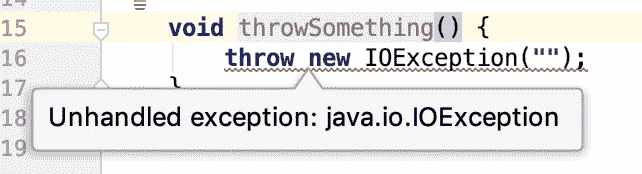
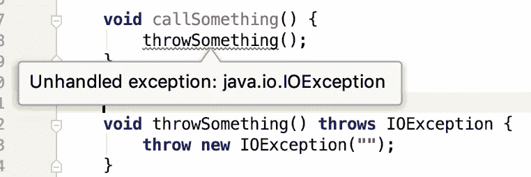
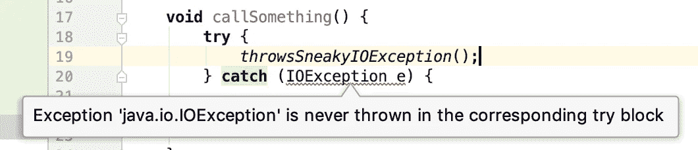

# 那些卑鄙的科特林例外

> 原文：<https://medium.com/google-developer-experts/those-sneaky-kotlin-exceptions-597c93d29358?source=collection_archive---------0----------------------->


[https://www.flickr.com/photos/crozefeet/23244411091](https://www.flickr.com/photos/crozefeet/23244411091/in/photolist-Bq2FAt-EvQ5r-5iF9gD-epsV-JbwkM-9qmVns-2kSJ77-psbYce-7daoGd-7ckNMr-4S3ZFB-Jxj6E-bmJHyS-bgpdka-VrfpbE-3bUWvq-9wWJRJ-n5VS1B-2enRYgX-UUQoo9-nMTuvb-RUuAZk-21EEXUY-qkDMfX-9PskjK-7MVBba-6iAVA7-W1PfMb-872Ak5-8HwZuC-ahCKyW-267H5sN-idp64g-4Cshq-q4q5vV-Zbxiuw-WgMEpC-hfwQbm-fYh9Uu-7GABoz-WnXjSY-5vSebs-47aHyK-J6HmKK-RTjWSr-sx4gKt-3rpaLa-bosbmK-9iJnEz-cCgmD)

如果您正在使用 Kotlin 进行开发，您可能已经知道与 Java 不同，不支持检查异常。许多文章支持和反对这两种方法，所以我们不在这里讨论这个。相反，当在 Java 和 Kotlin 之间转换时，我想把重点放在互操作性上。

# 古老的 Java 方式

当您从 Java 抛出异常时，编译器会强制您声明:



同样，当您想调用一个抛出的方法时，编译器会强制您处理:



# 但是在科特林

而科特林却不知道这个概念。但是随着 Java 和 Kotlin 的顺利合作，这是如何实现的呢？

这里要注意的重要事实是**检查异常是 Java 语言的一部分，而不是 JVM** ！在字节码中，您可以无限制地抛出任何异常！

其他 JVM 语言也利用了这一点，例如 Groovy 也允许抛出异常而不声明它们。

当我们查看抛出异常的 Kotlin 方法的反编译字节代码时，它可能看起来像这样:

```
public final void throwSomething() {
   throw (Throwable)(new IOException());
}
```

所以 Kotlin 编译器将异常隐藏在`Throwable`后面，它是检查和未检查异常都实现的接口。

# 实际上…

你可以用 Java 做类似的事情。它被称为[鬼祟的投掷](https://www.baeldung.com/java-sneaky-throws):

```
public static <E extends Throwable> void sneakyThrow(Throwable e) throws E {
    throw (E) e;
}

private static void throwsSneakyIOException() {
    *sneakyThrow*(new IOException("sneaky"));
}
```

# 问题是

偷偷抛出有一个问题(Kotlin 抛出的异常也是如此):如果你想捕捉异常，Java 编译器不允许你直接捕捉那个(检查过的)类型:



# 解决方案

Kotlin 有一个简单的方法来解决这个问题。使用`@Throws`注释！

```
**@Throws(IOException::class)**
fun throwSomething() {
   throw IOException("")
}
```

这将被翻译成字节码，就像方法上的 Java `throws`关键字一样。

因此，如果您的代码可能是从 Java 中调用的，那么您应该添加它，以利用这两种语言的优势！

# 但是等等…还有更多！

你还会遇到其他问题。例如，如果您使用的是用 Java 编写的库 [Mockito](https://github.com/mockito/mockito) ，并且您模仿了一个抛出类似以下内容的 Kotlin 类:

```
`when`(mock.doSomething()).thenThrow(IOException(**""**))
```

您最终可能会看到如下错误:

> org . mock ITO . exceptions . base . mock ITO exception:
> 选中的异常对此方法无效！

使用`Answer`很容易解决这个问题

```
doAnswer{ 
    throw IOException("")
}.`when`(mock).doSomething()
```

# TL；速度三角形定位法(dead reckoning)

即使 Kotlin 和 Java 能够很好地协同工作，有时了解另一面也很重要，正如这些隐藏的异常陷阱所显示的那样。

所以要小心，好好表现！