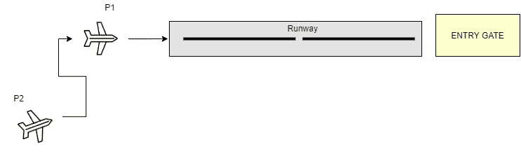
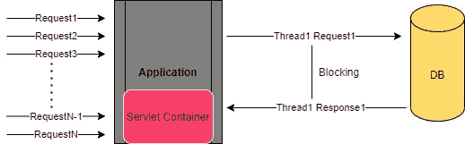
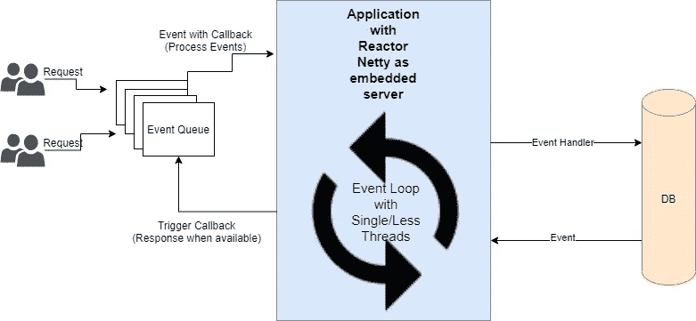

# 为什么反应？每个请求的线程与反应式编程模型(Eventloop)

> 原文：<https://medium.com/walmartglobaltech/thread-per-request-vs-7bf1f22f590?source=collection_archive---------2----------------------->

要理解反应式编程解决的是什么问题，我们先来看看到底是什么问题。系好安全带，如果你是新来的，可能会有一些理解上的混乱，但我会尽最大努力安全着陆。

## **每个请求的线程**

Sync and Blocking

现在考虑上图中的例子，有两架飞机，只有一架飞机失控。因此，在第一架飞机 P1 安全着陆后，另一架飞机 P2 将尝试着陆。这意味着 P2 的飞机将被禁止降落，除非 P1 完成降落并为 P2 开放跑道。也就是说，单个线程正在为请求提供服务，其他请求在队列中，如果该线程进一步执行 IO 操作，它就只是等待，不会产生任何效果。一旦它完成了它的任务，它就为其他的请求服务。这就是同步和阻塞呼叫。

现在让我们来理解每个请求的线程模型，考虑一个传统的 spring web 应用程序，它带有部署在 servlet 容器上的 spring mvc，比如 Tomcat。

Traditional Thread Per Request Model

假设您正在 Tomcat 上运行的应用程序中销售电子产品(如上所述)。您发现在正常情况下，应用程序的流量大约是每秒 500 个请求。假设您已经将 Tomcat 的线程池配置为 200，应用程序的平均响应时间为 200 毫秒。我们粗略的计算表明，app 每秒可以处理 1k 左右的请求，这足以每秒处理 500 个请求(我们的平均流量)。但天空并不总是蓝色的，你的应用程序在节日期间开始失去请求，因为它被巨大的用户请求淹没了。

上述场景中到底发生了什么？我们有一个专用的线程池来处理请求，其中一个线程将被分配给每个传入的请求，它将管理该请求的生命周期。所以我们的应用程序只能处理 N 个并发请求，其中 N 是线程池的大小。你可能会争论为什么我们不能产生更多的线程和增加并发性。这听起来也是正确的，事实上在上面的例子中有很多扩展的范围，这是一个单独的讨论话题。

一切都是有代价的，这就是上述方法的问题，产生更多的线程将导致更高的内存消耗，在某个时候我们的应用程序可能会因内存不足而崩溃。

怎么会？在 JDK 8 中，每次 JVM 创建一个线程时，操作系统都会分配一些本机内存来保存线程的堆栈，并保留一些默认的线程堆栈大小，该大小随 JVM、操作系统和环境变量而变化，线程的创建会向进程提交更多内存，直到线程退出。线程堆栈一旦创建就被完全分配(即提交，而不仅仅是保留)。现在，如果应用程序产生大量线程，它会消耗大量内存，否则这些内存会被应用程序或操作系统使用，这可能会使系统耗尽内存。显然有一个优化的范围，比如通过使用 *-Xss* 选项运行服务器来减少堆栈大小，但是确实存在更好的解决方案。

既然我们知道产生更多的线程不是一个好的解决方案，让我们回到我们的每请求线程模型。除了较高的内存消耗之外，还涉及到其他复杂性，如果处理特定请求的线程正在执行一些 IO 操作(如 DB 调用),那么它可能会进入阻塞和等待状态，这也是一种浪费。更高的响应时间，如果我们有额外的网络调用或 IO 操作层。还可能发生这样的情况，我们的服务 A 向服务 B 请求最近几个月的销售数据，结果数据非常大，服务 B 将这个巨大的数据返回给服务 A，它可能会独占服务 A

## **我们还能做些什么来使上面的系统高效？**

Java 提供了两种异步编程模型:

**回调:**不返回值但有回调参数(lambda 或匿名类)的异步方法，当结果可用时(或者当阻塞调用完成时)调用该回调参数。回调很难编写、阅读和维护，这就是为什么它被称为 ***回调地狱*** 。
考虑一个例子:在 UI 上显示来自用户的前 5 个最喜欢的项目，或者如果没有最喜欢的项目，则给出建议。我们可以假设涉及三个服务:第一个提供 favoriteIDs，第二个提供 favorite 细节，第三个提供建议。

回调接口有两个异步方法，一个在成功时调用，另一个在出错时调用(第 1 行)。第一个服务使用 favoriteID 列表调用其回调(第 2 行)，如果列表为空，我们将转到建议服务(第 4 行)。建议服务将 favoriteID 列表提供给第二个回调(第 5 行)。由于涉及到 UI，我们需要确保消费代码在 UI 线程中运行(第 6 行)。我们只需要 top 5，所以我们将使用 java 流只处理 top 5 并显示在 UI 上(第 7 到 9 行)。如果出现错误，我们将显示一个弹出窗口(第 14 行)。

现在假设 *getfavorite* 服务返回了一个有效列表而不是空列表(回到第 1 行)。我们需要转到 favorite 服务来获得详细的对象(第 18 到 20 行)。我们只需要显示前 5 名，所以同样的设置与另一个回调。代码太多，很难理解。

让我们看看与回调示例等价的反应器代码:

我认为代码是不言自明的，这就是美妙之处。获取 favoriteID 列表，获取每个 ID 的详细信息，如果列表为空，给出建议，取前 5 名并在 UI 线程上发布，要么该过程成功，要么将发生错误，无论是什么，都将调用相应的订阅者的方法。

**Futures:** 立即返回 Future < T >的异步方法。值 T 将由异步进程计算，但 Future 对象包装对值 T 的访问。尽管该值不会立即可用，但可以轮询该对象，直到它可用。
未来对象比回调更好，在 Java 8 中被 **CompletableFuture** 进一步改进。但是未来也有一些问题:

*   如果您知道 Future 是如何工作的，那么您就会知道当调用 Future 对象的 *get()* 方法时，很容易出现另一种阻塞情况。
*   不支持惰性计算(直到需要它的值时才进行计算)
*   缺乏对多值和高级错误处理的支持。

考虑一个例子，我们有一个 tweet id 的列表，我们想获取这些 tweet 的作者和该特定 tweet 的点赞数，以异步方式将它们两两组合。下面是使用 CompletableFuture 的代码

在第 1 行，我们得到了拥有 tweetIDs 的列表的未来。然后，我们继续对第 3 行中的列表进行异步处理，对于列表中的每一项，异步获取该 tweet 的作者姓名和赞数。组合结果，现在我们有了代表所有组合任务的未来列表(第 11 行)，要执行这些任务，我们必须将列表转换为数组(第 12 行)。现在我们将数组交给*CompletableFuture . allOf()*，它输出当其中的所有任务完成时完成的未来(第 14 行)， *allOf()* 返回*CompletableFuture<Void>，*，因此我们使用 *join()* 对期货收集结果列表进行一次迭代，这并不阻塞，因为我们已经有完成的期货。一旦整个管道被触发，我们等待它被处理并返回断言的结果列表。

由于 reactor 有更多的组合运算符，上述内容可以在反应式编程中简化，如下所示:

被 Flux 和 Mono 吓到了，不要担心，现在就假设他们是 Future 的高级版本，他们基本上是 project reactor 的两个发行商，Mono 发射 0 或 1 个元素，Flux 发射 1 到 N 个元素。我将在后面的帖子中详细介绍。我们来理解一下上面写的代码。

我们从异步提供的 tweetIDs 序列开始，作为 *Flux < String >* (第 1 行)。剩余的过程保持不变，比如获取作者姓名和喜欢的数量，然后使用 zipWith 运算符异步组合。在实际的场景中，比如在生产中，我们会继续异步地使用 Flux，通过进一步组合它和订阅它。大多数情况下，我们将结果返回为 Mono，但是出于**测试**的目的，我们阻塞了(第 14 行)，因此一旦过程结束，我们将返回值的聚合列表。

我们看到了回调、Future 和 CompletableFuture 如何带来更多的异步性，但是在某个时候它们可能会被阻塞，比如 *Future.get()* 和*CompletableFuture<List<Result>>*将需要等待整个集合的构建并随时可用 ***(异步和阻塞)*** ，而且 CompletableFuture 没有无限值的句柄。

**流应用编程接口**是在 Java 9 中引入的，但这更多的是一个反应流的契约，没有实现可以作为 JRE 的一部分。

Event Loop Model

这就是反应式编程的拯救之处，它通过以下方法解决了上面提到的所有问题:

*   不要使用每个请求一个线程的模型，而是用少量的线程来处理流量，即 **Eventloops** 。
*   在等待 IO 操作完成时防止线程阻塞，即**异步和非阻塞 IO (NIO)**
*   让消费者(此处为应用程序)能够向生产者(此处为 DB 或 BE)发出排放率过高的信号，即**背压**支持**推拉**混合数据流模型，这意味着应用程序可以请求数据(拉)或在无界模式下工作(发布者推送数据)。

Pheww..我想那太多了。我们现在有了很好的基地，我希望登陆成功。

既然我们已经清楚了基础，我将在下一篇文章中从反应流规范开始。此外，我将在以后的文章中更详细地介绍 Eventloop 模型的并发性。

# 参考文献:

*   [https://projectreactor.io/](https://projectreactor.io/)
*   [https://www.reactivemanifesto.org/](https://www.reactivemanifesto.org/)