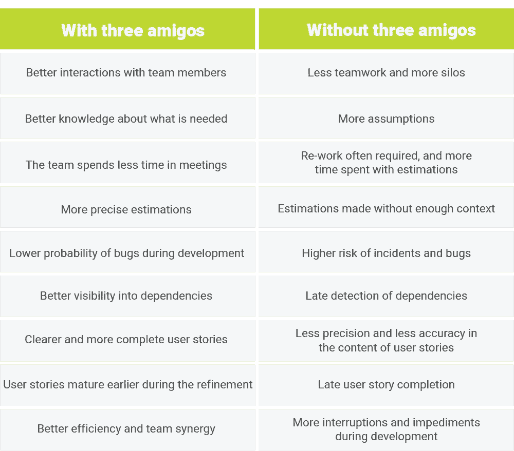

# 三个朋友和协作用户故事写作 2.0

> 原文：<https://medium.com/globant/three-amigos-and-collaborative-user-story-writing-2-0-63d9bea51828?source=collection_archive---------0----------------------->

*Published on 13 Nov 2020 | Authored By — Matilde Losada, Hilder Ospina, Edwin Güiza*

每个熟悉敏捷开发的人都会熟悉用户故事。当我们第一次碰到用户故事时，我们认为它们应该浓缩关于一个特性的所有信息，从而帮助开发过程。但是我们用得越多，就越意识到创建有效用户故事的过程比我们想象的要复杂。问题浮现在脑海中——比如*，谁负责做这件事？如果我们使用用户故事作为文档，会有风险吗？*在本文中，我们将深入探讨构成用户故事基础的基本概念，并详细介绍我们发现非常有用的“三个朋友”方法。

# 关于用户故事的三个重要概念

用户故事首先是团队成员之间产生合作的工具。其次，它们在消费者和开发者之间建立了一个纽带，使得高度以客户为中心的产品的开发成为可能。第三，他们强调交付的价值。

因此，用户故事的目的是阐明一项工作如何将价值传递给客户。像任何故事一样，它们应该很容易记住。用户故事是一个简短的陈述，它描述了系统必须为用户执行的一些事情，但是真正重要的是用户故事是对团队必须举行的未来对话的提醒。

# “三个朋友”战略

围绕用户故事进行有价值对话的一种方法是“三个朋友”策略。这种方法指出，在编写用户故事时，应该考虑三个方面:业务、开发和测试。通常，三个人，每个区域一个，参加这个会议，但是，如果需要，更多的人可以参加(例如，建筑师，UX 设计师)。在本次会议中:

*   **业务涉众**为每个用户故事及其商业价值提供了一个高层次的视角。
*   **质量保证团队的成员**讨论已经为这些业务需求创建的测试用例，并提供关于验收标准的见解。
*   **开发人员**与团队讨论架构、底层设计，并提供依赖关系、技术需求和假设的大图。

参与此过程的人员取决于项目或产品环境。任何具有业务、开发或测试知识的角色都可以参与，但是每个角度至少需要一个人。

在每个“三个朋友”会议中，每个故事都在非正式对话中进行了分析，以提供对将要交付的内容的共同愿景，从而确保它是团队**的声音**而不仅仅是一种观点。

# 三友方法的最佳实践

根据我们的经验，在使用这种方法时，我们总结了以下最佳实践。

**开始前**

*   到开会的时候，业务分析师应该已经写好了高层次的用户故事，以便有材料可以使用。
*   有一个“准备好”的定义来检查故事的质量。
*   设定会议时间以确保有效和及时的对话。每个故事 10 到 15 分钟的限制就足够了。
*   尝试让资深团队成员参与三个朋友会议，以解决故事中最基本的问题。
*   对于每个会话，应该有不同的参与者。通过轮流参与，您可以让整个团队作为参与者和演示者参与进来。轮换取决于团队的成熟度，不适用于业务代表(产品负责人/业务分析师)。

**会议期间**

*   业务代表应该介绍这个故事。
*   QA 成员应该展示测试用例。
*   用户故事通过对话得到了增强，就像测试用例一样。
*   检查可能的故事分割选项。
*   团队应该验证依赖项和先决条件。
*   假设不应该存在。如果有疑问，应该在评估会议之前澄清。我们建议用开放式问题重新考虑和提炼这些故事。

**会后**

*   提炼将用于解决团队的问题。然而，通过三个朋友的会议，你应该已经解决了大部分的问题，因此很容易为 sprint 计划准备好故事。
*   将与依赖项和先决条件相关的操作项分配给特定成员进行监控。
*   一个好的做法是让三个朋友会议的与会者在评估会议期间与团队的其他成员分享这组故事。这确保了每个人的参与，避免了产品负责人或业务分析师陈述所有的故事。

# 谁应该参加三个朋友会议？

这是最有趣的话题之一，因为从一般经验来看，这些会议不应该仅仅是为业务分析师、开发人员或质量分析师准备的。我们的建议是，能够为会议增加价值的每个人，以及那些想要加入的人，都可以自由地这样做，特别是如果他们的角色可以为用户故事提供信息的话。

尽管三个朋友会议对所有团队成员开放，但它不同于细化会议。这是因为参加三个朋友是可选的，精神是不同的。细化会议应该与团队中的每个人一起召开，不应该被三个朋友会议所取代。

重要的是要记住，信息应该尽可能清晰准确。当一个问题出现，而三个朋友与会者无法回答时，通常最好向主题专家咨询。

# 做这件事的最佳时间是什么时候？

我们建议在精化和评估会议之前安排这些会议。请记住，这不应该影响 sprint 中的其他活动，比如演示/回顾和回顾会议。

# 但是为什么呢？真正的好处是什么？

通过使用三个朋友，团队确保协作需求、协作测试场景和共识。它降低了业务团队将不完整的特性推向开发的风险。“三个朋友”有助于确保每个用户故事都符合就绪(DoR)标准的定义。

故事的重要之处在于围绕故事和故事中的人物展开的对话。这些讨论比工具或文字更重要。有时这些讨论导致团队将用户故事分成更小的用户故事(用户故事演进)。与此同时，这些会议的另一个好处是，它们有助于降低出现错误的可能性及其相关成本——众所周知，越早发现错误，解决问题的成本就越低。

# 细化和计划过程会发生什么？

首先也是最重要的，让我们记住，一个用户故事在满足就绪标准的定义之前，是不能进行开发的。因此，三个朋友会议的成员应该只关注符合这些标准的故事。

练习三个朋友可以让我们有更有效的会议。虽然细化会议期间的想法是与团队中的每个人围绕用户故事进行对话，但在三个朋友会议期间已经讨论了细节并解决了一些问题，这将有助于团队更好地了解故事，并在评估期间更有效。

同样地，规划会议应该对整个团队来说变得更加流畅，因为对所有用户故事的理解水平将会提高，团队中将会有更好的协作。这也有助于决策制定，使团队更好地定义下一个 sprint 要遵循的策略。

除了细化和计划阶段，三次 amigos 会议的效果会影响用户故事的最后阶段，最重要的是，影响产品本身。例如，在评审会议期间，根据 done 的定义，所有场景都应该已经被覆盖和完成，包括功能方面、验收标准和测试，因为它们在三个 amigos 和评估会议期间被及时识别。

然后，所有这些方面都由产品负责人和团队的其他成员批准，这些成员完全了解他们为完成这个工作软件的定义所做的一切，而不管每个团队成员的专业知识如何。

# 最后

“三个朋友”是一种方法，其中三种观点汇集在一起，以达到更高质量的用户故事。它使团队能够在开发过程之前、期间和之后检查业务、测试和技术方面。

为了提高用户故事的质量和改进过程，我们建议首先召开三个朋友会议。这个过程通过让不同的角色拥有用户故事的所有权，有助于增强团队协作。

尽管我们在这篇文章中强调的许多观点看起来非常理论化，但它们很容易实现。当然，通过这些实践获得好的结果将依赖于团队的协同作用、成熟度和对持续改进计划的开放性。