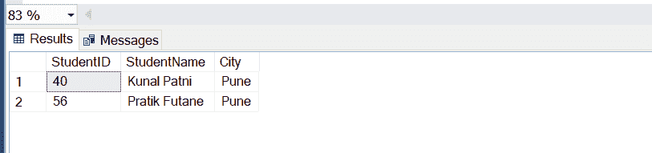
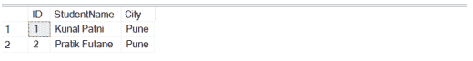
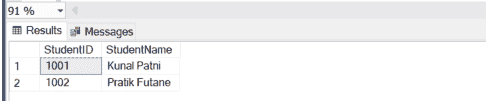
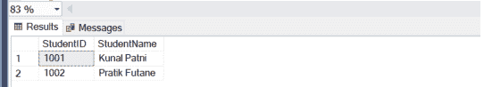
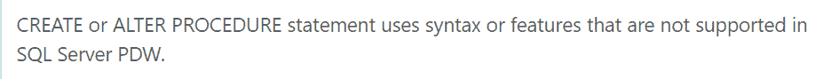

# 从 Azure SQL 迁移到 Azure Synapse SQL 时的三个兼容性问题

> 原文：<https://medium.com/globant/three-compatibility-problems-when-migrating-from-azure-sql-to-azure-synapse-sql-cd27cd381988?source=collection_archive---------0----------------------->


Making code more compatible.

在本文中，我们将看到从 [Azure SQL 数据库](https://docs.microsoft.com/en-us/azure/azure-sql/database/sql-database-paas-overview)迁移到 [Azure Synapse SQL](https://docs.microsoft.com/en-us/azure/synapse-analytics/sql/overview-architecture) 时的一些关键代码差异和最佳可能解决方案，其中包括实际例子和场景。在两个数据库上并行工作，我们可能会面临一些挑战，因为对象可能不被原样支持，或者功能可能略有不同。写这篇文章是考虑到你在 Azure SQL 和 Azure Synapse SQL 方面有初级到中级的专业水平，并且你有 Azure 订阅。

**问题陈述**

在处理解决方案时，我们经常看到 Azure SQL 数据库和 Azure Synapse SQL 的用例最适合作为数据库/数据源。即使迁移的大部分细节没有痛苦，也有一些可能的问题。下一部分涵盖了以下功能的示例，展示了 Azure Synapse SQL 中支持的一些关键代码差异和最佳解决方案。

1.  标识列
2.  表格变量
3.  将 NULL 设置为存储过程中的默认值

**身份列差异**

[标识列](https://docs.microsoft.com/en-us/sql/t-sql/functions/identity-function-transact-sql?view=sql-server-ver15)用于唯一标识表中的行。表的标识列是其值自动增加的列。标识列中的值由服务器创建。用户通常不能在标识列中插入值。

**Azure SQL**

```
IF OBJECT_ID(‘tempdb..#Student’) IS NOT NULL DROP TABLE #Student
CREATE TABLE #Student(
 StudentID INT IDENTITY(1,1),
 StudentName VARCHAR(30),
 City VARCHAR(10)
 )
INSERT INTO #Student (StudentName, City) VALUES (‘Kunal Patni’, ‘Pune’);
INSERT INTO #Student (StudentName, City) VALUES (‘Pratik Futane’, ‘Pune’);SELECT * FROM #Student ORDER BY StudentName ASC
```


**Azure Synapse SQL**

[Azure Synapse Analytics](https://docs.microsoft.com/en-us/azure/synapse-analytics/sql-data-warehouse/sql-data-warehouse-tables-identity)中的 IDENTITY 列不保证值将按顺序生成，并且由于分布式架构以及用户在“SET IDENTITY_INSERT ON”的情况下显式插入重复值，它将是唯一的。

在 Azure Synapse SQL 中运行类似的代码会产生不同的结果。



为了解决这个问题，我们可以使用像 ROW_NUMBER 这样的分析函数为每个值生成行号。这将为我们提供序列中唯一的行号。

这里有一个例子。

```
SELECT ROW_NUMBER() OVER(ORDER BY StudentName ASC) AS ID,
 StudentName,
 City
FROM #Student
```



因此，这解释了 Azure SQL 和 Azure Synapse SQL 中的标识列差异。

**表格变量差异**

## **Azure SQL**

是一种特殊的数据类型，可用于存储类似于[临时表](https://docs.microsoft.com/en-us/sql/t-sql/statements/create-table-transact-sql?view=sql-server-ver15)的临时数据。table 变量的语法类似于使用 CREATE TABLE 语句定义新表:

```
DECLARE @Student TABLE(
 StudentID INT,
 StudentName VARCHAR(30)
 );INSERT INTO @Student VALUES (1001, ‘Kunal Patni’);
INSERT INTO @Student VALUES (1002, ‘Pratik Futane’);SELECT * FROM @Student
```



**Azure Synapse SQL**

Synapse 不支持表格变量。相反，我们可以使用[临时表](https://docs.microsoft.com/en-us/azure/synapse-analytics/sql-data-warehouse/sql-data-warehouse-tables-temporary)，这与它在 Azure SQL 中的工作方式非常相似。

下面是一个例子:

```
IF OBJECT_ID(‘tempdb..#Student’) IS NOT NULL DROP TABLE #Student
CREATE TABLE #Student(
 StudentID INT,
 StudentName VARCHAR(30)
 )INSERT INTO #Student VALUES (1001, ‘Kunal Patni’);
INSERT INTO #Student VALUES (1002, ‘Pratik Futane’);SELECT * FROM #Student
```



因此，这解释了 Azure SQL 和 Azure Synapse SQL 中的表变量差异。

**将 NULL 设置为存储过程差异的默认值**

## **Azure SQL**

Azure SQL 支持在[存储过程](https://docs.microsoft.com/en-us/sql/relational-databases/stored-procedures/create-a-stored-procedure?view=sql-server-ver15) (SP)中将 NULL 值设置为默认值。有了它，我们可以创建接受可选参数的 SP，当调用 SP 时，我们可以传递也可以不传递默认参数。

下面的例子展示了我们如何设置可选参数。

```
CREATE PROCEDURE [dbo].[USP_GetStudentList]
(
 @City VARCHAR(50),
 @Country VARCHAR(50)=NULL
)
AS
BEGIN
 SELECT StudentID,
 StudentName,
 City,
 Country
 FROM Student
 WHERE City=@City AND Country=@Country
END
```

下面两个例子展示了我们如何用可选参数调用 SP。

```
EXEC [dbo].[USP_GetStudentList] @City=’Pune’, @Country=’India’ 
EXEC [dbo].[USP_GetStudentList] @City=’Pune’
```

**Azure Synapse SQL**

Synapse 不支持在[存储过程](https://docs.microsoft.com/en-us/azure/synapse-analytics/sql/develop-stored-procedures) (SP)中将 NULL 设置为默认参数；它抛出以下错误。



为了解决这个问题，我们可以根据具体情况创建两个不同的服务点。考虑上述示例，我们可以创建两个服务点。

第一个 SP 呼叫只有城市参数，如下所示。

```
CREATE PROCEDURE [dbo].[USP_GetStudentList]
(
 @City VARCHAR(50)
)
AS
BEGIN
 SELECT StudentID,
 StudentName,
 City,
 Country
 FROM Student
 WHERE City=@City
ENDEXEC [dbo].[USP_GetStudentList] @City=’Pune’
```

第二个 SP 呼叫仅包含国家参数，如下所示。

```
CREATE PROCEDURE [dbo].[USP_GetStudentList]
(
 @Country VARCHAR(50)
)
AS
BEGIN
 SELECT StudentID,
 StudentName,
 City,
 Country
 FROM Student
 WHERE Country=@Country
ENDEXEC [dbo].[USP_GetStudentList] @Country=’India’
```

因此，这解释了在 Azure SQL 和 Azure Synapse SQL 的存储过程差异中将 NULL 设置为默认值。

**结论**

总之，在这篇文章中，我们看到了从 Azure SQL 迁移到 Azure Synapse SQL 时可能出现的三个具体问题，以及我们如何编写支持这两种数据库的兼容或替代代码。在接下来的文章中，我们将讨论更多的问题来帮助实现无痛迁移。