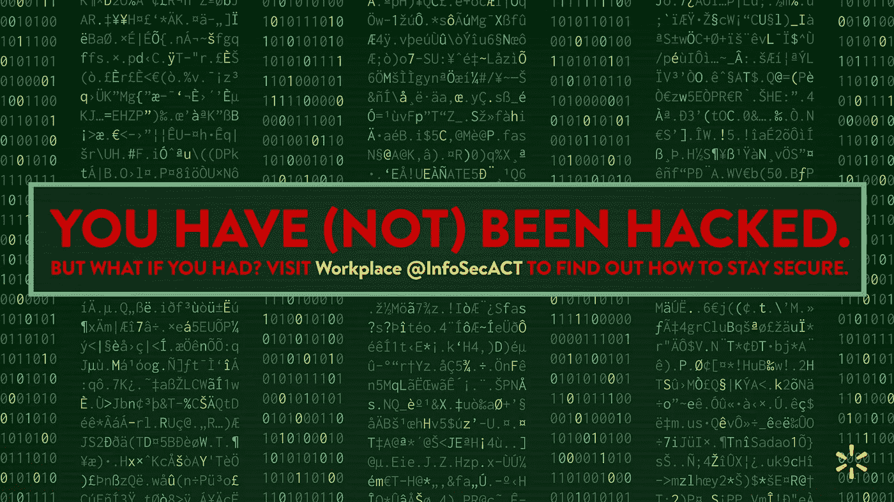
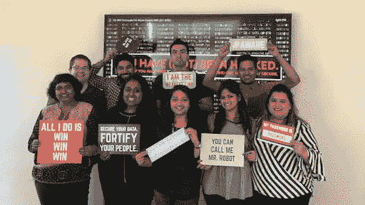
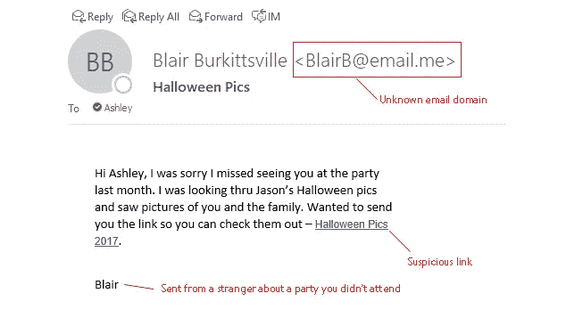

# 2019 年将尝试三项网络安全“行动”

> 原文：<https://medium.com/walmartglobaltech/three-cybersecurity-actions-to-try-in-2019-733c282c5a6?source=collection_archive---------8----------------------->

2018 年，网络安全和大规模数据泄露占据了头条。现在，企业为员工提供培训和资源以保护自己免受越来越多的网络威胁比以往任何时候都更加重要。为了开启 2019 年，我们的信息安全意识、沟通和培训(ACT)团队编制了一份提示列表和一些我们最喜欢的策略，以提高员工的安全意识和更好的行为。

## **让意识变得难忘**

在无穷无尽的信息、待办事项和太多的电子邮件的海洋中，让你的安全信息突破工作场所的混乱可能是一个挑战。去年 10 月，为了网络安全意识月，我们的团队采取了一种“震慑”的方法，在我们的公司办公室全面覆盖屏幕。当员工走进他们的大楼、打开他们的笔记本电脑或走进会议室(任何有屏幕的地方)时，他们会看到:

仅仅是违规的想法就让人们产生了一种高度的紧迫感，他们主动寻找有助于防止真正违规情况发生的信息。我们能够从内部信息安全意识、培训和沟通渠道的流量峰值来衡量我们的小型社交实验的成功。

另一个让你的安全意识项目令人难忘的方法是加入一点乐趣和游戏化。我们的团队主持网络安全密室，让团队一起学习最佳实践，我们还举办竞赛和小游戏，让学习网络安全变得有趣！

Cybersecurity escape room

**强化安全行为**

意识和训练努力不会单独移动针头；您还必须专注于推动更安全的行为。社交工程和网络钓鱼仍然是各种规模的组织面临的巨大威胁。随着人工智能和机器学习的使用，攻击变得越来越复杂，即使是最有知识的员工也可能被愚弄而放松警惕。我们通过持续的“捕捉网络钓鱼”活动，在全球员工中开展安全行为教育、强化和测试。通过该计划，我们向员工发送虚假的网络钓鱼企图，其中包括常见于不法分子网络钓鱼企图的微妙危险信号。这可以训练员工在点击之前要注意的事情。

Fake phishing attempt

根据他们采取的行动，我们会提供即时反馈，强化报告可疑电子邮件的正确方式，并祝贺那些遵循正确流程的人。然后，我们能够衡量这些活动的效果，并为公司领导提供一个仪表盘，显示我们测试的网络钓鱼企图的正确报告率有所增加。我们发现这一活动有助于我们的员工提高识别潜在恶意网络钓鱼企图的能力，并加强工作和家庭中的安全行为。

**培训技术团队**

信息安全培训是一项全年的工作，需要不断努力来应对对手使用的新战术。与贵公司的开发人员社区合作举办有价值的培训活动是为技术人员提供资源和发展机会以提高其技能的好方法。我们为我们的技术团队提供持续和按需培训机会，可以根据团队或个人的特定需求和技能水平进行定制。一些示例包括捕获旗帜活动、技术讲座、午餐学习以及各种其他基于计算机的学习和讲师指导培训活动形式的培训机会。这强化了安全性的重要性，为花在培训上的时间创造了最大价值，并鼓励了未来的参与。

在沃尔玛，我们相信安全是每个人的责任，我们为努力用保护自己、公司和顾客所需的知识、技能和行为武装员工而自豪。我们希望这份清单能帮助*激发*一些想法，让你也能在 2019 年采取网络安全“行动”。更多好主意，请查看我们印度团队的[网络安全意识月博客](/walmartlabs/national-cybersecurity-awareness-month-walmartlabs-india-8e7687eac445)和这篇关于[Jet 如何将网络安全融入其文化的博客](/jettech/how-jet-integrates-cyber-security-into-its-culture-ca0d21fa3acd)