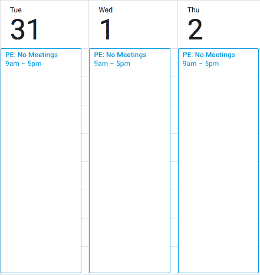
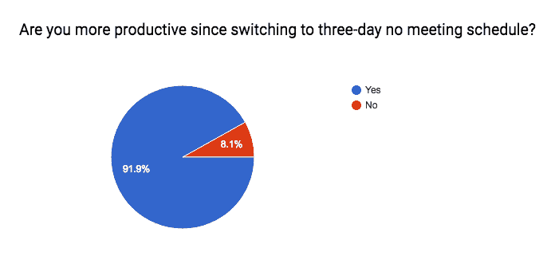
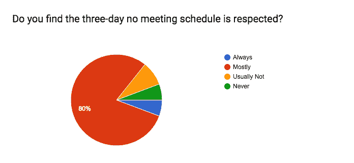

# 工程师三天不开会时间表

> 原文：<https://medium.com/pinterest-engineering/three-day-no-meeting-schedule-for-engineers-fca9f857a567?source=collection_archive---------0----------------------->

Brian Donohue |产品工程 Pinterest 工程经理

大约 100 天前，我们的产品工程团队开始为我们团队中的个人贡献者试验一个三天不开会的时间表。

软件开发需要长时间不间断的专注，这并不是什么大发现。随着 Pinterest 的发展，我们注意到会议的数量也在增加。开这么多的会议会分散工程师一整天的时间，消除构建软件所需的不间断时间。

早在 2009 年，保罗·格拉厄姆[写了下面的](http://www.paulgraham.com/makersschedule.html)，它比我所能希望的更好地说明了这个问题:

> *当你按照创造者的时间表运作时，会议就是一场灾难。一个会议可以浪费一整个下午，因为它被分成两部分，每部分都太小，以至于不能做任何困难的事情。另外，你要记得去开会。对于经理日程表上的人来说，这不成问题。下一个小时总会有事情发生；唯一的问题是什么。但是当创客日程表上的人开会的时候，他们就要考虑一下了。*

为了保留这些不受干扰的时间段，Pinterest 的产品工程组织尝试在工程师的日历上从周二到周四上午 9 点到下午 5 点不安排会议:

在过去的几个月里，产品工程经理得到了关于三天无会议计划的非常积极的反馈，我们最近发出了一份关于它的三个问题的调查。

最后一个问题是“其他反馈”，以下是一些**的积极**回应:

*   “我真的很喜欢三天不开会。我希望我们能更多地减少干扰，但面试和其他公司活动很难做到这一点。”
*   *“我喜欢这个主意。现在完成这么多工作。”*
*   *“这个转变很棒，我觉得这三天不用开会非常有利于建立和完成工作，而不会失去注意力。Slack 让我们交谈，做出我们在会议中无论如何都会做出的相同决定。随时准备取消更多会议！”*
*   “我真的很感激没有会议的额外日子，尽管它经常被违反，但我确实注意到更少的会议和更少的分心。”

以下是一些**中性到消极**的反应:

*   *“3 天的日程安排可能会有效地减少会议，但肯定不会扼杀会议，因为周一至周五的冲突会越来越多，而且会越来越多。”*
*   周一和周五通常会有很多会议

显然，做出这样的改变需要权衡取舍。然而，我们认为三天集中两天开会比一周分散开会要好。调查结果还表明，大多数工程师都有同感。

自从分享结果后，Pinterest 的其他几个工程组织也采用了同样的无会议日程。这是我从 protect 团队的一名工程师那里收到的一条消息，他回应他的团队采用了该计划:

> 我的经理建议我们效仿你的团队，将无会议时间从 1 天延长到 3 天。我很难对你的主动表示足够的感谢。有趣的是，保罗·格拉厄姆关于经理时间表与制造商时间表的文章昨晚在 HN 成为热门话题，我重新阅读了它，我只是在想，我很乐意将无会议延长到 3 天，今天我来到办公室向我的经理提起，你们已经试过了，我们也可以…非常感谢！

作为工程经理，我们的工作是提供所需的空间和支持，帮助我们的工程师交付优秀的软件。看到这个看似很小的变化对产品工程的影响令人惊讶，我们真的很兴奋看到其他工程团队在 Pinterest 采用它。

*PS。***！**