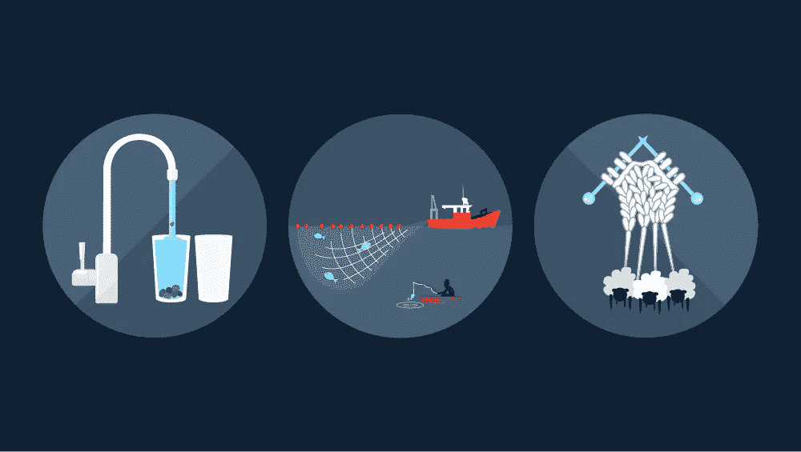

# 思考流媒体的三种方式

> 原文：<https://medium.com/capital-one-tech/three-ways-to-think-about-streaming-6cc39b99a56e?source=collection_archive---------6----------------------->

多亏了 YouTube、网飞、WatchESPN 和许多其他网站，流媒体在我们的个人生活中是一个相对直观的概念。然而，当我们试图将这种理解应用于数据时，事情往往会很快变得模糊不清。作为 Capital One 的高级数据分析师，我接触过典型的静态数据，批量加载并包含在数据仓库中。然而，就在我感到舒适的时候，事情发生了变化。我被要求构建一个应用程序，享受一个完全不同的野兽:流数据。在这个过程中，我不得不重新构建我对数据的许多假设，以解释流所带来的不断移动，我在这里传递一些出于需要而采用的关于流的不同思考方式。这三个概念在不同的方面都是有用的。

## **作为连续流**

这可能是考虑流的最直观的方式，但同时也是最难处理的。它带来的比较是直观的——“流”这个名字已经暗示了湍急的水的不断运动，我们所有人都消耗甚至产生了足够多的活流，以了解正在发生的事情。用像素代替行，就可以了。

然而，从编码的角度来看，这是一种很难进入的思维模式。由此产生的关键见解是，必须在流数据进入时将其捕获。想象一下，试图追着一条鱼顺流而下，与在鱼经过你的船时撒网捕鱼相比。问题是，你如何建立一个数据网？

一个答案是 DStream，这就引出了我们的第二个方法。

## **一系列小桌子**

奇怪的是，我只是想象了一堆小婴儿桌爬来爬去，然后听到有人说，*“哇。”*

总之。这种思维模式与前一种相反——对开始编码非常有用，但是用脑子思考有点奇怪。回到我们的水的比喻，想象一下你的水龙头偶尔吐出一块石头，你想通过抓住其中一块石头向你的房东证明这一点。

你打开水龙头，在下面放一个玻璃杯来接住任何潜在的石头。杯子需要大约 30 秒来装满，当它到达边缘时，你很快将另一个杯子滑到它下面。当第二个杯子装满时，你检查第一个杯子有没有石头，然后把它倒掉。当第二个杯子装满时，你打开第一个杯子，重复这个过程。

这是您可以开始考虑处理流数据的一种方式。您可以像对待静态表一样对待它，但是要知道像这样的表会不断出现。

顺便提一下，这是 Apache Spark 允许您编码的一种方式——您编写一个脚本，在 X 秒的数据上运行，然后您连接到流，让它一遍又一遍地运行。当你听到短语 ***“数据流方法与结构化流方法”*** 时，这种思维过程与数据流更加一致。

## **作为一个不断延伸的静态对象**

水的类比有助于捕捉流数据的短暂特性——流水在那里一秒钟，然后就消失了——但流的大胆个性还有更静态的一面。为了抓住这一点，我们将再次转换隐喻。现在想象一条围巾。

为什么是围巾？首先，我将在秋季发布这篇文章，所以它非常适合季节性。除此之外，人们很容易联想到一条围巾随着编织而变得越来越长的画面。随着长度添加到末端，围巾的其余部分不会改变。

Kafka 主题是这样工作的:数据不断地进来，但是一旦数据进入主题，它就保持相对静止。这种见解的含义开始在新消费者的工作方式中显现出来。

结构化流是一种特别优雅的方式。一个结构化的流媒体应用程序跟踪*时间*，而不是不断地接收数据。如果应用程序每 30 秒刷新一次，它会向主题询问最近 30 秒的数据，然后将这些数据发送出去进行处理。三十秒后，它会再次查询题目。

## **结论**

当建筑师决定建筑物窗户的位置时，他们认为太阳是绕着地球转的。当然，这并不完全正确，但它为他们的目的创建了一个有用的参考框架。流是一个非常强大的概念，这三种思维模式都没有抓住正在发生的事情的全部。然而，它们是在制定方法时有用的三个参考框架。

换句话说，如果鱼儿一直在追赶你，考虑织一条围巾。或许应该有人去看看那些婴儿桌。

## 有关系的

*   [CICD 和数据](/capital-one-tech/cicd-pipelines-and-data-platforms-758b074b38b1)
*   [数据的最大列表方法](/capital-one-tech/a-maximalist-approach-to-data-6e0f21529689)

*披露声明:这些观点仅代表作者个人观点。除非本帖中另有说明，否则 Capital One 不属于所提及的任何公司，也不被其认可。使用或展示的所有商标和其他知识产权均为其各自所有者所有。本文为 2018 首都一。*