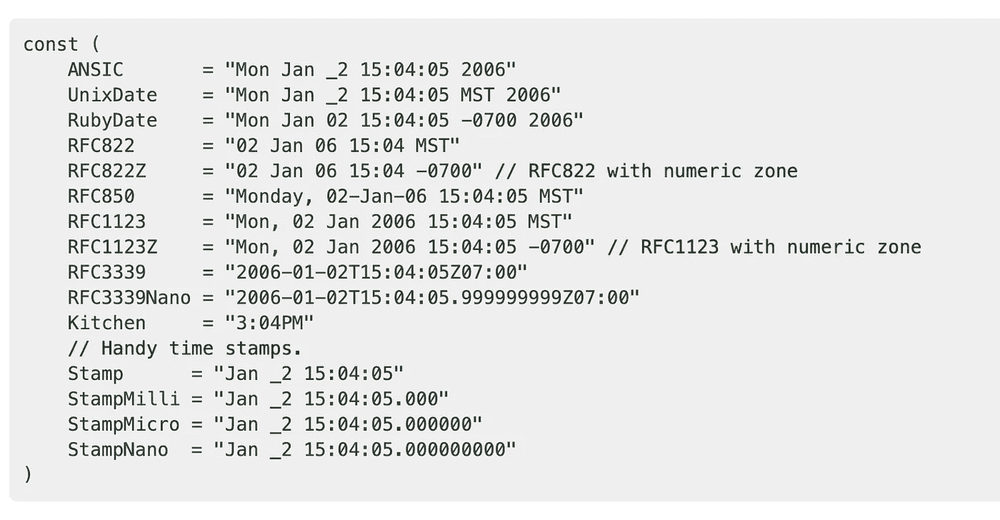

# TIL:小心 Postgres 查询，因为时间戳小于或等于

> 原文：<https://medium.easyread.co/til-becareful-on-postgres-query-for-less-than-or-equal-on-timestamp-9e486b657fc?source=collection_archive---------1----------------------->

## 我今天学到的一个关于在 Postgres 中查询时间戳值的小故事


Photo by [Jonas Jacobsson](https://unsplash.com/@jonasjacobsson?utm_source=medium&utm_medium=referral) on [Unsplash](https://unsplash.com?utm_source=medium&utm_medium=referral)

所以一周前，我在 Postgres 上做了一些关于分页的实验，结合了 UUID 和时间戳。我在这里遇到了一个有趣的问题，当我在同一个时间戳上查询我创建的时间戳时发生了这个问题。

# 语境

为了给出一些上下文，我有一个这样的数据库模式。

My Payment schema

出于好奇，我正在对我的应用程序进行负载测试，有许多并发用户并发插入多达 100 次。这导致我的数据库中有许多行具有相同的时间戳。例如可以在下面看到。

如您所见，所有记录的 created_time 是相同的(可能多达 100 条记录)。

# 问题

所以，当我基于创建的时间进行查询时，出现了奇怪的行为，我认为这是一个 bug 或什么。

```
SELECT * FROM payment_with_uuid 
WHERE 
created_time **<= '2020-05-24 21:27:10'**
ORDER BY created_time DESC LIMIT 10;
```

因此，从这个查询中，我想要实现的是，我想要选择具有给定时间戳的 created_time `**less than or equal to (<=)**`的所有记录。

但是我得到的只是所有小于被过滤的创建时间戳的时间戳。不过滤具有相同值的时间戳。

所以在下面的例子中，

我得到的结果只有`**Kane**`而`**Allistair**`和`**James**`没有被过滤。

另一件不可思议的事情是，如果我反转查询，比如使用`**greater than equal to (>=)**`语法，我可以获取其他的，比如`**Allistair**`和`**James**`，但是`**Kane**`显然会乱序。

# 我刚刚学到的解决方案和事情

## 时间戳是一个整数 UNIX 时间戳

所以，在搜索了整个互联网，Stackoverflow 很明显，甚至问了我的朋友，我得到了答案，基本上，存储在数据库中的时间戳是 UNIX 下的时间戳。

例如，如果您看到上面示例中的数据库记录，存储的时间戳是这样的。

```
**2020-05-24 21:27:10**
```

实际上这不是真正的值，因为 Postgres 实际上存储的是这些行的 UNIX 时间戳版本。它可能有毫微秒或微秒，所以它不只是停在秒版本上。

它可能看起来像这样，

```
**2020-05-24 21:27:10****.37091**
```

我们不知道。因为为了格式化，Postgres 只将其四舍五入到第二个值。

因此，我将我的查询改为更具体的，包括毫微秒或微秒，看起来像这样，这是可行的。

```
SELECT * FROM payment_with_uuid 
WHERE 
created_time **<= '2020-05-24 21:27:10****.37091****'**
ORDER BY created_time DESC LIMIT 10;
```

但是接下来，有一个问题，如何从应用层面做到这一点。但是对于我来说，由于我使用的是 Golang，所以非常简单。

## 在 Golang 上使用 RFC3339Nano

因为我的应用程序构建在 Golang 之上，所以为了处理精度问题，我使用了 Golang 中的`**time**`包中的`**time.RFC3339Nano**`。它的格式看起来像这样，`**"2006–01–02T15:04:05.999999999Z07:00"**`。或者你可以在这里看到详细的



time format in Golang package

我不知道在其他编程语言中如何做到这一点，但关键是要包括时间戳查询的精度。

因此，在执行接受来自最终用户的时间戳的查询的情况下，我们需要首先使用 RFC3339Nano 对其进行格式化，并将其发送到数据库。所以这个查询仍然有效。

但是为什么我需要使用格式，如果我可以不用格式使用它？因为如果我们不格式化它，时间数据结构也将包含毫秒和纳秒？因此，给背景，为什么我需要这个，特别是在我的情况下。

因此，我将使用用于分页的`**created_time**`来获取下一页作为光标，我将获取时间戳，并将其转换为字符串。并且该字符串将被用户用来获取新页面作为光标。

在我的应用程序中，我将把该字符串转换回时间戳，并在查询中使用它。正因为如此，我们需要小心行事。因为在 Golang 中，当我们将时间戳转换为字符串时，它可能不包括我们从 Postgres 中获得的精度。所以我需要用 time.RFC3339Nano 来格式化。

This is how my cursor encoded by using the time

所以我仍然保持精度，即使我把它转换成字符串，再转换回时间戳。

# 参考

1.  [Postgres:使用时间戳进行分页](https://stackoverflow.com/questions/39119783/postgres-using-timestamps-for-pagination) — Stackoverflow(在注释的线程上)