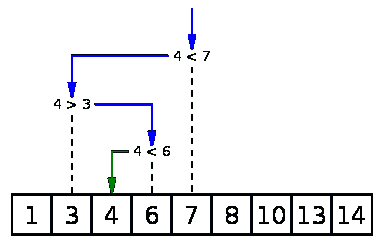
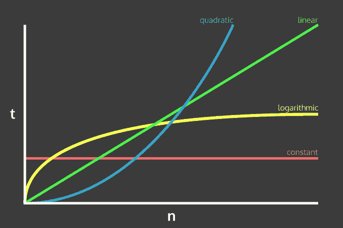

# 时间复杂度/大 O 符号

> 原文：<https://medium.com/javascript-scene/time-complexity-big-o-notation-1a4310c3ee4b?source=collection_archive---------4----------------------->

## 缩放算法而不是应用程序


在每个开发人员的旅程中，总有一天他们会被问及他们算法的时间复杂度。可能是在白板面试中(你应该[永远不要做](/javascript-scene/tech-hiring-has-always-been-broken-heres-how-i-survived-it-for-decades-b7ac33088de6#.pvxzjk5kz))，或者是在和其他开发人员谈论某种做事方式的时候。虽然过早的优化会导致自行车脱落，但了解和理解大 O 符号可以指导我们作为开发人员思考和设计应用程序的方式。

为了理解我的意思，首先我们需要为我们如何对算法的时间复杂度进行分级制定规则，并对算法有一个基本的定义。

当我们说“算法”时，我们所指的是我们的工作人员为了产生一个结果而要遵循的一组确定的步骤。例如，在我导师家煮咖啡的算法如下:

1.  从橱柜里拿一个杯子
2.  拿一杯我想要的咖啡
3.  确保 Keurig 中的水达到或超过最低水位
4.  把杯子放在炉栅上
5.  将 K-cup 放入 Keurig 中
6.  按“开始”
7.  等到杯子满了
8.  享受

虽然可能会有一些更小的步骤，如如何从橱柜中取出一个杯子或如何将 K-cup 放入机器中，但上面制作一杯咖啡的算法概述了过程中的每个步骤，任何人都可以按照这些步骤制作一杯咖啡。

如果我们有一个想为其冲咖啡的人的名单会怎么样？这就是时间复杂性的由来。

假设我们有 *n* 个人想要杯咖啡。因为每次制作一杯咖啡的步骤和时间都是一样的，所以我们说制作 *n* 杯咖啡将花费 *n* 个时间单位来完成。因此，对于 5 杯咖啡来说，需要 5 个单位的时间，或者用大 O 符号来表示，需要 *O(5)* 来制作。如果我们想做 100 杯咖啡，需要 100 分钟。然而，通常的做法是表示大 O 符号 [*渐近*](https://en.wikipedia.org/wiki/Time_complexity) 或“随着输入增长到无穷大”。这样我们的咖啡制作算法就是 *O(n* )。

根据时间复杂度对我们的算法进行分级的另一个规则是，我们通常使用*最坏情况。*这意味着当我们说某事是*O(n)*时，我们是说这个算法最长需要的时间等于对 *n* 个元素执行操作所花费的时间。

现在我们已经定义了规则和词汇表，让我们看看这些在代码中是什么样子的。

首先我们来看 *O(1)。*这意味着不管输入的数量或大小，执行算法总是需要 1 个单位的时间。算法的例子有 *O(1)* 从数组或散列/对象中访问项目:

```
// Given n sized list/object, it will take 1
// unit of time to return the value at that index
const valueAt = (key, obj) => obj[key];
```

因为数组只是索引对象，我们可以通过这个算法访问对象和数组，它们都表明我们只是从内存中的某个位置获取一个值。

假设我们不知道条目在列表中的位置，而是需要遍历整个列表，直到找到我们需要的内容。再一次，我们在这里看到*最坏的情况*，所以让我们假设我们需要的项目在列表的最末端或者根本不在列表中。这个算法的时间复杂度是多少？

```
// Given n sized unsorted list, it will 
// take n units of time to find a value
const indexOf = (val, list) => {
 for (let i = 0; i < list.length; i++) {
  if (list[i] === val) {
   return i;
  }
 }
}
```

我们看到这个算法将花费更长的时间，因为我们正在循环一些东西，而不仅仅是执行一个单一的操作。我们最好的情况是值在索引`0`处，我们可以提前返回。最坏的情况是，如果项目根本不在数组中，或者在数组的最末端，在这种情况下，需要花费 *n* 的时间来得到答案。正因为如此，我们说上面的算法是 *O(n)* 或者线性算法。花费的时间与列表中元素的数量成比例增长。

接下来让我们看一个算法的例子，它是*O(n)*选择排序。就时间复杂度而言，这是最糟糕的排序之一，即使是最好的情况。让我们来看看为什么:

除了[就地改变值](/javascript-scene/master-the-javascript-interview-what-is-a-pure-function-d1c076bec976#.f8ngscbly)之外，使这个算法如此糟糕的是，对于列表的每次迭代，我们必须从那个点开始迭代列表的其余部分。随着我们列表的增长，我们必须做的迭代数量也在以指数级的速度增长。

幸运的是，JavaScript 已经在一个数组上实现了自己的本机`sort`方法，我们可以用它来对列表进行排序，而不必太担心时间复杂度。但是我们如何让它保持有序呢？我们如何将一个条目添加到一个排序列表中？

我们可以`newList = [...list,1].sort()`我们的解决方案，但这意味着对于每一个插入，我们必须迭代整个数组。我们知道，一旦我们找到了该项的位置，我们就可以相信数组的其余部分也是正确的。

迭代每一个插入是最好的情况，但是我想知道我们是否可以创建一个算法来匹配最坏的情况，但是有一个更好的最好情况。

这里我们循环遍历每一项，检查它是否比给我们的项小。如果是，我们将该值推送到新数组，并继续下一个循环。如果不是，我们知道给我们的项属于下一个，所以我们把我们的结果设置为前面的结果、项，然后是给我们的列表的其余部分。但是，有时传递的项应该放在列表的末尾。为了了解这一点，我们在休息前设置一面旗帜，并在回来时检查它。

上述算法的时间复杂度，在最坏的情况下，是 *O(n)* ,因为如果该项大于列表中的任何其他项，我们必须迭代每一项才能算出来。然而，最好的情况是，它基本上是 *O(1)* ，因为我们可以在第一次迭代时中断循环，因为传递给我们的项应该在列表的前面。

但是我想知道:有没有更快的方法？仅仅通过提前退出，我们就从最好的情况 *O(n)* 跳到了最好的情况 *O(1)。既然我们没有办法击败 1，有没有办法提高我们的最坏情况，而不降低我们的最好情况太多？*

如果我们不必搜索每一个列表项，而是可以获得一些关于我们应该在哪里寻找每一个迭代的知识，减少可能的迭代。不用遍历整个数组，因为它已经排序了，我们可以告诉我们的工作人员:“嘿，根据您在这次迭代中得到的答案，这里有一个子列表，下次可以查看。”

我们描述的是 [*二分搜索法*](https://en.wikipedia.org/wiki/Binary_search_algorithm) *，*，它极大地降低了我们的时间复杂度。我们基本上告诉工作人员查看列表的中间，并将我们传递的项目与中间索引处的项目进行比较。然后，基于这个结果，我们在下一次循环中搜索列表的上半部分或下半部分。我们每走一步都这样做，将列表分成两半，将中间部分与条目进行比较，直到我们的最大索引和最小索引切换。一旦他们这样做了，我们就知道给我们的项目需要放在 min 索引之后。



[source](https://camo.githubusercontent.com/1cd853b57885449a176810b3e967167fb9fbf3b3/68747470733a2f2f75706c6f61642e77696b696d656469612e6f72672f77696b6970656469612f636f6d6d6f6e732f662f66372f42696e6172795f7365617263685f696e746f5f61727261792e706e67)

虽然我们必须扩展参数的数量并添加更多的逻辑，但我们将算法的搜索部分从 *O(n)* 更改为 *O(log n)* 或对数而不是线性。因为它是作为输入给出的排序列表，所以我们可以减少我们的工作人员在搜索期间必须进行的迭代次数，从而降低时间复杂度。

下面我们可以看到不同类型的时间复杂度，以及随着 *n* 变大，它们之间的相互比较



Credit: [http://callmenick.com/](http://callmenick.com/)

我们可以看到，虽然线性时间复杂度，或*O(n)*在开始时比对数时间复杂度，或*O(log n)*在开始时更具性能，但一旦我们的输入规模增长， *O(log n)* 真正开始发光。

## 但这有关系吗？

时间复杂性的难点在于:微优化很容易，根据我使用 DOM 的经验，这几乎不是需要解决的瓶颈。如果你有一个像 ramda 或 lodash 这样的帮助包，使用他们的 insert/sorts/etc。功能。即使你求助于`[...list,item].sort()`，你正在做的 100 次左右的迭代也很可能不是瓶颈。

那么为什么知道这些很重要呢？如果这可能不会对您的代码的性能造成影响，那么为什么要大费周章去理解这种奇怪的数学东西呢？

如果你想解决[有趣的问题](http://www.bigdatanews.com/profiles/blogs/fast-clustering-algorithms-for-massive-datasets)，时间复杂度差不多就是你唯一的出发点。