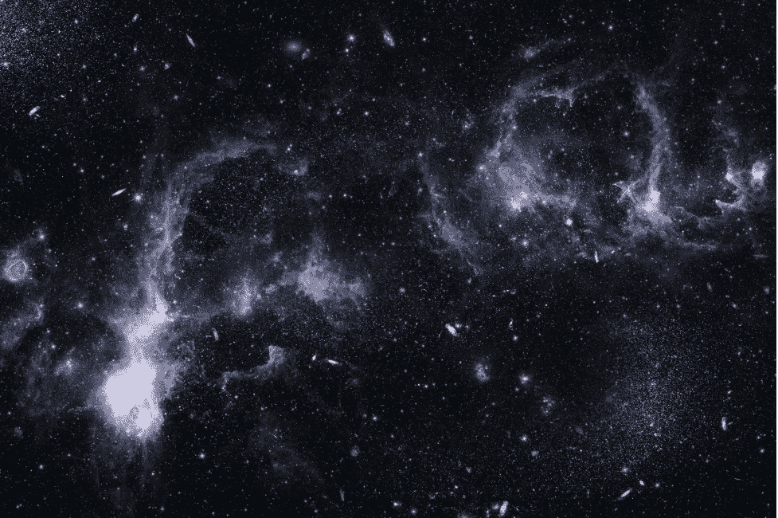
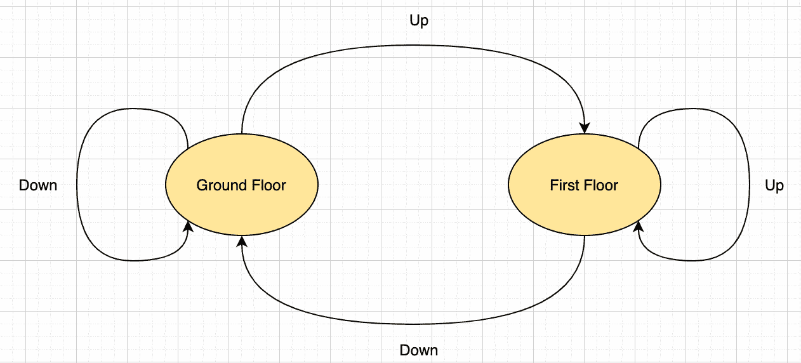
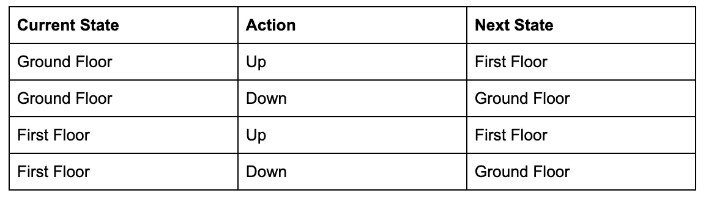
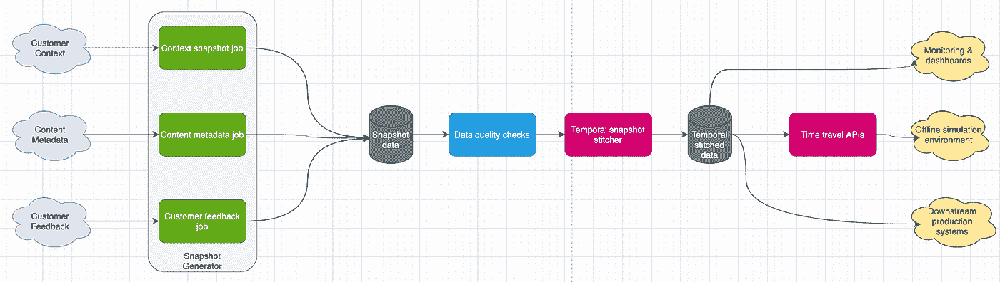

# 时间旅行是真实的——建立离线评估框架

> 原文：<https://medium.com/capital-one-tech/time-travel-is-real-building-offline-evaluation-frameworks-a78103613ef9?source=collection_archive---------4----------------------->

## “虫洞”框架如何帮助个性化平台利用机器学习

数字革命和通过多种设备访问互联网增加了世界各地人们的选择余地。例如，仅 YouTube 就有 [2B+用户每天在 PC、移动、OTT(over-the-top)设备上观看超过 10 亿小时的视频](https://www.youtube.com/about/press/)。这是几乎永无止境的视频内容，触手可及[1]。令人惊讶的是，人类不善于在众多选项中做出选择，这可能导致糟糕的决策。我们中的许多人花了数小时在流媒体网站上搜索新闻或专业内容，但最终却观看了随机的狗视频。这就是个性化体验平台可以帮助用户在正确的时间做出正确选择的地方。

个性化平台预测每个客户的期望，并帮助他们做出最佳决策，从而提高参与度。几十年来，提供个性化推荐的能力推动了在线广告、视频/游戏流媒体平台和搜索引擎的发展。类似的个性化也可以应用在金融服务中，以帮助客户按时付款，选择金融产品，或接收个性化消息，以帮助他们管理自己的财务健康。营销渠道沟通也可以通过个性化平台进行优化。

机器学习是任何高级个性化平台的核心，旨在帮助客户做出这些决定。最大化机器学习系统收益的显而易见但最有效的方法是提供更好的数据并建立强大的离线评估框架。但是，为了获得最大收益，还需要应对一些挑战。

# 构建强大的离线评估框架的挑战

机器学习算法通常在离线环境中使用历史数据进行评估。原始数据集被转换成进入离线模型开发阶段的特征向量。将这些相同的模型部署到生产中需要使用实时服务来生成特性。保持在线和离线特征生成同步是一个复杂的问题，学术界和工业界都在这方面做了大量工作[3]。

机器学习工程师需要超越特征生成，解决这三大挑战:

1.  **数据收集**n——提供数据生成特征的上游微服务，往往没有考虑到机器学习需求而构建。然而，考虑到机器学习需求的进化性质，这样做可能不切实际。从如此不同的来源收集数据总是一个挑战。
2.  **时态数据处理** —跨系统的多个数据源的时态视图可以让我们将它们缝合在一起，并在给定的时间点(客户旅程)建立客户交互。为无状态系统的数据和处理添加时间维度以识别客户交互随时间的状态是一项挑战。
3.  **离线模拟环境** —基于上述数据为不断变化的机器学习生态系统建立一个稳健的离线评估系统是一个复杂而又需要解决的关键问题。

在构建框架时，一个恰当代表这些挑战的概念是[虫洞](https://en.wikipedia.org/wiki/Wormhole)。[4]就像虫洞链接时空中的两个不同点一样，我们希望我们的解决方案能够从各种微服务中检索数据，并构建一致的客户行为时间视图，同时提供“时间旅行”功能。这些时间旅行功能将大致还原给定时间系统中的数据状态。*这导致创建了一个强大的离线评估框架，其中新的机器学习算法可以*****模拟**** *在伪生产环境中进行测试。本质上，人们可以简单地回到过去，问一个新的算法/系统在那个时候会如何响应客户的请求。*

# 构建虫洞离线评估框架的初步考虑

为了构建这个“虫洞”来连接来自我们众多微服务/系统的数据，并为我们提供客户状态的时态视图，我们需要两件东西— *状态持久性和被动时态数据快照构建器。*

# 1.状态持久性

任何系统都可以概括为[有限状态机](https://en.wikipedia.org/wiki/Finite-state_machine) (FSM)，或者 FSM 的组合，其中它在任何给定时间都可以处于有限数量的*状态*中的一个状态。基于一些输入，系统也可以从一种状态转移到另一种状态*。*

人们可以把个性化平台看作一个复杂的有限状态机。在这种情况下，用户登录并采取一些行动，如浏览内容、网页、视频等。借助于提供这些功能的底层微服务和子系统。如果在所有微服务和子系统中保持这些*状态转换*，那么本质上它们将拥有在给定时间点重建体验平台状态所需的所有数据点。

Fig1: FSM example of elevator system

*图 1* 以一个简单的电梯系统为例展示了这一点。相同的状态转换可以在下面的表格中定义。用时间维度来保持这些状态转换将允许我们计算出电梯系统在任何时间点的状态。

# 2.被动时态数据快照构建器

由于遗留、工程或监管方面的挑战，个性化平台中的每个微服务或子系统可能都无法保持状态。相反，我们可以*被动地*从这些上游微服务的日志、内部数据库和流中读取数据，以构建时态数据快照。为这些数据添加时间维度以实现数据拼接和时间旅行功能非常重要。

*   **时态数据拼接** —来自所有上游微服务和子系统的时态数据快照可以基于基于近似时间窗口的匹配进行拼接或链接，以提供所有服务/系统在给定时间点的近似状态。
*   **离线模拟环境** —具有拼接功能的时态数据集支持强大的离线模拟环境。在 Spark 或其他离线环境(Python，R)中读取这种拼接数据的编程 API 有助于标准化模型评估工具。它使数据科学家能够满怀信心地大规模评估新算法和模型，从而缩短了从原型到生产发布的时间。它还为实时 A/B 测试提供了一个可靠的替代方案，后者的范围有限，并且在生产环境中会有开发成本。

# 构建虫洞离线评估框架

任何个性化机器学习平台都广泛接受数据集，例如:

*   **客户背景** —客户当前状态的丰富特征数据集。
*   **内容元数据** —可供推荐的内容。例如，视频、图像、消息、网页布局、产品供应等。
*   **反馈数据** —客户对建议采取的行动。例如，印象、点击、浏览、喜欢、购买等。

这些数据集来自各种实时微服务和子系统。虫洞应该被动地工作，从这些系统收集数据——保持数据的时间状态——以提供时间旅行能力。

Figure2: High level architecture

*图 2* 显示了虫洞的高级架构。它包括:

*   **快照生成器** —该组件提供可扩展的通用快照功能，连接到微服务的内部临时存储层，并生成增量快照。它可以扩展为使用各种数据库连接、缓存层和流来生成快照。提供被动数据收集(以避免提供者系统过载)和时间维度至关重要。为了尽量减少由于失败造成的数据丢失，我们使用推测执行。我们构建了一个快照状态跟踪器来主动识别任何数据丢失。出于监管原因，有些快照会对某些敏感属性进行模糊处理和加密。我们重用内部工具和标准来满足这些法规要求。该组件的最终目标是使添加任何数据源和构建可靠的快照变得更加容易。
*   **数据质量检查** —快照上的基本数据质量检查跟踪数据问题，如缺失值和异常。这有助于为下游组件提供干净的数据集。这可以发展成通用的数据质量框架，超越类似于[4]和[5]的简单的基于规则的检查。
*   **时态快照缝合器** —用近似时态连接合并各种快照。它是一个由 spark APIs 组成的 JVM 库，用于缝合各种数据集。存在构建有用的拼接数据集的计划作业。它还使数据科学家能够从他们的 spark 笔记本电脑中生成自定义数据集进行即席分析。
*   **时间旅行功能** —该组件提供面向用户的 API，用于在给定时间点构建特定数据源的状态或系统的集体状态。这可以让用户跟踪过去的客户登录，并询问当时可用的客户上下文、可用内容和反馈数据。本质上，这可以跨所有子系统重新创建数据状态。这就是为什么我们称之为时间旅行系统——虫洞！数据科学家可以使用这些 API，调试推荐算法在过去的工作方式——恢复该时间点的系统数据——测试新算法。它提供了强大的大规模离线评估功能，可以更快地、充满信心地迭代新想法。
*   **其他用途**-该系统和可用的时态数据集有许多其他用途。例如，探索生产系统的新功能、监控和有价值的见解。

# 提高

一个被动地从所有子系统生成时态数据并提供时间旅行能力的功能系统对于个性化平台来说是非常强大的。通过使用模块化的、可扩展的和可伸缩的体系结构，人们可以毫不费力地添加更多的数据源。然而，还有几个额外的功能可以添加，主要集中在离线评估框架。虫洞可以利用 Spark 的分布式计算，或者可以扩展到在本地机器上的独立 Python 环境中工作。这样，人们可以用最少的努力为新算法测试提供开箱即用的支持。任何虫洞的目标都应该是通过提供高质量的数据和坚实的基础设施，以高度自信地大规模探索新算法，从而减少原型开发到生产的时间。实现这一点有助于形成一个丰富的个性化平台，帮助客户在正确的时间做出正确的决定。

# 参考资料和相关工作

[1] YouTube 上的 https://www.youtube.com/about/press/

[2]施瓦茨，巴里。(2015).选择的悖论。10.1002/9781118996874.ch8

[3]https://www.featurestore.org/

[4]https://en.wikipedia.org/wiki/Wormhole

[5][https://en.wikipedia.org/wiki/Finite-state_machine](https://en.wikipedia.org/wiki/Finite-state_machine)

[4][https://databricks . com/session _ na20/an-approach-to-data-quality-for-网飞个性化系统](https://databricks.com/session_na20/an-approach-to-data-quality-for-netflix-personalization-systems)

[5] Dasu，t .等人，“时间流的数据质量” *IEEE 数据工程。公牛。*39(2016):78–92。

[6][https://netflixtechblog . com/distributed-time-travel-for-feature-generation-389 cccdd 3907](https://netflixtechblog.com/distributed-time-travel-for-feature-generation-389cccdd3907)

*披露声明:2021 资本一。观点是作者个人的观点。除非本帖中另有说明，否则 Capital One 不隶属于所提及的任何公司，也不被这些公司认可。使用或展示的所有商标和其他知识产权是其各自所有者的财产。*

*原载于***。**