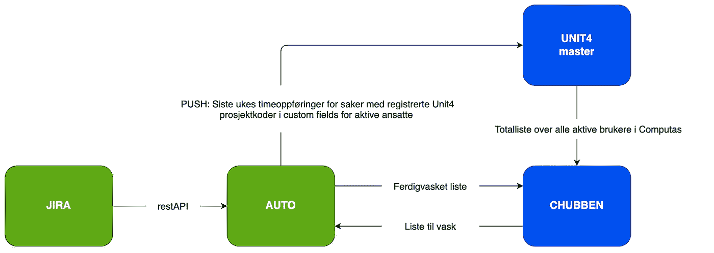
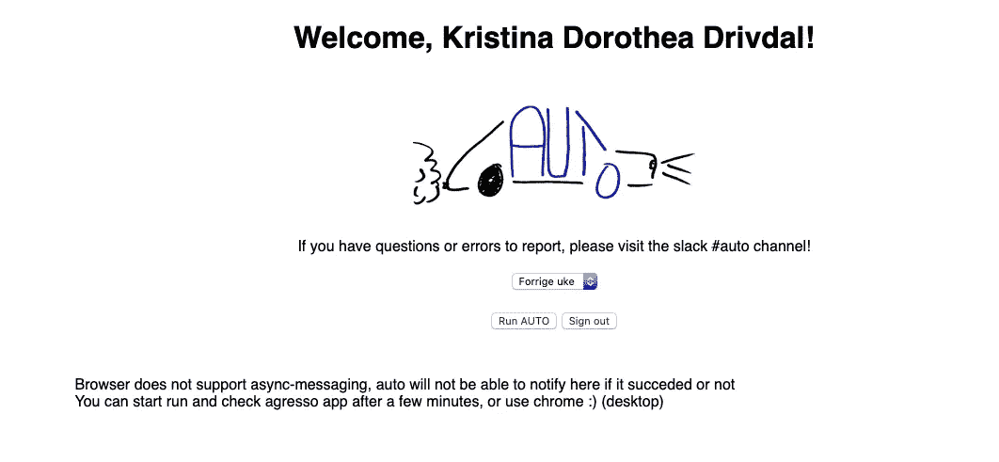

# Timeføring — et hodebry! Eller?

> 原文：<https://medium.com/compendium/timef%C3%B8ring-et-hodebry-eller-b3e5cc185591?source=collection_archive---------1----------------------->

## Hvis du er konsulent eller en annen type utleid ressurs, har du nok vært borti dette. Mitt spørsmål til deg er: Jobber du også i prosjekter hvor du er nødt til å føre de samme timene du jobber utallige plasser?

Du timefører kanskje i prosjektverktøyet direkte på oppgaven du jobber med, så legger du inn timer i økonomisystemet som genererer fakturaene for arbeidet ditt, og så kanskje du også må timeføre i systemene til kunden du jobber hos. Helt ærlig — jeg syns det er tidkrevende, men det er likevel viktig. Men å føre de samme timene mange forskjellige plasser som mest sannsynlig har ulike ID/kode, byr på forvirring. Målet med timeføringen er jo å holde oversikt, men kan fort føre til det motsatte.

Men det finnes heldigvis gode måter å løse dette på! Jeg vet at mange konsulenter benytter niftige løsninger, jeg vet også at et flertall klør seg i hodet og syns timeføring er et ordentlig hodebry. Her i Computas løser vi det på en måte jeg syns er helt topp!

Noen av våre utviklere har nemlig satt opp det vi kaller Auto. Det har til hensikt å effektivisere timeføringen ved å redusere tiden vi bruker på å føre timer mange plasser, så vel som å redusere feilraten som ofte dukker opp når man fører på samtlige plasser. Har du hørt noe så fint?

Hos oss er verktøyet for oppgaveoppfølgning Jira Software, mens økonomistyring skjer i Unit4\. Auto har derfor blitt satt opp mellom disse.

## Hvordan fungerer det? 🤷🏻‍♀️

Ved å benytte REST API spør Auto Jira om å få et uttrekk av worklog for sist uke. Resultatet av spørringen vaskes for deretter å pushe informasjonen inn i Unit4\. Når timer pushes inn, gjennomfører Auto en sjekk for å se om det allerede ligger timer registrert på aktuell dag/bruker/prosjekt/aktivitet før timene legges inn. Auto fjerner ikke eksisterende timer i Unit4\. Dersom alle kvalitetssjekker bestås, pusher Auto din worklog inn i Unit4.

> 💡 A side note: API er et grensesnitt i en programvare som gjør at spesifikke deler av denne kan kjøres fra en annen programvare. I dette tilfellet er det et API der man maskinelt / automatisk kan hente ut strukturert data (f.eks. timer). Dermed slipper du å gå inn i Jira og trykke på ‘worklog’ for å hente ut timene, men dataprogrammet gjør det for deg. Et REST API gir ikke skjermbilder, og er derfor perfekt å bruke til automatisering.

Det fine er nemlig at Atlassian tilbyr REST APIer for både Confluence og Jira — for Auto benyttes API for Jira. Atlassian har satt opp løsningen slik at APIet kun returnerer de deler av dataene som eksplisitt blir etterspurt i integrasjonen. Man kan ekspandere parametrene som etterspørres ved å spesifisere en kommaseparert liste over entiteter som ønskes, ved å identifisere entitetene ved navn.

I Auto er det også lagt inn en forutsetning at Jira har et custom field som inneholder en Unit4-kode (prosjektkodene vi benytter i fakturering, blant annet). Dersom Jirasakene har det egenkonfigurerte feltet ‘Agressokode’ tilstede ( *vi har ikke oppdatert feltet etter at Agresso byttet navn til Unit4\. Oops* ), vil Auto spørre oppover i hierarkiet (sub-task → modertask → epic) etter innhold i agressokodefeltet. Dersom ingen informasjon finnes i dette feltet, blir timene ignorert. Det fine er at det finnes mange måter å gjøre dette på, slik at det kan fungere godt for ulike behov.

## ️🛁 ️Vask og massering ‍💆🏻‍♀️

Når spørringen er kjørt, vil Auto, som nevnt, sitte igjen med en lang liste over førte timer. Listen vil inneholde timeføringer for alle brukere i Jira. Med andre ord — dette gjelder altså for alle, både våre interne og eksterne ressurser som er aktive brukere i Computas sin Jira.

Hos oss er Unit4 master når det gjelder oversikt over tilganger og rettigheter for alle som har eller har hatt databruker. Derfor, for å sikre at det kun er timer for aktive Computas-ansatte som pushes inn til Unit4, gjennomføres en opprensking av Jira-resultatet. Dette gjøres ved å vaske listen mot en ferdig vasket brukerliste fra det vi kaller Chubben.

> 💡 A side note: Chubben er Computas’ egen app hvor alle ansatte har en egen profil med informasjon, i tillegg til oversikt over interne eventer, kontaktliste for ansatte, og krisehåndtering. En finfin app, spør du meg.

Chubben har på forhånd gjennomgått masterdata-listen fra Unit4, og benytter deretter sin egen brukerliste over aktive ansatte i Computas. Etter at Auto er kjørt, returneres en liste som blant annet inneholder brukernes epostadresse, logget arbeidstid, dato for det timeførte arbeidet m.m. Det er epostadressen som er nøkkelen for videre kobling av ansatt og timer inn mot Unit4.

Her kan du se et forenklet diagram av flyten av det hele 👇🏻

For noen høres dette kanskje komplisert ut? Det skjønner jeg. Gleden er at det egentlig ikke er så komplisert, og resultatet er at jeg kan overføre alle timene jeg har ført i Jira over i Unit4 ved ett tastetrykk eller helt automatisk! Ved ett tastetrykk ser det slik ut 👇🏻

Dette har vi satt opp hos flere kunder i større prosjekter slik at konsulentene våre kun trenger å forholde seg til Jiraprosjektet de jobber i. Niftig ting, det der, og sparer mye hodebry.

Hva tror du — skal vi sette det opp for deg også?