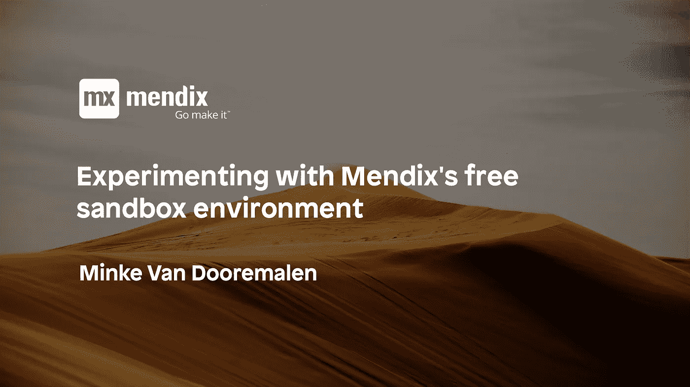
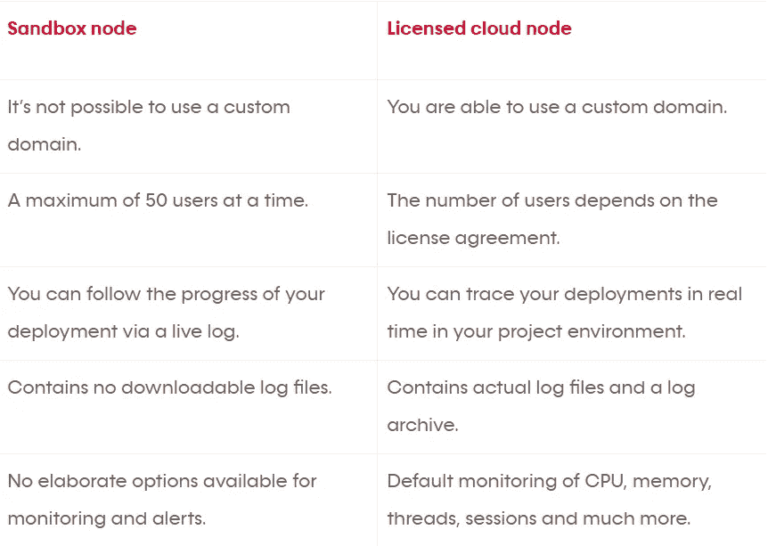
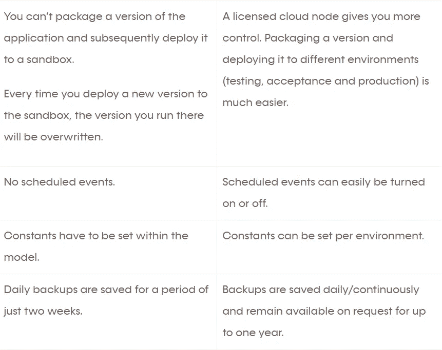
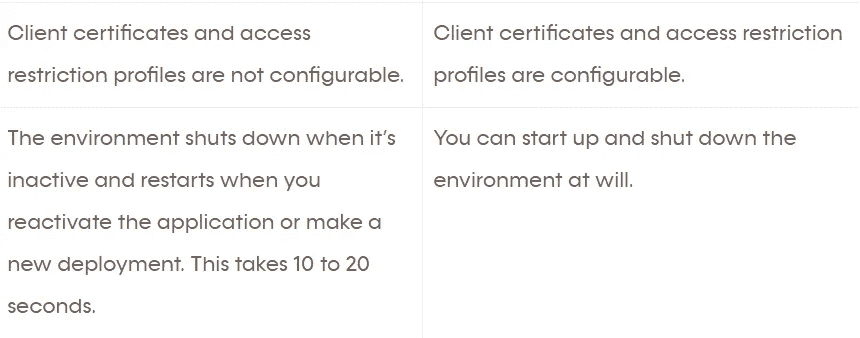
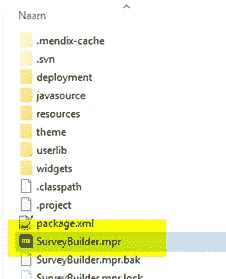
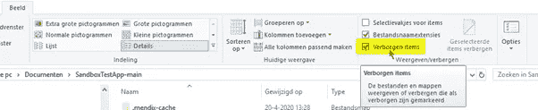

# 试用 Mendix 的免费沙盒环境

> 原文：<https://medium.com/mendix/tips-and-ideas-for-experimenting-with-new-apps-in-mendixs-free-sandbox-environment-be2e64d78d2d?source=collection_archive---------1----------------------->

你是想做一些动手实验的新来者吗？或者您已经是 Mendix 的用户，正在寻找使用一个小应用程序来试验或验证一个商业想法？如果是后者，您可以从 Mendix 提供的免费“沙盒”环境中获益。这种环境允许你去尝试。如果您的想法流行起来并具有重要的商业价值，您就有机会转换到具有更全面的服务级别协议的许可环境。

# 什么是沙盒？

术语“沙箱”经常在软件开发界使用，指的是一种临时的、比对功能、可用性和性能有更严格要求的开发更有限、更小的环境。

根据 Wikipedia，沙箱是一个测试环境，它将未测试的代码更改和彻底的实验与生产环境或存储库隔离开来。

# 什么是 Mendix 沙盒？

您在自己的本地机器上制作的每个 Mendix 应用程序都在 Mendix Studio Pro 开发环境中运行。然而，当涉及到让其他用户随时可以使用应用程序时，Studio Pro 并不是合适的平台。幸运的是，Mendix Studio Pro 允许你只需点击一个按钮，就可以将你的应用程序部署到 Mendix [沙盒环境](https://www.mendix.com/pricing/)。该应用程序现在运行在云中，可以被其他人访问和使用。

您可以将一个 sandbox 附加到一个 Mendix 项目。当您生成一个新的 Mendix 项目时，就建立了链接。沙箱在功能、可伸缩性、可用性和性能方面是有限的。在这篇博文的后面，我们将更深入地探讨沙盒和付费环境之间的区别。从技术上讲，沙盒应用程序运行在一个 docker 容器中。容器运行在 Mendix Cloud v4(自由层环境)中，后者运行在 [AWS(亚马逊网络服务)](https://aws.amazon.com/)上。规格如下:

*   1 GB 内存
*   1 GB 用于存储文件
*   0.5 GB 的最大数据库大小

如果应用程序不活动，它将进入睡眠模式，并在再次使用时重新启动。白天经常使用的应用程序通常只会在晚上进入睡眠模式。

# 沙箱和许可环境之间的区别

需要购买年度许可证的付费环境称为许可云节点。这些节点至少提供了一个默认的生产和验收环境，但它们还经常使用一个额外的测试环境，让您可以轻松地在云中部署和测试应用程序。

以下是沙箱和许可云节点之间的 11 个区别:

# 有没有可能以另一种方式解决现有的限制？

如果在使用沙盒环境时遇到严重问题，建议您购买获得许可的云节点。这样的解决方案为您提供了在 Mendix Cloud 中部署 Mendix 项目的机会，但如果您的许可证支持此选项，还允许您使用自己选择的不同云环境。MS Azure、Google Cloud、SAP 云平台和 Pivotal 是您可以使用的替代云平台的主要示例。但请记住，如果使用备用云平台之一，则必须解决所有基础架构、管理和系统问题。

通过使用特定的解决方法可以解决某些限制，但这些解决方法提供的解决方案远非理想。我们将列出一些限制和相应的解决方法。

缺乏跟踪图形和信息的正确洞察力 →将 Google Analytics 小部件添加到模型中。这些小部件已经向您展示了一些关于应用程序利用率的额外信息，例如谁在使用它以及用户何时登录。

**was 应用最近运行期间的日志文件不可用→** 使用 [Mendix App Store](https://appstore.mendix.com/) 中的日志模块向数据库写入日志消息。这使您能够构建日志归档。请注意，数据库中的存储空间有限。要解决此问题，可以使用 REST 接口将这些日志消息写入外部环境。可以将它们存储在 Datadog 或类似的 loggin-platform 或其他数据库中。

**没有可用于运行应用的自定义域名→** 要隐藏沙盒的 URL，您可以使用新域名或使用现有域中显示 iframe 的页面。您可以使用沙箱的 URL([单击此处查看此页面上的示例代码](https://www.flickr.com/groups/exemplaryshots/))。随后，您可以通过此自定义域名来调用应用程序。Iframes 确实有其局限性，尤其是当应用程序的显示屏幕大小定期发生变化时。

*高级提示:你使用深度链接吗？然后，您必须考虑这一点(例如，通过使用 JavaScript 将 deeplink 传递给 iframe)。*

**无高级备份功能→** 您应该通过将备份下载到本地环境来定期保护备份。在沙盒环境中工作时，备份最多存储两周。开发自己的导出和导入数据的功能会更好。在沙盒中，您只能还原 Mendix 制作的备份，而不能上载自己的备份。

**想存储 1 GB 以上的文件***某个应用程序想存储多少文件？考虑使用外部云存储。您可以使用 REST API 将此存储解决方案与您的云环境集成。Dropbox 的 AWS S3 是两种可靠且受欢迎的外部存储解决方案，每 GB 的价格很低。

**无预定事件** →要触发需要每天执行的进程，您必须从另一个云应用程序到达您的沙箱应用程序。这确保了数据仍然每天同步。你已经使用的 Google Scheduler、AWS Cloudwatch 或者一个(CRM)应用程序可以帮你解决这个问题。

# 我可以在沙箱中运行生产应用程序吗？

是的，你可以。但是您必须考虑到上述(技术)限制。除此之外，您必须认识到，较低的 SLA 和正常运行时间保证适用于沙箱环境。当然，如果出现任何问题，Mendix Support 将随时为您提供帮助。您可以通过提交票证来解决您的特定问题。如果结合适当的变通方法，这足以满足您为应用程序环境设置的要求，那么您可以安全而愉快地为生产应用程序使用沙箱！

根据我个人的经验，我会说，如果你在处理小的、非过程关键的和非任务关键的应用程序，而这些应用程序并没有被大量的用户同时访问，沙箱是一个很好的解决方案。自从沙箱环境出现以来，我已经能够在沙箱中以稳定和令人满意的方式使用几个应用程序。

# 我如何将我的应用程序部署到沙箱中？

如果您在 Mendix 平台上创建一个新的应用程序，该应用程序的 URL 也会附在后面。重要的是要知道，你以后不能调整这个网址！

创建新应用程序时，可在以下位置找到该 URL:

此 URL 是根据您创建新应用程序时最初使用的名称生成的。首次部署后，您将能够通过该网址访问该应用程序。

单击菜单“运行”中的“运行”，将新版本部署到沙箱环境中。**但要小心！**您的调整会立即在团队服务器(SVN)中提交，而您的版本会被沙箱云覆盖。如果您在本地测试，请确保选择“在本地运行”选项。

# 我能同时拥有生产沙箱和测试沙箱吗？

如果您正在处理 Mendix 项目，这不是默认选项。但是有一种变通方法可以让您在沙箱中创建一个测试环境。在将新特性部署到“生产”沙箱之前测试新特性(或让它们测试)时，这种环境的可用性提供了优势。

不幸的是，如果您想要创建一个测试沙箱，您必须执行许多手动操作。如果你想为你的应用创建一个测试环境，按照下面提到的步骤操作。

1.  您现有的应用程序在生产沙箱中运行吗？创建一个与您的同名的新的空白项目。mpr 文件。

*高级提示:您希望您的测试环境有一个不同的 URL 吗？然后给项目起个名字。“SurveyBuilder-test”就是一个很好的例子。随后重命名。mpr 通过 TortoiseSVN 的 SmartSVN 并给出。与您的生产应用程序完全相同的名称。*

1.  将空白项目部署到沙箱中(查看“如何部署到沙箱”以了解如何执行此操作)。
2.  现在您在沙箱中有了一个空白的 Mendix 项目，您可以将它用作测试环境。

如果您想在测试环境中测试应用程序中的更改，您应该从生产应用程序的目录中复制/粘贴所有文件，除了。svn 和. mendix-cache 目录(如果看不到，勾选 image->hidden items)。

4.现在，您已经用“生产”应用程序的 Mendix 模型替换了空白的测试应用程序。

5.现在进行所需的更改。

6.如果您在您的测试环境中进行部署(参见“如何部署到沙箱”)，您就可以开始运行测试了。

7.变更是否以令人满意的方式进行？然后，您可以在您的生产应用程序中重复相同的复制和粘贴过程，并最终将其部署到您的生产环境中。

就像我之前说的，这需要大量的手工工作。当然，在许可版本中，所有这些步骤都是完全自动化的。

# 最终建议

*   使用沙盒时不时需要一些耐心，因为部署过程并不总是像在许可环境中那样快速。
*   您可以使用本地环境中使用的默认调试器。
*   确保在模型的“启动后”创建管理员和用户，如果这些角色还没有就位的话。
*   对于在许可节点上运行的 Mendix 应用程序，请确保您的安全和访问规则到位。

我希望你喜欢你的沙盒体验。尝试和学习！如果有任何问题，请随时[联系我们](https://appronto.nl/en/contact/)！