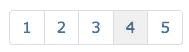

# API 分页的提示和技巧

> 原文：<https://medium.com/square-corner-blog/tips-and-tricks-for-api-pagination-5cacc6f017da?source=collection_archive---------0----------------------->

## 有时，您需要从 API 中得到比从第一组返回结果中得到的更多的东西。

> 注意，我们已经行动了！如果您想继续了解 Square 的最新技术内容，请访问我们在 https://developer.squareup.com/blog[的新家](https://developer.squareup.com/blog)

欢迎来到分页的世界——将结果分散到多个页面或部分。我将概述一些基本的分页概念，并深入探讨我们在 Square 上是如何做事的。

## 分页介绍

分页的概念最初来自书籍，但我认为用列表来描述更容易。在博客、新闻网站、图片分享网站等，你会经常看到分页。每当页面上没有足够的空间一次显示所有的文章时，文章的大列表就会被分成不同的“页面”。您可能熟悉类似于下面的帮助您在页面间导航的 UI 组件。



This is pagination!

API 分页的工作方式略有不同，但基本概念是相同的。当您试图检索一个太大的对象列表时，无论是检索(或消费)相关的计算成本，还是任何过多的网络问题(等待来自 API 调用的几千兆字节的数据可能会对您的应用程序产生意想不到的影响)，服务通常会响应有关如何访问下一个“页面”或结果部分的信息。

我将把这条信息称为“光标”，但它可能有许多名称和形式，包括:

*   作为 URL 参数或在请求头中提供给端点用于后续请求的令牌。
*   关于您正在访问/请求的页面的标准化 url 参数，例如`&page=3`或`start=100`
*   链接到一个不同的 URL 来发出请求(这个通常有一个令牌或 URL 参数)

为了更好地解释这个概念，我制作了一个动画，展示了添加到 v2 List Transactions 端点响应中的光标的样子。您的代码将向 List Transactions 端点发出请求，如果您有超过 50 个事务，API 将返回前 50 个，并将另一个名为`cursor`的字段附加到 json 响应。这是一个分页标记，将它附加到下一个请求(以 URL 参数的形式)会告诉 API 您已经看到了哪些事务，以及在返回下 50 个结果时从哪里开始。该响应包括一个不同的分页光标，供您获取下一个*50 个结果。这种情况一直持续到您“翻阅”完所有请求的结果，最后一页的结果通常比预期的页面大小要少。你可以在下面的动画中看到一个概念性的例子。*


An animation of Square’s cursor based pagination

Square 的[支付 API](https://squareup.com/developers)使用基于令牌的方法，但是有两种不同的方式:`v1`端点返回一个头，其中包含发送下一个请求的链接，而`v2`端点将一个光标令牌添加到 json 响应中，并在后续请求中接受它作为 URL 参数。

在我们的 SDK 的`2.2.1`版本中，我们添加了额外的函数来访问来自头部的分页标记，就像 PHP 中的`[getV1BatchTokenFromHeaders()](https://github.com/square/connect-php-sdk/blob/master/lib/ApiClient.php#L288)`。使用它们可以更容易地获得客户端库的分页标记。

# 怎么全部搞定？

在大多数情况下，当您体验分页时，您可能想要列表中的所有项目，并且不喜欢翻阅结果所需的额外工作。以下是一些最佳实践，可以让您在获得所有结果时不那么痛苦:

## **避开它**

虽然有点厚颜无耻，但从概念上来说，这是您能够获得最佳性能的方式。许多 API 允许您基于特定标准查询项目，或者只返回数据的某些子集。例如，Square 的[列表事务](https://docs.connect.squareup.com/api/connect/v2#endpoint-listtransactions)端点允许您基于时间范围进行查询。如果您知道您要查找的事务只发生在特定的时间范围内，那么您可以从一开始就缩小结果集的范围，在许多情况下，与在应用程序中过度提取然后过滤相比，这样可以消除分页并提高性能。

## 循环时

根据您选择的编程语言，分页可能是`while`的一个很好的用例。基本的工作流程是，*当*在响应中获得分页标记时，继续发出后续请求。伪代码可能是这样的:

```
Page = GetPageOfItems();
//process the data from the page, or add it to a larger array, etc.while( Page->cursor )
    Page  = GetPageOfItems(Page->cursor);
    //process the data again
end
```

一旦 API 停止对分页光标的响应，您就可以停止循环并继续执行完整的数据集。对于这样的方法，有几个要点需要记住:

*   使用这种方法很容易达到速率限制，所以要注意像`429`响应代码这样的东西。
*   来自 API 的任何不返回游标的错误都可能会过早地停止执行，所以要经常检查是否从 API 获得了良好的响应。
*   您可能希望包括一些检查，以确保您在某个上限停止引入更多的信息，以防 API 响应的信息比您预期的多得多，并一直分页、分页、分页…

希望这是一个有用的资源，下次你需要分页(或避免分页！)你从一个 API 得到的结果。如果您对 Square 的 API 分页有更多问题，可以看看参考资料中的 [v1](https://docs.connect.squareup.com/api/connect/v1/#pagination) & [v2](https://docs.connect.squareup.com/api/connect/v2#paginatingresults) 。