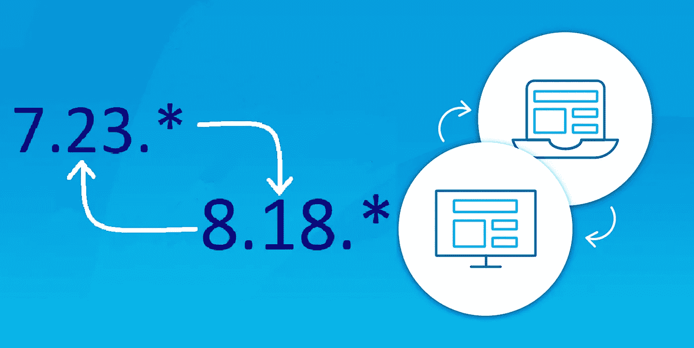
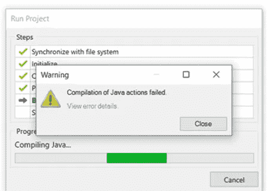
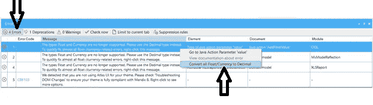

# 升级 Mendix Studio Pro 的提示和技巧

> 原文：<https://medium.com/mendix/tips-and-tricks-for-upgrading-mendix-studio-pro-8ec428c51266?source=collection_archive---------3----------------------->

# 这篇文章回答了围绕这个主题的一些常见问题。

# 我需要升级吗？

# 为什么不立即升级到 Mendix 9？

# 如何安全升级？

## **需要升级**

为什么要升级到最新的 **LTS** (长期支持——Studio Pro 版本(8.18。*)

这是 Mendix 为生产应用程序推荐的版本。LTS 版本包括最新的修复程序，并从较新的 Studio Pro 版本(如 Mendix 9)向后更新。如果发现问题，它们会被反向移植到最新的 LTS 版本。

由于 Mendix 7 与 Mendix 8 在某些方面确实有所不同:Atlas UI、Java 版本、SVN 版本、数据库版本，因此在一个 Mendix 版本中维护应用程序更容易。

Mendix 每年都努力发布新的主要 Studio Pro 版本。Mendix 向后支持 2 个完整的主要版本。当 Mendix 发布 Mendix 10 时，将停止对 Mendix 7 应用程序的支持。

## **您为什么不立即升级到 Mendix 9？**

Mendix 9 带来了最新版本的 Mendix Studio Pro，但当用于在生产中运行应用程序时，这可能会有很大的风险，因为它仍在开发中，新功能仍处于测试阶段，正由 Mendix 和社区进行测试。

即便如此，在中期支持版本(版本 9.6，自 2021 年 10 月开始可用)发布之前迁移到 Mendix 9 仍然有一些风险，但可能适合于某些您希望利用本机移动功能或本机工作流引擎等新功能的应用程序。

升级到 9.2/9.3 可能是一个选择，但是你需要记住“向前修补”的场景。新版本可能会有您或社区无法识别的错误，如果是这样的话，可能意味着阻塞进程。在这种情况下，您需要等待 Mendix 修补该问题，然后才能继续。需要知道的一个非常重要的事实是:**你不能回滚一个 Mendix 版本**，这就是为什么最好在一个分支中测试升级(稍后会详细介绍)

## **如何升级？**

下面你可以找到将一个项目从 Mendix 7 升级到 Mendix 8 的一般操作文档([https://docs.mendix.com/releasenotes/studio-pro/8.18](https://docs.mendix.com/releasenotes/studio-pro/8.18))。

## **提交更改**

如果您有任何更改，请确保在开始流程之前提交这些更改。

正如我上面提到的，升级应该在一个单独的分支中完成，这个分支以后可以用来替换主线。此外，在硬盘上保留项目的当前版本可能会有所帮助，以防遇到用户库问题。

## **将项目升级到 7.23.19**

使用 Studio Pro 7.23.19 作为要升级的版本，并在您的分支中提交该版本，以避免在升级到 8 的尝试失败时再次执行此操作。

7.23.24 是 Mendix 7 的最新版本(在撰写本文时)，但 7.23.19 将足以准备好升级到 Mendix 8，因为 7.23 是 LTS 版本:[https://docs.mendix.com/releasenotes/studio-pro/7.23](https://docs.mendix.com/releasenotes/studio-pro/7.23)

## **升级非平台支持的市场模块**

可能有一个 Mendix 8 模块可用于您想要更新的市场模块。在这种情况下，在项目升级后升级模块**是可以的。**

当试图升级 **CommunityCommons** 时，一些 Java 动作在新版本中被移除。注意:如果是这样的话，除非真的有必要，否则不要升级这个模块。

经常提交(你应该经常做的)，以防上述情况发生。这将防止返工。

Compilation of Java actions failed

Java 错误是意料之中的，但是通常可以通过从市场上更新到 Mendix 8 版本的模块来解决。如果实现了定制的 java，则需要手工修改和修复代码。惯例是尽可能接近基本门第，特别是因为这个原因；**可维护性**。

> **Mendix 8** 运行在 **Java 11** 上，而 **Mendix 7** 运行在 **Java 8** 上。确保您的 Java 操作与 Java 11 兼容。官方的 Java 8 到 11 迁移指南可以在 Oracle JDK 迁移指南的从 JDK 8 迁移到更高的 JDK 版本部分找到。
> 
> [https://docs . mendix . com/ref guide 8/moving-from-7-to-8 #弃用的 API](https://docs.mendix.com/refguide8/moving-from-7-to-8#deprecated-apis)

## 将您的项目升级到最新的 LTS 版本(8.18。*)

Studio Pro 8.18 拥有 Mendix 的长期支持(LTS)。它是一个稳定和安全的版本，可以被认为是最好的移植版本之一。

每隔几周就会有更新的 8.18 版本出来。由于 8.18 是当前的 LTS，您应该可以安全地升级到 8.18 序列中的最新版本。确保**总是**阅读发行说明，看看是否有可能破坏你的项目的大的改变或反对。

## **升级平台支持的市场模块和小部件**

所有支持平台的模块和小工具都可以从正规市场下载。

通用市场模块下载:

带有模板的电子邮件模块

安全声明标记语言（Security Assertion Markup Language 的缩写）

深层链接

社区公共资源

## **检查错误、警告&反对**

修复所有**错误**，以及所有**易修复** **警告**和**弃用**。例如，不再支持货币和浮动属性类型，但在 Studio Pro 8 中很容易修复。

**Deprecations**

在控制台栏(错误和警告旁边)中，您可以找到“弃用”选项卡。您可以**右键单击，看看您是否可以求解/转换**这些值为新值。之后测试这些更改的值。

**测试升级后的应用**

这将是明智的，尤其是如果您已经升级了具有跨模块关联等的模块。，根据生产数据库检查您的本地部署，并验证所有数据都完好无损。

成功迁移到 8 之后，一定要提交您的工作！

**用升级的分支替换主线**

如果您的分支线路中有一个工作副本，您不能将它合并回仍在 Mendix 7.23 中的主线。*.要把你的 Mendix 8 分支带到主线上，有一个具体的方法。

将所有项目从分支文件夹复制到主线文件夹，除了。svn 目录。确保您启用了 windows 资源管理器选项“显示隐藏文件”。完成后，你可以从主界面再次打开 Studio Pro，然后像往常一样提交。

这是将特定版本复制到某一行的常见方式。

**上方**:可以手动将一条支线移动到另一条线上，无需合并；基本上是一行一行的硬拷贝。如果您执行了该操作，SVN 将在 Studio Pro 中将该副本视为“更改”。提交这些更改，您就成功地用升级后的支线覆盖了主线。

**缺点**:你会丢失你的提交历史，因为复制分支线会被看做一个大动作。因此，您将看到一次提交中的所有更改，而不是单独提交的列表。如果在重写项目文件时出现问题，您可以在再次尝试之前单击 Studio Pro 中的“恢复所有更改”。

当您将项目升级到 8.18 时，您还需要乌龟 SVN 的相关版本:

*   为了深入了解您的团队服务器提交
*   要访问修订图，请执行以下操作
*   还是为了解决矛盾。

在撰写本文时，最新版本是 1.14.1(乌龟 LTS)。链接:[https://tortoisesvn.net/downloads.html](https://tortoisesvn.net/downloads.html)。

我希望这篇文章能解决围绕这个话题的所有常见问题。

## 阅读更多

 [## Studio 系列和 Mendix 版本- Studio 9 指南| Mendix 文档

### 在 Mendix Studio 中，每当新的 Mendix 版本成为…

docs.mendix.com](https://docs.mendix.com/studio/general-versions)  [## 从 Mendix Studio Pro 8 迁移到 9 - Studio Pro 9 指南| Mendix 文档

### Mendix Studio Pro 9 和 Mendix Studio 9 为您提供了强大的新工具来增强您的应用程序。有关变更的完整列表…

docs.mendix.com](https://docs.mendix.com/refguide/moving-from-8-to-9)  [## 创建支线- Studio Pro 9 指南| Mendix 文档

### 使用“创建支线”对话框通过支线管理器创建新支线:查看创建…

docs.mendix.com](https://docs.mendix.com/refguide/create-branch-line-dialog)  [## 分支部门经理- Studio Pro 9 指南| Mendix 文档

### 支线管理器用于管理存储在版本控制服务器上的应用程序的支线。的…

docs.mendix.com](https://docs.mendix.com/refguide/branch-line-manager-dialog) 

*来自发布者-*

*如果你喜欢这篇文章，你可以在我们的* [*中页*](https://medium.com/mendix) *找到更多喜欢的。*

*对于希望开始使用 Mendix 平台的创客，您可以注册一个* [*免费帐户*](https://signup.mendix.com/link/signup/?source=direct) *，并通过我们的* [*学院*](https://academy.mendix.com/link/home) *获得即时学习。*

有兴趣加入我们的社区吗？你可以加入我们的 [*懈怠社区频道*](https://join.slack.com/t/mendixcommunity/shared_invite/zt-hwhwkcxu-~59ywyjqHlUHXmrw5heqpQ) *或者想更多参与的人，看看加入我们的* [*遇见 ups*](https://developers.mendix.com/meetups/#meetupsNearYou) *。*