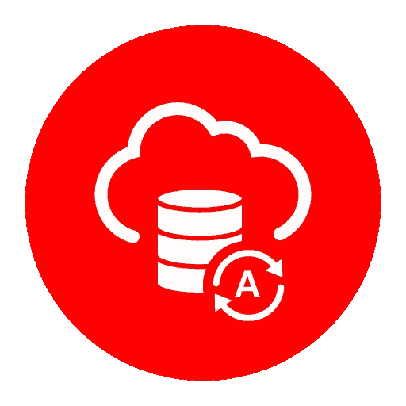

# 连接技巧。NET 应用程序到 Oracle 自治数据库

> 原文：<https://medium.com/oracledevs/tips-for-connecting-net-apps-to-oracle-autonomous-database-185aeff1a62c?source=collection_archive---------3----------------------->

去年，我在博客中写了[如何将 Azure Web Apps 连接到 Oracle 自主数据库](https://blogs.oracle.com/dbcs/connecting-azure-web-apps-to-oracle-autonomous-database)。许多开发人员已经使用这些指令开始开发各种。NET 自治数据库(ADB)应用，而不仅仅是 Azure 应用。很高兴听到这个消息！

这并不是说所有连接到亚行的尝试都是顺利的。如果开发人员遇到问题，他们会向我寻求帮助，这通常是由于我的教程和开发人员使用的配置不同造成的。在所有情况下，我们在对配置差异进行故障排除时都成功地进行了连接。我想分享这些发现，以便社区能够受益。

# 启用为 Web 应用程序加载用户配置文件

如果您遇到 ADB web 应用程序的错误`ORA-00542: Failure during SSL handshake`，请确认您已将 Microsoft Internet 信息服务配置 LoadUserProfile 设置设置为“true”(内部部署)或将 WEBSITE_LOAD_USER_PROFILE 设置设置为“1”(Azure)。默认情况下，该值为“假”或“0”。加载用户配置文件使您的 web 应用程序能够使用存储在文件系统或 Azure 上的 Oracle wallet。您需要 Oracle wallet 身份证明来连接到大多数 ADB 实例。

ORA-00542 错误是一般的 TLS/SSL 错误。这也可能是其他问题的结果。然而，不启用用户配置文件的加载是我见过的发生这个错误的最常见的原因。

# 启用 TLS 1.2 英寸。网

大多数 ADB 连接需要传输层安全性(TLS) 1.2 或更高版本。如果 TLS 1.2 没有在堆栈中正确配置，您通常会看到一个 ORA-00542 异常，其内部异常指示“提供给程序包的凭据未被识别。”

亚行支持 TLS 1.2。ODP.NET 12.2 和更高版本支持 TLS 1.2。但是关于。NET 框架和。网芯？

截至本文撰写时，最低。目前支持的 NET Core 版本是 2.1。。NET Core 2.1 支持 TLS 1.2。所以，这不是问题。NET Core，无论您使用的是哪种支持的版本。

开着。NET Framework，您使用的版本可能需要额外的配置才能启用 TLS 1.2。微软推荐。NET Framework 4.7 或更高版本。如果你用低一点的。NET Framework 版本，通常需要额外的配置。[微软在中提供了配置 TLS 的说明。NET 框架](https://docs.microsoft.com/en-us/dotnet/framework/network-programming/tls)。

# 使用最新的 ODP.NET 版本

一般来说，ODP.NET 开发团队会修复每个主要和次要版本的错误。我建议在连接到亚行时使用最新的 ODP.NET 版本。最新版本将始终与亚行合作，并应用最新的补丁。你可以从 [NuGet Gallery](https://www.nuget.org/) (托管 ODP.NET 和 ODP.NET 核心)或 [My Oracle Support](https://support.oracle.com/) (非托管 ODP)下载最新版本。网)。

# Azure Web Apps 放弃空闲的 TCP 连接

一种不同的连接问题类型是 Azure 连接在空闲超过四分钟时被切断。Azure Web Apps 将丢弃这些 ADB 连接，从而导致错误，例如`ORA-12570: Network Session: Unexpected packet read error`。这个问题不是亚行独有的。任何使用 Azure 负载平衡器的数据库都会发生这种情况。

来自 [Azure 文档](https://docs.microsoft.com/en-us/azure/load-balancer/load-balancer-tcp-idle-timeout):

*在其默认配置中，Azure 负载平衡器的空闲超时设置为 4 分钟。如果不活动的时间超过超时值，则无法保证客户端和云服务之间的 TCP 或 HTTP 会话保持不变。*

有两种方法可以防止连接被切断。

*   增加 Azure 负载平衡器上的默认空闲超时设置 IdleTimeoutInMinutes。
*   或者设置 ODP.NET KeepAlive 属性( [KeepAlive](https://docs.oracle.com/en/database/oracle/oracle-data-access-components/19.3/odpnt/ConnectionKeepAlive.html#GUID-6C24C49B-5E89-4E62-BEB8-828D3B1B47D7) 、 [KeepAliveInterval](https://docs.oracle.com/en/database/oracle/oracle-data-access-components/19.3/odpnt/ConnectionKeepAliveInterval.html#GUID-ED6AE59F-F97F-4E25-B8A1-D6C0BD5CF516) 和 [KeepAliveTime](https://docs.oracle.com/en/database/oracle/oracle-data-access-components/19.3/odpnt/ConnectionKeepAliveTime.html#GUID-CBF5E160-AE1F-4147-AA7C-2CD4E23EE105) )定期发送一个没有数据的探测包来重置负载平衡器的空闲超时。

这两种方法都可以防止负载平衡器过早地切断您的空闲数据库连接。

# 结论

这些是我见过的客户遇到的一些常见亚行 ODP.NET 连通性问题以及解决这些问题的方法。希望它能帮助你与亚行建立联系和合作。