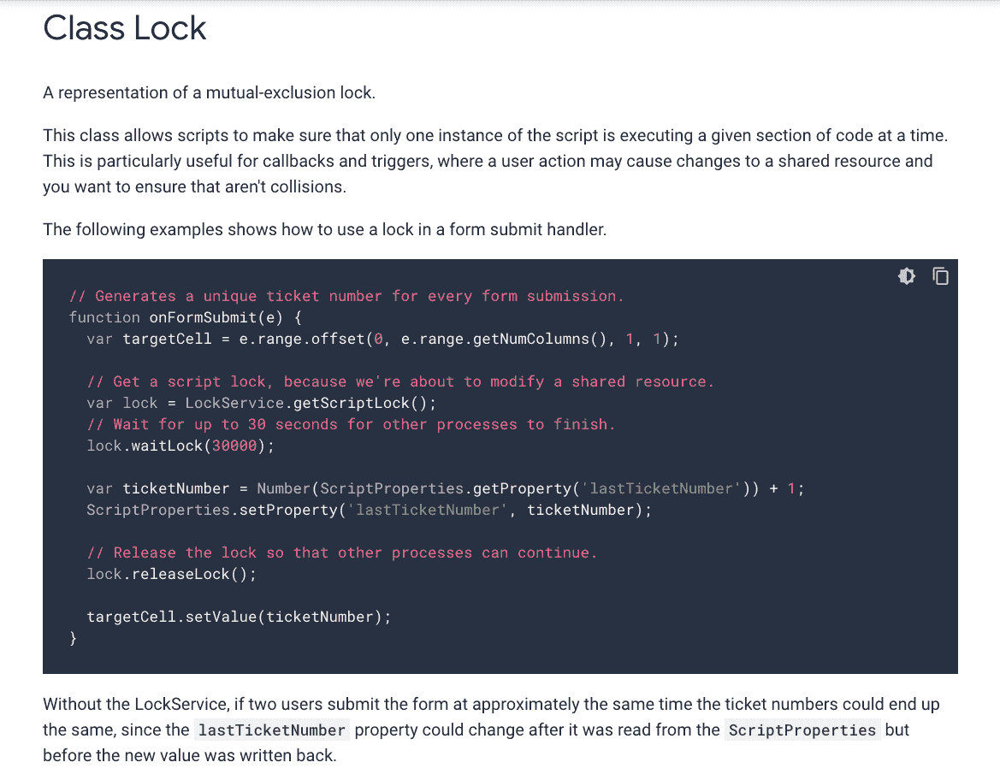
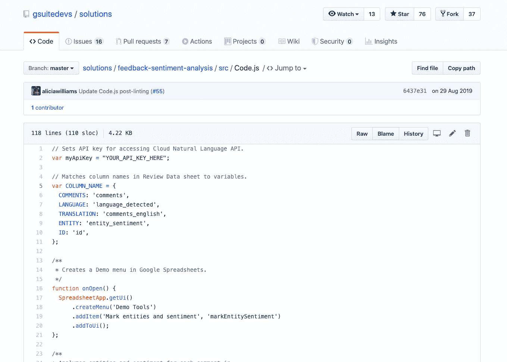
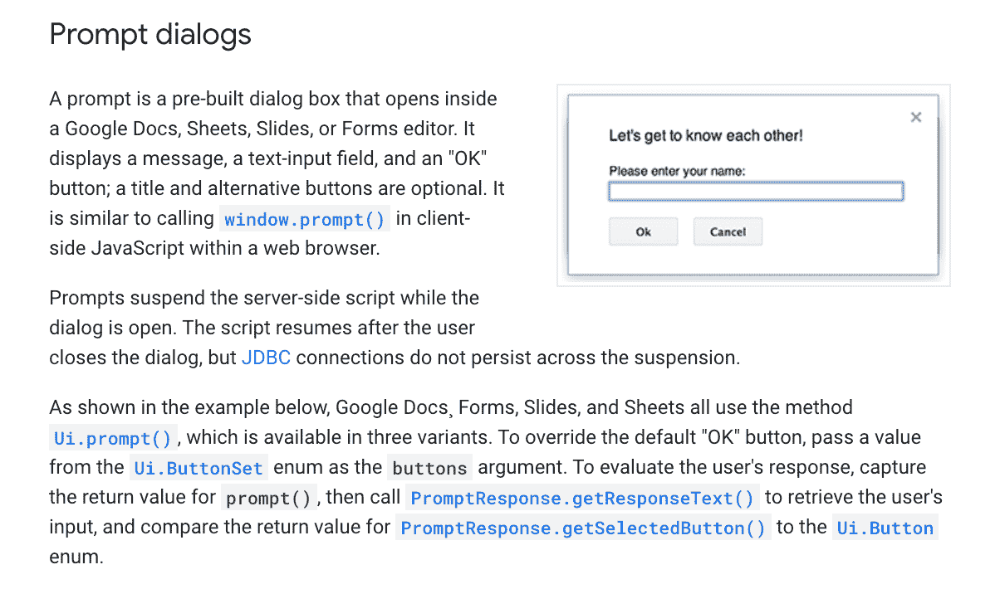
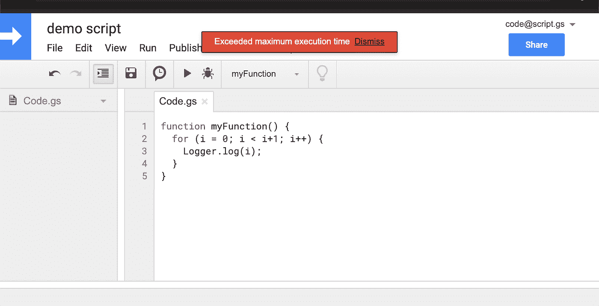
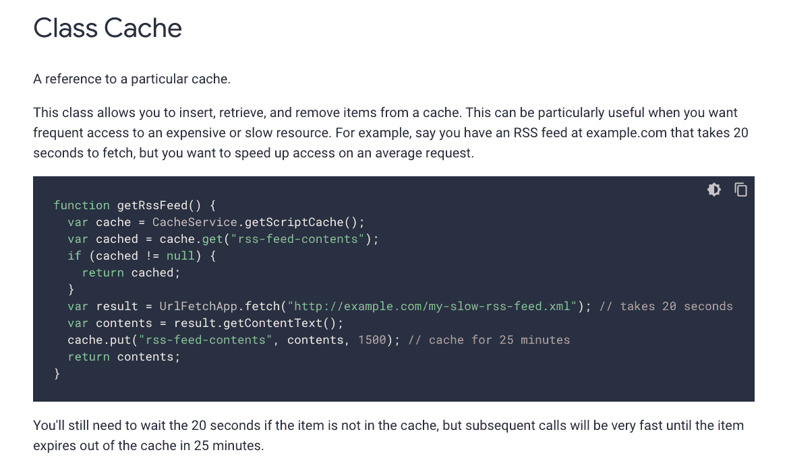

# 使用 Google Apps 脚本构建可靠、安全且可扩展的架构的技巧

> 原文：<https://medium.com/google-developer-experts/tips-on-building-a-reliable-secure-scalable-architecture-using-google-apps-script-615afd4d4066?source=collection_archive---------1----------------------->

Photo by [Àlex Rodriguez](https://unsplash.com/@alexabad?utm_source=medium&utm_medium=referral) on [Unsplash](https://unsplash.com?utm_source=medium&utm_medium=referral)

大多数围绕使用 Apps 脚本创建的解决方案或自动化的对话最终会达到一个点，即能够解决围绕其可靠性、安全性和可扩展性的问题成为一个挑战，如果与在其他平台(如 AWS、GCP、Firebase 等)上构建类似的应用程序相比，这一点更为突出。).

一些最常见的摩擦点包括-

*   管理并发执行
*   能够安全地存储、访问和管理 API 密钥、令牌等。
*   灵活扩展，而不会达到那些[配额和限制](https://developers.google.com/apps-script/guides/services/quotas)

如果有人在打造下一个 Spotify 或网飞，我不会推荐使用 [G Suite 的应用脚本](https://gsuite.google.com/products/apps-script/)(显然😂)但是，根据中小型企业使用的应用程序的类型，我们仍然可以通过轻松地使用一些鲜为人知的服务来非常有效地利用这个平台。
虽然这并不是说 Apps 脚本能够适应每一种用例，但是可以把这种讨论看作是改进现有应用的方法。

在这篇文章中，我们将看到如何通过解决这些问题的一部分来导航我们的方法，并且探索我们可以从一开始就烘焙一些解决方案的方法！

# 可靠性

在我使用 Apps 脚本的前 6 个月，它主要是作为一个 webhook 来捕获和存储电子表格中的数据，我遇到了丢失条目的问题，有时甚至是不准确的条目，使整个数据集不可靠。我花了一些时间才明白这是因为端点上的并发点击(当[将脚本部署为 web 应用](https://developers.google.com/apps-script/guides/web#deploying_a_script_as_a_web_app)时我们得到的链接)。很久以后，我才接触到 Apps Script 提供的'[锁服务](https://developers.google.com/apps-script/reference/lock/lock)，它就是为处理这种情况而设计的。

> 该服务允许脚本阻止对代码段的并发访问。当有多个用户或进程修改共享资源并希望防止冲突时，这很有用。

幸运的是，我甚至不需要自己创建一个例子来说明它的用法，因为' [Lock](https://developers.google.com/apps-script/reference/lock/lock) '类的现有文档中已经有了一个关于这个场景的例子。

这是文档中的一个快照，供参考-

[Lock Class](https://developers.google.com/apps-script/reference/lock/lock) in Google Apps Script

也有不同的[实现方法](https://developers.google.com/apps-script/reference/lock/lock#methods)可用，根据您想要构建的架构类型，您可以选择返回一个布尔值或者让函数抛出一个异常。

在您现有的开发环境中引入“[锁服务](https://developers.google.com/apps-script/reference/lock/lock-service)，肯定会在可靠性方面给您带来提升。

# 安全性

大多数连接到第三方服务的应用程序脚本的开源示例在代码库中至少有一个(如果不是更多的话)变量，这些变量将被声明为 API 密钥、令牌或其他秘密的占位符。现在，想象一下，如果您计划与您的同事或客户共享这个实现，很有可能您也必须向他们公开您的硬编码凭证；在我与其他技术专家的几乎所有对话和个人经历中，这都被认为是一个主要的安全*风险。

* *出于本文的目的，我将把我的范围限制在这个(特定)场景的* ***安全性*** *上。*

让我们以[反馈-情感-分析](https://github.com/gsuitedevs/solutions/blob/master/feedback-sentiment-analysis/src/Code.js)解决方案为例，其中第 2 行有一个占位符供您设置 API 键

Example solution: [feedback-sentiment-analysis](https://github.com/gsuitedevs/solutions/blob/master/feedback-sentiment-analysis/src/Code.js)

给定在 Google Sheets 中[创建自定义菜单](https://developers.google.com/apps-script/guides/menus)的实现(第 17 行)，您可以放心地假设这是一个容器绑定脚本(同样，没有找到可安装的触发器)。

解决这些情况的一个方法是-

*   引入一个“[提示](https://developers.google.com/apps-script/guides/dialogs#prompt_dialogs)”对话框，用户可以在执行应用程序时输入 API 凭证(可能是第一次)

[Prompt dialogs](https://developers.google.com/apps-script/guides/dialogs#prompt_dialogs) in Google Apps Script

*   然后使用'[属性服务](https://developers.google.com/apps-script/guides/properties)'将该信息存储为文档、用户或脚本属性的一部分(取决于用例)

通过这种方式，所有这些重要的凭证和机密都不会以可见的方式显示给每个人使用，如果有人试图以编程方式从设置的属性中检索信息，您总是可以跟踪日志来识别用户。

这类似于为 Google Apps 脚本构建 [OAuth2 库时使用的方法。](https://github.com/gsuitedevs/apps-script-oauth2)

# 可量测性

不允许应用脚本无限扩展的一个重要因素是它的[配额和限制](https://developers.google.com/apps-script/guides/services/quotas)。在这篇文章中，我将展示在两个最重要的方面变得聪明的方法

1.  脚本运行时—适用于每一次执行
    (不要与“自定义函数运行时”混淆)
2.  URL 获取调用—适用于用户/帐户的每日阈值

# 脚本运行时

通常，当迭代一大组电子表格数据时，您需要更高的运行时间，但更多时候，会出现错误——“超出最大执行时间”。

“Exceeded maximum execution time” error in Google Apps Script

一种更好的方法是，不直接通过循环运行主函数，您还可以跟踪每个循环执行了多长时间，并在脚本达到其运行时阈值之前，通过生成一个基于时间的触发器[以编程方式终止脚本，主函数足够智能，可以识别其最后一个检查点是什么，并在下次调用时从那里开始，而不是重新开始， 从顶部——这可以很容易地通过电子表格中的标记或者通过将该信息存储在](https://developers.google.com/apps-script/reference/script/clock-trigger-builder)[脚本属性](https://developers.google.com/apps-script/reference/properties/properties-service#getScriptProperties())中来实现。

关于这个实现的更详细的介绍可以在我不久前撰写的原始文章中找到。

# URL 获取调用

可能有几个例子，你可能最终会消耗大量的 URL 获取调用。-

*   虽然普遍不受欢迎，但您可能必须轮询 API 以了解其任意数量的资源的更新状态
*   考虑到更大的日期范围，通过 data studio 的连接器服务与它连接也可以证明 URL 获取调用的大量使用
*   对于您正在查询的数据集，一些第三方 API 服务可能有大量的分页，或者有多个跳转来捕获必要的信息

让我们以 data studio 连接器用例为例！在这里，为了节省 URL 获取调用，您可以利用 Apps 脚本的'[缓存服务](https://developers.google.com/apps-script/reference/cache)，其中一个用户在给定时间点请求的数据可以存储在[脚本缓存](https://developers.google.com/apps-script/reference/cache/cache-service#getscriptcache)中，供另一个用户在大约相同的时间请求相同的信息集(或子集)时使用。

然后，由代码逻辑首先检查缓存中请求的数据，如果在数据存储的日期范围内，则返回该数据，而不是进行另一个 URL 获取调用。

在' [Cache](https://developers.google.com/apps-script/reference/cache/cache) '类文档中可以找到一个不同的、尽管很好的例子，它讲述了获取一个响应非常慢的 RSS 提要

[Cache Class](https://developers.google.com/apps-script/reference/cache/cache) in Google Apps Script

虽然这解决了一个稍微不同的痛点，但是您也可以使用相同的方法来保存您的 URL 获取调用。

本文讨论的一些服务在大多数实现中并没有被重点强调，甚至没有被考虑过，虽然它们并没有描绘出完美的解决方案，但我希望了解它们的存在会有所帮助。

如果您碰巧知道针对这些结构提高效率的更好方法，请告诉我们😊或者通过 [Twitter](https://twitter.com/schoraria911) (DMs 开放) [LinkedIn](https://www.linkedin.com/in/schoraria/) 或者在这里的评论区。