# 使用 Tkinter 创建计算器应用程序——Tkinter 完全指南

> 原文：<https://medium.com/edureka/tkinter-tutorial-f655d3f4c818?source=collection_archive---------0----------------------->

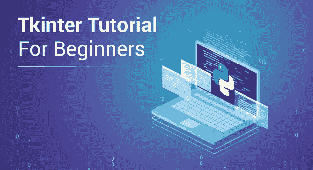

Tkinter Tutorial — Edureka

这篇 Tkinter 教程文章将帮助您开始了解用于 Python 的 Tkinter 库，并让您深入了解如何使用 Python 创建图形用户界面(GUI)应用程序。Tkinter 的应用程序是无穷无尽的，它是一个非常受欢迎和容易学习的库。

在本 Tkinter 教程中，我们将介绍以下概念:

*   什么是图形用户界面(GUI)？
*   创建 GUI 的 Python 库
*   Tkinter 是什么？
*   Tkinter 的基础知识
*   Tkinter 小工具
*   几何管理
*   布局和小部件的组织
*   绑定功能
*   图像和图标
*   用例—使用 Tkinter 的计算器应用程序

# 什么是图形用户界面(GUI)？

图形用户界面(GUI)只是一个桌面应用程序，帮助你与计算机进行交互。它们用于在台式机、笔记本电脑和其他电子设备中执行不同的任务。

*   **GUI** 像**文本编辑器**这样的应用程序被用来创建、阅读、更新和删除不同类型的文件。
*   像数独、象棋和单人纸牌游戏这样的 GUI 应用程序是你可以玩的游戏。
*   像谷歌 Chrome、火狐和微软 Edge 这样的 GUI 应用程序被用来浏览互联网。

它们是我们日常在笔记本电脑或台式机上使用的不同类型的 GUI 应用程序。我们将学习如何创建这些类型的应用程序。

由于这是 GUI 的介绍，请确保您一直关注到最后，因为我们将创建一个真正简单而漂亮的 GUI 应用程序。

这是我个人的偏好，我更喜欢 GUI 而不是命令行。这并不是说命令行有什么问题，而是我更喜欢有很多视觉效果的更直观和互动的应用程序。

你喜欢什么？前往评论区，让我知道。

接下来，在这个 Tkinter 教程博客上，让我们看看为设计我们自己的 GUI 而出现的 Python 库。

# 创建图形用户界面的 Python 库:

Python 有太多的库，这 4 个库在 GUI 方面尤为突出。具体如下:

*   基维
*   Python QT
*   wxPython
*   Tkinter

在所有这些当中，Tkinter 被许多学习者和开发者所偏爱，仅仅因为它是如此的简单和容易。

我相信过一会儿你也会有同样的看法。

注意:在这一点上，我想说的是，您需要一点 Python 知识来开始使用 Tkinter。如果您之前没有任何 Python 编程经验，也没什么好担心的。我已经专门为初学者创建了一个深入的 python 教程，我在这个博客的末尾链接了它，我得到了一些非常好的反馈，所以我建议你们在读完这个 Tkinter 教程博客后去看看。

接下来在这个 Tkinter 教程博客上，让我们看看 Tkinter 到底是什么。

# Tkinter 是什么？

Tkinter 实际上是一个内置的 **Python** 模块，用于创建简单的 **GUI** 应用。它是 **Python** 中 **GUI** 应用最常用的模块。

你不需要担心 **Tkinter** 模块的安装，因为它带有 **Python** 默认设置。

本教程我将使用 **Python 3.6** 版本。所以，如果你正在使用下面的版本，请更新一下 Python。

给你们的另一个建议是不要盲目复制代码。试着通过随心所欲地修改它，然后观察和理解由此产生的变化来写作。

接下来在这个 Tkinter 教程博客上，让我们看看 Tkinter 的基础知识，这样我们就可以着手创建我们自己的 GUI 了。

# Tkinter 的基础知识

考虑下图，它显示了应用程序如何在 Tkinter 中实际执行:

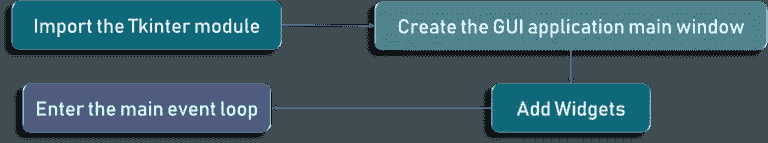

首先，我们首先导入 Tkinter 模型。接下来，我们创建主窗口。基本上，我们就是在这个窗口中执行操作和显示视觉效果以及所有的东西。稍后，我们添加小部件，最后我们进入主事件循环。

如果你注意到了，这里有两个你可能不知道的关键词。这是两个关键词:

*   小工具
*   主事件循环

一个事件循环基本上是告诉代码保持显示窗口，直到我们手动关闭它。它在后端无限循环运行。

为了更清楚起见，请查看以下代码:

```
import tkinter 
window = tkinter.Tk()
# to rename the title of the window window.title("GUI")
# pack is used to show the object in the window
label = tkinter.Label(window, text = "Hello World!").pack()
window.mainloop()
```

如您所见，我们正在导入 Tkinter 包并定义一个窗口。接下来，我们会给出一个窗口标题，当你打开一个应用程序时，它会显示在标题标签上。

例如，当您打开 Word 应用程序时，标题选项卡上会显示 Microsoft Word，对吗？同样，这里我们称之为 GUI。根据需要，我们可以随意称呼它。

最后，我们有一个标签。标签只是需要在窗口上显示的输出。在这种情况下，正如您已经看到的，它是 hello world。

查看上述代码的输出:

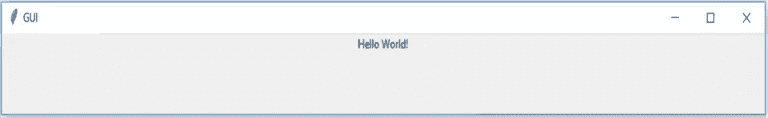

接下来，在这个 Tkinter 教程博客上，让我们看看 Tkinter 提供的大量小部件。

# Tkinter 小工具

我们需要问的第一个问题是，什么是 widgets？

小部件类似于 **HTML** 中的元素。在**t inter**中，你会发现不同类型的**小部件**对应不同类型的元素。

让我们来看看 **Tkinter 中对所有这些小部件的简要介绍。**

查看下图，了解主要使用的 Tkinter 小部件列表:

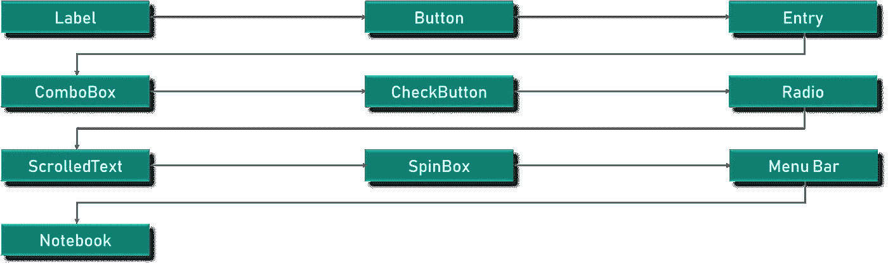

*   **画布** — **画布**用于在您的 **GUI** 中绘制形状。
*   **按钮** — **按钮** widget 用于将按钮放置在 **Tkinter** 中。
*   **复选按钮** — **复选按钮**用于在您的应用程序中创建复选按钮。请注意，您可以一次选择多个选项。
*   **条目** — **条目**小部件用于在 **GUI** 中创建输入字段。
*   **框架** — **框架**用作**t 中间**的容器。
*   **标签** — **标签**用于创建单行小部件，如**文本**、**图片等。**
*   **菜单** — **菜单**用于在 **GUI** 中创建菜单。

这些小部件是 Tkinter 如此受欢迎的原因。它使理解和实际使用变得非常容易。

为了更好地理解，让我们逐一查看所有这些小部件。

请注意，我不会用每个小部件的完整语法来淹没您。代码片段足以让你的学习变得更容易，我这样做只是为了让你在学习时避免任何混乱或歧义。

我们要检查的第一个小部件是标签小部件。

# 标签小部件:

如前所述，标签用于创建文本和图像等，但需要注意的是，它只能是单行定义。

下面是代码片段:

```
l1 = Label (window, text="edureka!“ font=("Arial Bold", 50))
l1.grid (column=0, row=0)
```

我们以 Edureka 的名字输入了我们的文本，并按原样打印出来。简单吧？

查看下面的输出:

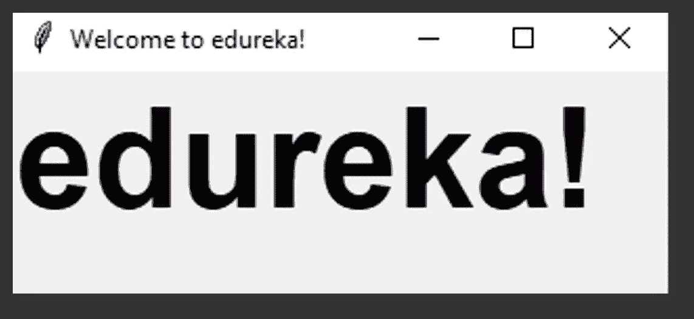

有一种东西叫做几何函数。在接下来的部分中，我们也将详细介绍这一点。

在这一点上，你需要知道的是，它基本上是用来改变窗口大小，并按照我们的要求设置。

查看下面的代码片段:

```
l1 = Label (window, text="edureka!“ font=("Arial Bold", 50))
window.geometry('350x200')
l1.grid (column=0, row=0)
```

在这种情况下，我们将它的宽度设置为 350 像素，高度设置为 200 像素。

这是相同的输出:

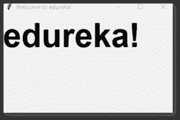

我们将在 Tkinter 教程博客上检查的下一个小部件是按钮小部件。

# 按钮部件:

按钮小部件与标签小部件非常相似。我们创建一个变量，并使用小部件语法来定义按钮要说的内容。

查看以下代码片段:

```
bt = Button (window, text="Enter")
bt.grid (column=1, row=0)
```

这里，我们使用了一个名为 grid 函数的函数，用于设置按钮在窗口中的位置。

代码的输出如下所示:

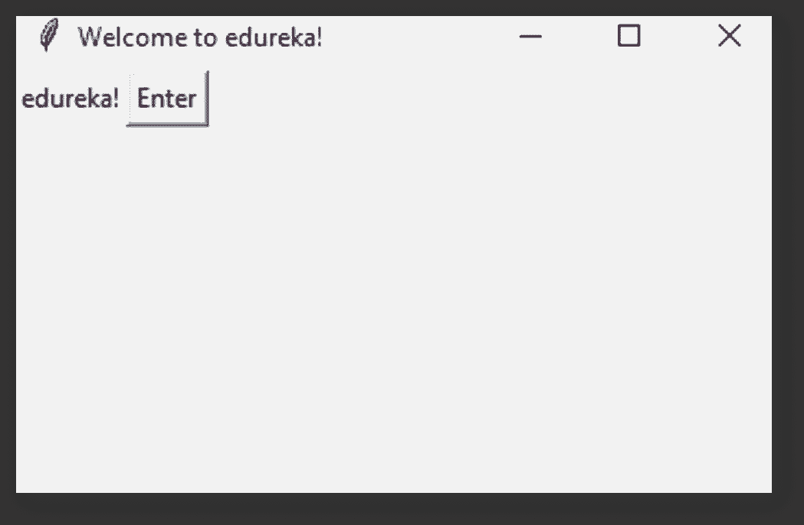

我们还可以改变按钮或任何其他小部件的前景。我们将使用代码中所示的参数 FG。类似地，使用 BG 属性也可以改变背景颜色。

查看代码:

```
bt = Button (window, text="Enter", bg="orange", fg="red") 
bt.grid (column=1, row=0)
```

输出:

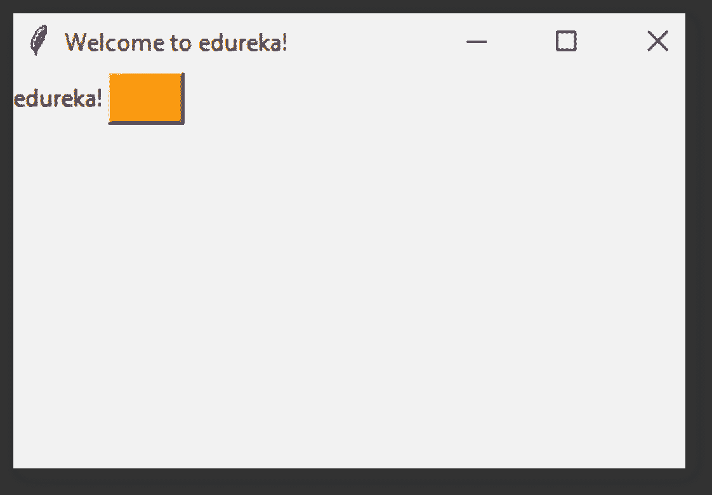

根据我们得到的输出，我们的前景是定义的红色文本，背景是我们使用 bg 参数设置的橙色。

在这一点上，我们有一个可点击的按钮。当我们点击它的时候会发生什么呢？

看看这个片段:

```
**def** clicked():
l1.configure (text**=**"Button was clicked !!")
bt **=** Button (window, text**=**“Enter”, command**=**clicked)
```

所以我们称之为点击事件。我们需要编写当我们单击按钮时应该发生的功能，或者当单击事件被触发时应该发生的功能。

为此，我们有一个名为 clicked 的函数，我们显示一条文本消息，说明按钮被单击。

我们需要在按钮定义中添加一个名为 command 的参数，如图所示。

很简单，对吧？

我们将在 Tkinter 教程博客上检查的下一个小部件是入口小部件。

# 入口小部件:

入口小部件是用来做什么的？

它用于在 GUI 中创建输入字段，以接受文本输入。

查看如下所示的示例代码:

```
txt = Entry(window,width=10)
txt.grid(column=1, row=0)
def clicked():
      res = "Welcome to " + txt.get()
      l1.configure(text= res)
bt = Button (window, text=“Enter”, command=clicked)
```

这里，我们使用 Tkinter entry 类创建一个 textbox。Grid 用于告诉代码我们希望小部件放在窗口的什么位置。

当按钮被点击时会发生什么？

我们有一条消息，上面写着“欢迎使用”,稍后输入到文本区域的任何内容都将与这条消息连接在一起并打印出来。

检查输出。我们已经输入了 python 培训，因此它会显示欢迎使用 Python 培训。

输出:

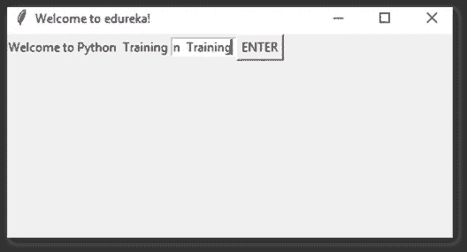

所有这些小部件都非常简单，不仅如此，它们总是很方便。

我们将在这个 Tkinter 教程博客上检查的下一个小部件是 combobox 小部件。

# 组合框小工具

你能快速猜出 combobox 部件是什么吗？

这只是一个下拉菜单，有一些特定的选项。

下面是代码片段:

```
from tkinter.ttk import *
combo = Combobox(window)
combo['values']= (1, 2, 3, 4, 5, "Text")
combo.current(3)
combo.grid(column=0, row=0)
```

所以检查一下，除了窗口之外，combobox 定义没有其他参数。在下一行，我们定义了一些值，比如从 1 到 5 的数字，接下来是文本。1 到 5 是数字输入，但是我们也可以有文本输入。

它是用双引号定义的，我们稍后将设置选择的输入。接下来，我们使用网格函数将小部件放在窗口上。

我们有一个下拉菜单，它显示了我们在代码中定义的所有内容。下面是代码的输出:

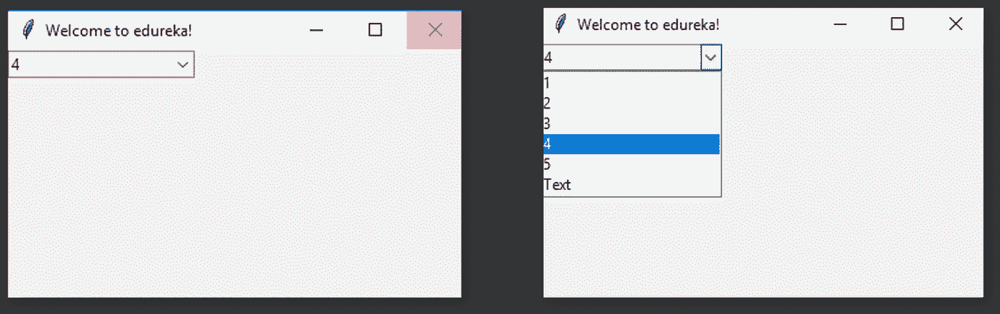

另一个简单的部件，完成了！

我们将在 Tkinter 教程博客上检查的下一个小部件是 Checkbutton 小部件。

# Checkbutton 小部件:

checkbutton 在几乎所有的网站上都被广泛使用。

所以基本上我们使用 checkbutton 类来创建小部件。

代码片段:

```
chk_state = BooleanVar()
chk_state.set (True)
chk = Checkbutton(window, text=‘Select', var=chk_state)
chk.grid(column=0, row=0)
```

我们首先创建一个 booleanvar 类型的变量。

但这不是标准的 python 变量，对吧？没什么好担心的，这是一个 Tkinter 变量。

默认情况下，我们将设置状态保持为 true，这意味着按钮已经被选中。接下来，我们将 **chk_state** 传递给 checkbutton 类，为我们设置检查状态。

输出:

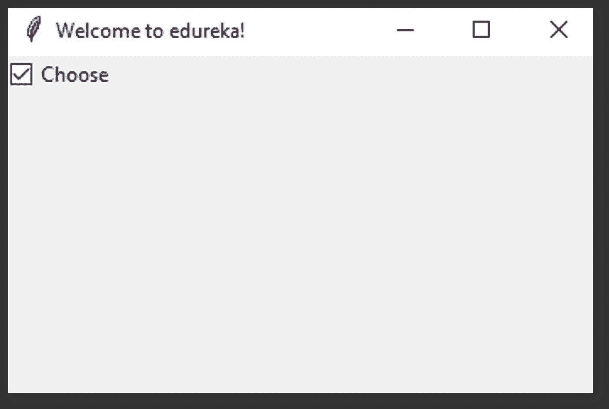

查看上面的输出。所以我们有一个非常简单的带有特定文本的 checkbutton 小部件。

那么，还有哪些像这样简单的小部件可用呢？

我们将在 Tkinter 教程博客上检查的下一个小部件是单选按钮小部件。

# 单选按钮小部件:

单选按钮小部件被广泛使用，我可以向您保证，您以前见过并使用过这个小部件。

我们将使用 radiobutton 类来添加小部件。

看一下代码:

```
rad1 = Radiobutton(window, text=Python', value=1)
rad2 = Radiobutton(window, text=Java', value=2)
rad3 = Radiobutton(window, text=Scala', value=3)
rad1.grid(column=0, row=0)
rad2.grid(column=1, row=0)
rad3.grid(column=2, row=0)
```

这里，我们有不同的值参数。一、二、三。但是，如果它们相同，就会导致冲突，就会出现错误。因此需要注意的是，一个唯一的值被用来寻址单选按钮。

该值应该是唯一的，但是文本数据可以是相同的。这里我们考虑了 Python、Java 和 Scala。根据需求，它可以是你想要的任何东西。

类似地，用于将小部件放置在窗口上的网格函数。

输出:

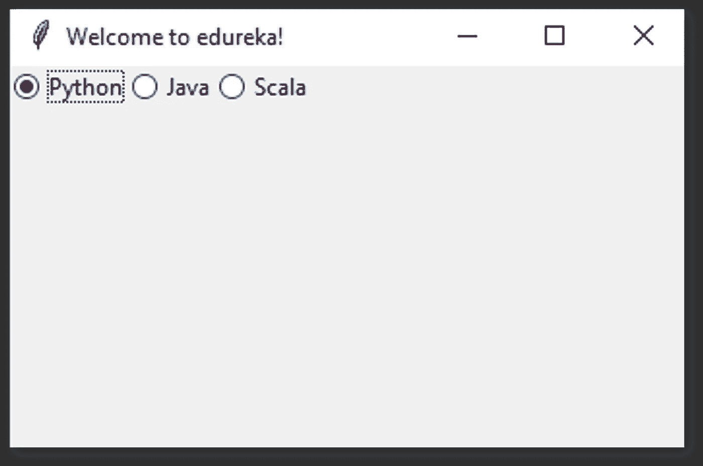

从上面的输出中，请注意，与您可以尝试选择多个的 checkbutton 不同，在单选按钮的情况下，您一次只能选择一个。

我们将在 Tkinter 教程博客上检查的下一个小部件是滚动文本小部件。

# 滚动文本小工具:

另一个不错的小部件是滚动文本小部件。这可以使用滚动文本类来添加。

代码:

```
from tkinter import scrolledtext txt = scrolledtext.ScrolledText(window, width=40,height=10)
```

这里你必须注意的一件非常重要的事情是，你需要指定滚动文本小部件的宽度和高度。如果我们不指定相同的值，整个窗口都会被填满。

您可以使用 insert 方法设置滚动的文本内容。语法非常简单。我们需要使用 **txt.insert** ，将消息作为参数。

输出:

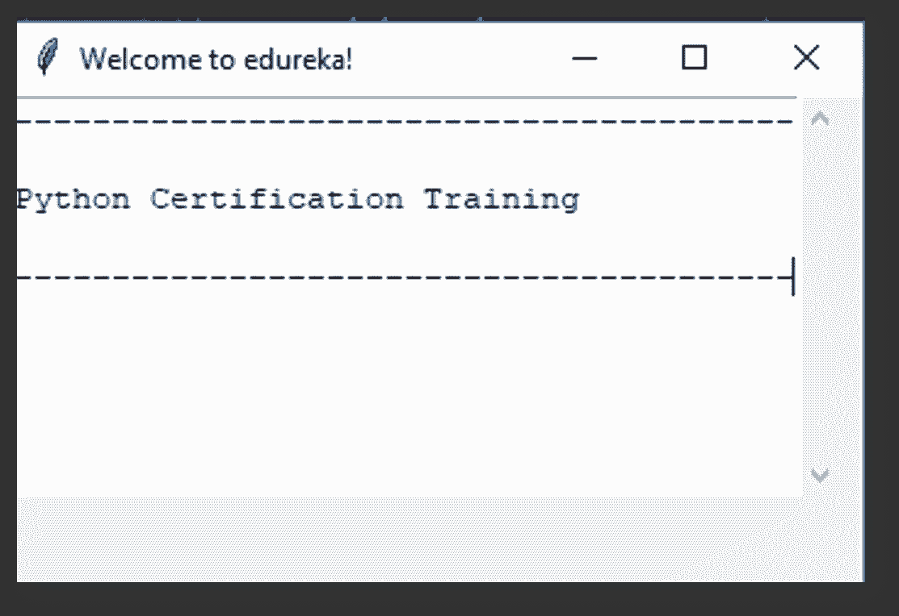

我们将在 Tkinter 教程博客上检查的下一个小部件是消息框小部件。

# 消息框小部件:

让我们快速浏览一下这个简单的小部件。我们在这里也使用 messagebox 库。

代码:

```
**from** tkinter **import** messagebox
messagebox.showinfo('Message title’, 'Message content')
```

导入库并显示消息。但是我们需要在这里定义消息标题和消息内容。

看，这就是事情变得有趣的地方。请看下面的片段:

```
**def** clicked():
    messagebox.showinfo('Message title', 'Message content')
btn **=** Button(window,text**=**‘ENTER', command**=**clicked)
```

这里我们使用了我们学过的两个小工具。我们使用一个按钮点击来显示一个消息框。

以下是输出结果:

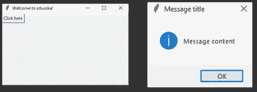

很简单，对吧？

最后但同样重要的是，我们将在本 Tkinter 教程中查看 Spinbox 小部件。

# SpinBox 小部件:

Spinbox 也是一个广泛使用的小部件。有两个选项卡，向上和向下滚动选项卡。这就是它与向下滚动小部件的不同之处。这里，静态数字将在一定的值范围内变化。

代码:

```
spin = Spinbox(window, from_=0, to=100, width=5)
```

我们有 3 个参数——从、到和宽度。From —告知范围的起始值和默认值，to —给出范围的上限阈值。

Width 基本上是将小部件的大小设置为 5 个字符空间。但是因为你做的是 0 到 100，所以 3 对我们来说已经足够了，但是我还是放了 5，这样看起来更好。

你可以把你想要的放在这里，它是有效的，但要确保它比产品系列所能提供的更多。

输出:

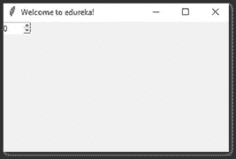

这就是 Tkinter 中主要使用的小部件。

接下来在这个 Tkinter 教程博客上，我们需要看看几何管理。

# 几何管理

**Tkinter** 中的所有部件都有一些几何尺寸。这些度量让您可以组织小部件及其父框架、窗口等等。

**Tkinter** 有以下三个几何管理器类。

*   **pack()** :-它组织块中的小部件，这意味着它占据了整个可用宽度。这是在窗口中显示小部件的标准方法。
*   grid() :-它以类似表格的结构组织小部件。
*   **place()** :-用于将小部件放置在您想要的特定位置。

我们已经在几乎所有以前的代码中看到了网格。如果你有任何疑问，请前往评论区并留下评论，让我们在那里互动。

接下来，在这个 Tkinter 教程博客上，我们需要看看如何组织布局和小部件。

# 组织布局和小部件

为了在**窗口**中安排布局，我们将使用**框架**，类。让我们创建一个简单的程序来看看**框架**是如何工作的。

**步骤:-**

*   **框架**用于在窗口中创建分区。您可以使用 **pack()** 方法的**侧**参数任意对齐框架。
*   **按钮**用于在窗口中创建一个按钮。它需要几个参数，如**文本**(按钮的值) **fg** (文本的颜色) **bg** (背景颜色)

**注意** —任何 **widget** 方法的参数必须是放置 widget 的位置。

在下面的代码中，我们用来在**窗口中放置**、**顶 _ 帧**、**底 _ 帧**。

```
import tkinter
window = tkinter.Tk()
window.title("GUI")
# creating 2 frames TOP and BOTTOM
top_frame = tkinter.Frame(window).pack()
bottom_frame = tkinter.Frame(window).pack(side = "bottom")
# now, create some widgets in the top_frame and bottom_frame
btn1 = tkinter.Button(top_frame, text = "Button1", fg = "red").pack()# 'fg - foreground' is used to color the contents
btn2 = tkinter.Button(top_frame, text = "Button2", fg = "green").pack()# 'text' is used to write the text on the Button
btn3 = tkinter.Button(bottom_frame, text = "Button2", fg = "purple").pack(side = "left")# 'side' is used to align the widgets
btn4 = tkinter.Button(bottom_frame, text = "Button2", fg = "orange").pack(side = "left")
window.mainloop()
```

上面的代码产生了下面的**窗口**，如果你没有修改上面的代码。

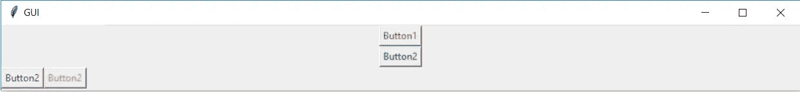

请看下面的例子来了解它是如何工作的。

```
import tkinter
window = tkinter.Tk()
window.title("GUI")
# creating 2 text labels and input labels
tkinter.Label(window, text = "Username").grid(row = 0) # this is placed in 0 0
# 'Entry' is used to display the input-field
tkinter.Entry(window).grid(row = 0, column = 1) # this is placed in 0 1
tkinter.Label(window, text = "Password").grid(row = 1) # this is placed in 1 0
tkinter.Entry(window).grid(row = 1, column = 1) # this is placed in 1 1
# 'Checkbutton' is used to create the check buttons
tkinter.Checkbutton(window, text = "Keep Me Logged In").grid(columnspan = 2) # 'columnspan' tells to take the width of 2 columns
# you can also use 'rowspan' in the similar manner
window.mainloop()
```

您将获得以下输出:

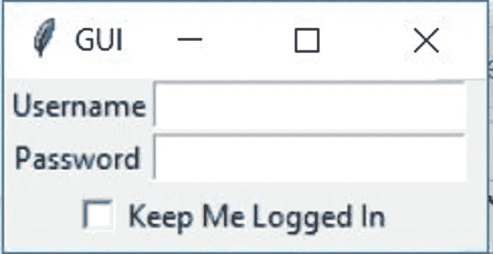

接下来，在这个 Tkinter 教程博客中，我们需要了解一个叫做绑定函数的概念。

# 绑定功能

每当事件发生时调用函数指的是绑定函数。

*   在下面的例子中，当你点击按钮时，它调用一个名为 **say_hi** 的函数。
*   函数 **say_hi** 创建一个带有文本 **Hi** 的新标签。

```
import tkinter
window = tkinter.Tk()
window.title("GUI")
# creating a function called say_hi()
def say_hi():
    tkinter.Label(window, text = "Hi").pack()
tkinter.Button(window, text = "Click Me!", command = say_hi).pack() # 'command' is executed when you click the button
# in this above case we're calling the function 'say_hi'.
window.mainloop()
```

上述程序将产生以下结果:

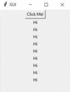

绑定函数的另一种方式是使用**事件**。事件类似于**鼠标移动、鼠标悬停、点击**和**滚动**。

下面的程序也产生与上面相同的输出:

```
import tkinter
window = tkinter.Tk()
window.title("GUI")
# creating a function with an arguments 'event'
def say_hi(event): # you can rename 'event' to anything you want

    tkinter.Label(window, text = "Hi").pack()
btn = tkinter.Button(window, text = "Click Me!")
btn.bind("<Button-1>", say_hi) # 'bind' takes 2 parameters 1st is 'event' 2nd is 'function'
btn.pack()
window.mainloop()
```

*   **<Button-1>****bind**方法的参数是左键点击事件，即当你点击左键时 **bind** 方法调用函数 **say_hi**

1.  <button-1>为**左键**点击</button-1>
2.  <button-2>为**中间的**点击</button-2>
3.  <button-3>为**右键**点击</button-3>

*   这里，我们将**绑定**的**左**点击事件到一个**按钮**。你可以将它绑定到任何你想要的其他**小部件**。
*   不同的事件会有不同的参数

点击事件有三种不同的类型，分别是**左键点击**、**中键点击**和**右键点击**。

现在，您将学习如何根据发生的事件调用特定的函数。

*   运行以下程序，点击**左、中、右**按钮调用特定的**功能**。
*   那个**函数**将用提到的文本创建一个新标签。

```
import tkinter
window = tkinter.Tk()
window.title("GUI")
#creating 3 different functions for 3 events
def left_click(event):

    tkinter.Label(window, text = "Left Click!").pack()
def middle_click(event):

    tkinter.Label(window, text = "Middle Click!").pack()
def right_click(event):

    tkinter.Label(window, text = "Right Click!").pack()
window.bind("<Button-1>", left_click)
window.bind("<Button-2>", middle_click)
window.bind("<Button-3>", right_click)
window.mainloop()
```

如果你运行上面的程序，你会看到一个空白的**窗口**。现在点击**左、中、右**按钮调用各自的功能。

您会得到与下面类似的结果:


接下来，在这个 Tkinter 教程博客中，我们需要看看如何在我们的窗口中添加图像。

# 图像和图标

您可以使用 **PhotoImage** 方法添加**图像**和**图标**。

让我们看看它是如何工作的:

```
import tkinter
window = tkinter.Tk()
window.title("GUI")
# taking image from the directory and storing the source in a variable
icon = tkinter.PhotoImage(file = "images/edureka.png")
# displaying the picture using a 'Label' by passing the 'picture' variriable to 'image' parameter
label = tkinter.Label(window, image = icon)
label.pack()
window.mainloop()
```

您可以在 **GUI 中看到图标:**


现在，您可以

*   理解 **Tkinter** 代码。
*   创建**框架、标签、按钮、绑定功能、事件等等。**
*   开发简单的 GUI 应用程序。

所以接下来在这个 Tkinter 教程博客上，我们将使用我们到目前为止学到的所有东西创建一个简单的**计算器 GUI** 。

# 使用案例:使用 Tkinter 的计算器应用程序

每个 **GUI** 应用程序都包括两个步骤:

*   创建用户界面
*   向 **GUI** 添加功能

```
from tkinter import *
# creating basic window
window = Tk()
window.geometry("312x324") # size of the window width:- 500, height:- 375
window.resizable(0, 0) # this prevents from resizing the window
window.title("Calcualtor")
################################### functions ######################################
# 'btn_click' function continuously updates the input field whenever you enters a number
def btn_click(item):

    global expression

    expression = expression + str(item)

    input_text.set(expression)
# 'btn_clear' function clears the input field
def btn_clear():

    global expression

    expression = ""

    input_text.set("")

# 'btn_equal' calculates the expression present in input field

def btn_equal():

    global expression

    result = str(eval(expression)) # 'eval' function evalutes the string expression directly

    # you can also implement your own function to evalute the expression istead of 'eval' function

    input_text.set(result)

    expression = ""

expression = ""

# 'StringVar()' is used to get the instance of input field

input_text = StringVar()

# creating a frame for the input field

input_frame = Frame(window, width = 312, height = 50, bd = 0, highlightbackground = "black", highlightcolor = "black", highlightthickness = 1)

input_frame.pack(side = TOP)

# creating a input field inside the 'Frame'

input_field = Entry(input_frame, font = ('arial', 18, 'bold'), textvariable = input_text, width = 50, bg = "#eee", bd = 0, justify = RIGHT)

input_field.grid(row = 0, column = 0)

input_field.pack(ipady = 10) # 'ipady' is internal padding to increase the height of input field

# creating another 'Frame' for the button below the 'input_frame'

btns_frame = Frame(window, width = 312, height = 272.5, bg = "grey")

btns_frame.pack()

# first row

clear = Button(btns_frame, text = "C", fg = "black", width = 32, height = 3, bd = 0, bg = "#eee", cursor = "hand2", command = lambda: btn_clear()).grid(row = 0, column = 0, columnspan = 3, padx = 1, pady = 1)

divide = Button(btns_frame, text = "/", fg = "black", width = 10, height = 3, bd = 0, bg = "#eee", cursor = "hand2", command = lambda: btn_click("/")).grid(row = 0, column = 3, padx = 1, pady = 1)

# second row

seven = Button(btns_frame, text = "7", fg = "black", width = 10, height = 3, bd = 0, bg = "#fff", cursor = "hand2", command = lambda: btn_click(7)).grid(row = 1, column = 0, padx = 1, pady = 1)

eight = Button(btns_frame, text = "8", fg = "black", width = 10, height = 3, bd = 0, bg = "#fff", cursor = "hand2", command = lambda: btn_click(8)).grid(row = 1, column = 1, padx = 1, pady = 1)

nine = Button(btns_frame, text = "9", fg = "black", width = 10, height = 3, bd = 0, bg = "#fff", cursor = "hand2", command = lambda: btn_click(9)).grid(row = 1, column = 2, padx = 1, pady = 1)

multiply = Button(btns_frame, text = "*", fg = "black", width = 10, height = 3, bd = 0, bg = "#eee", cursor = "hand2", command = lambda: btn_click("*")).grid(row = 1, column = 3, padx = 1, pady = 1)

# third row

four = Button(btns_frame, text = "4", fg = "black", width = 10, height = 3, bd = 0, bg = "#fff", cursor = "hand2", command = lambda: btn_click(4)).grid(row = 2, column = 0, padx = 1, pady = 1)

five = Button(btns_frame, text = "5", fg = "black", width = 10, height = 3, bd = 0, bg = "#fff", cursor = "hand2", command = lambda: btn_click(5)).grid(row = 2, column = 1, padx = 1, pady = 1)

six = Button(btns_frame, text = "6", fg = "black", width = 10, height = 3, bd = 0, bg = "#fff", cursor = "hand2", command = lambda: btn_click(6)).grid(row = 2, column = 2, padx = 1, pady = 1)

minus = Button(btns_frame, text = "-", fg = "black", width = 10, height = 3, bd = 0, bg = "#eee", cursor = "hand2", command = lambda: btn_click("-")).grid(row = 2, column = 3, padx = 1, pady = 1)

# fourth row

one = Button(btns_frame, text = "1", fg = "black", width = 10, height = 3, bd = 0, bg = "#fff", cursor = "hand2", command = lambda: btn_click(1)).grid(row = 3, column = 0, padx = 1, pady = 1)

two = Button(btns_frame, text = "2", fg = "black", width = 10, height = 3, bd = 0, bg = "#fff", cursor = "hand2", command = lambda: btn_click(2)).grid(row = 3, column = 1, padx = 1, pady = 1)

three = Button(btns_frame, text = "3", fg = "black", width = 10, height = 3, bd = 0, bg = "#fff", cursor = "hand2", command = lambda: btn_click(3)).grid(row = 3, column = 2, padx = 1, pady = 1)

plus = Button(btns_frame, text = "+", fg = "black", width = 10, height = 3, bd = 0, bg = "#eee", cursor = "hand2", command = lambda: btn_click("+")).grid(row = 3, column = 3, padx = 1, pady = 1)

# fourth row

zero = Button(btns_frame, text = "0", fg = "black", width = 21, height = 3, bd = 0, bg = "#fff", cursor = "hand2", command = lambda: btn_click(0)).grid(row = 4, column = 0, columnspan = 2, padx = 1, pady = 1)

point = Button(btns_frame, text = ".", fg = "black", width = 10, height = 3, bd = 0, bg = "#eee", cursor = "hand2", command = lambda: btn_click(".")).grid(row = 4, column = 2, padx = 1, pady = 1)

equals = Button(btns_frame, text = "=", fg = "black", width = 10, height = 3, bd = 0, bg = "#eee", cursor = "hand2", command = lambda: btn_equal()).grid(row = 4, column = 3, padx = 1, pady = 1)

window.mainloop()
```

# 结论

本教程中讨论的概念应该有助于您创建自己的 GUI 应用程序，并为其添加功能。

当您试图创建一个具有适合您个人需求的 GUI 的定制应用程序时，这将非常方便。现在，在 Python 的帮助下，您也应该能够使用这些小部件和图像轻松地开发应用程序。

我希望你喜欢 Tkinter 教程上的这篇文章。

如果你想查看更多关于人工智能、DevOps、道德黑客等市场最热门技术的文章，你可以参考 Edureka 的官方网站。

请留意本系列中的其他文章，它们将解释 Python 和数据科学的各个方面。

> 1. [Python 教程](/edureka/python-tutorial-be1b3d015745)
> 
> 2. [](/edureka/python-functions-f0cabca8c4a) [Python 编程语言](/edureka/python-programming-language-fc1015de7a6f)
> 
> 3. [Python 函数](/edureka/python-functions-f0cabca8c4a)
> 
> 4.[Python 中的文件处理](/edureka/file-handling-in-python-e0a6ff96ede9)
> 
> 5. [](/edureka/scikit-learn-machine-learning-7a2d92e4dd07) [Python Numpy 教程](/edureka/python-numpy-tutorial-89fb8b642c7d)
> 
> 6. [Scikit 学习机器学习](/edureka/scikit-learn-machine-learning-7a2d92e4dd07)
> 
> 7.[蟒蛇熊猫教程](/edureka/python-pandas-tutorial-c5055c61d12e)
> 
> 8. [Matplotlib 教程](/edureka/python-matplotlib-tutorial-15d148a7bfee)
> 
> 9.[请求教程](/edureka/python-requests-tutorial-30edabfa6a1c)
> 
> 10. [PyGame 教程](/edureka/pygame-tutorial-9874f7e5c0b4)
> 
> 11. [OpenCV 教程](/edureka/python-opencv-tutorial-5549bd4940e3)
> 
> 12.[用 Python 进行网页抓取](/edureka/web-scraping-with-python-d9e6506007bf)
> 
> 13. [PyCharm 教程](/edureka/pycharm-tutorial-d0ec9ce6fb60)
> 
> 14.[机器学习教程](/edureka/machine-learning-tutorial-f2883412fba1)
> 
> 15.[Python 中从头开始的线性回归算法](/edureka/linear-regression-in-python-e66f869cb6ce)
> 
> 16.[面向数据科学的 Python](/edureka/learn-python-for-data-science-1f9f407943d3)
> 
> 17. [Python 正则表达式](/edureka/python-regex-regular-expression-tutorial-f2d17ffcf17e)
> 
> 18.[Python 中的循环](/edureka/loops-in-python-fc5b42e2f313)
> 
> 19. [Python 项目](/edureka/python-projects-1f401a555ca0)
> 
> 20.[机器学习项目](/edureka/machine-learning-projects-cb0130d0606f)
> 
> 21.[Python 中的数组](/edureka/arrays-in-python-14aecabec16e)
> 
> 22.[在 Python 中设置](/edureka/sets-in-python-a16b410becf4)
> 
> 23.[Python 中的多线程](/edureka/what-is-mutithreading-19b6349dde0f)
> 
> 24. [Python 面试问题](/edureka/python-interview-questions-a22257bc309f)
> 
> 25. [Java vs Python](/edureka/java-vs-python-31d7433ed9d)
> 
> 26.[如何成为一名 Python 开发者？](/edureka/how-to-become-a-python-developer-462a0093f246)
> 
> 27. [Python Lambda 函数](/edureka/python-lambda-b84d68d449a0)
> 
> 28.[网飞如何使用 Python？](/edureka/how-netflix-uses-python-1e4deb2f8ca5)
> 
> 29.[Python 中的 Socket 编程是什么](/edureka/socket-programming-python-bbac2d423bf9)
> 
> 30. [Python 数据库连接](/edureka/python-database-connection-b4f9b301947c)
> 
> 31. [Golang vs Python](/edureka/golang-vs-python-5ac32e1ef2)
> 
> 32. [Python Seaborn 教程](/edureka/python-seaborn-tutorial-646fdddff322)
> 
> 33. [Python 职业机会](/edureka/python-career-opportunities-a2500ce158de)

*原载于 2018 年 12 月 25 日*[*www.edureka.co*](https://www.edureka.co/blog/tkinter-tutorial/)*。*