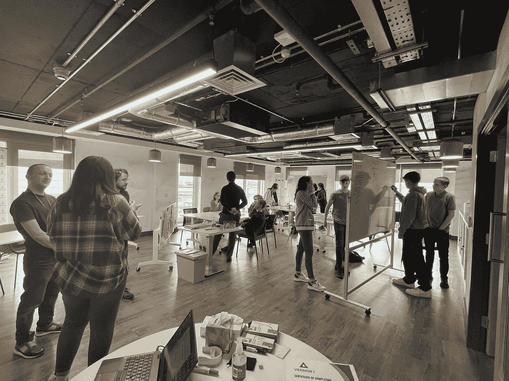
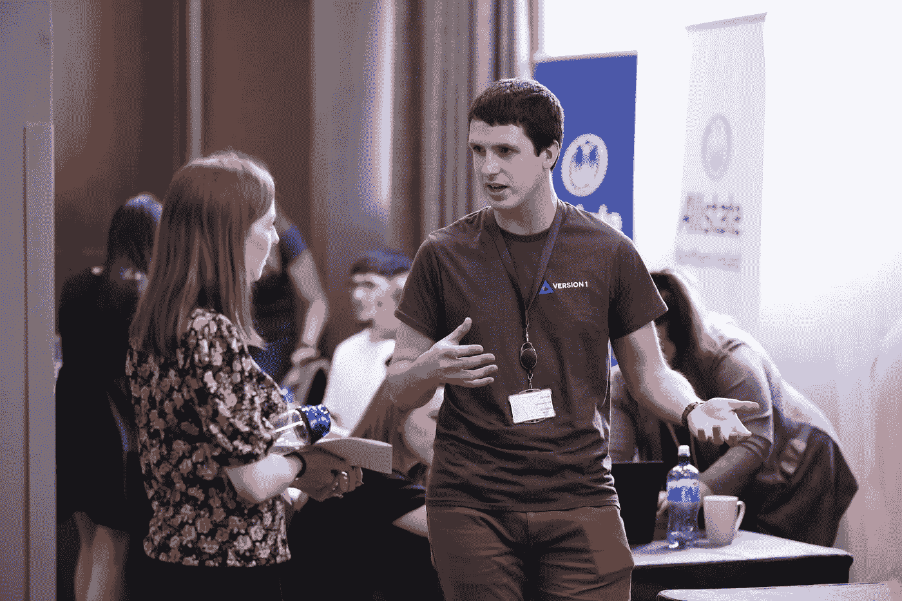
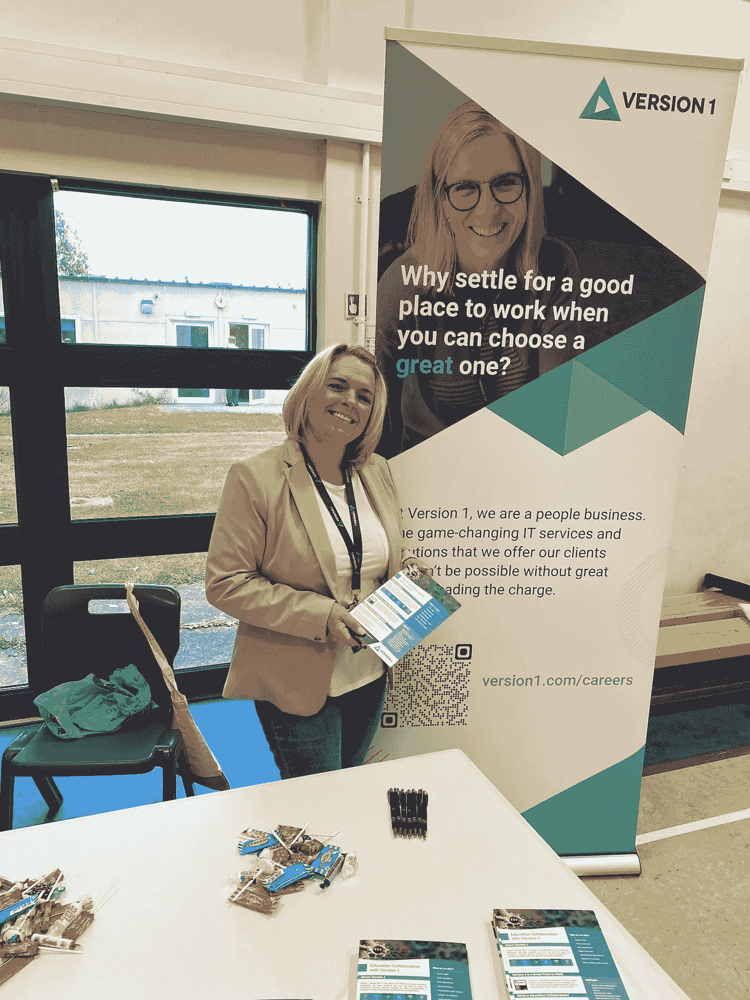
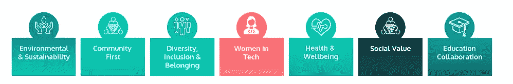

# 到无限…甚至更远

> 原文：<https://medium.com/version-1/to-infinity-and-beyond-7419a4df857b?source=collection_archive---------8----------------------->

第 1 版教育协作

# 那么，为什么要取《走向无限和超越》这个标题呢？

这不是因为我喜欢《玩具总动员》(我确实有)，而是这句话的意思。无限是无尽的，对我来说，这句话简单地意味着无限的机会。在科技的世界里，有无限的机会，我们希望激励、鼓励和促进我们的下一代。

Buzz Lightyear

当教育协作团队作为第 1 版 ESG 战略的一部分成立时，我们设定了到 2022 年底通过我们的外展活动接触 1000 名学生的目标。我是在 7 月 21 日写这篇文章的，我们刚刚完成了我们的计算，请敲鼓吧……自 2022 年 1 月以来，我们已经通过外展活动接触到了 **2344 名学生**。

# 我们是如何做到的？

志愿者——这是我们所有外展活动的关键要素，如果没有这么多无私的志愿者在第 1 版致力于在日常工作之外提供卓越服务，我们就不会取得这样的成就。在每个办公地点，我们都有一个教育团队，他们与当地的学校、学院、大学和其他机构建立关系。这些团队不仅参加活动，还自己策划和主持一些非常令人惊叹的活动。了解我们举办和参加的一些活动。

## **工作经历**

在我们的北爱尔兰办事处，我们已经接待了 2 大群有工作经验的学生，今年晚些时候还会接待更多。我们让他们了解了第 1 版，包括我们所做的工作和可用的角色，此外，我们还让他们了解了可转移技能和简历技能。然后，学生们被分成小组，他们的任务是完成一个小项目，这给了他们一个发展团队合作、沟通和演示技能的机会。

## **参加招聘会**

我们参加当地的招聘会，以促进 IT 和版本 1 中的机会。在这些活动中，我们与包括提供指导和建议的学生和教师在内的与会者建立联系。

## **模拟面试**

我们为学生提供模拟面试，让学生有机会在安全的环境中获得面试经验和信心。在体验过程中，志愿者向学生提供反馈，帮助他们发展和成长。

# 我们为什么要这样做？

环境、社会和治理，通常称为 ESG，是一个组织对其社会影响的责任。我们多年来一直是这一领域的领导者，这就是为什么我们最近制定了包含 7 大支柱的 ESG 战略。

ESG Pillars at Version 1

我们相信，作为一个负责任的组织，通过将我们的努力集中在这些领域，我们的工作将使我们成为行业中的创新者和积极的影响者。不仅限于 IT 行业，而是涵盖我们的客户和合作伙伴经营的所有行业。帮助我们的星球和其中的社区成为一个更好的地方。

在教育协作支柱中，我们的愿景是鼓励学校、学院和大学的学生考虑从事 IT 职业，并让我们的员工成为学生的励志榜样。我们的主要目标是:

1.  激励下一代投身科技。
2.  提高对可用角色的认识。
3.  将第 1 版中的职业提升到下一代。
4.  成为你学生时代想要的榜样。
5.  打破对技术职业的刻板印象。

在这篇文章的最后，我要衷心感谢第 1 版中的每一位志愿者，感谢他们帮助我们组织了所有精彩的推广活动。我代表所有做志愿者的人发言，我们已经看到了一些鼓舞人心的学生，我们迫不及待地想看到他们在未来几年进入科技行业。

作者简介:
Tanya Mathews 是 Version 1 的商业分析师。