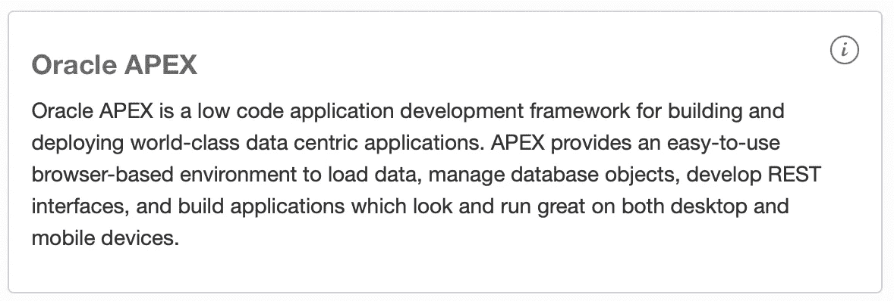
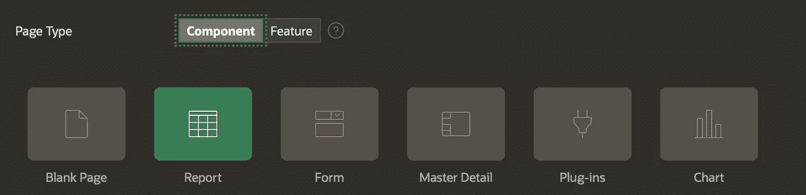
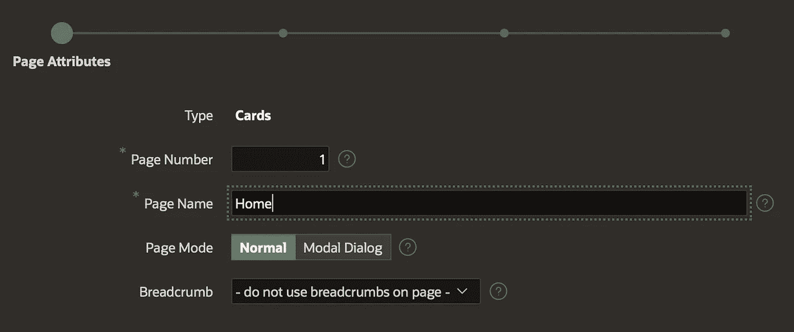

# 到 SQL 或 noSQL…这是个问题吗？

> 原文：<https://medium.com/oracledevs/to-sql-or-nosql-is-that-even-a-question-3b8b5b45b8fd?source=collection_archive---------0----------------------->

几年前，noSQL 运动风靡一时，SQL 和 noSQL 之间有无休止的“[辩论](https://www.youtube.com/watch?v=Nu1UQblRQdM)”。

双方都有很好的理由支持这种或那种方法。问题是，一旦我们决定了一个，另一个就在窗外。*如果我们都能在同一个 edata 上使用我们喜欢的工具，那岂不是很酷？*

## 简单的例子

一家公司希望跟踪某项技术出版了多少本书，以及与竞争对手相比如何。

这个项目有两个团队:

*   *python 团队*将从各种来源抓取和收集数据
*   APEX 团队将创建一个简单的用户界面来显示数据

挑战: ***python 团队*** 想用 JSON 做一切事情，因为他们收集和废弃的数据无论如何都是 JSON，他们**在任何情况下都不想使用 SQL 与数据库**交互。

***APEX 团队*** 被绑定到关系数据库，他们别无选择，只能使用它。


## 简单的解决办法

有了 *Oracle 自治数据库*他们每个人都可以使用他们想要的工具和 API，这要感谢新的 [**Oracle 数据库 API for MongoDB**](https://blogs.oracle.com/database/post/mongodb-api) **。下面是团队采取的一步一步的方法:**

## **一、提供一个自治的 JSON 数据库**


这个名字有点欺骗性，因为自治 JSON 数据库(AJD)实际上**包括高达 20GB 的关系存储，并且它支持 APEX** ！

更重要的是，它是永远免费层中可用的**(所以你可以免费跟随这个例子)，它**每个 OCPU 每月仅花费大约 240 美元**。如果您需要超过 20GB 的关系存储，您可以在以后升级到完全自治的事务处理数据库(ATP)。**

*对了，今天就可以* [*注册一个甲骨文云自由层账号*](https://signup.cloud.oracle.com/?language=en&sourceType=:ex:tb:::::&SC=:ex:tb:::::&pcode=) *！*

有很多关于如何配置 AJD 的[教程](https://oracle.github.io/learning-library/developer-library/oracle-db-features-for-developers/workshops/adb-json-freetier/?lab=adb-provision)，所以我只关注其中的要点:

1.  *此时* ***你要置备 JSON DB 才能获得 MongoDB API。*** 以后需要的话可以升级到 ATP。


2. ***你必须使用“来自允许的 IP 和 vcn 的安全访问”*** 目前不支持私有端点。


出于演示的目的，我将输入苹果酒 0.0.0.0/0，这是一个坏主意，不应该使用。

3.设置完成后，打开*服务控制台*和 ***复制 MongoDB 连接字符串***


You’ll find MongoDB connection string in the Development section

## **二。实现 python 客户端**


You can find the whole script [here](https://pastebin.com/dyd56FPX)

哇，太简单了！noSql，只是一些非常直接的 API 调用。在这里我当然可以看到 noSQL 的吸引力。

我们确定剧本可行吗？让我们回到 AJD 看看结果。

1.在 OCI 控制台中，打开数据库操作。


2.以管理员身份登录并打开 SQL 工具


3.让我们更改“books”用户的密码


注意，用户是由 MongoDB API 自动创建的，因为我们使用 admin 用户帐户登录。

4.注销并作为用户手册重新连接

5.打开 JSON 工具


你可以在这里找到用 python 脚本从 github 下载的书籍:


## **三。实施 APEX 应用程序**

1.  **创建 APEX 工作空间**

在服务控制台/开发部分，导航至 Oracle Apex



首次启动 Apex 时，您只能以管理员身份登录


我们已经通过 python 脚本创建了“books”用户。我们将为 APEX 应用程序使用同一个用户。


注销管理员帐户，并作为用户手册登录工作区手册。

## 2.创建新 APEX 应用程序


## 3.实现新主页

对于这个例子，最简单的方法是替换主页。点击“1-首页”


然后点击右上方的扳手，删除页面


下一步确认删除，但*不删除相应的列表条目*(默认)。删除主页后，创建一个新页面


选择“报告”，然后选择“卡片”



**输入 1 作为页码**，否则您的应用程序将无法运行



识别现有导航项目:


将源设置为 SQL 查询并粘贴以下内容


```
with q as
(select
    b.data.thumbnailUrl,
    b.data.isbn,
    b.data.title,
    b.data.pageCount,
    b.data.authors,
    j.*
from
    books b,
    json_table (
        b.data, '$' columns (
            nested categories[*]
            columns (
                category path '$'
            ))) j
)
select
*
from q
where category='Java'
```

我们将使用网格布局并用标题列填充标题


最后点击创建。但是我们还没有完成。
1。选择左侧
2 的原点区域。切换到右侧属性
3。将媒体更改为图像 URL，并选择 thumbnailurl 列作为来源
4。保存更改


**4。运行您的应用程序**


Java related books inserted by the python script

**总结**

在不做出任何牺牲的情况下使用合适的工具有明显的好处。SQL 或 noSQL 不再是一个二元选择。


**加入对话！**
如果你对甲骨文开发者在他们的自然栖息地发生的事情感到好奇，来[加入我们的公共休闲频道](https://join.slack.com/t/oracledevrel/shared_invite/zt-uffjmwh3-ksmv2ii9YxSkc6IpbokL1g?customTrackingParam=:ex:tb:::::RC_WWMK220210P00062:Medium_sqlWhyNotBoth)！我们不介意成为你的鱼缸🐠