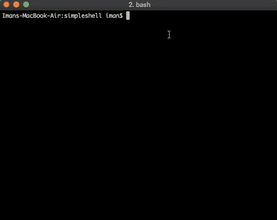

# Today I Learned: Belajar Membuat Aplikasi Interactive Shell Sederhana di Golang

> 原文：<https://medium.easyread.co/today-i-learned-belajar-membuat-aplikasi-interactive-shell-sederhana-di-golang-2ef013003393?source=collection_archive---------6----------------------->

## Pelajaran yang saya dapat ketika belajar membuat aplikasi Shell sederhana


“command computer keyboard key” by [Hannah Joshua](https://unsplash.com/@hannahjoshua?utm_source=medium&utm_medium=referral) on [Unsplash](https://unsplash.com?utm_source=medium&utm_medium=referral)

Hari ini, saya belajar hal baru lagi. Namun kali ini tentang hal basic dan sederhana di golang. Yakni tentang membuat aplikasi shell sederhana di Golang. Meski terlihat sederhana, namun saya berasa keren ketika berhasil membuatnya hehe.

Saya sudah bekerja di dunia Golang, kurang lebih 1 tahun. Banyak aplikasi hebat dan berguna telah saya buat khususnya di kantor saya Kurio. Namun tidak pernah sekalipun saya membuat aplikasi shell. Sehingga berlandas dari rasa penasaran, saya pun mencoba membuat sebuah shell sederhana.

Ketika mengerjakannya, tentu saja saya pertama kali mencari tutorial di internet. Namun yang saya temukan hanya tutorial dengan menggunakan library orang. Semua seperti mempromosikan librarinya masing-masing. Sementara yang saya butuhkan hanya aplikasi shell sederhana, menggunkana package bawaan golang.

Saya menemukan sebuah article tentang interactive shell disini: [http://technosophos.com/2014/07/11/start-an-interactive-shell-from-within-go.html](http://technosophos.com/2014/07/11/start-an-interactive-shell-from-within-go.html) , namun, apa yang dia tulis di artikel tersebut tidak seperti yang saya harapkan. Sehingga hanya berlandas google search dan contoh-contoh dari website gobyexample.com, dan stackoverflow, akhirnya saya membuat aplikasi shell sederhana.

## Shell

Sebelumnya, saya akan menjelaskan Shell yang saya maksud untuk menyamakan persepsi antara saya dan pembaca hehe.

Shell yang saya maksud disini adalah, aplikasi text-based yang digunakan untuk berintraksi dengan OS dengan memasukkan sejumlah command (perintah), atau biasa juga disebut dengan CLI (Command Line Interface)

## Making The Application

Contoh sederhananya adalah, seperti dibawah. Ketika saya mengetikkan `ls` maka akan memunculkan list file dan directory.

```
$ ls
go.mod  main.go
```

## Read the Command from Terminal

Hal pertama yang perlu diketahui tentunya membaca command yang dimasukkan agar dapat diproses.

Untuk menerima inputan dari use, kita bisa menggunakan package `bufio` seperti kode dibawah.

```
reader := bufio.NewReader(os.Stdin)
cmdString, err := reader.ReadString('\n')
if err != nil {
 fmt.Fprintln(os.Stderr, err)
}
```

## Execute the Command

Setelah command kita dapat, selanjutnya kita meng-eksekusinya terhadap OS. Di Golang terdapat package `exec` yang memudahkan kita melakukan ini.

```
cmdString = strings.TrimSuffix(cmdString, "\n")
cmd := exec.Command(commandString)
cmd.Stderr = os.Stderr
cmd.Stdout = os.Stdout
cmd.Run()
```

Cukup sampai disini, aplikasi simple shell saya sudah bisa dibilang berjalan. Namun sayangnya masih bisa melakukan sekali karena perintah programmnya langsung selesai

## Adding the Infinite Loop

Selanjutnya, agar programmnya tidak langsung berhenti, maka saya menambahkan infinite loop. Sehingga akan listening terus menerus.

```
for {
 fmt.Print("$ ")
 cmdString, err := reader.ReadString('\n')
 if err != nil {
  fmt.Fprintln(os.Stderr, err)
 }cmdString = strings.TrimSuffix(cmdString, "\n")cmd := exec.Command(cmdString)
 cmd.Stderr = os.Stderr
 cmd.Stdout = os.Stdout
 err = cmd.Run()
 if err != nil {
  fmt.Fprintln(os.Stderr, err)
 }}
```

Berikut tampilan aplikasi sederhana saya jika dijalankan hohoho.



simple shell application

## Dealing with the Arguments

Sejauh ini, aplikasi saya sudah bisa berjalan, namun hanya untuk command yang bersifat satu kata.

Jika suatu command saya tambahkan argument, maka aplikasi saya akan return error.

```
$ ls -lah // this command wil throw error
```

Selanjutnya adalah, membaca argument yang di-ikut sertakan bersama command. Pertama, saya akan membagi command menjadi string array. Kemudian melempar command dan argument tersebut ke `exec.Command` .

```
// ...
cmdString = strings.TrimSuffix(cmdString, "\n")
arrCommandStr := **strings.Fields**(cmdString)
cmd := exec.Command(arrCommandStr[0], arrCommandStr[1:]...)
// ...
```

Karena commandnya adalah berupa string yang dipisahkan oleh spasi maka, saya menggunakan fungsi `Fields` dari package `string` . Fungsi ini mirip dengan `strings.Split` , namun fungsi split membutuhkan separator. Sementara fungsi `strings.Fields` langsung membagi kalimat menjadi string array berdasarkan spasi.

Contoh:

```
str := "Hello World    Beautiful World"
arrString := strings.Fields(str)
fmt.Println(arrString)
// [Hello World Beautiful World]
```

Hingga saat ini, aplikasi shell sederhana saya sudah menerima param dan meng-eksekusinya dan berjalan seperti layaknya shell lainnya.

```
$ ls -lah
total 4280
drwxr-xr-x  5 iman  staff   160B Nov  6 19:48 .
drwxr-xr-x  6 iman  staff   192B Nov  6 11:41 ..
-rw-r--r--  1 iman  staff    38B Nov  6 11:43 go.mod
-rw-r--r--  1 iman  staff   606B Nov  6 20:11 main.go
-rwxr-xr-x  1 iman  staff   2.1M Nov  6 19:49 simshel
```

## Adding Exit Command

Namun, ada kendala tentunya. Aplikasi saya tidak bisa di exit dengan command `exit` . Sehingga saya harus membuat custom command `exit` .

Untuk melakukannya, saya hanya menambahkan `switch-case` pada setiap command yang masuk, untuk men-check apakah command tersebut adalah command exit.

simple shell in go

## Adding the Custom Command

Untuk menambah custom command baru, saya tinggal menambahkannya di dalam switch-case agar dapat berjalan.

Misalnya, saya ingin menambahkan fungsi `plus` dimana tugasnya adalah menjumlahkan parameter yang diberikan.

Contohnya:

```
$ plus 2 4 5 6
17
```

Karena command ini tidak ada di default CLI, maka saya harus custom dan menambahkannya *(perhatikan code di dalam switch case).*

## Conclusion

Akhir kata, ini hanyalah aplikasi yang sangat sederhana. Tetapi meski sangat sederhana, ini merupakan hal baru yang saya pelajari.

Saya juga push source-codenya di Github saya di [https://github.com/bxcodec/simpleshell](https://github.com/bxcodec/simpleshell) , jika kelak suatu saat saya ada niat untuk mengubah dan menambah fitur baru, hehe :D

*   English Version: [https://hackernoon.com/today-i-learned-making-a-simple-interactive-shell-application-in-golang-aa83adcb266a](https://hackernoon.com/today-i-learned-making-a-simple-interactive-shell-application-in-golang-aa83adcb266a)