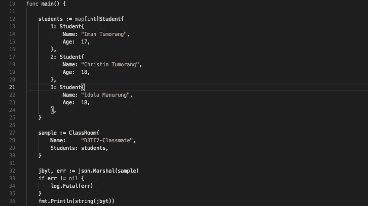

# 今天我学到了:小心戈兰语的教鞭！！！

> 原文：<https://medium.easyread.co/today-i-learned-beware-with-pointer-in-golang-7764f2060a93?source=collection_archive---------4----------------------->

## 今天在 Golang 中自定义 JSON 编组时的错误



所以，今天的 bug 和要学习的一课是关于非/指针接收器函数，它发生在我为我的 struct 做定制编组 JSON 的时候。我被困了几个小时来解决这个问题。
场景是，我有一个结构，比如说一个`ClassRoom`结构，而`ClassRoom`有很多学生。每一个学生都按照他们的分数或者别的什么排名上升，不管它是什么，:D，这只是一个例子来描述我们真实的案例结构。类似，只是名称不同。

```
type ClassRoom struct {
 Name     string          `json:"name"`
 Students map[int]Student `json:"students"`
}
type Students struct {
 Name string `json:"name"`
 Age  int    `json:"age"`
}
```

对于这个结构，如果我们将它编组到 JSON，结果将如下所示:

```
{
  "name": "D3TI2-Classmate",
  "students": {
    "1": {
      "name": "Iman Tumorang",
      "age": 17
    },
    "2": {
      "name": "Christin Tumorang",
      "age": 18
    },
    "3": {
      "name": "Idola Manurung",
      "age": 18
    }
  }
}
```

但是对于 API 的要求，我们希望 JSON 结果没有学生的排名。我们只想看起来像这样:

```
{
  "name": "D3TI2-Classmate",
  "students": [
    {
      "name": "Iman Tumorang",
      "age": 17
    },
    {
      "name": "Christin Tumorang",
      "age": 18
    },
    {
      "name": "Idola Manurung",
      "age": 18
    }
  ]
}
```

嗯，根据我的经验，在 Golang 做这件事是很容易的。我们只是创建一个以`ClassRoom`为接收者的函数，其名称与`[Marshaler](https://golang.org/src/encoding/json/encode.go?s=8333:8392#L211)`接口中的函数名称相同

```
func (s ClassRoom) **MarshalJSON**() ([]byte, error) {
 arrStudent := []Student{}
 arrKey := []int{}
 for k, _ := range s.Students {
  arrKey = append(arrKey, k)
 }
 sort.Ints(arrKey)for _, pos := range arrKey {
  arrStudent = append(arrStudent, s.Students[pos])
 }
 return json.Marshal(struct {
  Name     string    `json:"name"`
  Students []Student `json:"students"`
 }{
  Name:     s.Name,
  Students: arrStudent,
 })
}
```

就这么简单。但是当我试着测试它的时候。JSON 结果不像我们预期的那样正确。我在这个问题上被卡住了几个小时，:D，我真傻😅

# **发布**

在代码修复之前，代码更像下面这样。如果我们看到这里，它就像这里没有任何问题。但结果是错误的。

# 固定

在厌倦了寻找解决方案之后，当我偶然用一个指针对象调用 JSON marshall 时，我发现了这个问题。

```
sample := **&**ClassRoom{ // *See the ampersand symbol* "**&**"
  Name:     "D3TI2-Classmate",
  Students: students,
 }
_,_= json.Marshal(sample)
```

这就是问题所在。在我的自定义 MarshalJSON 中，我让接收器是一个指针。因此，如果我试图封送一个非指针对象，我的自定义 MarshalJSON 将不会被调用。但是，如果我封送一个非指针对象，它将成功封送。

总结一下:
如果我用一个**指针**接收器来定制 MarshalJSON

```
func (s *****ClassRoom)MarshalJSON() ([]byte, error){
  // Other codes
}
```

然后当我想封送对象时，我必须将一个**指针**对象传递给`json.Marhsal`

```
sample := **&**ClassRoom{ // *See the ampersand symbol* "**&**"
  Name:     "D3TI2-Classmate",
  Students: students,
 }
_,_= json.Marshal(sample)
```

对于**非指针(值)**接收器也是如此。

如果我用一个**非指针(值)**接收器来定制 MarshalJSON

```
func (s ClassRoom)MarshalJSON() ([]byte, error){
  // Other codes
}
```

然后当我想要封送对象时，我必须传递一个**非指针(值)**对象给`json.Marhsal`

```
sample := ClassRoom{ // *Without the ampersand symbol* "**&**"
  Name:     "D3TI2-Classmate",
  Students: students,
 }
_,_= json.Marshal(sample)
```

嗯，这对我来说是一个非常愚蠢的问题，因为它真的让我愤怒了几个小时。这让我在决定使用**指针**还是**非指针**接收器时更加谨慎。